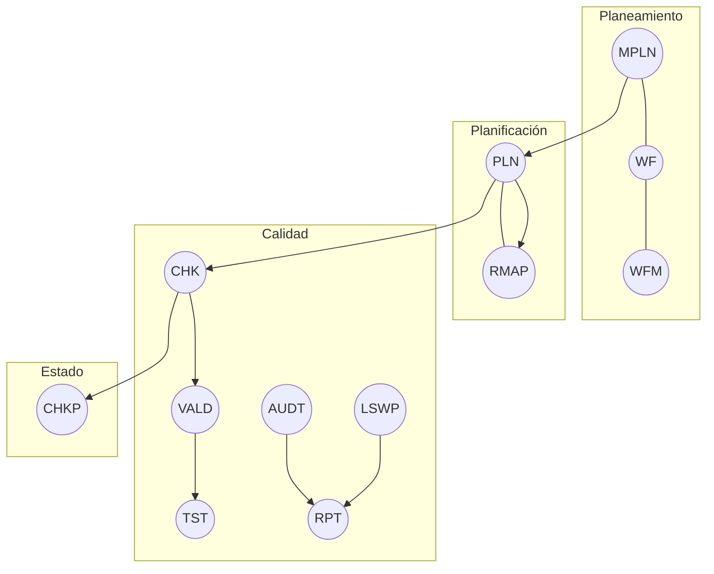

---

## id: aingz\_ruleset\_max name: RULESET\_MAX version: 1.0.0 status: working owner: AingZ\_Platform · ArchOps scope: universal platforms: [GPT5, CODEX, OPENAI\_API, GH\_BOT, VSC, PY, OBSIDIAN, EXCALIDRAW] connectors: [GitHub, GoogleDrive, SharePoint/OneDrive, Box, Dropbox, Notion, Gmail, Calendar, Contacts] date: 2025-08-30 contract: "Reglas de máxima jerarquía y plantillas operativas para IA + humanos. Sin rutas duras. Overrides sólo vía SPEC.\*"

# RULESET\_MAX — Normativa universal y plantilla ejecutable (AingZ)

> Axioma: **contrato antes que implementación**. Cero ambigüedades. **Una sola fuente semántica** para todos los entornos.

---

## 0) Cabecera obligatoria (rellenar)

```yaml
asset:
  id: <uid>
  name: <PascalCase>
  version: <SemVer>
  owner: AingZ_Platform
  status: draft|working|final
context:
  dom: <Domain>
  goals: [<objetivo1>, <objetivo2>]
  risks: [<riesgo1>, <riesgo2>]
compat:
  platforms: [GPT5, CODEX, OPENAI_API, GH_BOT, VSC, PY, OBSIDIAN, EXCALIDRAW]
  connectors: [GitHub, GoogleDrive]
  notes: "Sin acoplar a rutas. Especificidades en SPEC.*"
```

---

## 1) Principios (obligatorios)

1. **SEMÁNTICA ÚNICA**: codifica conceptos con el glosario GLOS V5. Un término = un concepto.
2. **CONTRATOS CLAROS**: I/O, efectos y límites observables. No describas implementación.
3. **INTEROPERABILIDAD**: misma semántica en GPT‑5, Codex, API, GitHub Bot, VS Code, Python, Obsidian y Excalidraw.
4. **EVIDENCIA**: todo cambio deja traza mínima (LOG/BIT/CHG/ADT/VALOG).
5. **EVOLUCIÓN CONTROLADA**: depreca con `Deprecated: true` + `ReplacedBy`.
6. **PRIVACIDAD**: minimiza datos; evita secretos en links compartidos.

> Referencias internas: `GLOS_V5` (A01 RULE, Bxx IDs, Cxx instrucciones, Dxx workflows, Exx logs).

---

## 2) Estructura del RULESET

| CODE | Name              | Definición                          | Contract                            |
| ---- | ----------------- | ----------------------------------- | ----------------------------------- |
| RULE | Ruleset           | Marco normativo semántico universal | Rige naming/contratos/validación    |
| SPEC | SpecificExtension | Overrides de alcance explícito      | Declara ámbito, duración y rollback |
| ENV  | EnvInstruction    | Ajustes por plataforma              | Parámetros operativos declarativos  |
| PRC  | ProcInstruction   | Procedimiento paso a paso           | Ejecutable por humano/agente        |
| WK   | WorkflowKnowledge | Loop de aprendizaje/logging         | Persistencia post‑run               |
| CHK  | Checklist         | Criterios observables               | Aceptación y QA                     |
| VALD | Validation        | Verificación técnica                | Pass/Fail + métricas                |
| AUDT | Audit             | Auditoría de proceso/resultados     | Evidencias y hallazgos              |
| RPT  | Report            | Síntesis con decisiones             | KPIs + links a evidencia            |

---

## 3) Naming y unicidad

- `CODE` ≤5 chars, **SCREAMING\_SNAKE**. `Name` **PascalCase**.
- `ID` global inmutable. Sin rutas. Crossref sólo **genérico** (alias/tema).
- Prohibido codificar entornos o credenciales en nombres.

---

## 4) Jerarquía de ejecución



---

## 5) Conectores y feedback dinámico

**Meta‑regla**: los conectores son **fuentes**, no fuentes de verdad. La verdad la define el contrato + evidencia.

- **Synced**: activa indexado previo cuando exista (p.ej. Drive/GitHub).
- **Feedback loop**: cada uso de conector escribe `WK.log` (pasos, hallazgos, límites). Consolidar con `TRG_CONSOLIDATE_TL` tras hitos.
- **Privacidad**: limitar por repos/carpetas; sin secretos en links públicos.
- **Fallas**: si el conector no está disponible, usar ruta espejo (GitHub ↔ Drive). Registrar `ADT`.

**Plantilla de registro (**``**)**

```yaml
wk_entry:
  when: <iso8601>
  actor: ai|human
  connector: <GitHub|Drive|...>
  query: <texto>
  scope: <repo/carpeta/tag>
  artifacts: [<urls o ids>]
  findings: [<bullet1>, <bullet2>]
  gaps: [<falta1>]
  next: [<acción>]
```

---

## 6) Reglas globales de seguridad y datos

1. Sin compras ni formularios sin confirmación explícita.
2. Minimización de datos personales. `USC` gobierna visibilidad/acciones.
3. **Shared Links**: evitar datos sensibles. Expirar o borrar al cerrar entregables.
4. **BK/BACKUP** crítico antes de cambios masivos. `CHKP` tras cada release.

---

## 7) ENV — perfiles por plataforma (rellenar y versionar)

### 7.1 GPT5 · ChatGPT (Chat + Projects + Canvas)

```yaml
ENV.GPT5:
  tools: [browser, agent, deep_research, python, images, canvas]
  connectors_allowed: [GitHub, GoogleDrive]
  projects:
    instructions: |
      Contexto: <negocio y dominio>
      Fuentes: <archivos, carpetas, repos>
      Tareas: <bullets>
      Salida: <JSON schema o plantilla>
      Calidad: <tests y métricas>
    memory: project_only: true
  policies:
    citations: required_for_web
    data_controls: {train_chats:false}
  outputs:
    default_format: markdown_report|json_deliverable
```

**Checklists**

-

### 7.2 CODEX · Agente de ingeniería

```yaml
ENV.CODEX:
  cli:
    config: ~/.codex/config.toml
    env: {inherit:"all", exclude:["AWS_*","AZURE_*"], set:{PROJECT:"AingZ"}}
  guardrails:
    network: sandbox_default_off
    confirm_before_apply: true
  workflows:
    - name: bugfix_batch
      steps: [plan, diff, test, pr]
    - name: feature_small
      steps: [spec, scaffold, diff, test, pr]
```

**Checklists**

-

### 7.3 OPENAI\_API · Respuestas y Tools

```yaml
ENV.OPENAI_API:
  model: gpt-5-think|auto
  tools: ["web_browser","python","actions"]
  json_schemas: [Deliverable]
  rate_limits: <según plan>
  retries: {max:2, backoff:"exponential"}
```

### 7.4 GH\_BOT · GitHub

```yaml
ENV.GH_BOT:
  repos: [<org/repo>]
  actions: [label_by_CODE, comment_chk, open_pr_on_diff]
  rules:
    pr_requirements: [tests_green, checklist_attached, no_secrets]
```

### 7.5 VSC · VS Code (Work with Apps)

```yaml
ENV.VSC:
  integration: work_with_apps
  policies: {show_diff:true, dry_run_default:true}
  tasks: [refactor, tests, docs_sync]
```

### 7.6 PY · Data Analysis

```yaml
ENV.PY:
  outputs: [table, chart, html]
  rules: {exit_codes:true, reproducible:true}
```

### 7.7 OBSIDIAN · 2º cerebro

```yaml
ENV.OBSIDIAN:
  vault: <ruta_logica>
  sync: via: GitHub|Drive
  taxonomy:
    folders: [/Brainstorm, /Research, /Design, /Decisions, /Archive]
    tags: [#idea, #insight, #decision, #retro, #diagram]
  note_template: |
    # Título
    Fecha: {{date:YYYY-MM-DD}}
    Estado: draft
    Objetivo:
    Hallazgos:
    Próximos pasos:
```

### 7.8 EXCALIDRAW · Diagrama vivo

```yaml
ENV.EXCALIDRAW:
  storage: in_vault
  formats: [.excalidraw, .svg, .png]
  pipeline:
    - source: mermaid
      action: export_to_excalidraw
    - source: excalidraw
      action: export_png_svg_and_link_note
```

---

## 8) SPEC — overrides por caso (plantilla)

```yaml
SPEC.<ctx>:
  scope: <repo|carpeta|proyecto>
  duration: <YYYY-MM-DD>.. <YYYY-MM-DD|open>
  overrides:
    ENV.GPT5.connectors_allowed: [GitHub]
    ENV.CODEX.workflows[feature_small].steps: [spec, scaffold, review, diff, test, pr]
  rollback: <procedimiento>
  rationale: <por qué>
```

---

## 9) Procedimientos (PRC) — mínimas de adopción

1. **Arranque**: crear `MPLN` y `PLN` con objetivos y criterios.
2. **Operación**: ejecutar `WF` con `CHK` por etapa.
3. **Control**: `VALD/TST` por componente; `AUDT` por release.
4. **Cierre**: `RPT` + `CHKP` congelado.

**Checklist de release**

-

---

## 10) Plantillas de salida

### 10.1 Reporte MD

```md
# Resumen (≤10 bullets)
## Hallazgos con citas
## Contrastes y consenso
## Riesgos y vacíos
## Metodología
## Anexos (fuentes, enlaces, datasets)
```

### 10.2 JSON “Deliverable” (schema)

```json
{
  "$schema": "https://json-schema.org/draft/2020-12/schema",
  "title": "Deliverable",
  "type": "object",
  "properties": {
    "summary": {"type": "string"},
    "insights": {"type": "array", "items": {"type": "string"}},
    "actions": {"type": "array", "items": {"type": "string"}},
    "risks": {"type": "array", "items": {"type": "string"}},
    "sources": {"type": "array", "items": {"type": "string"}}
  },
  "required": ["summary", "sources"]
}
```

---

## 11) Auditoría y triggers

- `TRG_AUDIT_TL`: auditoría trazable de timeline.
- `TRG_CONSOLIDATE_TL`: consolidación semántica post‑hito.
- `TRG_PURGE_AI`: purga de datos IA según política.

**Matriz de auditoría mínima**

```yaml
VALM:
  criteria:
    - id: citations_web
      rule: "Todo punto no trivial referenciado"
      metric: coverage_pct
      target: ">= 0.9"
    - id: tests_green
      rule: "TSTSC all green"
      metric: pass_rate
      target: 1.0
```

---

## 12) Operación con el 2º cerebro (Obsidian)

- Brainstorm en `/Brainstorm` → curación a `/Research` → decisión a `/Decisions`.
- Cada diagrama Excalidraw enlaza su nota madre y viceversa.
- `WK` captura aprendizajes por sesión. Semanal: consolidar a `LEARN`.

---

## 13) Anexos ejecutables

### 13.1 Actions (ejemplo tipo función)

```json
{
  "type": "function",
  "function": {
    "name": "create_ticket",
    "description": "Crea un ticket en Jira",
    "parameters": {
      "type": "object",
      "properties": {
        "title": {"type": "string"},
        "projectKey": {"type": "string"},
        "priority": {"type": "string", "enum": ["Low","Medium","High"]}
      },
      "required": ["title","projectKey"]
    }
  }
}
```

### 13.2 OpenAPI (lectura)

```yaml
openapi: 3.1.0
info: {title: GitHub Reader, version: 1.0.0}
servers: [{url: https://api.github.com}]
paths:
  /repos/{owner}/{repo}/pulls:
    get:
      operationId: listPulls
      parameters:
        - {name: owner, in: path, required: true, schema: {type: string}}
        - {name: repo, in: path, required: true, schema: {type: string}}
        - {name: state, in: query, schema: {type: string, enum: [open, closed, all]}}
      responses: {'200': {description: OK}}
```

---

## 14) OutputTemplate (log de operación)

```yaml
output_example:
  status: WORKING
  id_asset: ruleset_max
  generated_by: ai
  created_at: 2025-08-30T00:00:00-03:00
  params:
    - scope: universal
    - coupling: none (no routes)
  result:
    - sections: [principios, envs, procedimientos, auditoria]
    - feedback_slots: enabled
  log:
    - step1: scaffold_ruleset_max
    - step2: fill_envs
    - step3: run_audit
```

---

## 15) Panel de feedback (marcar)

-

> **Nota**: SPEC es el único canal para excepciones. Toda excepción debe declarar alcance, duración, rollback y rationale.

