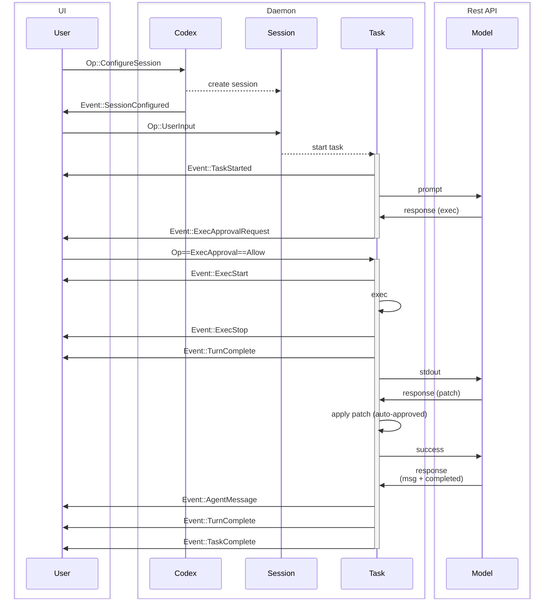

# Codex — Knowledge Context Pack (Literal)
> Compilación literal sin inferencia. Uso interno.

## Tabla de contenido
- [.devcontainer/README.md](#devcontainerREADMEmd)
- [.devcontainer/devcontainer.json](#devcontainerdevcontainerjson)
- [.github/ISSUE_TEMPLATE/2-bug-report.yml](#githubISSUE_TEMPLATE2-bug-reportyml)
- [.github/ISSUE_TEMPLATE/3-docs-issue.yml](#githubISSUE_TEMPLATE3-docs-issueyml)
- [.github/ISSUE_TEMPLATE/4-feature-request.yml](#githubISSUE_TEMPLATE4-feature-requestyml)
- [.github/codex/labels/codex-attempt.md](#githubcodexlabelscodex-attemptmd)
- [.github/codex/labels/codex-review.md](#githubcodexlabelscodex-reviewmd)
- [.github/codex/labels/codex-rust-review.md](#githubcodexlabelscodex-rust-reviewmd)
- [.github/codex/labels/codex-triage.md](#githubcodexlabelscodex-triagemd)
- [.github/dependabot.yaml](#githubdependabotyaml)
- [.github/dotslash-config.json](#githubdotslash-configjson)
- [.github/pull_request_template.md](#githubpull_request_templatemd)
- [.github/workflows/ci.yml](#githubworkflowsciyml)
- [.github/workflows/cla.yml](#githubworkflowsclayml)
- [.github/workflows/rust-ci.yml](#githubworkflowsrust-ciyml)
- [.github/workflows/rust-release.yml](#githubworkflowsrust-releaseyml)
- [AGENTS.md](#AGENTSmd)
- [CHANGELOG.md](#CHANGELOGmd)
- [PNPM.md](#PNPMmd)
- [README.md](#READMEmd)
- [cliff.toml](#clifftoml)
- [codex-cli/README.md](#codex-cliREADMEmd)
- [codex-cli/bin/codex.js](#codex-clibincodexjs)
- [codex-cli/package-lock.json](#codex-clipackage-lockjson)
- [codex-cli/package.json](#codex-clipackagejson)
- [codex-cli/scripts/README.md](#codex-cliscriptsREADMEmd)
- [codex-cli/scripts/build_container.sh](#codex-cliscriptsbuild_containersh)
- [codex-cli/scripts/init_firewall.sh](#codex-cliscriptsinit_firewallsh)
- [codex-cli/scripts/install_native_deps.sh](#codex-cliscriptsinstall_native_depssh)
- [codex-cli/scripts/run_in_container.sh](#codex-cliscriptsrun_in_containersh)
- [codex-cli/scripts/stage_release.sh](#codex-cliscriptsstage_releasesh)
- [codex-rs/Cargo.toml](#codex-rsCargotoml)
- [codex-rs/README.md](#codex-rsREADMEmd)
- [codex-rs/ansi-escape/Cargo.toml](#codex-rsansi-escapeCargotoml)
- [codex-rs/ansi-escape/README.md](#codex-rsansi-escapeREADMEmd)
- [codex-rs/apply-patch/Cargo.toml](#codex-rsapply-patchCargotoml)
- [codex-rs/arg0/Cargo.toml](#codex-rsarg0Cargotoml)
- [codex-rs/chatgpt/Cargo.toml](#codex-rschatgptCargotoml)
- [codex-rs/chatgpt/README.md](#codex-rschatgptREADMEmd)
- [codex-rs/chatgpt/tests/task_turn_fixture.json](#codex-rschatgptteststask_turn_fixturejson)
- [codex-rs/cli/Cargo.toml](#codex-rscliCargotoml)
- [codex-rs/common/Cargo.toml](#codex-rscommonCargotoml)
- [codex-rs/common/README.md](#codex-rscommonREADMEmd)
- [codex-rs/core/Cargo.toml](#codex-rscoreCargotoml)
- [codex-rs/core/README.md](#codex-rscoreREADMEmd)
- [codex-rs/core/prompt.md](#codex-rscorepromptmd)
- [codex-rs/core/src/prompt_for_compact_command.md](#codex-rscoresrcprompt_for_compact_commandmd)
- [codex-rs/core/tests/common/Cargo.toml](#codex-rscoretestscommonCargotoml)
- [codex-rs/docs/protocol_v1.md](#codex-rsdocsprotocol_v1md)
- [codex-rs/exec/Cargo.toml](#codex-rsexecCargotoml)
- [codex-rs/execpolicy/Cargo.toml](#codex-rsexecpolicyCargotoml)
- [codex-rs/execpolicy/README.md](#codex-rsexecpolicyREADMEmd)
- [codex-rs/file-search/Cargo.toml](#codex-rsfile-searchCargotoml)
- [codex-rs/file-search/README.md](#codex-rsfile-searchREADMEmd)
- [codex-rs/linux-sandbox/Cargo.toml](#codex-rslinux-sandboxCargotoml)
- [codex-rs/linux-sandbox/README.md](#codex-rslinux-sandboxREADMEmd)
- [codex-rs/login/Cargo.toml](#codex-rsloginCargotoml)
- [codex-rs/mcp-client/Cargo.toml](#codex-rsmcp-clientCargotoml)
- [codex-rs/mcp-server/Cargo.toml](#codex-rsmcp-serverCargotoml)
- [codex-rs/mcp-server/tests/common/Cargo.toml](#codex-rsmcp-servertestscommonCargotoml)
- [codex-rs/ollama/Cargo.toml](#codex-rsollamaCargotoml)
- [codex-rs/protocol-ts/Cargo.toml](#codex-rsprotocol-tsCargotoml)
- [codex-rs/protocol/Cargo.toml](#codex-rsprotocolCargotoml)
- [codex-rs/protocol/README.md](#codex-rsprotocolREADMEmd)
- [codex-rs/scripts/create_github_release.sh](#codex-rsscriptscreate_github_releasesh)
- [codex-rs/tui/Cargo.toml](#codex-rstuiCargotoml)
- [codex-rs/tui/styles.md](#codex-rstuistylesmd)
- [codex-rs/tui/tests/fixtures/ideal-binary-response.txt](#codex-rstuitestsfixturesideal-binary-responsetxt)
- [docs/CLA.md](#docsCLAmd)
- [docs/advanced.md](#docsadvancedmd)
- [docs/authentication.md](#docsauthenticationmd)
- [docs/config.md](#docsconfigmd)
- [docs/contributing.md](#docscontributingmd)
- [docs/experimental.md](#docsexperimentalmd)
- [docs/faq.md](#docsfaqmd)
- [docs/getting-started.md](#docsgetting-startedmd)
- [docs/install.md](#docsinstallmd)
- [docs/open-source-fund.md](#docsopen-source-fundmd)
- [docs/platform-sandboxing.md](#docsplatform-sandboxingmd)
- [docs/release_management.md](#docsrelease_managementmd)
- [docs/sandbox.md](#docssandboxmd)
- [docs/zdr.md](#docszdrmd)
- [package.json](#packagejson)
- [scripts/publish_to_npm.py](#scriptspublish_to_npmpy)

### .devcontainer/README.md
We provide the following options to facilitate Codex development in a container. This is particularly useful for verifying the Linux build when working on a macOS host.

Fuente: path=.devcontainer/README.md · commit=74d27417 · líneas=3-3 · mtime=2025-08-28

```shell
CODEX_DOCKER_IMAGE_NAME=codex-linux-dev
docker build --platform=linux/amd64 -t "$CODEX_DOCKER_IMAGE_NAME" ./.devcontainer
docker run --platform=linux/amd64 --rm -it -e CARGO_TARGET_DIR=/workspace/codex-rs/target-amd64 -v "$PWD":/workspace -w /workspace/codex-rs "$CODEX_DOCKER_IMAGE_NAME"
```

Fuente: path=.devcontainer/README.md · commit=74d27417 · líneas=9-13 · mtime=2025-08-28

Note that `/workspace/target` will contain the binaries built for your host platform, so we include `-e CARGO_TARGET_DIR=/workspace/codex-rs/target-amd64` in the `docker run` command so that the binaries built inside your container are written to a separate directory.

Fuente: path=.devcontainer/README.md · commit=74d27417 · líneas=15-15 · mtime=2025-08-28

VS Code recognizes the `devcontainer.json` file and gives you the option to develop Codex in a container. Currently, `devcontainer.json` builds and runs the `arm64` flavor of the container.

Fuente: path=.devcontainer/README.md · commit=74d27417 · líneas=23-23 · mtime=2025-08-28

### .devcontainer/devcontainer.json
  "name": "Codex",

Fuente: path=.devcontainer/devcontainer.json · commit=74d27417 · líneas=2-2 · mtime=2025-08-28

    "CARGO_TARGET_DIR": "${containerWorkspaceFolder}/codex-rs/target-arm64"

Fuente: path=.devcontainer/devcontainer.json · commit=74d27417 · líneas=15-15 · mtime=2025-08-28

### .github/ISSUE_TEMPLATE/2-bug-report.yml
        Thank you for submitting a bug report! It helps make Codex better for everyone.

Fuente: path=.github/ISSUE_TEMPLATE/2-bug-report.yml · commit=74d27417 · líneas=10-10 · mtime=2025-08-28

        If you need help or support using Codex, and are not reporting a bug, please post on [codex/discussions](https://github.com/openai/codex/discussions), where you can ask questions or engage with others on ideas for how to improve codex.

Fuente: path=.github/ISSUE_TEMPLATE/2-bug-report.yml · commit=74d27417 · líneas=12-12 · mtime=2025-08-28

        Make sure you are running the [latest](https://npmjs.com/package/@openai/codex) version of Codex CLI. The bug you are experiencing may already have been fixed.

Fuente: path=.github/ISSUE_TEMPLATE/2-bug-report.yml · commit=74d27417 · líneas=14-14 · mtime=2025-08-28

      label: What version of Codex is running?

Fuente: path=.github/ISSUE_TEMPLATE/2-bug-report.yml · commit=74d27417 · líneas=21-21 · mtime=2025-08-28

      description: Copy the output of `codex --version`

Fuente: path=.github/ISSUE_TEMPLATE/2-bug-report.yml · commit=74d27417 · líneas=22-22 · mtime=2025-08-28

### .github/ISSUE_TEMPLATE/3-docs-issue.yml
        Thank you for submitting a documentation request. It helps make Codex better.

Fuente: path=.github/ISSUE_TEMPLATE/3-docs-issue.yml · commit=74d27417 · líneas=8-8 · mtime=2025-08-28

### .github/ISSUE_TEMPLATE/4-feature-request.yml
description: Propose a new feature for Codex

Fuente: path=.github/ISSUE_TEMPLATE/4-feature-request.yml · commit=74d27417 · líneas=2-2 · mtime=2025-08-28

        Is Codex missing a feature that you'd like to see? Feel free to propose it here.

Fuente: path=.github/ISSUE_TEMPLATE/4-feature-request.yml · commit=74d27417 · líneas=10-10 · mtime=2025-08-28

        2. The Codex team will try to balance the varying needs of the community when prioritizing or rejecting new features. Not all features will be accepted. See [Contributing](https://github.com/openai/codex#contributing) for more details.

Fuente: path=.github/ISSUE_TEMPLATE/4-feature-request.yml · commit=74d27417 · líneas=14-14 · mtime=2025-08-28

### .github/codex/labels/codex-attempt.md
### {CODEX_ACTION_ISSUE_TITLE}

Fuente: path=.github/codex/labels/codex-attempt.md · commit=74d27417 · líneas=7-7 · mtime=2025-08-28

{CODEX_ACTION_ISSUE_BODY}

Fuente: path=.github/codex/labels/codex-attempt.md · commit=74d27417 · líneas=9-9 · mtime=2025-08-28

### .github/codex/labels/codex-review.md
{CODEX_ACTION_GITHUB_EVENT_PATH} contains the JSON that triggered this GitHub workflow. It contains the `base` and `head` refs that define this PR. Both refs are available locally.

Fuente: path=.github/codex/labels/codex-review.md · commit=74d27417 · líneas=7-7 · mtime=2025-08-28

### .github/codex/labels/codex-rust-review.md
- Each create in the Cargo workspace in `codex-rs` has a specific purpose: make a note if you believe new code is not introduced in the correct crate.
- When possible, try to keep the `core` crate as small as possible. Non-core but shared logic is often a good candidate for `codex-rs/common`.
- Be wary of large files and offer suggestions for how to break things into more reasonably-sized files.
- Rust files should generally be organized such that the public parts of the API appear near the top of the file and helper functions go below. This is analagous to the "inverted pyramid" structure that is favored in journalism.

Fuente: path=.github/codex/labels/codex-rust-review.md · commit=74d27417 · líneas=18-21 · mtime=2025-08-28

- If the nature of the change seems to have a visual component (which is often the case for changes to `codex-rs/tui`), recommend including a screenshot or video to demonstrate the change, if appropriate.
- References to existing GitHub issues and PRs are encouraged, where appropriate, though you likely do not have network access, so may not be able to help here.

Fuente: path=.github/codex/labels/codex-rust-review.md · commit=74d27417 · líneas=134-135 · mtime=2025-08-28

{CODEX_ACTION_GITHUB_EVENT_PATH} contains the JSON that triggered this GitHub workflow. It contains the `base` and `head` refs that define this PR. Both refs are available locally.

Fuente: path=.github/codex/labels/codex-rust-review.md · commit=74d27417 · líneas=139-139 · mtime=2025-08-28

### .github/codex/labels/codex-triage.md
### {CODEX_ACTION_ISSUE_TITLE}

Fuente: path=.github/codex/labels/codex-triage.md · commit=74d27417 · líneas=5-5 · mtime=2025-08-28

{CODEX_ACTION_ISSUE_BODY}

Fuente: path=.github/codex/labels/codex-triage.md · commit=74d27417 · líneas=7-7 · mtime=2025-08-28

### .github/dependabot.yaml
    directory: .github/actions/codex

Fuente: path=.github/dependabot.yaml · commit=74d27417 · líneas=6-6 · mtime=2025-08-28

      - codex-rs

Fuente: path=.github/dependabot.yaml · commit=74d27417 · líneas=11-11 · mtime=2025-08-28

      - codex-rs/*

Fuente: path=.github/dependabot.yaml · commit=74d27417 · líneas=12-12 · mtime=2025-08-28

    directory: codex-cli

Fuente: path=.github/dependabot.yaml · commit=74d27417 · líneas=20-20 · mtime=2025-08-28

    directory: codex-rs

Fuente: path=.github/dependabot.yaml · commit=74d27417 · líneas=28-28 · mtime=2025-08-28

### .github/dotslash-config.json
    "codex": {

Fuente: path=.github/dotslash-config.json · commit=74d27417 · líneas=3-3 · mtime=2025-08-28

          "regex": "^codex-aarch64-apple-darwin\\.zst$",

Fuente: path=.github/dotslash-config.json · commit=74d27417 · líneas=6-6 · mtime=2025-08-28

          "path": "codex"

Fuente: path=.github/dotslash-config.json · commit=74d27417 · líneas=7-7 · mtime=2025-08-28

          "regex": "^codex-x86_64-apple-darwin\\.zst$",

Fuente: path=.github/dotslash-config.json · commit=74d27417 · líneas=10-10 · mtime=2025-08-28

          "path": "codex"

Fuente: path=.github/dotslash-config.json · commit=74d27417 · líneas=11-11 · mtime=2025-08-28

          "regex": "^codex-x86_64-unknown-linux-musl\\.zst$",

Fuente: path=.github/dotslash-config.json · commit=74d27417 · líneas=14-14 · mtime=2025-08-28

          "path": "codex"

Fuente: path=.github/dotslash-config.json · commit=74d27417 · líneas=15-15 · mtime=2025-08-28

          "regex": "^codex-aarch64-unknown-linux-musl\\.zst$",

Fuente: path=.github/dotslash-config.json · commit=74d27417 · líneas=18-18 · mtime=2025-08-28

          "path": "codex"

Fuente: path=.github/dotslash-config.json · commit=74d27417 · líneas=19-19 · mtime=2025-08-28

          "regex": "^codex-x86_64-pc-windows-msvc\\.exe\\.zst$",

Fuente: path=.github/dotslash-config.json · commit=74d27417 · líneas=22-22 · mtime=2025-08-28

          "path": "codex.exe"

Fuente: path=.github/dotslash-config.json · commit=74d27417 · líneas=23-23 · mtime=2025-08-28

### .github/pull_request_template.md
Before opening this Pull Request, please read the "Contributing" section of the README or your PR may be closed:
https://github.com/openai/codex#contributing

Fuente: path=.github/pull_request_template.md · commit=74d27417 · líneas=3-4 · mtime=2025-08-28

### .github/workflows/ci.yml
        run: ./codex-cli/scripts/stage_release.sh

Fuente: path=.github/workflows/ci.yml · commit=74d27417 · líneas=50-50 · mtime=2025-08-28

      - name: Ensure codex-cli/README.md contains only ASCII and certain Unicode code points

Fuente: path=.github/workflows/ci.yml · commit=74d27417 · líneas=57-57 · mtime=2025-08-28

        run: ./scripts/asciicheck.py codex-cli/README.md

Fuente: path=.github/workflows/ci.yml · commit=74d27417 · líneas=58-58 · mtime=2025-08-28

      - name: Check codex-cli/README ToC

Fuente: path=.github/workflows/ci.yml · commit=74d27417 · líneas=59-59 · mtime=2025-08-28

        run: python3 scripts/readme_toc.py codex-cli/README.md

Fuente: path=.github/workflows/ci.yml · commit=74d27417 · líneas=60-60 · mtime=2025-08-28

### .github/workflows/cla.yml
          path-to-document: https://github.com/openai/codex/blob/main/docs/CLA.md

Fuente: path=.github/workflows/cla.yml · commit=74d27417 · líneas=26-26 · mtime=2025-08-28

### .github/workflows/rust-ci.yml
      codex: ${{ steps.detect.outputs.codex }}

Fuente: path=.github/workflows/rust-ci.yml · commit=74d27417 · líneas=17-17 · mtime=2025-08-28

            files=("codex-rs/force" ".github/force")

Fuente: path=.github/workflows/rust-ci.yml · commit=74d27417 · líneas=36-36 · mtime=2025-08-28

          codex=false

Fuente: path=.github/workflows/rust-ci.yml · commit=74d27417 · líneas=39-39 · mtime=2025-08-28

            [[ $f == codex-rs/* ]] && codex=true

Fuente: path=.github/workflows/rust-ci.yml · commit=74d27417 · líneas=42-42 · mtime=2025-08-28

          echo "codex=$codex" >> "$GITHUB_OUTPUT"

Fuente: path=.github/workflows/rust-ci.yml · commit=74d27417 · líneas=46-46 · mtime=2025-08-28

    if: ${{ needs.changed.outputs.codex == 'true' || needs.changed.outputs.workflows == 'true' || github.event_name == 'push' }}

Fuente: path=.github/workflows/rust-ci.yml · commit=74d27417 · líneas=54-54 · mtime=2025-08-28

        working-directory: codex-rs

Fuente: path=.github/workflows/rust-ci.yml · commit=74d27417 · líneas=57-57 · mtime=2025-08-28

    if: ${{ needs.changed.outputs.codex == 'true' || needs.changed.outputs.workflows == 'true' || github.event_name == 'push' }}

Fuente: path=.github/workflows/rust-ci.yml · commit=74d27417 · líneas=73-73 · mtime=2025-08-28

        working-directory: codex-rs

Fuente: path=.github/workflows/rust-ci.yml · commit=74d27417 · líneas=76-76 · mtime=2025-08-28

            ${{ github.workspace }}/codex-rs/target/

Fuente: path=.github/workflows/rust-ci.yml · commit=74d27417 · líneas=127-127 · mtime=2025-08-28

          if [[ '${{ needs.changed.outputs.codex }}' != 'true' && '${{ needs.changed.outputs.workflows }}' != 'true' && '${{ github.event_name }}' != 'push' ]]; then

Fuente: path=.github/workflows/rust-ci.yml · commit=74d27417 · líneas=186-186 · mtime=2025-08-28

### .github/workflows/rust-release.yml
# Release workflow for codex-rs.

Fuente: path=.github/workflows/rust-release.yml · commit=74d27417 · líneas=1-1 · mtime=2025-08-28

          cargo_ver="$(grep -m1 '^version' codex-rs/Cargo.toml \

Fuente: path=.github/workflows/rust-release.yml · commit=74d27417 · líneas=38-38 · mtime=2025-08-28

        working-directory: codex-rs

Fuente: path=.github/workflows/rust-release.yml · commit=74d27417 · líneas=55-55 · mtime=2025-08-28

            ${{ github.workspace }}/codex-rs/target/

Fuente: path=.github/workflows/rust-release.yml · commit=74d27417 · líneas=89-89 · mtime=2025-08-28

        run: cargo build --target ${{ matrix.target }} --release --bin codex

Fuente: path=.github/workflows/rust-release.yml · commit=74d27417 · líneas=98-98 · mtime=2025-08-28

            cp target/${{ matrix.target }}/release/codex.exe "$dest/codex-${{ matrix.target }}.exe"

Fuente: path=.github/workflows/rust-release.yml · commit=74d27417 · líneas=107-107 · mtime=2025-08-28

            cp target/${{ matrix.target }}/release/codex "$dest/codex-${{ matrix.target }}"

Fuente: path=.github/workflows/rust-release.yml · commit=74d27417 · líneas=109-109 · mtime=2025-08-28

          #   codex-<target>.zst          (existing)

Fuente: path=.github/workflows/rust-release.yml · commit=74d27417 · líneas=122-122 · mtime=2025-08-28

          #   codex-<target>.tar.gz       (new)

Fuente: path=.github/workflows/rust-release.yml · commit=74d27417 · líneas=123-123 · mtime=2025-08-28

          #   codex-<target>.zip          (only for Windows)

Fuente: path=.github/workflows/rust-release.yml · commit=74d27417 · líneas=124-124 · mtime=2025-08-28

            codex-rs/dist/${{ matrix.target }}/*

Fuente: path=.github/workflows/rust-release.yml · commit=74d27417 · líneas=157-157 · mtime=2025-08-28

          python3 codex-cli/scripts/stage_rust_release.py \

Fuente: path=.github/workflows/rust-release.yml · commit=74d27417 · líneas=189-189 · mtime=2025-08-28

             "${GITHUB_WORKSPACE}/dist/npm/codex-npm-${{ steps.release_name.outputs.name }}.tgz"

Fuente: path=.github/workflows/rust-release.yml · commit=74d27417 · líneas=197-197 · mtime=2025-08-28

### AGENTS.md
# Rust/codex-rs

Fuente: path=AGENTS.md · commit=74d27417 · líneas=1-1 · mtime=2025-08-28

In the codex-rs folder where the rust code lives:

Fuente: path=AGENTS.md · commit=74d27417 · líneas=3-3 · mtime=2025-08-28

- Crate names are prefixed with `codex-`. For example, the `core` folder's crate is named `codex-core`
- When using format! and you can inline variables into {}, always do that.
- Never add or modify any code related to `CODEX_SANDBOX_NETWORK_DISABLED_ENV_VAR` or `CODEX_SANDBOX_ENV_VAR`.
  - You operate in a sandbox where `CODEX_SANDBOX_NETWORK_DISABLED=1` will be set whenever you use the `shell` tool. Any existing code that uses `CODEX_SANDBOX_NETWORK_DISABLED_ENV_VAR` was authored with this fact in mind. It is often used to early exit out of tests that the author knew you would not be able to run given your sandbox limitations.
  - Similarly, when you spawn a process using Seatbelt (`/usr/bin/sandbox-exec`), `CODEX_SANDBOX=seatbelt` will be set on the child process. Integration tests that want to run Seatbelt themselves cannot be run under Seatbelt, so checks for `CODEX_SANDBOX=seatbelt` are also often used to early exit out of tests, as appropriate.

Fuente: path=AGENTS.md · commit=74d27417 · líneas=5-9 · mtime=2025-08-28

Before finalizing a change to `codex-rs`, run `just fmt` (in `codex-rs` directory) to format the code and `just fix -p <project>` (in `codex-rs` directory) to fix any linter issues in the code. Additionally, run the tests:
1. Run the test for the specific project that was changed. For example, if changes were made in `codex-rs/tui`, run `cargo test -p codex-tui`.
2. Once those pass, if any changes were made in common, core, or protocol, run the complete test suite with `cargo test --all-features`.
When running interactively, ask the user before running these commands to finalize.

Fuente: path=AGENTS.md · commit=74d27417 · líneas=11-14 · mtime=2025-08-28

See `codex-rs/tui/styles.md`.

Fuente: path=AGENTS.md · commit=74d27417 · líneas=18-18 · mtime=2025-08-28

This repo uses snapshot tests (via `insta`), especially in `codex-rs/tui`, to validate rendered output. When UI or text output changes intentionally, update the snapshots as follows:

Fuente: path=AGENTS.md · commit=74d27417 · líneas=31-31 · mtime=2025-08-28

- Run tests to generate any updated snapshots:
  - `cargo test -p codex-tui`
- Check what’s pending:
  - `cargo insta pending-snapshots -p codex-tui`
- Review changes by reading the generated `*.snap.new` files directly in the repo, or preview a specific file:
  - `cargo insta show -p codex-tui path/to/file.snap.new`
- Only if you intend to accept all new snapshots in this crate, run:
  - `cargo insta accept -p codex-tui`

Fuente: path=AGENTS.md · commit=74d27417 · líneas=33-40 · mtime=2025-08-28

### CHANGELOG.md
The changelog can be found on the [releases page](https://github.com/openai/codex/releases)

Fuente: path=CHANGELOG.md · commit=74d27417 · líneas=1-1 · mtime=2025-08-28

### PNPM.md
| Action                                     | Command                                  |
| ------------------------------------------ | ---------------------------------------- |
| Run a command in a specific package        | `pnpm --filter @openai/codex run build`  |
| Install a dependency in a specific package | `pnpm --filter @openai/codex add lodash` |
| Run a command in all packages              | `pnpm -r run test`                       |

Fuente: path=PNPM.md · commit=74d27417 · líneas=36-40 · mtime=2025-08-28

```
codex/
├── pnpm-workspace.yaml    # Workspace configuration
├── .npmrc                 # pnpm configuration
├── package.json           # Root dependencies and scripts
├── codex-cli/             # Main package
│   └── package.json       # codex-cli specific dependencies
└── docs/                  # Documentation (future package)
```

Fuente: path=PNPM.md · commit=74d27417 · líneas=44-52 · mtime=2025-08-28

### README.md
<h1 align="center">OpenAI Codex CLI</h1>

Fuente: path=README.md · commit=74d27417 · líneas=1-1 · mtime=2025-08-28

<p align="center"><code>npm i -g @openai/codex</code><br />or <code>brew install codex</code></p>

Fuente: path=README.md · commit=74d27417 · líneas=3-3 · mtime=2025-08-28

<p align="center"><strong>Codex CLI</strong> is a coding agent from OpenAI that runs locally on your computer.</br>If you are looking for the <em>cloud-based agent</em> from OpenAI, <strong>Codex Web</strong>, see <a href="https://chatgpt.com/codex">chatgpt.com/codex</a>.</p>

Fuente: path=README.md · commit=74d27417 · líneas=5-5 · mtime=2025-08-28

<p align="center">
  
  </p>

Fuente: path=README.md · commit=74d27417 · líneas=7-9 · mtime=2025-08-28

### Installing and running Codex CLI

Fuente: path=README.md · commit=74d27417 · líneas=15-15 · mtime=2025-08-28

```shell
npm install -g @openai/codex  # Alternatively: `brew install codex`
```

Fuente: path=README.md · commit=74d27417 · líneas=19-21 · mtime=2025-08-28

Then simply run `codex` to get started:

Fuente: path=README.md · commit=74d27417 · líneas=23-23 · mtime=2025-08-28

```shell
codex
```

Fuente: path=README.md · commit=74d27417 · líneas=25-27 · mtime=2025-08-28

<details>
<summary>You can also go to the <a href="https://github.com/openai/codex/releases/latest">latest GitHub Release</a> and download the appropriate binary for your platform.</summary>

Fuente: path=README.md · commit=74d27417 · líneas=29-30 · mtime=2025-08-28

- macOS
  - Apple Silicon/arm64: `codex-aarch64-apple-darwin.tar.gz`
  - x86_64 (older Mac hardware): `codex-x86_64-apple-darwin.tar.gz`
- Linux
  - x86_64: `codex-x86_64-unknown-linux-musl.tar.gz`
  - arm64: `codex-aarch64-unknown-linux-musl.tar.gz`

Fuente: path=README.md · commit=74d27417 · líneas=34-39 · mtime=2025-08-28

Each archive contains a single entry with the platform baked into the name (e.g., `codex-x86_64-unknown-linux-musl`), so you likely want to rename it to `codex` after extracting it.

Fuente: path=README.md · commit=74d27417 · líneas=41-41 · mtime=2025-08-28

### Using Codex with your ChatGPT plan

Fuente: path=README.md · commit=74d27417 · líneas=45-45 · mtime=2025-08-28

<p align="center">
  
  </p>

Fuente: path=README.md · commit=74d27417 · líneas=47-49 · mtime=2025-08-28

Run `codex` and select **Sign in with ChatGPT**. We recommend signing into your ChatGPT account to use Codex as part of your Plus, Pro, Team, Edu, or Enterprise plan. [Learn more about what's included in your ChatGPT plan](https://help.openai.com/en/articles/11369540-codex-in-chatgpt).

Fuente: path=README.md · commit=74d27417 · líneas=51-51 · mtime=2025-08-28

You can also use Codex with an API key, but this requires [additional setup](./docs/authentication.md#usage-based-billing-alternative-use-an-openai-api-key). If you previously used an API key for usage-based billing, see the [migration steps](./docs/authentication.md#migrating-from-usage-based-billing-api-key). If you're having trouble with login, please comment on [this issue](https://github.com/openai/codex/issues/1243).

Fuente: path=README.md · commit=74d27417 · líneas=53-53 · mtime=2025-08-28

Codex CLI supports [MCP servers](./docs/advanced.md#model-context-protocol-mcp). Enable by adding an `mcp_servers` section to your `~/.codex/config.toml`.

Fuente: path=README.md · commit=74d27417 · líneas=57-57 · mtime=2025-08-28

Codex CLI supports a rich set of configuration options, with preferences stored in `~/.codex/config.toml`. For full configuration options, see [Configuration](./docs/config.md).

Fuente: path=README.md · commit=74d27417 · líneas=62-62 · mtime=2025-08-28

### cliff.toml
You can install any of these versions: `npm install -g codex@version`

Fuente: path=cliff.toml · commit=74d27417 · líneas=7-7 · mtime=2025-08-28

### codex-cli/README.md
<h1 align="center">OpenAI Codex CLI</h1>
<p align="center">Lightweight coding agent that runs in your terminal</p>

Fuente: path=codex-cli/README.md · commit=74d27417 · líneas=1-2 · mtime=2025-08-28

<p align="center"><code>npm i -g @openai/codex</code></p>

Fuente: path=codex-cli/README.md · commit=74d27417 · líneas=4-4 · mtime=2025-08-28

> [!IMPORTANT]
> This is the documentation for the _legacy_ TypeScript implementation of the Codex CLI. It has been superseded by the _Rust_ implementation. See the [README in the root of the Codex repository](https://github.com/openai/codex/blob/main/README.md) for details.

Fuente: path=codex-cli/README.md · commit=74d27417 · líneas=6-7 · mtime=2025-08-28


Fuente: path=codex-cli/README.md · commit=74d27417 · líneas=9-9 · mtime=2025-08-28

- [Experimental technology disclaimer](#experimental-technology-disclaimer)
- [Quickstart](#quickstart)
- [Why Codex?](#why-codex)
- [Security model & permissions](#security-model--permissions)
  - [Platform sandboxing details](#platform-sandboxing-details)
- [System requirements](#system-requirements)
- [CLI reference](#cli-reference)
- [Memory & project docs](#memory--project-docs)
- [Non-interactive / CI mode](#non-interactive--ci-mode)
- [Tracing / verbose logging](#tracing--verbose-logging)
- [Recipes](#recipes)
- [Installation](#installation)
- [Configuration guide](#configuration-guide)
  - [Basic configuration parameters](#basic-configuration-parameters)
  - [Custom AI provider configuration](#custom-ai-provider-configuration)
  - [History configuration](#history-configuration)
  - [Configuration examples](#configuration-examples)
  - [Full configuration example](#full-configuration-example)
  - [Custom instructions](#custom-instructions)
  - [Environment variables setup](#environment-variables-setup)
- [FAQ](#faq)
- [Zero data retention (ZDR) usage](#zero-data-retention-zdr-usage)
- [Codex open source fund](#codex-open-source-fund)
- [Contributing](#contributing)
  - [Development workflow](#development-workflow)
  - [Git hooks with Husky](#git-hooks-with-husky)
  - [Debugging](#debugging)
  - [Writing high-impact code changes](#writing-high-impact-code-changes)
  - [Opening a pull request](#opening-a-pull-request)
  - [Review process](#review-process)
  - [Community values](#community-values)
  - [Getting help](#getting-help)
  - [Contributor license agreement (CLA)](#contributor-license-agreement-cla)
    - [Quick fixes](#quick-fixes)
  - [Releasing `codex`](#releasing-codex)
  - [Alternative build options](#alternative-build-options)
    - [Nix flake development](#nix-flake-development)
- [Security & responsible AI](#security--responsible-ai)
- [License](#license)

Fuente: path=codex-cli/README.md · commit=74d27417 · líneas=18-56 · mtime=2025-08-28

Codex CLI is an experimental project under active development. It is not yet stable, may contain bugs, incomplete features, or undergo breaking changes. We're building it in the open with the community and welcome:

Fuente: path=codex-cli/README.md · commit=74d27417 · líneas=66-66 · mtime=2025-08-28

```shell
npm install -g @openai/codex
```

Fuente: path=codex-cli/README.md · commit=74d27417 · líneas=79-81 · mtime=2025-08-28

> Codex also allows you to use other providers that support the OpenAI Chat Completions API. You can set the provider in the config file or use the `--provider` flag. The possible options for `--provider` are:
>
> - openai (default)
> - openrouter
> - azure
> - gemini
> - ollama
> - mistral
> - deepseek
> - xai
> - groq
> - arceeai
> - any other provider that is compatible with the OpenAI API
>
> If you use a provider other than OpenAI, you will need to set the API key for the provider in the config file or in the environment variable as:
>
> ```shell
> export <provider>_API_KEY="your-api-key-here"
> ```
>
> If you use a provider not listed above, you must also set the base URL for the provider:
>
> ```shell
> export <provider>_BASE_URL="https://your-provider-api-base-url"
> ```

Fuente: path=codex-cli/README.md · commit=74d27417 · líneas=100-124 · mtime=2025-08-28

```shell
codex
```

Fuente: path=codex-cli/README.md · commit=74d27417 · líneas=131-133 · mtime=2025-08-28

```shell
codex "explain this codebase to me"
```

Fuente: path=codex-cli/README.md · commit=74d27417 · líneas=137-139 · mtime=2025-08-28

```shell
codex --approval-mode full-auto "create the fanciest todo-list app"
```

Fuente: path=codex-cli/README.md · commit=74d27417 · líneas=141-143 · mtime=2025-08-28

That's it - Codex will scaffold a file, run it inside a sandbox, install any
missing dependencies, and show you the live result. Approve the changes and
they'll be committed to your working directory.

Fuente: path=codex-cli/README.md · commit=74d27417 · líneas=145-147 · mtime=2025-08-28

## Why Codex?

Fuente: path=codex-cli/README.md · commit=74d27417 · líneas=151-151 · mtime=2025-08-28

Codex CLI is built for developers who already **live in the terminal** and want
ChatGPT-level reasoning **plus** the power to actually run code, manipulate
files, and iterate - all under version control. In short, it's _chat-driven
development_ that understands and executes your repo.

Fuente: path=codex-cli/README.md · commit=74d27417 · líneas=153-156 · mtime=2025-08-28

Codex lets you decide _how much autonomy_ the agent receives and auto-approval policy via the
`--approval-mode` flag (or the interactive onboarding prompt):

Fuente: path=codex-cli/README.md · commit=74d27417 · líneas=168-169 · mtime=2025-08-28

In **Full Auto** every command is run **network-disabled** and confined to the
current working directory (plus temporary files) for defense-in-depth. Codex
will also show a warning/confirmation if you start in **auto-edit** or
**full-auto** while the directory is _not_ tracked by Git, so you always have a
safety net.

Fuente: path=codex-cli/README.md · commit=74d27417 · líneas=177-181 · mtime=2025-08-28

The hardening mechanism Codex uses depends on your OS:

Fuente: path=codex-cli/README.md · commit=74d27417 · líneas=188-188 · mtime=2025-08-28

  - Everything is placed in a read-only jail except for a small set of
    writable roots (`$PWD`, `$TMPDIR`, `~/.codex`, etc.).
  - Outbound network is _fully blocked_ by default - even if a child process
    tries to `curl` somewhere it will fail.

Fuente: path=codex-cli/README.md · commit=74d27417 · líneas=192-195 · mtime=2025-08-28

- **Linux** - there is no sandboxing by default.
  We recommend using Docker for sandboxing, where Codex launches itself inside a **minimal
  container image** and mounts your repo _read/write_ at the same path. A
  custom `iptables`/`ipset` firewall script denies all egress except the
  OpenAI API. This gives you deterministic, reproducible runs without needing
  root on the host. You can use the [`run_in_container.sh`](../codex-cli/scripts/run_in_container.sh) script to set up the sandbox.

Fuente: path=codex-cli/README.md · commit=74d27417 · líneas=197-202 · mtime=2025-08-28

| Command                              | Purpose                             | Example                              |
| ------------------------------------ | ----------------------------------- | ------------------------------------ |
| `codex`                              | Interactive REPL                    | `codex`                              |
| `codex "..."`                        | Initial prompt for interactive REPL | `codex "fix lint errors"`            |
| `codex -q "..."`                     | Non-interactive "quiet mode"        | `codex -q --json "explain utils.ts"` |
| `codex completion <bash\|zsh\|fish>` | Print shell completion script       | `codex completion bash`              |

Fuente: path=codex-cli/README.md · commit=74d27417 · líneas=221-226 · mtime=2025-08-28

You can give Codex extra instructions and guidance using `AGENTS.md` files. Codex looks for `AGENTS.md` files in the following places, and merges them top-down:

Fuente: path=codex-cli/README.md · commit=74d27417 · líneas=234-234 · mtime=2025-08-28

1. `~/.codex/AGENTS.md` - personal global guidance
2. `AGENTS.md` at repo root - shared project notes
3. `AGENTS.md` in the current working directory - sub-folder/feature specifics

Fuente: path=codex-cli/README.md · commit=74d27417 · líneas=236-238 · mtime=2025-08-28

Disable loading of these files with `--no-project-doc` or the environment variable `CODEX_DISABLE_PROJECT_DOC=1`.

Fuente: path=codex-cli/README.md · commit=74d27417 · líneas=240-240 · mtime=2025-08-28

Run Codex head-less in pipelines. Example GitHub Action step:

Fuente: path=codex-cli/README.md · commit=74d27417 · líneas=246-246 · mtime=2025-08-28

```yaml
- name: Update changelog via Codex
  run: |
    npm install -g @openai/codex
    export OPENAI_API_KEY="${{ secrets.OPENAI_KEY }}"
    codex -a auto-edit --quiet "update CHANGELOG for next release"
```

Fuente: path=codex-cli/README.md · commit=74d27417 · líneas=248-254 · mtime=2025-08-28

Set `CODEX_QUIET_MODE=1` to silence interactive UI noise.

Fuente: path=codex-cli/README.md · commit=74d27417 · líneas=256-256 · mtime=2025-08-28

```shell
DEBUG=true codex
```

Fuente: path=codex-cli/README.md · commit=74d27417 · líneas=262-264 · mtime=2025-08-28

Below are a few bite-size examples you can copy-paste. Replace the text in quotes with your own task. See the [prompting guide](https://github.com/openai/codex/blob/main/codex-cli/examples/prompting_guide.md) for more tips and usage patterns.

Fuente: path=codex-cli/README.md · commit=74d27417 · líneas=270-270 · mtime=2025-08-28

| ✨  | What you type                                                                   | What happens                                                               |
| --- | ------------------------------------------------------------------------------- | -------------------------------------------------------------------------- |
| 1   | `codex "Refactor the Dashboard component to React Hooks"`                       | Codex rewrites the class component, runs `npm test`, and shows the diff.   |
| 2   | `codex "Generate SQL migrations for adding a users table"`                      | Infers your ORM, creates migration files, and runs them in a sandboxed DB. |
| 3   | `codex "Write unit tests for utils/date.ts"`                                    | Generates tests, executes them, and iterates until they pass.              |
| 4   | `codex "Bulk-rename *.jpeg -> *.jpg with git mv"`                               | Safely renames files and updates imports/usages.                           |
| 5   | `codex "Explain what this regex does: ^(?=.*[A-Z]).{8,}$"`                      | Outputs a step-by-step human explanation.                                  |
| 6   | `codex "Carefully review this repo, and propose 3 high impact well-scoped PRs"` | Suggests impactful PRs in the current codebase.                            |
| 7   | `codex "Look for vulnerabilities and create a security review report"`          | Finds and explains security bugs.                                          |

Fuente: path=codex-cli/README.md · commit=74d27417 · líneas=272-280 · mtime=2025-08-28

```bash
npm install -g @openai/codex
# or
yarn global add @openai/codex
# or
bun install -g @openai/codex
# or
pnpm add -g @openai/codex
```

Fuente: path=codex-cli/README.md · commit=74d27417 · líneas=289-297 · mtime=2025-08-28

```bash
# Clone the repository and navigate to the CLI package
git clone https://github.com/openai/codex.git
cd codex/codex-cli

# Enable corepack
corepack enable

# Install dependencies and build
pnpm install
pnpm build

# Linux-only: download prebuilt sandboxing binaries (requires gh and zstd).
./scripts/install_native_deps.sh

# Get the usage and the options
node ./dist/cli.js --help

# Run the locally-built CLI directly
node ./dist/cli.js

# Or link the command globally for convenience
pnpm link
```

Fuente: path=codex-cli/README.md · commit=74d27417 · líneas=304-327 · mtime=2025-08-28

Codex configuration files can be placed in the `~/.codex/` directory, supporting both YAML and JSON formats.

Fuente: path=codex-cli/README.md · commit=74d27417 · líneas=335-335 · mtime=2025-08-28

1. YAML format (save as `~/.codex/config.yaml`):

Fuente: path=codex-cli/README.md · commit=74d27417 · líneas=368-368 · mtime=2025-08-28

2. JSON format (save as `~/.codex/config.json`):

Fuente: path=codex-cli/README.md · commit=74d27417 · líneas=377-377 · mtime=2025-08-28

You can create a `~/.codex/AGENTS.md` file to define custom guidance for the agent:

Fuente: path=codex-cli/README.md · commit=74d27417 · líneas=458-458 · mtime=2025-08-28

<details>
<summary>OpenAI released a model called Codex in 2021 - is this related?</summary>

Fuente: path=codex-cli/README.md · commit=74d27417 · líneas=487-488 · mtime=2025-08-28

In 2021, OpenAI released Codex, an AI system designed to generate code from natural language prompts. That original Codex model was deprecated as of March 2023 and is separate from the CLI tool.

Fuente: path=codex-cli/README.md · commit=74d27417 · líneas=490-490 · mtime=2025-08-28

<details>
<summary>How do I stop Codex from editing my files?</summary>

Fuente: path=codex-cli/README.md · commit=74d27417 · líneas=507-508 · mtime=2025-08-28

Codex runs model-generated commands in a sandbox. If a proposed command or file change doesn't look right, you can simply type **n** to deny the command or give the model feedback.

Fuente: path=codex-cli/README.md · commit=74d27417 · líneas=510-510 · mtime=2025-08-28

Not directly. It requires [Windows Subsystem for Linux (WSL2)](https://learn.microsoft.com/en-us/windows/wsl/install) - Codex has been tested on macOS and Linux with Node 22.

Fuente: path=codex-cli/README.md · commit=74d27417 · líneas=516-516 · mtime=2025-08-28

Codex CLI **does** support OpenAI organizations with [Zero Data Retention (ZDR)](https://platform.openai.com/docs/guides/your-data#zero-data-retention) enabled. If your OpenAI organization has Zero Data Retention enabled and you still encounter errors such as:

Fuente: path=codex-cli/README.md · commit=74d27417 · líneas=524-524 · mtime=2025-08-28

You may need to upgrade to a more recent version with: `npm i -g @openai/codex@latest`

Fuente: path=codex-cli/README.md · commit=74d27417 · líneas=530-530 · mtime=2025-08-28

## Codex open source fund

Fuente: path=codex-cli/README.md · commit=74d27417 · líneas=534-534 · mtime=2025-08-28

We're excited to launch a **$1 million initiative** supporting open source projects that use Codex CLI and other OpenAI models.

Fuente: path=codex-cli/README.md · commit=74d27417 · líneas=536-536 · mtime=2025-08-28

**Interested? [Apply here](https://openai.com/form/codex-open-source-fund/).**

Fuente: path=codex-cli/README.md · commit=74d27417 · líneas=541-541 · mtime=2025-08-28

To debug the CLI with a visual debugger, do the following in the `codex-cli` folder:

Fuente: path=codex-cli/README.md · commit=74d27417 · líneas=594-594 · mtime=2025-08-28

1. **Start with an issue.** Open a new one or comment on an existing discussion so we can agree on the solution before code is written.
2. **Add or update tests.** Every new feature or bug-fix should come with test coverage that fails before your change and passes afterwards. 100% coverage is not required, but aim for meaningful assertions.
3. **Document behaviour.** If your change affects user-facing behaviour, update the README, inline help (`codex --help`), or relevant example projects.
4. **Keep commits atomic.** Each commit should compile and the tests should pass. This makes reviews and potential rollbacks easier.

Fuente: path=codex-cli/README.md · commit=74d27417 · líneas=603-606 · mtime=2025-08-28

Together we can make Codex CLI an incredible tool. **Happy hacking!** :rocket:

Fuente: path=codex-cli/README.md · commit=74d27417 · líneas=631-631 · mtime=2025-08-28

### Releasing `codex`

Fuente: path=codex-cli/README.md · commit=74d27417 · líneas=656-656 · mtime=2025-08-28

To publish a new version of the CLI you first need to stage the npm package. A
helper script in `codex-cli/scripts/` does all the heavy lifting. Inside the
`codex-cli` folder run:

Fuente: path=codex-cli/README.md · commit=74d27417 · líneas=658-660 · mtime=2025-08-28

```bash
# Classic, JS implementation that includes small, native binaries for Linux sandboxing.
pnpm stage-release

# Optionally specify the temp directory to reuse between runs.
RELEASE_DIR=$(mktemp -d)
pnpm stage-release --tmp "$RELEASE_DIR"

# "Fat" package that additionally bundles the native Rust CLI binaries for
# Linux. End-users can then opt-in at runtime by setting CODEX_RUST=1.
pnpm stage-release --native
```

Fuente: path=codex-cli/README.md · commit=74d27417 · líneas=662-673 · mtime=2025-08-28

```bash
# Use either one of the commands according to which implementation you want to work with
nix develop .#codex-cli # For entering codex-cli specific shell
nix develop .#codex-rs # For entering codex-rs specific shell
```

Fuente: path=codex-cli/README.md · commit=74d27417 · líneas=690-694 · mtime=2025-08-28

This shell includes Node.js, installs dependencies, builds the CLI, and provides a `codex` command alias.

Fuente: path=codex-cli/README.md · commit=74d27417 · líneas=696-696 · mtime=2025-08-28

```bash
# Use either one of the commands according to which implementation you want to work with
nix build .#codex-cli # For building codex-cli
nix build .#codex-rs # For building codex-rs
./result/bin/codex --help
```

Fuente: path=codex-cli/README.md · commit=74d27417 · líneas=700-705 · mtime=2025-08-28

```bash
# Use either one of the commands according to which implementation you want to work with
nix run .#codex-cli # For running codex-cli
nix run .#codex-rs # For running codex-rs
```

Fuente: path=codex-cli/README.md · commit=74d27417 · líneas=709-713 · mtime=2025-08-28

```bash
cd codex-rs
echo "use flake ../flake.nix#codex-cli" >> .envrc && direnv allow
cd codex-cli
echo "use flake ../flake.nix#codex-rs" >> .envrc && direnv allow
```

Fuente: path=codex-cli/README.md · commit=74d27417 · líneas=719-724 · mtime=2025-08-28

### codex-cli/bin/codex.js
// Unified entry point for the Codex CLI.

Fuente: path=codex-cli/bin/codex.js · commit=74d27417 · líneas=2-2 · mtime=2025-08-28

const binaryPath = path.join(__dirname, "..", "bin", `codex-${targetTriple}`);

Fuente: path=codex-cli/bin/codex.js · commit=74d27417 · líneas=59-59 · mtime=2025-08-28

  env: { ...process.env, PATH: updatedPath, CODEX_MANAGED_BY_NPM: "1" },

Fuente: path=codex-cli/bin/codex.js · commit=74d27417 · líneas=104-104 · mtime=2025-08-28

### codex-cli/package-lock.json
  "name": "@openai/codex",

Fuente: path=codex-cli/package-lock.json · commit=74d27417 · líneas=2-2 · mtime=2025-08-28

      "name": "@openai/codex",

Fuente: path=codex-cli/package-lock.json · commit=74d27417 · líneas=8-8 · mtime=2025-08-28

        "codex": "bin/codex.js"

Fuente: path=codex-cli/package-lock.json · commit=74d27417 · líneas=15-15 · mtime=2025-08-28

### codex-cli/package.json
  "name": "@openai/codex",

Fuente: path=codex-cli/package.json · commit=74d27417 · líneas=2-2 · mtime=2025-08-28

    "codex": "bin/codex.js"

Fuente: path=codex-cli/package.json · commit=74d27417 · líneas=6-6 · mtime=2025-08-28

    "url": "git+https://github.com/openai/codex.git"

Fuente: path=codex-cli/package.json · commit=74d27417 · líneas=18-18 · mtime=2025-08-28

### codex-cli/scripts/README.md
```bash
./codex-cli/scripts/stage_rust_release.py --release-version 0.6.0
```

Fuente: path=codex-cli/scripts/README.md · commit=74d27417 · líneas=7-9 · mtime=2025-08-28

### codex-cli/scripts/build_container.sh
rm -rf ./dist/openai-codex-*.tgz

Fuente: path=codex-cli/scripts/build_container.sh · commit=74d27417 · líneas=13-13 · mtime=2025-08-28

mv ./dist/openai-codex-*.tgz ./dist/codex.tgz

Fuente: path=codex-cli/scripts/build_container.sh · commit=74d27417 · líneas=15-15 · mtime=2025-08-28

docker build -t codex -f "./Dockerfile" .

Fuente: path=codex-cli/scripts/build_container.sh · commit=74d27417 · líneas=16-16 · mtime=2025-08-28

### codex-cli/scripts/init_firewall.sh
ALLOWED_DOMAINS_FILE="/etc/codex/allowed_domains.txt"

Fuente: path=codex-cli/scripts/init_firewall.sh · commit=74d27417 · líneas=6-6 · mtime=2025-08-28

### codex-cli/scripts/install_native_deps.sh
# Install native runtime dependencies for codex-cli.

Fuente: path=codex-cli/scripts/install_native_deps.sh · commit=74d27417 · líneas=3-3 · mtime=2025-08-28

#   install_native_deps.sh [--workflow-url URL] [CODEX_CLI_ROOT]

Fuente: path=codex-cli/scripts/install_native_deps.sh · commit=74d27417 · líneas=6-6 · mtime=2025-08-28

CODEX_CLI_ROOT=""

Fuente: path=codex-cli/scripts/install_native_deps.sh · commit=74d27417 · líneas=18-18 · mtime=2025-08-28

WORKFLOW_URL="https://github.com/openai/codex/actions/runs/16840150768" # rust-v0.20.0-alpha.2

Fuente: path=codex-cli/scripts/install_native_deps.sh · commit=74d27417 · líneas=23-23 · mtime=2025-08-28

      if [[ -z "$CODEX_CLI_ROOT" ]]; then

Fuente: path=codex-cli/scripts/install_native_deps.sh · commit=74d27417 · líneas=34-34 · mtime=2025-08-28

        CODEX_CLI_ROOT="$1"

Fuente: path=codex-cli/scripts/install_native_deps.sh · commit=74d27417 · líneas=35-35 · mtime=2025-08-28

if [ -n "$CODEX_CLI_ROOT" ]; then

Fuente: path=codex-cli/scripts/install_native_deps.sh · commit=74d27417 · líneas=49-49 · mtime=2025-08-28

  BIN_DIR="$CODEX_CLI_ROOT/bin"

Fuente: path=codex-cli/scripts/install_native_deps.sh · commit=74d27417 · líneas=51-51 · mtime=2025-08-28

  CODEX_CLI_ROOT="$(cd "$SCRIPT_DIR/.." && pwd)"

Fuente: path=codex-cli/scripts/install_native_deps.sh · commit=74d27417 · líneas=56-56 · mtime=2025-08-28

  BIN_DIR="$CODEX_CLI_ROOT/bin"

Fuente: path=codex-cli/scripts/install_native_deps.sh · commit=74d27417 · líneas=57-57 · mtime=2025-08-28

gh run download --dir "$ARTIFACTS_DIR" --repo openai/codex "$WORKFLOW_ID"

Fuente: path=codex-cli/scripts/install_native_deps.sh · commit=74d27417 · líneas=73-73 · mtime=2025-08-28

zstd -d "$ARTIFACTS_DIR/x86_64-unknown-linux-musl/codex-x86_64-unknown-linux-musl.zst" \

Fuente: path=codex-cli/scripts/install_native_deps.sh · commit=74d27417 · líneas=76-76 · mtime=2025-08-28

    -o "$BIN_DIR/codex-x86_64-unknown-linux-musl"

Fuente: path=codex-cli/scripts/install_native_deps.sh · commit=74d27417 · líneas=77-77 · mtime=2025-08-28

zstd -d "$ARTIFACTS_DIR/aarch64-unknown-linux-musl/codex-aarch64-unknown-linux-musl.zst" \

Fuente: path=codex-cli/scripts/install_native_deps.sh · commit=74d27417 · líneas=79-79 · mtime=2025-08-28

    -o "$BIN_DIR/codex-aarch64-unknown-linux-musl"

Fuente: path=codex-cli/scripts/install_native_deps.sh · commit=74d27417 · líneas=80-80 · mtime=2025-08-28

zstd -d "$ARTIFACTS_DIR/x86_64-apple-darwin/codex-x86_64-apple-darwin.zst" \

Fuente: path=codex-cli/scripts/install_native_deps.sh · commit=74d27417 · líneas=82-82 · mtime=2025-08-28

    -o "$BIN_DIR/codex-x86_64-apple-darwin"

Fuente: path=codex-cli/scripts/install_native_deps.sh · commit=74d27417 · líneas=83-83 · mtime=2025-08-28

zstd -d "$ARTIFACTS_DIR/aarch64-apple-darwin/codex-aarch64-apple-darwin.zst" \

Fuente: path=codex-cli/scripts/install_native_deps.sh · commit=74d27417 · líneas=85-85 · mtime=2025-08-28

    -o "$BIN_DIR/codex-aarch64-apple-darwin"

Fuente: path=codex-cli/scripts/install_native_deps.sh · commit=74d27417 · líneas=86-86 · mtime=2025-08-28

zstd -d "$ARTIFACTS_DIR/x86_64-pc-windows-msvc/codex-x86_64-pc-windows-msvc.exe.zst" \

Fuente: path=codex-cli/scripts/install_native_deps.sh · commit=74d27417 · líneas=88-88 · mtime=2025-08-28

    -o "$BIN_DIR/codex-x86_64-pc-windows-msvc.exe"

Fuente: path=codex-cli/scripts/install_native_deps.sh · commit=74d27417 · líneas=89-89 · mtime=2025-08-28

### codex-cli/scripts/run_in_container.sh
CONTAINER_NAME="codex_$(echo "$WORK_DIR" | sed 's/\//_/g' | sed 's/[^a-zA-Z0-9_-]//g')"

Fuente: path=codex-cli/scripts/run_in_container.sh · commit=74d27417 · líneas=29-29 · mtime=2025-08-28

  codex \

Fuente: path=codex-cli/scripts/run_in_container.sh · commit=74d27417 · líneas=65-65 · mtime=2025-08-28

docker exec --user root "$CONTAINER_NAME" bash -c "mkdir -p /etc/codex"

Fuente: path=codex-cli/scripts/run_in_container.sh · commit=74d27417 · líneas=69-69 · mtime=2025-08-28

  echo "$domain" | docker exec --user root -i "$CONTAINER_NAME" bash -c "cat >> /etc/codex/allowed_domains.txt"

Fuente: path=codex-cli/scripts/run_in_container.sh · commit=74d27417 · líneas=76-76 · mtime=2025-08-28

docker exec --user root "$CONTAINER_NAME" bash -c "chmod 444 /etc/codex/allowed_domains.txt && chown root:root /etc/codex/allowed_domains.txt"

Fuente: path=codex-cli/scripts/run_in_container.sh · commit=74d27417 · líneas=80-80 · mtime=2025-08-28

docker exec -it "$CONTAINER_NAME" bash -c "cd \"/app$WORK_DIR\" && codex --full-auto ${quoted_args}"

Fuente: path=codex-cli/scripts/run_in_container.sh · commit=74d27417 · líneas=95-95 · mtime=2025-08-28

### codex-cli/scripts/stage_release.sh
# Stages an npm release for @openai/codex.

Fuente: path=codex-cli/scripts/stage_release.sh · commit=74d27417 · líneas=5-5 · mtime=2025-08-28

# The script lives in codex-cli/scripts/ - change into codex-cli root so that

Fuente: path=codex-cli/scripts/stage_release.sh · commit=74d27417 · líneas=85-85 · mtime=2025-08-28

CODEX_CLI_ROOT="$(cd "$SCRIPT_DIR/.." && pwd)"

Fuente: path=codex-cli/scripts/stage_release.sh · commit=74d27417 · líneas=88-88 · mtime=2025-08-28

pushd "$CODEX_CLI_ROOT" >/dev/null

Fuente: path=codex-cli/scripts/stage_release.sh · commit=74d27417 · líneas=90-90 · mtime=2025-08-28

cp -r bin/codex.js "$TMPDIR/bin/codex.js"

Fuente: path=codex-cli/scripts/stage_release.sh · commit=74d27417 · líneas=97-97 · mtime=2025-08-28

echo "    node ${TMPDIR}/bin/codex.js --version"

Fuente: path=codex-cli/scripts/stage_release.sh · commit=74d27417 · líneas=116-116 · mtime=2025-08-28

echo "    node ${TMPDIR}/bin/codex.js --help"

Fuente: path=codex-cli/scripts/stage_release.sh · commit=74d27417 · líneas=117-117 · mtime=2025-08-28

### codex-rs/Cargo.toml
# See https://github.com/openai/codex/issues/1411 for details.

Fuente: path=codex-rs/Cargo.toml · commit=74d27417 · líneas=46-46 · mtime=2025-08-28

### codex-rs/README.md
# Codex CLI (Rust Implementation)

Fuente: path=codex-rs/README.md · commit=74d27417 · líneas=1-1 · mtime=2025-08-28

We provide Codex CLI as a standalone, native executable to ensure a zero-dependency install.

Fuente: path=codex-rs/README.md · commit=74d27417 · líneas=3-3 · mtime=2025-08-28

## Installing Codex

Fuente: path=codex-rs/README.md · commit=74d27417 · líneas=5-5 · mtime=2025-08-28

Today, the easiest way to install Codex is via `npm`, though we plan to publish Codex to other package managers soon.

Fuente: path=codex-rs/README.md · commit=74d27417 · líneas=7-7 · mtime=2025-08-28

```shell
npm i -g @openai/codex@native
codex
```

Fuente: path=codex-rs/README.md · commit=74d27417 · líneas=9-12 · mtime=2025-08-28

You can also download a platform-specific release directly from our [GitHub Releases](https://github.com/openai/codex/releases).

Fuente: path=codex-rs/README.md · commit=74d27417 · líneas=14-14 · mtime=2025-08-28

While we are [working to close the gap between the TypeScript and Rust implementations of Codex CLI](https://github.com/openai/codex/issues/1262), note that the Rust CLI has a number of features that the TypeScript CLI does not!

Fuente: path=codex-rs/README.md · commit=74d27417 · líneas=18-18 · mtime=2025-08-28

Codex supports a rich set of configuration options. Note that the Rust CLI uses `config.toml` instead of `config.json`. See [`docs/config.md`](../docs/config.md) for details.

Fuente: path=codex-rs/README.md · commit=74d27417 · líneas=22-22 · mtime=2025-08-28

Codex CLI functions as an MCP client that can connect to MCP servers on startup. See the [`mcp_servers`](../docs/config.md#mcp_servers) section in the configuration documentation for details.

Fuente: path=codex-rs/README.md · commit=74d27417 · líneas=26-26 · mtime=2025-08-28

It is still experimental, but you can also launch Codex as an MCP _server_ by running `codex mcp`. Use the [`@modelcontextprotocol/inspector`](https://github.com/modelcontextprotocol/inspector) to try it out:

Fuente: path=codex-rs/README.md · commit=74d27417 · líneas=28-28 · mtime=2025-08-28

```shell
npx @modelcontextprotocol/inspector codex mcp
```

Fuente: path=codex-rs/README.md · commit=74d27417 · líneas=30-32 · mtime=2025-08-28

### `codex exec` to run Codex programmatially/non-interactively

Fuente: path=codex-rs/README.md · commit=74d27417 · líneas=38-38 · mtime=2025-08-28

To run Codex non-interactively, run `codex exec PROMPT` (you can also pass the prompt via `stdin`) and Codex will work on your task until it decides that it is done and exits. Output is printed to the terminal directly. You can set the `RUST_LOG` environment variable to see more about what's going on.

Fuente: path=codex-rs/README.md · commit=74d27417 · líneas=40-40 · mtime=2025-08-28

When the chat composer is empty, press Esc to prime “backtrack” mode. Press Esc again to open a transcript preview highlighting the last user message; press Esc repeatedly to step to older user messages. Press Enter to confirm and Codex will fork the conversation from that point, trim the visible transcript accordingly, and pre‑fill the composer with the selected user message so you can edit and resubmit it.

Fuente: path=codex-rs/README.md · commit=74d27417 · líneas=48-48 · mtime=2025-08-28

Sometimes it is not convenient to `cd` to the directory you want Codex to use as the "working root" before running Codex. Fortunately, `codex` supports a `--cd` option so you can specify whatever folder you want. You can confirm that Codex is honoring `--cd` by double-checking the **workdir** it reports in the TUI at the start of a new session.

Fuente: path=codex-rs/README.md · commit=74d27417 · líneas=54-54 · mtime=2025-08-28

```shell
codex completion bash
codex completion zsh
codex completion fish
```

Fuente: path=codex-rs/README.md · commit=74d27417 · líneas=60-64 · mtime=2025-08-28

### Experimenting with the Codex Sandbox

Fuente: path=codex-rs/README.md · commit=74d27417 · líneas=66-66 · mtime=2025-08-28

To test to see what happens when a command is run under the sandbox provided by Codex, we provide the following subcommands in Codex CLI:

Fuente: path=codex-rs/README.md · commit=74d27417 · líneas=68-68 · mtime=2025-08-28

```
# macOS
codex debug seatbelt [--full-auto] [COMMAND]...

# Linux
codex debug landlock [--full-auto] [COMMAND]...
```

Fuente: path=codex-rs/README.md · commit=74d27417 · líneas=70-76 · mtime=2025-08-28

```shell
# Run Codex with the default, read-only sandbox
codex --sandbox read-only

# Allow the agent to write within the current workspace while still blocking network access
codex --sandbox workspace-write

# Danger! Disable sandboxing entirely (only do this if you are already running in a container or other isolated env)
codex --sandbox danger-full-access
```

Fuente: path=codex-rs/README.md · commit=74d27417 · líneas=82-91 · mtime=2025-08-28

The same setting can be persisted in `~/.codex/config.toml` via the top-level `sandbox_mode = "MODE"` key, e.g. `sandbox_mode = "workspace-write"`.

Fuente: path=codex-rs/README.md · commit=74d27417 · líneas=93-93 · mtime=2025-08-28

- [`core/`](./core) contains the business logic for Codex. Ultimately, we hope this to be a library crate that is generally useful for building other Rust/native applications that use Codex.
- [`exec/`](./exec) "headless" CLI for use in automation.
- [`tui/`](./tui) CLI that launches a fullscreen TUI built with [Ratatui](https://ratatui.rs/).
- [`cli/`](./cli) CLI multitool that provides the aforementioned CLIs via subcommands.

Fuente: path=codex-rs/README.md · commit=74d27417 · líneas=99-102 · mtime=2025-08-28

### codex-rs/ansi-escape/Cargo.toml
name = "codex-ansi-escape"

Fuente: path=codex-rs/ansi-escape/Cargo.toml · commit=74d27417 · líneas=3-3 · mtime=2025-08-28

name = "codex_ansi_escape"

Fuente: path=codex-rs/ansi-escape/Cargo.toml · commit=74d27417 · líneas=7-7 · mtime=2025-08-28

### codex-rs/ansi-escape/README.md
# oai-codex-ansi-escape

Fuente: path=codex-rs/ansi-escape/README.md · commit=74d27417 · líneas=1-1 · mtime=2025-08-28

### codex-rs/apply-patch/Cargo.toml
name = "codex-apply-patch"

Fuente: path=codex-rs/apply-patch/Cargo.toml · commit=74d27417 · líneas=3-3 · mtime=2025-08-28

name = "codex_apply_patch"

Fuente: path=codex-rs/apply-patch/Cargo.toml · commit=74d27417 · líneas=7-7 · mtime=2025-08-28

### codex-rs/arg0/Cargo.toml
name = "codex-arg0"

Fuente: path=codex-rs/arg0/Cargo.toml · commit=74d27417 · líneas=3-3 · mtime=2025-08-28

name = "codex_arg0"

Fuente: path=codex-rs/arg0/Cargo.toml · commit=74d27417 · líneas=7-7 · mtime=2025-08-28

codex-apply-patch = { path = "../apply-patch" }

Fuente: path=codex-rs/arg0/Cargo.toml · commit=74d27417 · líneas=15-15 · mtime=2025-08-28

codex-core = { path = "../core" }

Fuente: path=codex-rs/arg0/Cargo.toml · commit=74d27417 · líneas=16-16 · mtime=2025-08-28

codex-linux-sandbox = { path = "../linux-sandbox" }

Fuente: path=codex-rs/arg0/Cargo.toml · commit=74d27417 · líneas=17-17 · mtime=2025-08-28

### codex-rs/chatgpt/Cargo.toml
name = "codex-chatgpt"

Fuente: path=codex-rs/chatgpt/Cargo.toml · commit=74d27417 · líneas=3-3 · mtime=2025-08-28

codex-common = { path = "../common", features = ["cli"] }

Fuente: path=codex-rs/chatgpt/Cargo.toml · commit=74d27417 · líneas=12-12 · mtime=2025-08-28

codex-core = { path = "../core" }

Fuente: path=codex-rs/chatgpt/Cargo.toml · commit=74d27417 · líneas=13-13 · mtime=2025-08-28

codex-login = { path = "../login" }

Fuente: path=codex-rs/chatgpt/Cargo.toml · commit=74d27417 · líneas=14-14 · mtime=2025-08-28

### codex-rs/chatgpt/README.md
This crate pertains to first party ChatGPT APIs and products such as Codex agent.

Fuente: path=codex-rs/chatgpt/README.md · commit=74d27417 · líneas=3-3 · mtime=2025-08-28

### codex-rs/chatgpt/tests/task_turn_fixture.json
                        "text": "\n\nCodex couldn't run certain commands due to environment limitations. Consider configuring a setup script or internet access in your Codex environment to install dependencies."

Fuente: path=codex-rs/chatgpt/tests/task_turn_fixture.json · commit=74d27417 · líneas=59-59 · mtime=2025-08-28

### codex-rs/cli/Cargo.toml
name = "codex-cli"

Fuente: path=codex-rs/cli/Cargo.toml · commit=74d27417 · líneas=3-3 · mtime=2025-08-28

name = "codex"

Fuente: path=codex-rs/cli/Cargo.toml · commit=74d27417 · líneas=7-7 · mtime=2025-08-28

name = "codex_cli"

Fuente: path=codex-rs/cli/Cargo.toml · commit=74d27417 · líneas=11-11 · mtime=2025-08-28

codex-arg0 = { path = "../arg0" }

Fuente: path=codex-rs/cli/Cargo.toml · commit=74d27417 · líneas=21-21 · mtime=2025-08-28

codex-chatgpt = { path = "../chatgpt" }

Fuente: path=codex-rs/cli/Cargo.toml · commit=74d27417 · líneas=22-22 · mtime=2025-08-28

codex-common = { path = "../common", features = ["cli"] }

Fuente: path=codex-rs/cli/Cargo.toml · commit=74d27417 · líneas=23-23 · mtime=2025-08-28

codex-core = { path = "../core" }

Fuente: path=codex-rs/cli/Cargo.toml · commit=74d27417 · líneas=24-24 · mtime=2025-08-28

codex-exec = { path = "../exec" }

Fuente: path=codex-rs/cli/Cargo.toml · commit=74d27417 · líneas=25-25 · mtime=2025-08-28

codex-login = { path = "../login" }

Fuente: path=codex-rs/cli/Cargo.toml · commit=74d27417 · líneas=26-26 · mtime=2025-08-28

codex-mcp-server = { path = "../mcp-server" }

Fuente: path=codex-rs/cli/Cargo.toml · commit=74d27417 · líneas=27-27 · mtime=2025-08-28

codex-protocol = { path = "../protocol" }

Fuente: path=codex-rs/cli/Cargo.toml · commit=74d27417 · líneas=28-28 · mtime=2025-08-28

codex-tui = { path = "../tui" }

Fuente: path=codex-rs/cli/Cargo.toml · commit=74d27417 · líneas=29-29 · mtime=2025-08-28

codex-protocol-ts = { path = "../protocol-ts" }

Fuente: path=codex-rs/cli/Cargo.toml · commit=74d27417 · líneas=40-40 · mtime=2025-08-28

### codex-rs/common/Cargo.toml
name = "codex-common"

Fuente: path=codex-rs/common/Cargo.toml · commit=74d27417 · líneas=3-3 · mtime=2025-08-28

codex-core = { path = "../core" }

Fuente: path=codex-rs/common/Cargo.toml · commit=74d27417 · líneas=11-11 · mtime=2025-08-28

codex-protocol = { path = "../protocol" }

Fuente: path=codex-rs/common/Cargo.toml · commit=74d27417 · líneas=12-12 · mtime=2025-08-28

### codex-rs/common/README.md
# codex-common

Fuente: path=codex-rs/common/README.md · commit=74d27417 · líneas=1-1 · mtime=2025-08-28

### codex-rs/core/Cargo.toml
name = "codex-core"

Fuente: path=codex-rs/core/Cargo.toml · commit=74d27417 · líneas=3-3 · mtime=2025-08-28

name = "codex_core"

Fuente: path=codex-rs/core/Cargo.toml · commit=74d27417 · líneas=7-7 · mtime=2025-08-28

codex-apply-patch = { path = "../apply-patch" }

Fuente: path=codex-rs/core/Cargo.toml · commit=74d27417 · líneas=20-20 · mtime=2025-08-28

codex-login = { path = "../login" }

Fuente: path=codex-rs/core/Cargo.toml · commit=74d27417 · líneas=21-21 · mtime=2025-08-28

codex-mcp-client = { path = "../mcp-client" }

Fuente: path=codex-rs/core/Cargo.toml · commit=74d27417 · líneas=22-22 · mtime=2025-08-28

codex-protocol = { path = "../protocol" }

Fuente: path=codex-rs/core/Cargo.toml · commit=74d27417 · líneas=23-23 · mtime=2025-08-28

### codex-rs/core/README.md
# codex-core

Fuente: path=codex-rs/core/README.md · commit=74d27417 · líneas=1-1 · mtime=2025-08-28

This crate implements the business logic for Codex. It is designed to be used by the various Codex UIs written in Rust.

Fuente: path=codex-rs/core/README.md · commit=74d27417 · líneas=3-3 · mtime=2025-08-28

Note that `codex-core` makes some assumptions about certain helper utilities being available in the environment. Currently, this

Fuente: path=codex-rs/core/README.md · commit=74d27417 · líneas=7-7 · mtime=2025-08-28

Expects the binary containing `codex-core` to run the equivalent of `codex debug landlock` when `arg0` is `codex-linux-sandbox`. See the `codex-arg0` crate for details.

Fuente: path=codex-rs/core/README.md · commit=74d27417 · líneas=15-15 · mtime=2025-08-28

Expects the binary containing `codex-core` to simulate the virtual `apply_patch` CLI when `arg1` is `--codex-run-as-apply-patch`. See the `codex-arg0` crate for details.

Fuente: path=codex-rs/core/README.md · commit=74d27417 · líneas=19-19 · mtime=2025-08-28

### codex-rs/core/prompt.md
You are a coding agent running in the Codex CLI, a terminal-based coding assistant. Codex CLI is an open source project led by OpenAI. You are expected to be precise, safe, and helpful.

Fuente: path=codex-rs/core/prompt.md · commit=74d27417 · líneas=1-1 · mtime=2025-08-28

Within this context, Codex refers to the open-source agentic coding interface (not the old Codex language model built by OpenAI).

Fuente: path=codex-rs/core/prompt.md · commit=74d27417 · líneas=9-9 · mtime=2025-08-28

The Codex CLI harness supports several different sandboxing, and approval configurations that the user can choose from.

Fuente: path=codex-rs/core/prompt.md · commit=74d27417 · líneas=139-139 · mtime=2025-08-28

### codex-rs/core/src/prompt_for_compact_command.md
You are a summarization assistant. A conversation follows between a user and a coding-focused AI (Codex). Your task is to generate a clear summary capturing:

Fuente: path=codex-rs/core/src/prompt_for_compact_command.md · commit=74d27417 · líneas=1-1 · mtime=2025-08-28

### codex-rs/core/tests/common/Cargo.toml
codex-core = { path = "../.." }

Fuente: path=codex-rs/core/tests/common/Cargo.toml · commit=74d27417 · líneas=10-10 · mtime=2025-08-28

### codex-rs/docs/protocol_v1.md
These are entities exit on the codex backend. The intent of this section is to establish vocabulary and construct a shared mental model for the `Codex` core system.

Fuente: path=codex-rs/docs/protocol_v1.md · commit=74d27417 · líneas=9-9 · mtime=2025-08-28

0. `Model`
   - In our case, this is the Responses REST API
1. `Codex`
   - The core engine of codex
   - Runs locally, either in a background thread or separate process
   - Communicated to via a queue pair – SQ (Submission Queue) / EQ (Event Queue)
   - Takes user input, makes requests to the `Model`, executes commands and applies patches.
2. `Session`
   - The `Codex`'s current configuration and state
   - `Codex` starts with no `Session`, and it is initialized by `Op::ConfigureSession`, which should be the first message sent by the UI.
   - The current `Session` can be reconfigured with additional `Op::ConfigureSession` calls.
   - Any running execution is aborted when the session is reconfigured.
3. `Task`
   - A `Task` is `Codex` executing work in response to user input.
   - `Session` has at most one `Task` running at a time.
   - Receiving `Op::UserInput` starts a `Task`
   - Consists of a series of `Turn`s
   - The `Task` executes to until:
     - The `Model` completes the task and there is no output to feed into an additional `Turn`
     - Additional `Op::UserInput` aborts the current task and starts a new one
     - UI interrupts with `Op::Interrupt`
     - Fatal errors are encountered, eg. `Model` connection exceeding retry limits
     - Blocked by user approval (executing a command or patch)
4. `Turn`
   - One cycle of iteration in a `Task`, consists of:
     - A request to the `Model` - (initially) prompt + (optional) `last_response_id`, or (in loop) previous turn output
     - The `Model` streams responses back in an SSE, which are collected until "completed" message and the SSE terminates
     - `Codex` then executes command(s), applies patch(es), and outputs message(s) returned by the `Model`
     - Pauses to request approval when necessary
   - The output of one `Turn` is the input to the next `Turn`
   - A `Turn` yielding no output terminates the `Task`

Fuente: path=codex-rs/docs/protocol_v1.md · commit=74d27417 · líneas=11-41 · mtime=2025-08-28

The term "UI" is used to refer to the application driving `Codex`. This may be the CLI / TUI chat-like interface that users operate, or it may be a GUI interface like a VSCode extension. The UI is external to `Codex`, as `Codex` is intended to be operated by arbitrary UI implementations.

Fuente: path=codex-rs/docs/protocol_v1.md · commit=74d27417 · líneas=43-43 · mtime=2025-08-28

Since only 1 `Task` can be run at a time, for parallel tasks it is recommended that a single `Codex` be run for each thread of work.

Fuente: path=codex-rs/docs/protocol_v1.md · commit=74d27417 · líneas=47-47 · mtime=2025-08-28

- `Codex`
  - Communicates with UI via a `SQ` (Submission Queue) and `EQ` (Event Queue).
- `Submission`
  - These are messages sent on the `SQ` (UI -> `Codex`)
  - Has an string ID provided by the UI, referred to as `sub_id`
  - `Op` refers to the enum of all possible `Submission` payloads
    - This enum is `non_exhaustive`; variants can be added at future dates
- `Event`
  - These are messages sent on the `EQ` (`Codex` -> UI)
  - Each `Event` has a non-unique ID, matching the `sub_id` from the `Op::UserInput` that started the current task.
  - `EventMsg` refers to the enum of all possible `Event` payloads
    - This enum is `non_exhaustive`; variants can be added at future dates
    - It should be expected that new `EventMsg` variants will be added over time to expose more detailed information about the model's actions.

Fuente: path=codex-rs/docs/protocol_v1.md · commit=74d27417 · líneas=51-63 · mtime=2025-08-28



Fuente: path=codex-rs/docs/protocol_v1.md · commit=74d27417 · líneas=94-129 · mtime=2025-08-28

### codex-rs/exec/Cargo.toml
name = "codex-exec"

Fuente: path=codex-rs/exec/Cargo.toml · commit=74d27417 · líneas=3-3 · mtime=2025-08-28

name = "codex-exec"

Fuente: path=codex-rs/exec/Cargo.toml · commit=74d27417 · líneas=7-7 · mtime=2025-08-28

name = "codex_exec"

Fuente: path=codex-rs/exec/Cargo.toml · commit=74d27417 · líneas=11-11 · mtime=2025-08-28

codex-arg0 = { path = "../arg0" }

Fuente: path=codex-rs/exec/Cargo.toml · commit=74d27417 · líneas=21-21 · mtime=2025-08-28

codex-common = { path = "../common", features = [

Fuente: path=codex-rs/exec/Cargo.toml · commit=74d27417 · líneas=22-22 · mtime=2025-08-28

codex-core = { path = "../core" }

Fuente: path=codex-rs/exec/Cargo.toml · commit=74d27417 · líneas=27-27 · mtime=2025-08-28

codex-login = { path = "../login" }

Fuente: path=codex-rs/exec/Cargo.toml · commit=74d27417 · líneas=28-28 · mtime=2025-08-28

codex-ollama = { path = "../ollama" }

Fuente: path=codex-rs/exec/Cargo.toml · commit=74d27417 · líneas=29-29 · mtime=2025-08-28

codex-protocol = { path = "../protocol" }

Fuente: path=codex-rs/exec/Cargo.toml · commit=74d27417 · líneas=30-30 · mtime=2025-08-28

### codex-rs/execpolicy/Cargo.toml
name = "codex-execpolicy"

Fuente: path=codex-rs/execpolicy/Cargo.toml · commit=74d27417 · líneas=2-2 · mtime=2025-08-28

name = "codex-execpolicy"

Fuente: path=codex-rs/execpolicy/Cargo.toml · commit=74d27417 · líneas=7-7 · mtime=2025-08-28

name = "codex_execpolicy"

Fuente: path=codex-rs/execpolicy/Cargo.toml · commit=74d27417 · líneas=11-11 · mtime=2025-08-28

### codex-rs/execpolicy/README.md
# codex_execpolicy

Fuente: path=codex-rs/execpolicy/README.md · commit=74d27417 · líneas=1-1 · mtime=2025-08-28

Further, "safety" in this system is not a guarantee that the command will execute successfully. As an example, `cat /Users/mbolin/code/codex/README.md` may be considered "safe" if the system has decided the agent is allowed to read anything under `/Users/mbolin/code/codex`, but it will fail at runtime if `README.md` does not exist. (Though this is "safe" in that the agent did not read any files that it was not authorized to read.)

Fuente: path=codex-rs/execpolicy/README.md · commit=74d27417 · líneas=49-49 · mtime=2025-08-28

### codex-rs/file-search/Cargo.toml
name = "codex-file-search"

Fuente: path=codex-rs/file-search/Cargo.toml · commit=74d27417 · líneas=3-3 · mtime=2025-08-28

name = "codex-file-search"

Fuente: path=codex-rs/file-search/Cargo.toml · commit=74d27417 · líneas=7-7 · mtime=2025-08-28

name = "codex_file_search"

Fuente: path=codex-rs/file-search/Cargo.toml · commit=74d27417 · líneas=11-11 · mtime=2025-08-28

### codex-rs/file-search/README.md
# codex_file_search

Fuente: path=codex-rs/file-search/README.md · commit=74d27417 · líneas=1-1 · mtime=2025-08-28

Fast fuzzy file search tool for Codex.

Fuente: path=codex-rs/file-search/README.md · commit=74d27417 · líneas=3-3 · mtime=2025-08-28

### codex-rs/linux-sandbox/Cargo.toml
name = "codex-linux-sandbox"

Fuente: path=codex-rs/linux-sandbox/Cargo.toml · commit=74d27417 · líneas=3-3 · mtime=2025-08-28

name = "codex-linux-sandbox"

Fuente: path=codex-rs/linux-sandbox/Cargo.toml · commit=74d27417 · líneas=7-7 · mtime=2025-08-28

name = "codex_linux_sandbox"

Fuente: path=codex-rs/linux-sandbox/Cargo.toml · commit=74d27417 · líneas=11-11 · mtime=2025-08-28

codex-common = { path = "../common", features = ["cli"] }

Fuente: path=codex-rs/linux-sandbox/Cargo.toml · commit=74d27417 · líneas=20-20 · mtime=2025-08-28

codex-core = { path = "../core" }

Fuente: path=codex-rs/linux-sandbox/Cargo.toml · commit=74d27417 · líneas=21-21 · mtime=2025-08-28

### codex-rs/linux-sandbox/README.md
# codex-linux-sandbox

Fuente: path=codex-rs/linux-sandbox/README.md · commit=74d27417 · líneas=1-1 · mtime=2025-08-28

- a `codex-linux-sandbox` standalone executable for Linux that is bundled with the Node.js version of the Codex CLI
- a lib crate that exposes the business logic of the executable as `run_main()` so that
  - the `codex-exec` CLI can check if its arg0 is `codex-linux-sandbox` and, if so, execute as if it were `codex-linux-sandbox`
  - this should also be true of the `codex` multitool CLI

Fuente: path=codex-rs/linux-sandbox/README.md · commit=74d27417 · líneas=5-8 · mtime=2025-08-28

### codex-rs/login/Cargo.toml
name = "codex-login"

Fuente: path=codex-rs/login/Cargo.toml · commit=74d27417 · líneas=3-3 · mtime=2025-08-28

codex-protocol = { path = "../protocol" }

Fuente: path=codex-rs/login/Cargo.toml · commit=74d27417 · líneas=12-12 · mtime=2025-08-28

### codex-rs/mcp-client/Cargo.toml
name = "codex-mcp-client"

Fuente: path=codex-rs/mcp-client/Cargo.toml · commit=74d27417 · líneas=2-2 · mtime=2025-08-28

### codex-rs/mcp-server/Cargo.toml
name = "codex-mcp-server"

Fuente: path=codex-rs/mcp-server/Cargo.toml · commit=74d27417 · líneas=3-3 · mtime=2025-08-28

name = "codex-mcp-server"

Fuente: path=codex-rs/mcp-server/Cargo.toml · commit=74d27417 · líneas=7-7 · mtime=2025-08-28

name = "codex_mcp_server"

Fuente: path=codex-rs/mcp-server/Cargo.toml · commit=74d27417 · líneas=11-11 · mtime=2025-08-28

codex-arg0 = { path = "../arg0" }

Fuente: path=codex-rs/mcp-server/Cargo.toml · commit=74d27417 · líneas=19-19 · mtime=2025-08-28

codex-common = { path = "../common", features = ["cli"] }

Fuente: path=codex-rs/mcp-server/Cargo.toml · commit=74d27417 · líneas=20-20 · mtime=2025-08-28

codex-core = { path = "../core" }

Fuente: path=codex-rs/mcp-server/Cargo.toml · commit=74d27417 · líneas=21-21 · mtime=2025-08-28

codex-login = { path = "../login" }

Fuente: path=codex-rs/mcp-server/Cargo.toml · commit=74d27417 · líneas=22-22 · mtime=2025-08-28

codex-protocol = { path = "../protocol" }

Fuente: path=codex-rs/mcp-server/Cargo.toml · commit=74d27417 · líneas=23-23 · mtime=2025-08-28

### codex-rs/mcp-server/tests/common/Cargo.toml
codex-core = { path = "../../../core" }

Fuente: path=codex-rs/mcp-server/tests/common/Cargo.toml · commit=74d27417 · líneas=12-12 · mtime=2025-08-28

codex-mcp-server = { path = "../.." }

Fuente: path=codex-rs/mcp-server/tests/common/Cargo.toml · commit=74d27417 · líneas=13-13 · mtime=2025-08-28

codex-protocol = { path = "../../../protocol" }

Fuente: path=codex-rs/mcp-server/tests/common/Cargo.toml · commit=74d27417 · líneas=14-14 · mtime=2025-08-28

### codex-rs/ollama/Cargo.toml
name = "codex-ollama"

Fuente: path=codex-rs/ollama/Cargo.toml · commit=74d27417 · líneas=3-3 · mtime=2025-08-28

name = "codex_ollama"

Fuente: path=codex-rs/ollama/Cargo.toml · commit=74d27417 · líneas=7-7 · mtime=2025-08-28

codex-core = { path = "../core" }

Fuente: path=codex-rs/ollama/Cargo.toml · commit=74d27417 · líneas=16-16 · mtime=2025-08-28

### codex-rs/protocol-ts/Cargo.toml
name = "codex-protocol-ts"

Fuente: path=codex-rs/protocol-ts/Cargo.toml · commit=74d27417 · líneas=3-3 · mtime=2025-08-28

name = "codex_protocol_ts"

Fuente: path=codex-rs/protocol-ts/Cargo.toml · commit=74d27417 · líneas=10-10 · mtime=2025-08-28

name = "codex-protocol-ts"

Fuente: path=codex-rs/protocol-ts/Cargo.toml · commit=74d27417 · líneas=14-14 · mtime=2025-08-28

codex-protocol = { path = "../protocol" }

Fuente: path=codex-rs/protocol-ts/Cargo.toml · commit=74d27417 · líneas=19-19 · mtime=2025-08-28

### codex-rs/protocol/Cargo.toml
name = "codex-protocol"

Fuente: path=codex-rs/protocol/Cargo.toml · commit=74d27417 · líneas=3-3 · mtime=2025-08-28

name = "codex_protocol"

Fuente: path=codex-rs/protocol/Cargo.toml · commit=74d27417 · líneas=7-7 · mtime=2025-08-28

### codex-rs/protocol/README.md
# codex-protocol

Fuente: path=codex-rs/protocol/README.md · commit=74d27417 · líneas=1-1 · mtime=2025-08-28

This crate defines the "types" for the protocol used by Codex CLI, which includes both "internal types" for communication between `codex-core` and `codex-tui`, as well as "external types" used with `codex mcp`.

Fuente: path=codex-rs/protocol/README.md · commit=74d27417 · líneas=3-3 · mtime=2025-08-28

### codex-rs/scripts/create_github_release.sh
# the canonical repository (https://github.com/openai/codex).

Fuente: path=codex-rs/scripts/create_github_release.sh · commit=74d27417 · líneas=38-38 · mtime=2025-08-28

### codex-rs/tui/Cargo.toml
name = "codex-tui"

Fuente: path=codex-rs/tui/Cargo.toml · commit=74d27417 · líneas=3-3 · mtime=2025-08-28

name = "codex-tui"

Fuente: path=codex-rs/tui/Cargo.toml · commit=74d27417 · líneas=7-7 · mtime=2025-08-28

name = "codex_tui"

Fuente: path=codex-rs/tui/Cargo.toml · commit=74d27417 · líneas=11-11 · mtime=2025-08-28

codex-ansi-escape = { path = "../ansi-escape" }

Fuente: path=codex-rs/tui/Cargo.toml · commit=74d27417 · líneas=30-30 · mtime=2025-08-28

codex-arg0 = { path = "../arg0" }

Fuente: path=codex-rs/tui/Cargo.toml · commit=74d27417 · líneas=31-31 · mtime=2025-08-28

codex-common = { path = "../common", features = [

Fuente: path=codex-rs/tui/Cargo.toml · commit=74d27417 · líneas=32-32 · mtime=2025-08-28

codex-core = { path = "../core" }

Fuente: path=codex-rs/tui/Cargo.toml · commit=74d27417 · líneas=37-37 · mtime=2025-08-28

codex-file-search = { path = "../file-search" }

Fuente: path=codex-rs/tui/Cargo.toml · commit=74d27417 · líneas=38-38 · mtime=2025-08-28

codex-login = { path = "../login" }

Fuente: path=codex-rs/tui/Cargo.toml · commit=74d27417 · líneas=39-39 · mtime=2025-08-28

codex-ollama = { path = "../ollama" }

Fuente: path=codex-rs/tui/Cargo.toml · commit=74d27417 · líneas=40-40 · mtime=2025-08-28

codex-protocol = { path = "../protocol" }

Fuente: path=codex-rs/tui/Cargo.toml · commit=74d27417 · líneas=41-41 · mtime=2025-08-28

### codex-rs/tui/styles.md
- **Default:** Most of the time, just use the default foreground color. `reset` can help get it back.
- **User input tips, selection, and status indicators:** Use ANSI `cyan`.
- **Success and additions:** Use ANSI `green`.
- **Errors, failures and deletions:** Use ANSI `red`.
- **Codex:** Use ANSI `magenta`.

Fuente: path=codex-rs/tui/styles.md · commit=74d27417 · líneas=9-13 · mtime=2025-08-28

### codex-rs/tui/tests/fixtures/ideal-binary-response.txt
 /init - create an AGENTS.md file with instructions for Codex

Fuente: path=codex-rs/tui/tests/fixtures/ideal-binary-response.txt · commit=74d27417 · líneas=3-3 · mtime=2025-08-28

 /approvals - choose what Codex can do without approval

Fuente: path=codex-rs/tui/tests/fixtures/ideal-binary-response.txt · commit=74d27417 · líneas=5-5 · mtime=2025-08-28

codex

Fuente: path=codex-rs/tui/tests/fixtures/ideal-binary-response.txt · commit=74d27417 · líneas=8-8 · mtime=2025-08-28

    name = "codex-ansi-escape"

Fuente: path=codex-rs/tui/tests/fixtures/ideal-binary-response.txt · commit=74d27417 · líneas=44-44 · mtime=2025-08-28

    name = "codex-execpolicy"

Fuente: path=codex-rs/tui/tests/fixtures/ideal-binary-response.txt · commit=74d27417 · líneas=54-54 · mtime=2025-08-28

    name = "codex-file-search"

Fuente: path=codex-rs/tui/tests/fixtures/ideal-binary-response.txt · commit=74d27417 · líneas=67-67 · mtime=2025-08-28

    name = "codex-linux-sandbox"

Fuente: path=codex-rs/tui/tests/fixtures/ideal-binary-response.txt · commit=74d27417 · líneas=79-79 · mtime=2025-08-28

    name = "codex-login"

Fuente: path=codex-rs/tui/tests/fixtures/ideal-binary-response.txt · commit=74d27417 · líneas=91-91 · mtime=2025-08-28

    name = "codex-mcp-client"

Fuente: path=codex-rs/tui/tests/fixtures/ideal-binary-response.txt · commit=74d27417 · líneas=102-102 · mtime=2025-08-28

    name = "codex-mcp-server"

Fuente: path=codex-rs/tui/tests/fixtures/ideal-binary-response.txt · commit=74d27417 · líneas=115-115 · mtime=2025-08-28

    name = "codex-ollama"

Fuente: path=codex-rs/tui/tests/fixtures/ideal-binary-response.txt · commit=74d27417 · líneas=139-139 · mtime=2025-08-28

    name = "codex-tui"

Fuente: path=codex-rs/tui/tests/fixtures/ideal-binary-response.txt · commit=74d27417 · líneas=151-151 · mtime=2025-08-28

    name = "codex-chatgpt"

Fuente: path=codex-rs/tui/tests/fixtures/ideal-binary-response.txt · commit=74d27417 · líneas=163-163 · mtime=2025-08-28

codex

Fuente: path=codex-rs/tui/tests/fixtures/ideal-binary-response.txt · commit=74d27417 · líneas=173-173 · mtime=2025-08-28

- Static linking style: Each bin (codex, codex-tui, codex-exec,

Fuente: path=codex-rs/tui/tests/fixtures/ideal-binary-response.txt · commit=74d27417 · líneas=178-178 · mtime=2025-08-28

codex-mcp-server, etc.) statically links its full dependency graph, so common

Fuente: path=codex-rs/tui/tests/fixtures/ideal-binary-response.txt · commit=74d27417 · líneas=179-179 · mtime=2025-08-28

- Image/terminal stack: codex-tui includes image (with jpeg), ratatui,

Fuente: path=codex-rs/tui/tests/fixtures/ideal-binary-response.txt · commit=74d27417 · líneas=184-184 · mtime=2025-08-28

### docs/CLA.md
By commenting **“I have read the CLA Document and I hereby sign the CLA”**
on a Pull Request, **you (“Contributor”) agree to the following terms** for any
past and future “Contributions” submitted to the **OpenAI Codex CLI project
(the “Project”)**.

Fuente: path=docs/CLA.md · commit=74d27417 · líneas=5-8 · mtime=2025-08-28

### docs/advanced.md
Run Codex head-less in pipelines. Example GitHub Action step:

Fuente: path=docs/advanced.md · commit=74d27417 · líneas=5-5 · mtime=2025-08-28

```yaml
- name: Update changelog via Codex
  run: |
    npm install -g @openai/codex
    export OPENAI_API_KEY="${{ secrets.OPENAI_KEY }}"
    codex exec --full-auto "update CHANGELOG for next release"
```

Fuente: path=docs/advanced.md · commit=74d27417 · líneas=7-13 · mtime=2025-08-28

Because Codex is written in Rust, it honors the `RUST_LOG` environment variable to configure its logging behavior.

Fuente: path=docs/advanced.md · commit=74d27417 · líneas=17-17 · mtime=2025-08-28

The TUI defaults to `RUST_LOG=codex_core=info,codex_tui=info` and log messages are written to `~/.codex/log/codex-tui.log`, so you can leave the following running in a separate terminal to monitor log messages as they are written:

Fuente: path=docs/advanced.md · commit=74d27417 · líneas=19-19 · mtime=2025-08-28

```
tail -F ~/.codex/log/codex-tui.log
```

Fuente: path=docs/advanced.md · commit=74d27417 · líneas=21-23 · mtime=2025-08-28

By comparison, the non-interactive mode (`codex exec`) defaults to `RUST_LOG=error`, but messages are printed inline, so there is no need to monitor a separate file.

Fuente: path=docs/advanced.md · commit=74d27417 · líneas=25-25 · mtime=2025-08-28

The Codex CLI can be configured to leverage MCP servers by defining an [`mcp_servers`](./config.md#mcp_servers) section in `~/.codex/config.toml`. It is intended to mirror how tools such as Claude and Cursor define `mcpServers` in their respective JSON config files, though the Codex format is slightly different since it uses TOML rather than JSON, e.g.:

Fuente: path=docs/advanced.md · commit=74d27417 · líneas=31-31 · mtime=2025-08-28

> [!TIP]
> It is somewhat experimental, but the Codex CLI can also be run as an MCP _server_ via `codex mcp`. If you launch it with an MCP client such as `npx @modelcontextprotocol/inspector codex mcp` and send it a `tools/list` request, you will see that there is only one tool, `codex`, that accepts a grab-bag of inputs, including a catch-all `config` map for anything you might want to override. Feel free to play around with it and provide feedback via GitHub issues. 

Fuente: path=docs/advanced.md · commit=74d27417 · líneas=41-42 · mtime=2025-08-28

### docs/authentication.md
If you've used the Codex CLI before with usage-based billing via an API key and want to switch to using your ChatGPT plan, follow these steps:

Fuente: path=docs/authentication.md · commit=74d27417 · líneas=13-13 · mtime=2025-08-28

1. Update the CLI and ensure `codex --version` is `0.20.0` or later
2. Delete `~/.codex/auth.json` (on Windows: `C:\\Users\\USERNAME\\.codex\\auth.json`)
3. Run `codex login` again

Fuente: path=docs/authentication.md · commit=74d27417 · líneas=15-17 · mtime=2025-08-28

You can explicitly choose which authentication Codex should prefer when both are available.

Fuente: path=docs/authentication.md · commit=74d27417 · líneas=21-21 · mtime=2025-08-28

```toml
# ~/.codex/config.toml
preferred_auth_method = "apikey"
```

Fuente: path=docs/authentication.md · commit=74d27417 · líneas=25-28 · mtime=2025-08-28

```bash
codex --config preferred_auth_method="apikey"
```

Fuente: path=docs/authentication.md · commit=74d27417 · líneas=32-34 · mtime=2025-08-28

```toml
# ~/.codex/config.toml
preferred_auth_method = "chatgpt"
```

Fuente: path=docs/authentication.md · commit=74d27417 · líneas=38-41 · mtime=2025-08-28

- When `preferred_auth_method = "apikey"` and an API key is available, the login screen is skipped.
- When `preferred_auth_method = "chatgpt"` (default), Codex prefers ChatGPT auth if present; if only an API key is present, it will use the API key. Certain account types may also require API-key mode.
- To check which auth method is being used during a session, use the `/status` command in the TUI.

Fuente: path=docs/authentication.md · commit=74d27417 · líneas=45-47 · mtime=2025-08-28

The easiest solution is likely to run through the `codex login` process on your local machine such that `localhost:1455` _is_ accessible in your web browser. When you complete the authentication process, an `auth.json` file should be available at `$CODEX_HOME/auth.json` (on Mac/Linux, `$CODEX_HOME` defaults to `~/.codex` whereas on Windows, it defaults to `%USERPROFILE%\\.codex`).

Fuente: path=docs/authentication.md · commit=74d27417 · líneas=55-55 · mtime=2025-08-28

Because the `auth.json` file is not tied to a specific host, once you complete the authentication flow locally, you can copy the `$CODEX_HOME/auth.json` file to the headless machine and then `codex` should "just work" on that machine. Note to copy a file to a Docker container, you can do:

Fuente: path=docs/authentication.md · commit=74d27417 · líneas=57-57 · mtime=2025-08-28

```shell
# substitute MY_CONTAINER with the name or id of your Docker container:
CONTAINER_HOME=$(docker exec MY_CONTAINER printenv HOME)
docker exec MY_CONTAINER mkdir -p "$CONTAINER_HOME/.codex"
docker cp auth.json MY_CONTAINER:"$CONTAINER_HOME/.codex/auth.json"
```

Fuente: path=docs/authentication.md · commit=74d27417 · líneas=59-64 · mtime=2025-08-28

```shell
ssh user@remote 'mkdir -p ~/.codex'
scp ~/.codex/auth.json user@remote:~/.codex/auth.json
```

Fuente: path=docs/authentication.md · commit=74d27417 · líneas=68-71 · mtime=2025-08-28

```shell
ssh user@remote 'mkdir -p ~/.codex && cat > ~/.codex/auth.json' < ~/.codex/auth.json
```

Fuente: path=docs/authentication.md · commit=74d27417 · líneas=75-77 · mtime=2025-08-28

If you run Codex on a remote machine (VPS/server) without a local browser, the login helper starts a server on `localhost:1455` on the remote host. To complete login in your local browser, forward that port to your machine before starting the login flow:

Fuente: path=docs/authentication.md · commit=74d27417 · líneas=81-81 · mtime=2025-08-28

Then, in that SSH session, run `codex` and select "Sign in with ChatGPT". When prompted, open the printed URL (it will be `http://localhost:1455/...`) in your local browser. The traffic will be tunneled to the remote server. 

Fuente: path=docs/authentication.md · commit=74d27417 · líneas=88-88 · mtime=2025-08-28

### docs/config.md
Codex supports several mechanisms for setting config values:

Fuente: path=docs/config.md · commit=74d27417 · líneas=4-4 · mtime=2025-08-28

- Config-specific command-line flags, such as `--model o3` (highest precedence).
- A generic `-c`/`--config` flag that takes a `key=value` pair, such as `--config model="o3"`.
  - The key can contain dots to set a value deeper than the root, e.g. `--config model_providers.openai.wire_api="chat"`.
  - Values can contain objects, such as `--config shell_environment_policy.include_only=["PATH", "HOME", "USER"]`.
  - For consistency with `config.toml`, values are in TOML format rather than JSON format, so use `{a = 1, b = 2}` rather than `{"a": 1, "b": 2}`.
  - If `value` cannot be parsed as a valid TOML value, it is treated as a string value. This means that both `-c model="o3"` and `-c model=o3` are equivalent.
- The `$CODEX_HOME/config.toml` configuration file where the `CODEX_HOME` environment value defaults to `~/.codex`. (Note `CODEX_HOME` will also be where logs and other Codex-related information are stored.)

Fuente: path=docs/config.md · commit=74d27417 · líneas=6-12 · mtime=2025-08-28

The model that Codex should use.

Fuente: path=docs/config.md · commit=74d27417 · líneas=18-18 · mtime=2025-08-28

This option lets you override and amend the default set of model providers bundled with Codex. This value is a map where the key is the value to use with `model_provider` to select the corresponding provider.

Fuente: path=docs/config.md · commit=74d27417 · líneas=26-26 · mtime=2025-08-28

```toml
# Recall that in TOML, root keys must be listed before tables.
model = "gpt-4o"
model_provider = "openai-chat-completions"

[model_providers.openai-chat-completions]
# Name of the provider that will be displayed in the Codex UI.
name = "OpenAI using Chat Completions"
# The path `/chat/completions` will be amended to this URL to make the POST
# request for the chat completions.
base_url = "https://api.openai.com/v1"
# If `env_key` is set, identifies an environment variable that must be set when
# using Codex with this provider. The value of the environment variable must be
# non-empty and will be used in the `Bearer TOKEN` HTTP header for the POST request.
env_key = "OPENAI_API_KEY"
# Valid values for wire_api are "chat" and "responses". Defaults to "chat" if omitted.
wire_api = "chat"
# If necessary, extra query params that need to be added to the URL.
# See the Azure example below.
query_params = {}
```

Fuente: path=docs/config.md · commit=74d27417 · líneas=30-50 · mtime=2025-08-28

Note this makes it possible to use Codex CLI with non-OpenAI models, so long as they use a wire API that is compatible with the OpenAI chat completions API. For example, you could define the following provider to use Codex CLI with Ollama running locally:

Fuente: path=docs/config.md · commit=74d27417 · líneas=52-52 · mtime=2025-08-28

How many times Codex will retry a failed HTTP request to the model provider. Defaults to `4`.

Fuente: path=docs/config.md · commit=74d27417 · líneas=115-115 · mtime=2025-08-28

Number of times Codex will attempt to reconnect when a streaming response is interrupted. Defaults to `10`.

Fuente: path=docs/config.md · commit=74d27417 · líneas=119-119 · mtime=2025-08-28

How long Codex will wait for activity on a streaming response before treating the connection as lost. Defaults to `300_000` (5 minutes).

Fuente: path=docs/config.md · commit=74d27417 · líneas=123-123 · mtime=2025-08-28

Determines when the user should be prompted to approve whether Codex can execute a command:

Fuente: path=docs/config.md · commit=74d27417 · líneas=140-140 · mtime=2025-08-28

```toml
# Codex has hardcoded logic that defines a set of "trusted" commands.
# Setting the approval_policy to `untrusted` means that Codex will prompt the
# user before running a command not in the "trusted" set.
#
# See https://github.com/openai/codex/issues/1260 for the plan to enable
# end-users to define their own trusted commands.
approval_policy = "untrusted"
```

Fuente: path=docs/config.md · commit=74d27417 · líneas=142-150 · mtime=2025-08-28

```toml
# If the command fails when run in the sandbox, Codex asks for permission to
# retry the command outside the sandbox.
approval_policy = "on-failure"
```

Fuente: path=docs/config.md · commit=74d27417 · líneas=154-158 · mtime=2025-08-28

```toml
# User is never prompted: if the command fails, Codex will automatically try
# something out. Note the `exec` subcommand always uses this mode.
approval_policy = "never"
```

Fuente: path=docs/config.md · commit=74d27417 · líneas=169-173 · mtime=2025-08-28

1. custom command-line argument, e.g., `--model o3`
2. as part of a profile, where the `--profile` is specified via a CLI (or in the config file itself)
3. as an entry in `config.toml`, e.g., `model = "o3"`
4. the default value that comes with Codex CLI (i.e., Codex CLI defaults to `gpt-5`)

Fuente: path=docs/config.md · commit=74d27417 · líneas=217-220 · mtime=2025-08-28

If the selected model is known to support reasoning (for example: `o3`, `o4-mini`, `codex-*`, `gpt-5`), reasoning is enabled by default when using the Responses API. As explained in the [OpenAI Platform documentation](https://platform.openai.com/docs/guides/reasoning?api-mode=responses#get-started-with-reasoning), this can be set to:

Fuente: path=docs/config.md · commit=74d27417 · líneas=224-224 · mtime=2025-08-28

If the model name starts with `"o"` (as in `"o3"` or `"o4-mini"`) or `"codex"`, reasoning is enabled by default when using the Responses API. As explained in the [OpenAI Platform documentation](https://platform.openai.com/docs/guides/reasoning?api-mode=responses#reasoning-summaries), this can be set to:

Fuente: path=docs/config.md · commit=74d27417 · líneas=235-235 · mtime=2025-08-28

When set, Codex includes a `text` object in the request payload with the configured verbosity, for example: `"text": { "verbosity": "low" }`.

Fuente: path=docs/config.md · commit=74d27417 · líneas=255-255 · mtime=2025-08-28

Codex executes model-generated shell commands inside an OS-level sandbox.

Fuente: path=docs/config.md · commit=74d27417 · líneas=276-276 · mtime=2025-08-28

A more relaxed policy is `workspace-write`. When specified, the current working directory for the Codex task will be writable (as well as `$TMPDIR` on macOS). Note that the CLI defaults to using the directory where it was spawned as `cwd`, though this can be overridden using `--cwd/-C`.

Fuente: path=docs/config.md · commit=74d27417 · líneas=288-288 · mtime=2025-08-28

On macOS (and soon Linux), all writable roots (including `cwd`) that contain a `.git/` folder _as an immediate child_ will configure the `.git/` folder to be read-only while the rest of the Git repository will be writable. This means that commands like `git commit` will fail, by default (as it entails writing to `.git/`), and will require Codex to ask for permission.

Fuente: path=docs/config.md · commit=74d27417 · líneas=290-290 · mtime=2025-08-28

```toml
# same as `--sandbox workspace-write`
sandbox_mode = "workspace-write"

# Extra settings that only apply when `sandbox = "workspace-write"`.
[sandbox_workspace_write]
# By default, the cwd for the Codex session will be writable as well as $TMPDIR
# (if set) and /tmp (if it exists). Setting the respective options to `true`
# will override those defaults.
exclude_tmpdir_env_var = false
exclude_slash_tmp = false

# Optional list of _additional_ writable roots beyond $TMPDIR and /tmp.
writable_roots = ["/Users/YOU/.pyenv/shims"]

# Allow the command being run inside the sandbox to make outbound network
# requests. Disabled by default.
network_access = false
```

Fuente: path=docs/config.md · commit=74d27417 · líneas=292-310 · mtime=2025-08-28

This is reasonable to use if Codex is running in an environment that provides its own sandboxing (such as a Docker container) such that further sandboxing is unnecessary.

Fuente: path=docs/config.md · commit=74d27417 · líneas=319-319 · mtime=2025-08-28

Though using this option may also be necessary if you try to use Codex in environments where its native sandboxing mechanisms are unsupported, such as older Linux kernels or on Windows.

Fuente: path=docs/config.md · commit=74d27417 · líneas=321-321 · mtime=2025-08-28

Codex provides three main Approval Presets:

Fuente: path=docs/config.md · commit=74d27417 · líneas=325-325 · mtime=2025-08-28

- Read Only: Codex can read files and answer questions; edits, running commands, and network access require approval.
- Auto: Codex can read files, make edits, and run commands in the workspace without approval; asks for approval outside the workspace or for network access.
- Full Access: Full disk and network access without prompts; extremely risky.

Fuente: path=docs/config.md · commit=74d27417 · líneas=327-329 · mtime=2025-08-28

You can further customize how Codex runs at the command line using the `--ask-for-approval` and `--sandbox` options.

Fuente: path=docs/config.md · commit=74d27417 · líneas=331-331 · mtime=2025-08-28

Defines the list of MCP servers that Codex can consult for tool use. Currently, only servers that are launched by executing a program that communicate over stdio are supported. For servers that use the SSE transport, consider an adapter like [mcp-proxy](https://github.com/sparfenyuk/mcp-proxy).

Fuente: path=docs/config.md · commit=74d27417 · líneas=335-335 · mtime=2025-08-28

**Note:** Codex may cache the list of tools and resources from an MCP server so that Codex can include this information in context at startup without spawning all the servers. This is designed to save resources by loading MCP servers lazily.

Fuente: path=docs/config.md · commit=74d27417 · líneas=337-337 · mtime=2025-08-28

This config option is comparable to how Claude and Cursor define `mcpServers` in their respective JSON config files, though because Codex uses TOML for its config language, the format is slightly different. For example, the following config in JSON:

Fuente: path=docs/config.md · commit=74d27417 · líneas=339-339 · mtime=2025-08-28

Should be represented as follows in `~/.codex/config.toml`:

Fuente: path=docs/config.md · commit=74d27417 · líneas=355-355 · mtime=2025-08-28

Currently, customers whose accounts are set to use Zero Data Retention (ZDR) must set `disable_response_storage` to `true` so that Codex uses an alternative to the Responses API that works with ZDR:

Fuente: path=docs/config.md · commit=74d27417 · líneas=367-367 · mtime=2025-08-28

Codex spawns subprocesses (e.g. when executing a `local_shell` tool-call suggested by the assistant). By default it now passes **your full environment** to those subprocesses. You can tune this behavior via the **`shell_environment_policy`** block in `config.toml`:

Fuente: path=docs/config.md · commit=74d27417 · líneas=375-375 · mtime=2025-08-28

| Field                     | Type                       | Default | Description                                                                                                                                     |
| ------------------------- | -------------------------- | ------- | ----------------------------------------------------------------------------------------------------------------------------------------------- |
| `inherit`                 | string                     | `all`   | Starting template for the environment:<br>`all` (clone full parent env), `core` (`HOME`, `PATH`, `USER`, …), or `none` (start empty).           |
| `ignore_default_excludes` | boolean                    | `false` | When `false`, Codex removes any var whose **name** contains `KEY`, `SECRET`, or `TOKEN` (case-insensitive) before other rules run.              |
| `exclude`                 | array<string>        | `[]`    | Case-insensitive glob patterns to drop after the default filter.<br>Examples: `"AWS_*"`, `"AZURE_*"`.                                           |
| `set`                     | table<string,string> | `{}`    | Explicit key/value overrides or additions – always win over inherited values.                                                                   |
| `include_only`            | array<string>        | `[]`    | If non-empty, a whitelist of patterns; only variables that match _one_ pattern survive the final step. (Generally used with `inherit = "all"`.) |

Fuente: path=docs/config.md · commit=74d27417 · líneas=391-397 · mtime=2025-08-28

Currently, `CODEX_SANDBOX_NETWORK_DISABLED=1` is also added to the environment, assuming network is disabled. This is not configurable.

Fuente: path=docs/config.md · commit=74d27417 · líneas=413-413 · mtime=2025-08-28

Specify a program that will be executed to get notified about events generated by Codex. Note that the program will receive the notification argument as a string of JSON, e.g.:

Fuente: path=docs/config.md · commit=74d27417 · líneas=417-417 · mtime=2025-08-28

```python
#!/usr/bin/env python3

import json
import subprocess
import sys


def main() -> int:
    if len(sys.argv) != 2:
        print("Usage: notify.py <NOTIFICATION_JSON>")
        return 1

    try:
        notification = json.loads(sys.argv[1])
    except json.JSONDecodeError:
        return 1

    match notification_type := notification.get("type"):
        case "agent-turn-complete":
            assistant_message = notification.get("last-assistant-message")
            if assistant_message:
                title = f"Codex: {assistant_message}"
            else:
                title = "Codex: Turn Complete!"
            input_messages = notification.get("input_messages", [])
            message = " ".join(input_messages)
            title += message
        case _:
            print(f"not sending a push notification for: {notification_type}")
            return 0

    subprocess.check_output(
        [
            "terminal-notifier",
            "-title",
            title,
            "-message",
            message,
            "-group",
            "codex",
            "-ignoreDnD",
            "-activate",
            "com.googlecode.iterm2",
        ]
    )

    return 0


if __name__ == "__main__":
    sys.exit(main())
```

Fuente: path=docs/config.md · commit=74d27417 · líneas=432-484 · mtime=2025-08-28

To have Codex use this script for notifications, you would configure it via `notify` in `~/.codex/config.toml` using the appropriate path to `notify.py` on your computer:

Fuente: path=docs/config.md · commit=74d27417 · líneas=486-486 · mtime=2025-08-28

```toml
notify = ["python3", "/Users/mbolin/.codex/notify.py"]
```

Fuente: path=docs/config.md · commit=74d27417 · líneas=488-490 · mtime=2025-08-28

By default, Codex CLI records messages sent to the model in `$CODEX_HOME/history.jsonl`. Note that on UNIX, the file permissions are set to `o600`, so it should only be readable and writable by the owner.

Fuente: path=docs/config.md · commit=74d27417 · líneas=494-494 · mtime=2025-08-28

Currently, `"vscode"` is the default, though Codex does not verify VS Code is installed. As such, `file_opener` may default to `"none"` or something else in the future.

Fuente: path=docs/config.md · commit=74d27417 · líneas=517-517 · mtime=2025-08-28

Codex intermittently emits "reasoning" events that show the model's internal "thinking" before it produces a final answer. Some users may find these events distracting, especially in CI logs or minimal terminal output.

Fuente: path=docs/config.md · commit=74d27417 · líneas=521-521 · mtime=2025-08-28

In general, Codex knows the context window for the most common OpenAI models, but if you are using a new model with an old version of the Codex CLI, then you can use `model_context_window` to tell Codex what value to use to determine how much context is left during a conversation.

Fuente: path=docs/config.md · commit=74d27417 · líneas=548-548 · mtime=2025-08-28

### docs/contributing.md
1. **Start with an issue.** Open a new one or comment on an existing discussion so we can agree on the solution before code is written.
2. **Add or update tests.** Every new feature or bug-fix should come with test coverage that fails before your change and passes afterwards. 100% coverage is not required, but aim for meaningful assertions.
3. **Document behaviour.** If your change affects user-facing behaviour, update the README, inline help (`codex --help`), or relevant example projects.
4. **Keep commits atomic.** Each commit should compile and the tests should pass. This makes reviews and potential rollbacks easier.

Fuente: path=docs/contributing.md · commit=74d27417 · líneas=19-22 · mtime=2025-08-28

Together we can make Codex CLI an incredible tool. **Happy hacking!** :rocket:

Fuente: path=docs/contributing.md · commit=74d27417 · líneas=48-48 · mtime=2025-08-28

### Releasing `codex`

Fuente: path=docs/contributing.md · commit=74d27417 · líneas=73-73 · mtime=2025-08-28

```shell
VERSION=0.2.0  # Can also be 0.2.0-alpha.1 or any valid Rust version.
./codex-rs/scripts/create_github_release.sh "$VERSION"
```

Fuente: path=docs/contributing.md · commit=74d27417 · líneas=79-82 · mtime=2025-08-28

This will make a local commit on top of `main` with `version` set to `$VERSION` in `codex-rs/Cargo.toml` (note that on `main`, we leave the version as `version = "0.0.0"`).

Fuente: path=docs/contributing.md · commit=74d27417 · líneas=84-84 · mtime=2025-08-28

Create a PR to update [`Formula/c/codex.rb`](https://github.com/Homebrew/homebrew-core/blob/main/Formula/c/codex.rb) on Homebrew.

Fuente: path=docs/contributing.md · commit=74d27417 · líneas=90-90 · mtime=2025-08-28

### docs/experimental.md
Codex CLI is an experimental project under active development. It is not yet stable, may contain bugs, incomplete features, or undergo breaking changes. We're building it in the open with the community and welcome:

Fuente: path=docs/experimental.md · commit=74d27417 · líneas=3-3 · mtime=2025-08-28

### docs/faq.md
### OpenAI released a model called Codex in 2021 - is this related?

Fuente: path=docs/faq.md · commit=74d27417 · líneas=3-3 · mtime=2025-08-28

In 2021, OpenAI released Codex, an AI system designed to generate code from natural language prompts. That original Codex model was deprecated as of March 2023 and is separate from the CLI tool.

Fuente: path=docs/faq.md · commit=74d27417 · líneas=5-5 · mtime=2025-08-28

We recommend using Codex with GPT-5, our best coding model. The default reasoning level is medium, and you can upgrade to high for complex tasks with the `/model` command.

Fuente: path=docs/faq.md · commit=74d27417 · líneas=9-9 · mtime=2025-08-28

You can also use older models by using API-based auth and launching codex with the `--model` flag.

Fuente: path=docs/faq.md · commit=74d27417 · líneas=11-11 · mtime=2025-08-28

### How do I stop Codex from editing my files?

Fuente: path=docs/faq.md · commit=74d27417 · líneas=17-17 · mtime=2025-08-28

By default, Codex can modify files in your current working directory (Auto mode). To prevent edits, run `codex` in read-only mode with the CLI flag `--sandbox read-only`. Alternatively, you can change the approval level mid-conversation with `/approvals`.

Fuente: path=docs/faq.md · commit=74d27417 · líneas=19-19 · mtime=2025-08-28

Running Codex directly on Windows may work, but is not officially supported. We recommend using [Windows Subsystem for Linux (WSL2)](https://learn.microsoft.com/en-us/windows/wsl/install). 

Fuente: path=docs/faq.md · commit=74d27417 · líneas=23-23 · mtime=2025-08-28

### docs/getting-started.md
| Command            | Purpose                            | Example                         |
| ------------------ | ---------------------------------- | ------------------------------- |
| `codex`            | Interactive TUI                    | `codex`                         |
| `codex "..."`      | Initial prompt for interactive TUI | `codex "fix lint errors"`       |
| `codex exec "..."` | Non-interactive "automation mode"  | `codex exec "explain utils.ts"` |

Fuente: path=docs/getting-started.md · commit=74d27417 · líneas=5-9 · mtime=2025-08-28

You can also run Codex CLI with a prompt as input:

Fuente: path=docs/getting-started.md · commit=74d27417 · líneas=15-15 · mtime=2025-08-28

```shell
codex "explain this codebase to me"
```

Fuente: path=docs/getting-started.md · commit=74d27417 · líneas=17-19 · mtime=2025-08-28

```shell
codex --full-auto "create the fanciest todo-list app"
```

Fuente: path=docs/getting-started.md · commit=74d27417 · líneas=21-23 · mtime=2025-08-28

That's it - Codex will scaffold a file, run it inside a sandbox, install any
missing dependencies, and show you the live result. Approve the changes and
they'll be committed to your working directory.

Fuente: path=docs/getting-started.md · commit=74d27417 · líneas=25-27 · mtime=2025-08-28

Below are a few bite-size examples you can copy-paste. Replace the text in quotes with your own task. See the [prompting guide](https://github.com/openai/codex/blob/main/codex-cli/examples/prompting_guide.md) for more tips and usage patterns.

Fuente: path=docs/getting-started.md · commit=74d27417 · líneas=31-31 · mtime=2025-08-28

| ✨  | What you type                                                                   | What happens                                                               |
| --- | ------------------------------------------------------------------------------- | -------------------------------------------------------------------------- |
| 1   | `codex "Refactor the Dashboard component to React Hooks"`                       | Codex rewrites the class component, runs `npm test`, and shows the diff.   |
| 2   | `codex "Generate SQL migrations for adding a users table"`                      | Infers your ORM, creates migration files, and runs them in a sandboxed DB. |
| 3   | `codex "Write unit tests for utils/date.ts"`                                    | Generates tests, executes them, and iterates until they pass.              |
| 4   | `codex "Bulk-rename *.jpeg -> *.jpg with git mv"`                               | Safely renames files and updates imports/usages.                           |
| 5   | `codex "Explain what this regex does: ^(?=.*[A-Z]).{8,}$"`                      | Outputs a step-by-step human explanation.                                  |
| 6   | `codex "Carefully review this repo, and propose 3 high impact well-scoped PRs"` | Suggests impactful PRs in the current codebase.                            |
| 7   | `codex "Look for vulnerabilities and create a security review report"`          | Finds and explains security bugs.                                          |

Fuente: path=docs/getting-started.md · commit=74d27417 · líneas=33-41 · mtime=2025-08-28

You can give Codex extra instructions and guidance using `AGENTS.md` files. Codex looks for `AGENTS.md` files in the following places, and merges them top-down:

Fuente: path=docs/getting-started.md · commit=74d27417 · líneas=45-45 · mtime=2025-08-28

1. `~/.codex/AGENTS.md` - personal global guidance
2. `AGENTS.md` at repo root - shared project notes
3. `AGENTS.md` in the current working directory - sub-folder/feature specifics

Fuente: path=docs/getting-started.md · commit=74d27417 · líneas=47-49 · mtime=2025-08-28

```bash
codex -i screenshot.png "Explain this error"
codex --image img1.png,img2.jpg "Summarize these diagrams"
```

Fuente: path=docs/getting-started.md · commit=74d27417 · líneas=63-66 · mtime=2025-08-28

When the chat composer is empty, press Esc to prime “backtrack” mode. Press Esc again to open a transcript preview highlighting the last user message; press Esc repeatedly to step to older user messages. Press Enter to confirm and Codex will fork the conversation from that point, trim the visible transcript accordingly, and pre‑fill the composer with the selected user message so you can edit and resubmit it.

Fuente: path=docs/getting-started.md · commit=74d27417 · líneas=70-70 · mtime=2025-08-28

```shell
codex completion bash
codex completion zsh
codex completion fish
```

Fuente: path=docs/getting-started.md · commit=74d27417 · líneas=78-82 · mtime=2025-08-28

Sometimes it is not convenient to `cd` to the directory you want Codex to use as the "working root" before running Codex. Fortunately, `codex` supports a `--cd` option so you can specify whatever folder you want. You can confirm that Codex is honoring `--cd` by double-checking the **workdir** it reports in the TUI at the start of a new session.

Fuente: path=docs/getting-started.md · commit=74d27417 · líneas=86-86 · mtime=2025-08-28

### docs/install.md
The GitHub Release also contains a [DotSlash](https://dotslash-cli.com/) file for the Codex CLI named `codex`. Using a DotSlash file makes it possible to make a lightweight commit to source control to ensure all contributors use the same version of an executable, regardless of what platform they use for development.

Fuente: path=docs/install.md · commit=74d27417 · líneas=13-13 · mtime=2025-08-28

```bash
# Clone the repository and navigate to the root of the Cargo workspace.
git clone https://github.com/openai/codex.git
cd codex/codex-rs

# Install the Rust toolchain, if necessary.
curl --proto '=https' --tlsv1.2 -sSf https://sh.rustup.rs | sh -s -- -y
source "$HOME/.cargo/env"
rustup component add rustfmt
rustup component add clippy

# Build Codex.
cargo build

# Launch the TUI with a sample prompt.
cargo run --bin codex -- "explain this codebase to me"

# After making changes, ensure the code is clean.
cargo fmt -- --config imports_granularity=Item
cargo clippy --tests

# Run the tests.
cargo test
``` 

Fuente: path=docs/install.md · commit=74d27417 · líneas=17-40 · mtime=2025-08-28

### docs/open-source-fund.md
## Codex open source fund

Fuente: path=docs/open-source-fund.md · commit=74d27417 · líneas=1-1 · mtime=2025-08-28

We're excited to launch a **$1 million initiative** supporting open source projects that use Codex CLI and other OpenAI models.

Fuente: path=docs/open-source-fund.md · commit=74d27417 · líneas=3-3 · mtime=2025-08-28

**Interested? [Apply here](https://openai.com/form/codex-open-source-fund/).** 

Fuente: path=docs/open-source-fund.md · commit=74d27417 · líneas=8-8 · mtime=2025-08-28

### docs/platform-sandboxing.md
The mechanism Codex uses to implement the sandbox policy depends on your OS:

Fuente: path=docs/platform-sandboxing.md · commit=74d27417 · líneas=3-3 · mtime=2025-08-28

Note that when running Linux in a containerized environment such as Docker, sandboxing may not work if the host/container configuration does not support the necessary Landlock/seccomp APIs. In such cases, we recommend configuring your Docker container so that it provides the sandbox guarantees you are looking for and then running `codex` with `--sandbox danger-full-access` (or, more simply, the `--dangerously-bypass-approvals-and-sandbox` flag) within your container. 

Fuente: path=docs/platform-sandboxing.md · commit=74d27417 · líneas=8-8 · mtime=2025-08-28

### docs/release_management.md
Currently, we made Codex binaries available in three places:

Fuente: path=docs/release_management.md · commit=74d27417 · líneas=3-3 · mtime=2025-08-28

- GitHub Releases https://github.com/openai/codex/releases/
- `@openai/codex` on npm: https://www.npmjs.com/package/@openai/codex
- `codex` on Homebrew: https://formulae.brew.sh/formula/codex

Fuente: path=docs/release_management.md · commit=74d27417 · líneas=5-7 · mtime=2025-08-28

Currently, choosing the version number for the next release is a manual process. In general, just go to https://github.com/openai/codex/releases/latest and see what the latest release is and increase the minor version by `1`, so if the current release is `0.20.0`, then the next release should be `0.21.0`.

Fuente: path=docs/release_management.md · commit=74d27417 · líneas=11-11 · mtime=2025-08-28

```shell
VERSION=0.21.0
./codex-rs/scripts/create_github_release.sh "$VERSION"
```

Fuente: path=docs/release_management.md · commit=74d27417 · líneas=15-18 · mtime=2025-08-28

This will kick off a GitHub Action to build the release, so go to https://github.com/openai/codex/actions/workflows/rust-release.yml to find the corresponding workflow. (Note: we should automate finding the workflow URL with `gh`.)

Fuente: path=docs/release_management.md · commit=74d27417 · líneas=20-20 · mtime=2025-08-28

After the GitHub Release is done, you can publish to npm. Note the GitHub Release includes the appropriate artifact for npm (which is the output of `npm pack`), which should be named `codex-npm-VERSION.tgz`. To publish to npm, run:

Fuente: path=docs/release_management.md · commit=74d27417 · líneas=26-26 · mtime=2025-08-28

Note that you must have permissions to publish to https://www.npmjs.com/package/@openai/codex for this to succeed.

Fuente: path=docs/release_management.md · commit=74d27417 · líneas=33-33 · mtime=2025-08-28

For Homebrew, we are properly set up with their automation system, so every few hours or so it will check our GitHub repo to see if there is a new release. When it finds one, it will put up a PR to create the equivalent Homebrew release, which entails building Codex CLI from source on various versions of macOS.

Fuente: path=docs/release_management.md · commit=74d27417 · líneas=37-37 · mtime=2025-08-28

https://github.com/Homebrew/homebrew-core/pulls?q=%3Apr+codex

Fuente: path=docs/release_management.md · commit=74d27417 · líneas=41-41 · mtime=2025-08-28

https://github.com/Homebrew/homebrew-core/blob/main/Formula/c/codex.rb

Fuente: path=docs/release_management.md · commit=74d27417 · líneas=47-47 · mtime=2025-08-28

### docs/sandbox.md
We've chosen a powerful default for how Codex works on your computer: `Auto`. In this approval mode, Codex can read files, make edits, and run commands in the working directory automatically. However, Codex will need your approval to work outside the working directory or access network.

Fuente: path=docs/sandbox.md · commit=74d27417 · líneas=5-5 · mtime=2025-08-28

If you need Codex to read files, make edits, and run commands with network access, without approval, you can use `Full Access`. Exercise caution before doing so.

Fuente: path=docs/sandbox.md · commit=74d27417 · líneas=9-9 · mtime=2025-08-28

- Codex runs in a sandbox by default with strong guardrails: it prevents editing files outside the workspace and blocks network access unless enabled.
- On launch, Codex detects whether the folder is version-controlled and recommends:
  - Version-controlled folders: `Auto` (workspace write + on-request approvals)
  - Non-version-controlled folders: `Read Only`
- The workspace includes the current directory and temporary directories like `/tmp`. Use the `/status` command to see which directories are in the workspace.
- You can set these explicitly:
  - `codex --sandbox workspace-write --ask-for-approval on-request`
  - `codex --sandbox read-only --ask-for-approval on-request`

Fuente: path=docs/sandbox.md · commit=74d27417 · líneas=13-20 · mtime=2025-08-28

Yes, you can disable all approval prompts with `--ask-for-approval never`. This option works with all `--sandbox` modes, so you still have full control over Codex's level of autonomy. It will make its best attempt with whatever contrainsts you provide.

Fuente: path=docs/sandbox.md · commit=74d27417 · líneas=24-24 · mtime=2025-08-28

| Intent                                  | Flags                                                                                  | Effect                                                                                  |
| --------------------------------------- | ----------------------------------------------------------------------------------------------- | ----------------------------------------------------------------------------------------------- |
| Safe read-only browsing                 | `--sandbox read-only --ask-for-approval on-request`                                            | Codex can read files and answer questions. Codex requires approval to make edits, run commands, or access network. |
| Read-only non-interactive (CI)          | `--sandbox read-only --ask-for-approval never`                                                 | Reads only; never escalates                                                                     |
| Let it edit the repo, ask if risky      | `--sandbox workspace-write --ask-for-approval on-request`                                      | Codex can read files, make edits, and run commands in the workspace. Codex requires approval for actions outside the workspace or for network access. |
| Auto (preset)                           | `--full-auto` (equivalent to `--sandbox workspace-write` + `--ask-for-approval on-failure`)     | Codex can read files, make edits, and run commands in the workspace. Codex requires approval when a sandboxed command fails or needs escalation. |
| YOLO (not recommended)                  | `--dangerously-bypass-approvals-and-sandbox` (alias: `--yolo`)                                 | No sandbox; no prompts                                                                          |

Fuente: path=docs/sandbox.md · commit=74d27417 · líneas=28-34 · mtime=2025-08-28

### Experimenting with the Codex Sandbox

Fuente: path=docs/sandbox.md · commit=74d27417 · líneas=66-66 · mtime=2025-08-28

To test to see what happens when a command is run under the sandbox provided by Codex, we provide the following subcommands in Codex CLI:

Fuente: path=docs/sandbox.md · commit=74d27417 · líneas=68-68 · mtime=2025-08-28

```
# macOS
codex debug seatbelt [--full-auto] [COMMAND]...

# Linux
codex debug landlock [--full-auto] [COMMAND]...
```

Fuente: path=docs/sandbox.md · commit=74d27417 · líneas=70-76 · mtime=2025-08-28

The mechanism Codex uses to implement the sandbox policy depends on your OS:

Fuente: path=docs/sandbox.md · commit=74d27417 · líneas=80-80 · mtime=2025-08-28

Note that when running Linux in a containerized environment such as Docker, sandboxing may not work if the host/container configuration does not support the necessary Landlock/seccomp APIs. In such cases, we recommend configuring your Docker container so that it provides the sandbox guarantees you are looking for and then running `codex` with `--sandbox danger-full-access` (or, more simply, the `--dangerously-bypass-approvals-and-sandbox` flag) within your container. 

Fuente: path=docs/sandbox.md · commit=74d27417 · líneas=85-85 · mtime=2025-08-28

### docs/zdr.md
Codex CLI **does** support OpenAI organizations with [Zero Data Retention (ZDR)](https://platform.openai.com/docs/guides/your-data#zero-data-retention) enabled. If your OpenAI organization has Zero Data Retention enabled and you still encounter errors such as:

Fuente: path=docs/zdr.md · commit=74d27417 · líneas=3-3 · mtime=2025-08-28

Ensure you are running `codex` with `--config disable_response_storage=true` or add this line to `~/.codex/config.toml` to avoid specifying the command line option each time:

Fuente: path=docs/zdr.md · commit=74d27417 · líneas=9-9 · mtime=2025-08-28

### package.json
  "name": "codex-monorepo",

Fuente: path=package.json · commit=74d27417 · líneas=2-2 · mtime=2025-08-28

### scripts/publish_to_npm.py
  - Downloads the `codex-npm-<version>.tgz` asset from the GitHub release

Fuente: path=scripts/publish_to_npm.py · commit=74d27417 · líneas=7-7 · mtime=2025-08-28

    tagged `rust-v<version>` in the `openai/codex` repository using `gh`.

Fuente: path=scripts/publish_to_npm.py · commit=74d27417 · líneas=8-8 · mtime=2025-08-28

  - Runs `npm publish` on the downloaded tarball to publish `@openai/codex`.

Fuente: path=scripts/publish_to_npm.py · commit=74d27417 · líneas=9-9 · mtime=2025-08-28

    `@openai/codex`. This may trigger a browser for 2FA.

Fuente: path=scripts/publish_to_npm.py · commit=74d27417 · líneas=18-18 · mtime=2025-08-28

    asset_name = f"codex-npm-{version}.tgz"

Fuente: path=scripts/publish_to_npm.py · commit=74d27417 · líneas=62-62 · mtime=2025-08-28

    repo = "openai/codex"

Fuente: path=scripts/publish_to_npm.py · commit=74d27417 · líneas=72-72 · mtime=2025-08-28

## Cobertura y trazabilidad
- total_archivos_texto: 112
- total_escaneados: 112
- total_con_hallazgos: 84
- términos_encontrados:
  - codex: 730
  - modelo codex: 0
  - openai codex: 2
  - chatgpt codex: 0
  - codex cli: 43
  - model: codex: 0
  - --model codex: 0
  - usage codex: 0

`path,commit,lin_start,lin_end,bytes`
path,commit,lin_start,lin_end,bytes
.devcontainer/README.md,74d27417,3,3,168
.devcontainer/README.md,74d27417,9,13,301
.devcontainer/README.md,74d27417,15,15,268
.devcontainer/README.md,74d27417,23,23,189
.devcontainer/devcontainer.json,74d27417,2,2,18
.devcontainer/devcontainer.json,74d27417,15,15,75
.github/ISSUE_TEMPLATE/2-bug-report.yml,74d27417,10,10,87
.github/ISSUE_TEMPLATE/2-bug-report.yml,74d27417,12,12,243
.github/ISSUE_TEMPLATE/2-bug-report.yml,74d27417,14,14,167
.github/ISSUE_TEMPLATE/2-bug-report.yml,74d27417,21,21,46
.github/ISSUE_TEMPLATE/2-bug-report.yml,74d27417,22,22,55
.github/ISSUE_TEMPLATE/3-docs-issue.yml,74d27417,8,8,85
.github/ISSUE_TEMPLATE/4-feature-request.yml,74d27417,2,2,44
.github/ISSUE_TEMPLATE/4-feature-request.yml,74d27417,10,10,88
.github/ISSUE_TEMPLATE/4-feature-request.yml,74d27417,14,14,243
.github/codex/labels/codex-attempt.md,74d27417,7,7,30
.github/codex/labels/codex-attempt.md,74d27417,9,9,25
.github/codex/labels/codex-review.md,74d27417,7,7,180
.github/codex/labels/codex-rust-review.md,74d27417,18,21,627
.github/codex/labels/codex-rust-review.md,74d27417,134,135,365
.github/codex/labels/codex-rust-review.md,74d27417,139,139,180
.github/codex/labels/codex-triage.md,74d27417,5,5,30
.github/codex/labels/codex-triage.md,74d27417,7,7,25
.github/dependabot.yaml,74d27417,6,6,36
.github/dependabot.yaml,74d27417,11,11,16
.github/dependabot.yaml,74d27417,12,12,18
.github/dependabot.yaml,74d27417,20,20,24
.github/dependabot.yaml,74d27417,28,28,23
.github/dotslash-config.json,74d27417,3,3,14
.github/dotslash-config.json,74d27417,6,6,56
.github/dotslash-config.json,74d27417,7,7,25
.github/dotslash-config.json,74d27417,10,10,55
.github/dotslash-config.json,74d27417,11,11,25
.github/dotslash-config.json,74d27417,14,14,61
.github/dotslash-config.json,74d27417,15,15,25
.github/dotslash-config.json,74d27417,18,18,62
.github/dotslash-config.json,74d27417,19,19,25
.github/dotslash-config.json,74d27417,22,22,64
.github/dotslash-config.json,74d27417,23,23,29
.github/pull_request_template.md,74d27417,3,4,157
.github/workflows/ci.yml,74d27417,50,50,49
.github/workflows/ci.yml,74d27417,57,57,92
.github/workflows/ci.yml,74d27417,58,58,56
.github/workflows/ci.yml,74d27417,59,59,40
.github/workflows/ci.yml,74d27417,60,60,62
.github/workflows/cla.yml,74d27417,26,26,81
.github/workflows/rust-ci.yml,74d27417,17,17,46
.github/workflows/rust-ci.yml,74d27417,36,36,52
.github/workflows/rust-ci.yml,74d27417,39,39,21
.github/workflows/rust-ci.yml,74d27417,42,42,48
.github/workflows/rust-ci.yml,74d27417,46,46,49
.github/workflows/rust-ci.yml,74d27417,54,54,128
.github/workflows/rust-ci.yml,74d27417,57,57,35
.github/workflows/rust-ci.yml,74d27417,73,73,128
.github/workflows/rust-ci.yml,74d27417,76,76,35
.github/workflows/rust-ci.yml,74d27417,127,127,52
.github/workflows/rust-ci.yml,74d27417,186,186,165
.github/workflows/rust-release.yml,74d27417,1,1,32
.github/workflows/rust-release.yml,74d27417,38,38,64
.github/workflows/rust-release.yml,74d27417,55,55,35
.github/workflows/rust-release.yml,74d27417,89,89,52
.github/workflows/rust-release.yml,74d27417,98,98,76
.github/workflows/rust-release.yml,74d27417,107,107,99
.github/workflows/rust-release.yml,74d27417,109,109,91
.github/workflows/rust-release.yml,74d27417,122,122,52
.github/workflows/rust-release.yml,74d27417,123,123,47
.github/workflows/rust-release.yml,74d27417,124,124,60
.github/workflows/rust-release.yml,74d27417,157,157,48
.github/workflows/rust-release.yml,74d27417,189,189,59
.github/workflows/rust-release.yml,74d27417,197,197,96
AGENTS.md,74d27417,1,1,15
AGENTS.md,74d27417,3,3,49
AGENTS.md,74d27417,5,9,966
AGENTS.md,74d27417,11,14,586
AGENTS.md,74d27417,18,18,29
AGENTS.md,74d27417,31,31,182
AGENTS.md,74d27417,33,40,427
CHANGELOG.md,74d27417,1,1,91
PNPM.md,74d27417,36,40,449
PNPM.md,74d27417,44,52,375
README.md,74d27417,1,1,40
README.md,74d27417,3,3,97
README.md,74d27417,5,5,276
README.md,74d27417,7,9,107
README.md,74d27417,15,15,36
README.md,74d27417,19,21,80
README.md,74d27417,23,23,39
README.md,74d27417,25,27,18
README.md,74d27417,29,30,190
README.md,74d27417,34,39,250
README.md,74d27417,41,41,181
README.md,74d27417,45,45,38
README.md,74d27417,47,49,105
README.md,74d27417,51,51,286
README.md,74d27417,53,53,426
README.md,74d27417,57,57,154
README.md,74d27417,62,62,177
cliff.toml,74d27417,7,7,69
codex-cli/README.md,74d27417,1,2,114
codex-cli/README.md,74d27417,4,4,57
codex-cli/README.md,74d27417,6,7,275
codex-cli/README.md,74d27417,9,9,81
codex-cli/README.md,74d27417,18,56,1907
codex-cli/README.md,74d27417,66,66,214
codex-cli/README.md,74d27417,79,81,41
codex-cli/README.md,74d27417,100,124,789
codex-cli/README.md,74d27417,131,133,18
codex-cli/README.md,74d27417,137,139,48
codex-cli/README.md,74d27417,141,143,80
codex-cli/README.md,74d27417,145,147,200
codex-cli/README.md,74d27417,151,151,13
codex-cli/README.md,74d27417,153,156,285
codex-cli/README.md,74d27417,168,169,156
codex-cli/README.md,74d27417,177,181,318
codex-cli/README.md,74d27417,188,188,54
codex-cli/README.md,74d27417,192,195,249
codex-cli/README.md,74d27417,197,202,496
codex-cli/README.md,74d27417,221,226,707
codex-cli/README.md,74d27417,234,234,160
codex-cli/README.md,74d27417,236,238,180
codex-cli/README.md,74d27417,240,240,113
codex-cli/README.md,74d27417,246,246,61
codex-cli/README.md,74d27417,248,254,209
codex-cli/README.md,74d27417,256,256,57
codex-cli/README.md,74d27417,262,264,29
codex-cli/README.md,74d27417,270,270,242
codex-cli/README.md,74d27417,272,280,1503
codex-cli/README.md,74d27417,289,297,140
codex-cli/README.md,74d27417,304,327,508
codex-cli/README.md,74d27417,335,335,108
codex-cli/README.md,74d27417,368,368,48
codex-cli/README.md,74d27417,377,377,48
codex-cli/README.md,74d27417,458,458,83
codex-cli/README.md,74d27417,487,488,92
codex-cli/README.md,74d27417,490,490,194
codex-cli/README.md,74d27417,507,508,71
codex-cli/README.md,74d27417,510,510,180
codex-cli/README.md,74d27417,516,516,174
codex-cli/README.md,74d27417,524,524,260
codex-cli/README.md,74d27417,530,530,86
codex-cli/README.md,74d27417,534,534,25
codex-cli/README.md,74d27417,536,536,127
codex-cli/README.md,74d27417,541,541,78
codex-cli/README.md,74d27417,594,594,84
codex-cli/README.md,74d27417,603,606,627
codex-cli/README.md,74d27417,631,631,78
codex-cli/README.md,74d27417,656,656,21
codex-cli/README.md,74d27417,658,660,179
codex-cli/README.md,74d27417,662,673,422
codex-cli/README.md,74d27417,690,694,226
codex-cli/README.md,74d27417,696,696,105
codex-cli/README.md,74d27417,700,705,218
codex-cli/README.md,74d27417,709,713,186
codex-cli/README.md,74d27417,719,724,167
codex-cli/bin/codex.js,74d27417,2,2,41
codex-cli/bin/codex.js,74d27417,59,59,78
codex-cli/bin/codex.js,74d27417,104,104,72
codex-cli/package-lock.json,74d27417,2,2,26
codex-cli/package-lock.json,74d27417,8,8,30
codex-cli/package-lock.json,74d27417,15,15,31
codex-cli/package.json,74d27417,2,2,26
codex-cli/package.json,74d27417,6,6,27
codex-cli/package.json,74d27417,18,18,52
codex-cli/scripts/README.md,74d27417,7,9,77
codex-cli/scripts/build_container.sh,74d27417,13,13,32
codex-cli/scripts/build_container.sh,74d27417,15,15,45
codex-cli/scripts/build_container.sh,74d27417,16,16,41
codex-cli/scripts/init_firewall.sh,74d27417,6,6,53
codex-cli/scripts/install_native_deps.sh,74d27417,3,3,52
codex-cli/scripts/install_native_deps.sh,74d27417,6,6,64
codex-cli/scripts/install_native_deps.sh,74d27417,18,18,17
codex-cli/scripts/install_native_deps.sh,74d27417,23,23,94
codex-cli/scripts/install_native_deps.sh,74d27417,34,34,41
codex-cli/scripts/install_native_deps.sh,74d27417,35,35,27
codex-cli/scripts/install_native_deps.sh,74d27417,49,49,33
codex-cli/scripts/install_native_deps.sh,74d27417,51,51,31
codex-cli/scripts/install_native_deps.sh,74d27417,56,56,48
codex-cli/scripts/install_native_deps.sh,74d27417,57,57,31
codex-cli/scripts/install_native_deps.sh,74d27417,73,73,73
codex-cli/scripts/install_native_deps.sh,74d27417,76,76,88
codex-cli/scripts/install_native_deps.sh,74d27417,77,77,49
codex-cli/scripts/install_native_deps.sh,74d27417,79,79,90
codex-cli/scripts/install_native_deps.sh,74d27417,80,80,50
codex-cli/scripts/install_native_deps.sh,74d27417,82,82,76
codex-cli/scripts/install_native_deps.sh,74d27417,83,83,43
codex-cli/scripts/install_native_deps.sh,74d27417,85,85,78
codex-cli/scripts/install_native_deps.sh,74d27417,86,86,44
codex-cli/scripts/install_native_deps.sh,74d27417,88,88,86
codex-cli/scripts/install_native_deps.sh,74d27417,89,89,50
codex-cli/scripts/run_in_container.sh,74d27417,29,29,87
codex-cli/scripts/run_in_container.sh,74d27417,65,65,9
codex-cli/scripts/run_in_container.sh,74d27417,69,69,71
codex-cli/scripts/run_in_container.sh,74d27417,76,76,111
codex-cli/scripts/run_in_container.sh,74d27417,80,80,142
codex-cli/scripts/run_in_container.sh,74d27417,95,95,100
codex-cli/scripts/stage_release.sh,74d27417,5,5,42
codex-cli/scripts/stage_release.sh,74d27417,85,85,77
codex-cli/scripts/stage_release.sh,74d27417,88,88,46
codex-cli/scripts/stage_release.sh,74d27417,90,90,34
codex-cli/scripts/stage_release.sh,74d27417,97,97,41
codex-cli/scripts/stage_release.sh,74d27417,116,116,48
codex-cli/scripts/stage_release.sh,74d27417,117,117,45
codex-rs/Cargo.toml,74d27417,46,46,62
codex-rs/README.md,74d27417,1,1,33
codex-rs/README.md,74d27417,3,3,92
codex-rs/README.md,74d27417,5,5,19
codex-rs/README.md,74d27417,7,7,117
codex-rs/README.md,74d27417,9,12,48
codex-rs/README.md,74d27417,14,14,128
codex-rs/README.md,74d27417,18,18,228
codex-rs/README.md,74d27417,22,22,174
codex-rs/README.md,74d27417,26,26,191
codex-rs/README.md,74d27417,28,28,208
codex-rs/README.md,74d27417,30,32,58
codex-rs/README.md,74d27417,38,38,63
codex-rs/README.md,74d27417,40,40,302
codex-rs/README.md,74d27417,48,48,417
codex-rs/README.md,74d27417,54,54,346
codex-rs/README.md,74d27417,60,64,77
codex-rs/README.md,74d27417,66,66,40
codex-rs/README.md,74d27417,68,68,137
codex-rs/README.md,74d27417,70,76,120
codex-rs/README.md,74d27417,82,91,364
codex-rs/README.md,74d27417,93,93,147
codex-rs/README.md,74d27417,99,102,431
codex-rs/ansi-escape/Cargo.toml,74d27417,3,3,26
codex-rs/ansi-escape/Cargo.toml,74d27417,7,7,26
codex-rs/ansi-escape/README.md,74d27417,1,1,23
codex-rs/apply-patch/Cargo.toml,74d27417,3,3,26
codex-rs/apply-patch/Cargo.toml,74d27417,7,7,26
codex-rs/arg0/Cargo.toml,74d27417,3,3,19
codex-rs/arg0/Cargo.toml,74d27417,7,7,19
codex-rs/arg0/Cargo.toml,74d27417,15,15,47
codex-rs/arg0/Cargo.toml,74d27417,16,16,33
codex-rs/arg0/Cargo.toml,74d27417,17,17,51
codex-rs/chatgpt/Cargo.toml,74d27417,3,3,22
codex-rs/chatgpt/Cargo.toml,74d27417,12,12,57
codex-rs/chatgpt/Cargo.toml,74d27417,13,13,33
codex-rs/chatgpt/Cargo.toml,74d27417,14,14,35
codex-rs/chatgpt/README.md,74d27417,3,3,81
codex-rs/chatgpt/tests/task_turn_fixture.json,74d27417,59,59,211
codex-rs/cli/Cargo.toml,74d27417,3,3,18
codex-rs/cli/Cargo.toml,74d27417,7,7,14
codex-rs/cli/Cargo.toml,74d27417,11,11,18
codex-rs/cli/Cargo.toml,74d27417,21,21,33
codex-rs/cli/Cargo.toml,74d27417,22,22,39
codex-rs/cli/Cargo.toml,74d27417,23,23,57
codex-rs/cli/Cargo.toml,74d27417,24,24,33
codex-rs/cli/Cargo.toml,74d27417,25,25,33
codex-rs/cli/Cargo.toml,74d27417,26,26,35
codex-rs/cli/Cargo.toml,74d27417,27,27,45
codex-rs/cli/Cargo.toml,74d27417,28,28,41
codex-rs/cli/Cargo.toml,74d27417,29,29,31
codex-rs/cli/Cargo.toml,74d27417,40,40,47
codex-rs/common/Cargo.toml,74d27417,3,3,21
codex-rs/common/Cargo.toml,74d27417,11,11,33
codex-rs/common/Cargo.toml,74d27417,12,12,41
codex-rs/common/README.md,74d27417,1,1,14
codex-rs/core/Cargo.toml,74d27417,3,3,19
codex-rs/core/Cargo.toml,74d27417,7,7,19
codex-rs/core/Cargo.toml,74d27417,20,20,47
codex-rs/core/Cargo.toml,74d27417,21,21,35
codex-rs/core/Cargo.toml,74d27417,22,22,45
codex-rs/core/Cargo.toml,74d27417,23,23,41
codex-rs/core/README.md,74d27417,1,1,12
codex-rs/core/README.md,74d27417,3,3,119
codex-rs/core/README.md,74d27417,7,7,128
codex-rs/core/README.md,74d27417,15,15,168
codex-rs/core/README.md,74d27417,19,19,169
codex-rs/core/prompt.md,74d27417,1,1,185
codex-rs/core/prompt.md,74d27417,9,9,129
codex-rs/core/prompt.md,74d27417,139,139,119
codex-rs/core/src/prompt_for_compact_command.md,74d27417,1,1,157
codex-rs/core/tests/common/Cargo.toml,74d27417,10,10,31
codex-rs/docs/protocol_v1.md,74d27417,9,9,164
codex-rs/docs/protocol_v1.md,74d27417,11,41,1906
codex-rs/docs/protocol_v1.md,74d27417,43,43,288
codex-rs/docs/protocol_v1.md,74d27417,47,47,132
codex-rs/docs/protocol_v1.md,74d27417,51,63,833
codex-rs/docs/protocol_v1.md,74d27417,94,129,1038
codex-rs/exec/Cargo.toml,74d27417,3,3,19
codex-rs/exec/Cargo.toml,74d27417,7,7,19
codex-rs/exec/Cargo.toml,74d27417,11,11,19
codex-rs/exec/Cargo.toml,74d27417,21,21,33
codex-rs/exec/Cargo.toml,74d27417,22,22,49
codex-rs/exec/Cargo.toml,74d27417,27,27,33
codex-rs/exec/Cargo.toml,74d27417,28,28,35
codex-rs/exec/Cargo.toml,74d27417,29,29,37
codex-rs/exec/Cargo.toml,74d27417,30,30,41
codex-rs/execpolicy/Cargo.toml,74d27417,2,2,25
codex-rs/execpolicy/Cargo.toml,74d27417,7,7,25
codex-rs/execpolicy/Cargo.toml,74d27417,11,11,25
codex-rs/execpolicy/README.md,74d27417,1,1,18
codex-rs/execpolicy/README.md,74d27417,49,49,434
codex-rs/file-search/Cargo.toml,74d27417,3,3,26
codex-rs/file-search/Cargo.toml,74d27417,7,7,26
codex-rs/file-search/Cargo.toml,74d27417,11,11,26
codex-rs/file-search/README.md,74d27417,1,1,19
codex-rs/file-search/README.md,74d27417,3,3,38
codex-rs/linux-sandbox/Cargo.toml,74d27417,3,3,28
codex-rs/linux-sandbox/Cargo.toml,74d27417,7,7,28
codex-rs/linux-sandbox/Cargo.toml,74d27417,11,11,28
codex-rs/linux-sandbox/Cargo.toml,74d27417,20,20,57
codex-rs/linux-sandbox/Cargo.toml,74d27417,21,21,33
codex-rs/linux-sandbox/README.md,74d27417,1,1,21
codex-rs/linux-sandbox/README.md,74d27417,5,8,389
codex-rs/login/Cargo.toml,74d27417,3,3,20
codex-rs/login/Cargo.toml,74d27417,12,12,41
codex-rs/mcp-client/Cargo.toml,74d27417,2,2,25
codex-rs/mcp-server/Cargo.toml,74d27417,3,3,25
codex-rs/mcp-server/Cargo.toml,74d27417,7,7,25
codex-rs/mcp-server/Cargo.toml,74d27417,11,11,25
codex-rs/mcp-server/Cargo.toml,74d27417,19,19,33
codex-rs/mcp-server/Cargo.toml,74d27417,20,20,57
codex-rs/mcp-server/Cargo.toml,74d27417,21,21,33
codex-rs/mcp-server/Cargo.toml,74d27417,22,22,35
codex-rs/mcp-server/Cargo.toml,74d27417,23,23,41
codex-rs/mcp-server/tests/common/Cargo.toml,74d27417,12,12,39
codex-rs/mcp-server/tests/common/Cargo.toml,74d27417,13,13,37
codex-rs/mcp-server/tests/common/Cargo.toml,74d27417,14,14,47
codex-rs/ollama/Cargo.toml,74d27417,3,3,21
codex-rs/ollama/Cargo.toml,74d27417,7,7,21
codex-rs/ollama/Cargo.toml,74d27417,16,16,33
codex-rs/protocol-ts/Cargo.toml,74d27417,3,3,26
codex-rs/protocol-ts/Cargo.toml,74d27417,10,10,26
codex-rs/protocol-ts/Cargo.toml,74d27417,14,14,26
codex-rs/protocol-ts/Cargo.toml,74d27417,19,19,41
codex-rs/protocol/Cargo.toml,74d27417,3,3,23
codex-rs/protocol/Cargo.toml,74d27417,7,7,23
codex-rs/protocol/README.md,74d27417,1,1,16
codex-rs/protocol/README.md,74d27417,3,3,210
codex-rs/scripts/create_github_release.sh,74d27417,38,38,61
codex-rs/tui/Cargo.toml,74d27417,3,3,18
codex-rs/tui/Cargo.toml,74d27417,7,7,18
codex-rs/tui/Cargo.toml,74d27417,11,11,18
codex-rs/tui/Cargo.toml,74d27417,30,30,47
codex-rs/tui/Cargo.toml,74d27417,31,31,33
codex-rs/tui/Cargo.toml,74d27417,32,32,49
codex-rs/tui/Cargo.toml,74d27417,37,37,33
codex-rs/tui/Cargo.toml,74d27417,38,38,47
codex-rs/tui/Cargo.toml,74d27417,39,39,35
codex-rs/tui/Cargo.toml,74d27417,40,40,37
codex-rs/tui/Cargo.toml,74d27417,41,41,41
codex-rs/tui/styles.md,74d27417,9,13,309
codex-rs/tui/tests/fixtures/ideal-binary-response.txt,74d27417,3,3,61
codex-rs/tui/tests/fixtures/ideal-binary-response.txt,74d27417,5,5,55
codex-rs/tui/tests/fixtures/ideal-binary-response.txt,74d27417,8,8,5
codex-rs/tui/tests/fixtures/ideal-binary-response.txt,74d27417,44,44,30
codex-rs/tui/tests/fixtures/ideal-binary-response.txt,74d27417,54,54,29
codex-rs/tui/tests/fixtures/ideal-binary-response.txt,74d27417,67,67,30
codex-rs/tui/tests/fixtures/ideal-binary-response.txt,74d27417,79,79,32
codex-rs/tui/tests/fixtures/ideal-binary-response.txt,74d27417,91,91,24
codex-rs/tui/tests/fixtures/ideal-binary-response.txt,74d27417,102,102,29
codex-rs/tui/tests/fixtures/ideal-binary-response.txt,74d27417,115,115,29
codex-rs/tui/tests/fixtures/ideal-binary-response.txt,74d27417,139,139,25
codex-rs/tui/tests/fixtures/ideal-binary-response.txt,74d27417,151,151,22
codex-rs/tui/tests/fixtures/ideal-binary-response.txt,74d27417,163,163,26
codex-rs/tui/tests/fixtures/ideal-binary-response.txt,74d27417,173,173,5
codex-rs/tui/tests/fixtures/ideal-binary-response.txt,74d27417,178,178,63
codex-rs/tui/tests/fixtures/ideal-binary-response.txt,74d27417,179,179,77
codex-rs/tui/tests/fixtures/ideal-binary-response.txt,74d27417,184,184,70
docs/CLA.md,74d27417,5,8,267
docs/advanced.md,74d27417,5,5,61
docs/advanced.md,74d27417,7,13,205
docs/advanced.md,74d27417,17,17,114
docs/advanced.md,74d27417,19,19,230
docs/advanced.md,74d27417,21,23,42
docs/advanced.md,74d27417,25,25,165
docs/advanced.md,74d27417,31,31,355
docs/advanced.md,74d27417,41,42,473
docs/authentication.md,74d27417,13,13,142
docs/authentication.md,74d27417,15,17,180
docs/authentication.md,74d27417,21,21,91
docs/authentication.md,74d27417,25,28,67
docs/authentication.md,74d27417,32,34,57
docs/authentication.md,74d27417,38,41,68
docs/authentication.md,74d27417,45,47,400
docs/authentication.md,74d27417,55,55,383
docs/authentication.md,74d27417,57,57,289
docs/authentication.md,74d27417,59,64,268
docs/authentication.md,74d27417,68,71,102
docs/authentication.md,74d27417,75,77,97
docs/authentication.md,74d27417,81,81,254
docs/authentication.md,74d27417,88,88,225
docs/config.md,74d27417,4,4,60
docs/config.md,74d27417,6,12,926
docs/config.md,74d27417,18,18,32
docs/config.md,74d27417,26,26,208
docs/config.md,74d27417,30,50,925
docs/config.md,74d27417,52,52,255
docs/config.md,74d27417,115,115,93
docs/config.md,74d27417,119,119,107
docs/config.md,74d27417,123,123,136
docs/config.md,74d27417,140,140,91
docs/config.md,74d27417,142,150,372
docs/config.md,74d27417,154,158,160
docs/config.md,74d27417,169,173,181
docs/config.md,74d27417,217,220,291
docs/config.md,74d27417,224,224,335
docs/config.md,74d27417,235,235,304
docs/config.md,74d27417,255,255,141
docs/config.md,74d27417,276,276,73
docs/config.md,74d27417,288,288,287
docs/config.md,74d27417,290,290,369
docs/config.md,74d27417,292,310,673
docs/config.md,74d27417,319,319,170
docs/config.md,74d27417,321,321,185
docs/config.md,74d27417,325,325,43
docs/config.md,74d27417,327,329,352
docs/config.md,74d27417,331,331,116
docs/config.md,74d27417,335,335,295
docs/config.md,74d27417,337,337,241
docs/config.md,74d27417,339,339,249
docs/config.md,74d27417,355,355,59
docs/config.md,74d27417,367,367,198
docs/config.md,74d27417,375,375,265
docs/config.md,74d27417,391,397,1490
docs/config.md,74d27417,413,413,135
docs/config.md,74d27417,417,417,176
docs/config.md,74d27417,432,484,1257
docs/config.md,74d27417,486,486,170
docs/config.md,74d27417,488,490,66
docs/config.md,74d27417,494,494,204
docs/config.md,74d27417,517,517,168
docs/config.md,74d27417,521,521,218
docs/config.md,74d27417,548,548,281
docs/contributing.md,74d27417,19,22,627
docs/contributing.md,74d27417,48,48,78
docs/contributing.md,74d27417,73,73,21
docs/contributing.md,74d27417,79,82,137
docs/contributing.md,74d27417,84,84,172
docs/contributing.md,74d27417,90,90,129
docs/experimental.md,74d27417,3,3,214
docs/faq.md,74d27417,3,3,67
docs/faq.md,74d27417,5,5,194
docs/faq.md,74d27417,9,9,171
docs/faq.md,74d27417,11,11,98
docs/faq.md,74d27417,17,17,46
docs/faq.md,74d27417,19,19,255
docs/faq.md,74d27417,23,23,189
docs/getting-started.md,74d27417,5,9,469
docs/getting-started.md,74d27417,15,15,50
docs/getting-started.md,74d27417,17,19,48
docs/getting-started.md,74d27417,21,23,66
docs/getting-started.md,74d27417,25,27,200
docs/getting-started.md,74d27417,31,31,242
docs/getting-started.md,74d27417,33,41,1503
docs/getting-started.md,74d27417,45,45,160
docs/getting-started.md,74d27417,47,49,180
docs/getting-started.md,74d27417,63,66,115
docs/getting-started.md,74d27417,70,70,417
docs/getting-started.md,74d27417,78,82,77
docs/getting-started.md,74d27417,86,86,346
docs/install.md,74d27417,13,13,317
docs/install.md,74d27417,17,40,619
docs/open-source-fund.md,74d27417,1,1,25
docs/open-source-fund.md,74d27417,3,3,127
docs/open-source-fund.md,74d27417,8,8,79
docs/platform-sandboxing.md,74d27417,3,3,76
docs/platform-sandboxing.md,74d27417,8,8,472
docs/release_management.md,74d27417,3,3,60
docs/release_management.md,74d27417,5,7,191
docs/release_management.md,74d27417,11,11,306
docs/release_management.md,74d27417,15,18,82
docs/release_management.md,74d27417,20,20,231
docs/release_management.md,74d27417,26,26,231
docs/release_management.md,74d27417,33,33,114
docs/release_management.md,74d27417,37,37,312
docs/release_management.md,74d27417,41,41,61
docs/release_management.md,74d27417,47,47,70
docs/sandbox.md,74d27417,5,5,287
docs/sandbox.md,74d27417,9,9,161
docs/sandbox.md,74d27417,13,20,683
docs/sandbox.md,74d27417,24,24,252
docs/sandbox.md,74d27417,28,34,1780
docs/sandbox.md,74d27417,66,66,40
docs/sandbox.md,74d27417,68,68,137
docs/sandbox.md,74d27417,70,76,120
docs/sandbox.md,74d27417,80,80,76
docs/sandbox.md,74d27417,85,85,472
docs/zdr.md,74d27417,3,3,260
docs/zdr.md,74d27417,9,9,174
package.json,74d27417,2,2,27
scripts/publish_to_npm.py,74d27417,7,7,73
scripts/publish_to_npm.py,74d27417,8,8,73
scripts/publish_to_npm.py,74d27417,9,9,76
scripts/publish_to_npm.py,74d27417,18,18,56
scripts/publish_to_npm.py,74d27417,62,62,43
scripts/publish_to_npm.py,74d27417,72,72,25
