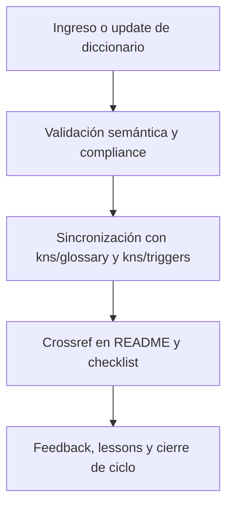

# 📚 core/data/dicts/ — Diccionarios técnicos, de triggers y dominio (v3.2)

## 1. Descripción, función, objetivos y contexto

La carpeta `core/data/dicts/` centraliza **todos los diccionarios técnicos, de triggers, semánticos y de dominio** que estructuran y normalizan el funcionamiento y la interoperabilidad de la plataforma AingZ/RwB.

### Funciones principales:

- Almacenar los diccionarios vivos que definen semántica, taxonomía y naming universal (code, triggers, dominio, etc.).
- Servir como fuente de sincronización obligatoria para los glosarios y triggers de `kns/` y pipelines IA/humano.
- Facilitar la validación, expansión y actualización incremental de la taxonomía RwB.
- Mantener la integridad, compliance y trazabilidad de todos los cambios de nomenclatura y triggers clave.

### Integraciones y sistemas relacionados:

- Referencia cruzada directa y sincronización bidireccional con `kns/glossary/` y `kns/triggers/`.
- Usado por workflows de validación, migración y consolidación de `wf/`.
- Base para onboarding y definición de assets en todos los buckets principales.

## 2. Estructura interna

| Subcarpeta / Archivo                                  | Propósito                              | Estado |
| ----------------------------------------------------- | -------------------------------------- | ------ |
| rw\_b\_glosario\_code\_v\_2\_20250729.md              | Glosario code universal (versión viva) | Activo |
| rw\_b\_diccionario\_code\_triggers\_v\_2\_20250729.md | Diccionario triggers (versión viva)    | Activo |
| ...                                                   | Otros diccionarios técnicos/dominio    | Activo |

## 3. Metadatos y compliance

- **Versión:** v3.2 — 2025-08-06
- **Owner/Responsable:** AingZ\_Platform · RwB
- **Crossref obligatoria:** Blueprint, master plan, checklist, template universal README (ops/templates/)
- **Naming/Versionado:** Cumplimiento estricto de políticas RwB v3.2
- **Estado:** Activo

## 4. Ciclo de vida y flujos

## 5. Changelog local

- 2025-08-06: Versión v3.2, compliance y sincronización con glosario/triggers.

## 6. Observaciones / Lessons learned

- Cualquier cambio en naming/triggers debe propagarse vía pipeline a glosario y triggers de kns/.
- Todo diccionario debe estar versionado, documentado y con changelog activo.

---

**FIN README core/data/dicts/ v3.2**

