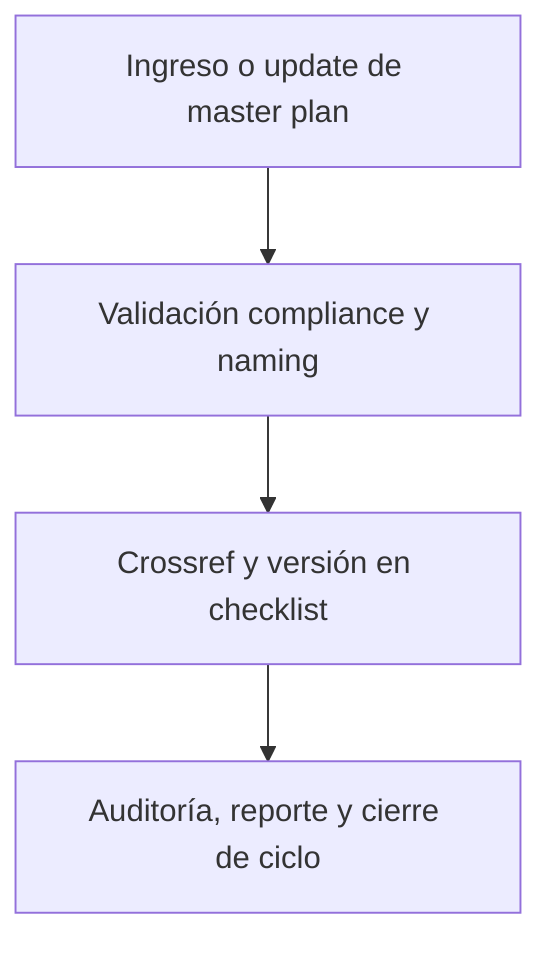

# 🗺️ core/data/mplan/ — Master Plans y Matrices de Planificación (v3.2)

## 1. Descripción, función, objetivos y contexto

La carpeta `core/data/mplan/` centraliza los **master plans, cronogramas y matrices de planificación** clave para la evolución y mantenimiento de la plataforma AingZ/RwB.

### Funciones principales:

- Almacenar el master plan vigente y versiones históricas, asegurando trazabilidad y actualización estratégica.
- Mantener matrices de planificación, cronogramas, backlog incremental y roadmap de releases/objetivos.
- Ser fuente de referencia para auditorías, validaciones y priorización de nuevos desarrollos o migraciones.

### Integraciones y sistemas relacionados:

- Sincronización y validación cruzada con `blueprint`, `checklist` y los flujos de `wf/`.
- Alimenta la generación de reportes, auditorías y ciclos PDCA en todos los buckets principales.

## 2. Estructura interna

| Subcarpeta / Archivo                         | Propósito                               | Estado |
| -------------------------------------------- | --------------------------------------- | ------ |
| mpln\_master\_plan\_rw\_b\_v\_3\_20250803.md | Master plan vigente                     | Activo |
| ...                                          | Matrices y cronogramas de planificación | Activo |

## 3. Metadatos y compliance

- **Versión:** v3.2 — 2025-08-06
- **Owner/Responsable:** AingZ\_Platform · RwB
- **Crossref obligatoria:** Blueprint, master plan, checklist, template universal README (ops/templates/)
- **Naming/Versionado:** Cumplimiento estricto de políticas RwB v3.2
- **Estado:** Activo

## 4. Ciclo de vida y flujos



## 5. Changelog local

- 2025-08-06: Versión v3.2, integración compliance master plan y matrices de planificación.

## 6. Observaciones / Lessons learned

- Todo master plan debe ser actualizado solo bajo control de compliance y registro de versión/changelog.
- No eliminar versiones históricas salvo migración explícita documentada.

---

**FIN README core/data/mplan/ v3.2**

## OutputTemplate
```yaml
CODE:
ID:
VERSION:
ROUTE:
CROSSREF:
AUTHOR:
DATE:
```
