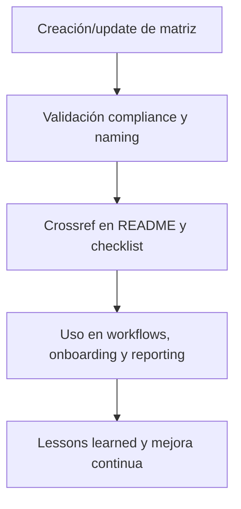

# 🗂️ core/data/mtx/ — Matrices (Versus, Mapping, Clasificación) (v3.2)

## 1. Descripción, función, objetivos y contexto

La carpeta `core/data/mtx/` centraliza todas las **matrices vivas** utilizadas para clasificación, mapping, versus, correlación y validación dentro de la plataforma AingZ/RwB.

### Funciones principales:

- Almacenar matrices de comparación (versus), mapping de correspondencias, tablas de clasificación y relaciones de datos clave.
- Servir como base para la automatización, análisis y verificación de flujos (en especial auditorías, migraciones y consolidaciones).
- Facilitar el onboarding y entrenamiento IA/humano sobre estructuras relacionales críticas del core.

### Integraciones y sistemas relacionados:

- Utilizado en workflows de `wf/` para validaciones y reporting.
- Referencia cruzada en assets y pipelines de `ops/` para integración de nuevos assets y testing.
- Sincronización con cronogramas/matrices de `mplan/` cuando corresponda.

## 2. Estructura interna

| Subcarpeta / Archivo  | Propósito                              | Estado |
| --------------------- | -------------------------------------- | ------ |
| matriz\_versus\_xx.md | Matriz comparativa (versus) específica | Activo |
| mapping\_xx.md        | Tabla de mapping de correspondencias   | Activo |
| clasificacion\_xx.md  | Tabla de clasificación                 | Activo |
| ...                   | Otras matrices relacionadas            | Activo |

## 3. Metadatos y compliance

- **Versión:** v3.2 — 2025-08-06
- **Owner/Responsable:** AingZ\_Platform · RwB
- **Crossref obligatoria:** Blueprint, master plan, checklist, template universal README (ops/templates/)
- **Naming/Versionado:** Cumplimiento estricto de políticas RwB v3.2
- **Estado:** Activo

## 4. Ciclo de vida y flujos



## 5. Changelog local

- 2025-08-06: Versión v3.2, integración compliance matrices versus/mapping.

## 6. Observaciones / Lessons learned

- Todas las matrices deben tener referencia cruzada y estar validadas para su uso por workflows o assets IA/humano.
- No almacenar matrices legacy sin migración y compliance documentados.

---

**FIN README core/data/mtx/ v3.2**

## OutputTemplate
```yaml
CODE:
ID:
VERSION:
ROUTE:
CROSSREF:
AUTHOR:
DATE:
```
