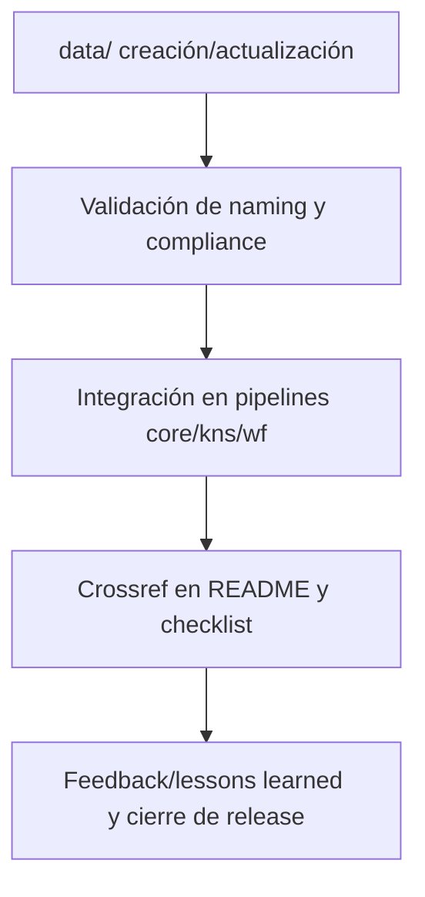

# 📊 core/data/ — Matrices, Diccionarios y Plantillas estructurales (v3.2)

## 1. Descripción, función, objetivos y contexto

La carpeta `core/data/` centraliza **todos los insumos estructurales, técnicos y normativos** de la plataforma AingZ/RwB.

### Funciones principales:

- Ser la fuente única para matrices de planificación, mapping, reglas y taxonomías funcionales.
- Centralizar diccionarios técnicos, de triggers y de dominio (`dicts/`), con sincronización periódica hacia `kns/` para uso IA/humano.
- Proveer las reglaset y políticas universales (`rulset/`) que gobiernan los workflows de toda la plataforma.
- Contener todas las plantillas estructurales internas del core (`template/`), diferenciando de las templates universales alojadas en `ops/templates/`.
- Mantener la integridad y versionado de todos los artefactos base que alimentan el core y sus pipelines.

### Integraciones y sistemas relacionados:

- Interconectada con `kns/` (sincronización de glosario y triggers), `wf/` (uso de matrices y reglas), y con los pipelines de onboarding y automatización de `ops/`.
- Referencia cruzada y dependencia directa del blueprint, master plan y checklist.

## 2. Estructura interna

| Subcarpeta / Archivo | Propósito                                  | Estado |
| -------------------- | ------------------------------------------ | ------ |
| dicts/               | Diccionarios técnicos, triggers, dominio   | Activo |
| mplan/               | Master plans, matrices de planificación    | Activo |
| mtx/                 | Matrices de mapping, clasificación, versus | Activo |
| rulset/              | Rulesets, normas y políticas RwB           | Activo |
| template/            | Plantillas estructurales del core          | Activo |

## 3. Metadatos y compliance

- **Versión:** v3.2 — 2025-08-06
- **Owner/Responsable:** AingZ\_Platform · RwB
- **Crossref obligatoria:** Blueprint, master plan, checklist, triggers, glosario, template universal README (ops/templates/)
- **Naming/Versionado:** Cumplimiento estricto de políticas RwB v3.2
- **Estado:** Activo

## 4. Ciclo de vida y flujos

## 5. Changelog local

- 2025-08-06: Versión v3.2, integración dicts y ajuste compliance Master Plan.

## 6. Observaciones / Lessons learned

- Sincronización obligatoria entre dicts (data/) y los nodos de kns/ (glossary, triggers).
- Nunca replicar artefactos universales fuera de su carpeta raíz.

---

**FIN README core/data/ v3.2**

