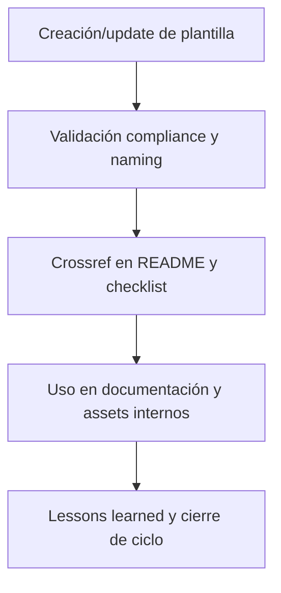

# 📑 core/data/template/ — Plantillas estructurales del Core (v3.2)

## 1. Descripción, función, objetivos y contexto

La carpeta `core/data/template/` centraliza todas las **plantillas estructurales internas** utilizadas para la documentación, matrices y assets propios del core AingZ/RwB.

### Funciones principales:
- Almacenar scaffolds, plantillas y modelos reutilizables para la generación de documentación, matrices, rulesets y assets internos.
- Proveer recursos base para la estandarización de nuevos documentos, assets y estructuras del core, diferenciando de los templates universales alojados en `ops/templates/`.
- Facilitar el onboarding y la consistencia documental y de activos en todo el core y sus subniveles.

### Integraciones y sistemas relacionados:
- Referencia cruzada directa con assets de `data/`, `doc/` y pipelines de documentación.
- Usadas por scripts/manuales de onboarding, validación y auditoría.
- Plantillas universales y de automatización (README, scripts) viven en `ops/templates/`.

## 2. Estructura interna

| Subcarpeta / Archivo         | Propósito                                     | Estado  |
|-----------------------------|-----------------------------------------------|---------|
| plantilla_doc_modelo.md     | Scaffold de documentación interna             | Activo  |
| plantilla_matriz_modelo.md  | Scaffold de matrices internas                 | Activo  |
| ...                         | Otras plantillas estructurales internas       | Activo  |

## 3. Metadatos y compliance
- **Versión:** v3.2 — 2025-08-06
- **Owner/Responsable:** AingZ_Platform · RwB
- **Crossref obligatoria:** Blueprint, master plan, checklist, template universal README (ops/templates/)
- **Naming/Versionado:** Cumplimiento estricto de políticas RwB v3.2
- **Estado:** Activo

## 4. Ciclo de vida y flujos

## 5. Changelog local
- 2025-08-06: Versión v3.2, integración compliance y scaffolds estructurales.

## 6. Observaciones / Lessons learned
- Solo alojar plantillas internas del core aquí; las universales y automatizadas deben estar en ops/templates/.
- Mantener sincronización con cambios de reglas, matrices y documentación activa.

---

**FIN README core/data/template/ v3.2**

