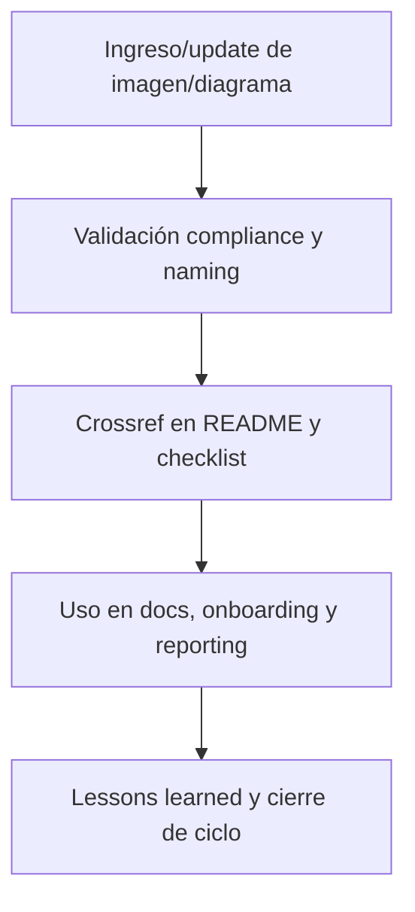

# 🖼️ core/doc/image/ — Imágenes Técnicas y Diagramas (v3.2)

## 1. Descripción, función, objetivos y contexto

La carpeta `core/doc/image/` almacena todas las **imágenes técnicas, diagramas, visualizaciones y recursos gráficos** necesarios para documentar workflows, procesos y assets del core AingZ/RwB.

### Funciones principales:

- Centralizar imágenes y diagramas que acompañan documentación, onboarding, workflows y reporting del core.
- Facilitar la visualización y comprensión de procesos, estructuras, arquitecturas y relaciones complejas.
- Proveer soporte visual para humanos e IA en el despliegue y uso de la plataforma.

### Integraciones y sistemas relacionados:

- Referencia cruzada con `audio/`, `onbrd/`, `video/` y documentación técnica general de `doc/`.
- Usadas en manuales, onboarding, reporting y como input/output en pipelines de IA/documentación automatizada.

## 2. Estructura interna

| Archivo/Subcarpeta        | Propósito                         | Estado |
| ------------------------- | --------------------------------- | ------ |
| diagrama\_arbol\_core.png | Diagrama estructural del core     | Activo |
| visualizacion\_pipeline/  | Diagramas de procesos y pipelines | Activo |
| ...                       | Otros diagramas/imágenes técnicas | Activo |

## 3. Metadatos y compliance

- **Versión:** v3.2 — 2025-08-06
- **Owner/Responsable:** AingZ\_Platform · RwB
- **Crossref obligatoria:** Blueprint, master plan, checklist, template universal README (ops/templates/)
- **Naming/Versionado:** Cumplimiento estricto de políticas RwB v3.2
- **Estado:** Activo

## 4. Ciclo de vida y flujos



## 5. Changelog local

- 2025-08-06: Versión v3.2, compliance imágenes técnicas y reporting.

## 6. Observaciones / Lessons learned

- Todas las imágenes y diagramas deben estar referenciadas en los README y documentos relevantes.
- Mantener consistencia de formato, naming y metadatos para trazabilidad y uso IA/humano.

---

**FIN README core/doc/image/ v3.2**

## OutputTemplate
```yaml
CODE:
ID:
VERSION:
ROUTE:
CROSSREF:
AUTHOR:
DATE:
```
