# 🚀 core/doc/onbrd/ — Onboarding, Guías y Quickstart (v3.2)

## 1. Descripción, función, objetivos y contexto

La carpeta `core/doc/onbrd/` centraliza **todas las guías de onboarding, quickstart y documentación de entrada** para usuarios humanos e IA en la plataforma AingZ/RwB.

### Funciones principales:

- Almacenar manuales, guías, tutoriales y quickstarts para facilitar el ingreso y uso correcto de la plataforma y sus activos.
- Garantizar la trazabilidad de los procesos de onboarding y actualización de nuevos assets, workflows o políticas.
- Proveer recursos vivos y versionados para onboarding incremental, test de usuarios y formación IA.

### Integraciones y sistemas relacionados:

- Vinculada a los pipelines y scripts de onboarding en `ops/` y los assets de `wf/`.
- Referencia cruzada a documentación técnica (`doc/`), imágenes (`image/`), audio (`audio/`) y videos (`video/`).

## 2. Estructura interna

| Archivo/Subcarpeta  | Propósito                                      | Estado |
| ------------------- | ---------------------------------------------- | ------ |
| guia\_onboarding.md | Manual de onboarding general                   | Activo |
| quickstart.md       | Guía rápida de ingreso y uso                   | Activo |
| ...                 | Otros manuales, tutoriales, scripts de entrada | Activo |

## 3. Metadatos y compliance

- **Versión:** v3.2 — 2025-08-06
- **Owner/Responsable:** AingZ\_Platform · RwB
- **Crossref obligatoria:** Blueprint, master plan, checklist, template universal README (ops/templates/)
- **Naming/Versionado:** Cumplimiento estricto de políticas RwB v3.2
- **Estado:** Activo

## 4. Ciclo de vida y flujos

```mermaid
graph TD;
  A[Ingreso/update de guía] --> B[Validación compliance y naming]
  B --> C[Crossref en README y checklist]
  C --> D[Uso en onboarding, feedback y test]
  D --> E[Lessons learned y cierre de ciclo]
```



## 5. Changelog local

- 2025-08-06: Versión v3.2, compliance onboarding y quickstart.

## 6. Observaciones / Lessons learned

- Todas las guías deben mantenerse vivas y sincronizadas con cambios de assets y workflows.
- Priorizar la claridad, trazabilidad y feedback para onboarding incremental humano/IA.

---

**FIN README core/doc/onbrd/ v3.2**

## OutputTemplate
```yaml
CODE:
ID:
VERSION:
ROUTE:
CROSSREF:
AUTHOR:
DATE:
```
