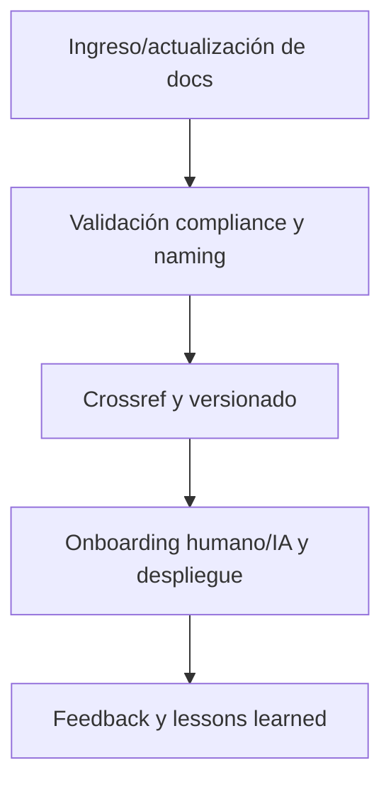

# 📄 core/doc/ — Documentación técnica, onboarding y plantillas modelo (v3.2)

## 1. Descripción, función, objetivos y contexto

La carpeta `core/doc/` reúne **toda la documentación operativa, técnica y de onboarding** de la plataforma AingZ/RwB.

### Funciones principales:

- Centralizar documentación estructurada: guías técnicas, onboarding, diagramas, imágenes, documentación audiovisual y plantillas modelo de uso específico del core.
- Garantizar el onboarding universal (humano/IA) y la rápida transferencia de conocimiento clave de la plataforma.
- Actuar como referencia para la integración y despliegue de nuevos workflows, pipelines y sistemas vinculados al core.
- Asegurar la versionabilidad y trazabilidad de toda documentación relevante del core y su evolución.

### Integraciones y sistemas relacionados:

- Totalmente vinculada a los pipelines de onboarding de `ops/` y los workflows activos de `wf/`.
- Dependencia cruzada directa con `data/` (plantillas, matrices) y los glosarios/vocabularios de `kns/`.
- Crossref viva a blueprint, master plan y checklist.

## 2. Estructura interna

| Subcarpeta / Archivo | Propósito                                       | Estado |
| -------------------- | ----------------------------------------------- | ------ |
| audio/               | Documentación en formato audio de workflows     | Activo |
| image/               | Diagramas, imágenes técnicas, visualizaciones   | Activo |
| onbrd/               | Onboarding: guías, quickstart, capacitación     | Activo |
| template/            | Plantillas modelo de documentación para el core | Activo |
| video/               | Documentación audiovisual                       | Activo |

## 3. Metadatos y compliance

- **Versión:** v3.2 — 2025-08-06
- **Owner/Responsable:** AingZ\_Platform · RwB
- **Crossref obligatoria:** Blueprint, master plan, checklist, triggers, glosario, template universal README (ops/templates/)
- **Naming/Versionado:** Cumplimiento estricto de políticas RwB v3.2
- **Estado:** Activo

## 4. Ciclo de vida y flujos



## 5. Changelog local

- 2025-08-06: Versión v3.2, onboarding, ajuste de compliance y crossref.

## 6. Observaciones / Lessons learned

- Onboarding y documentación técnica deben mantenerse sincronizados con la evolución de assets y workflows.
- Toda doc relevante debe tener crossref a blueprint y pipelines activos.

---

**FIN README core/doc/ v3.2**

## OutputTemplate
```yaml
CODE:
ID:
VERSION:
ROUTE:
CROSSREF:
AUTHOR:
DATE:
```
