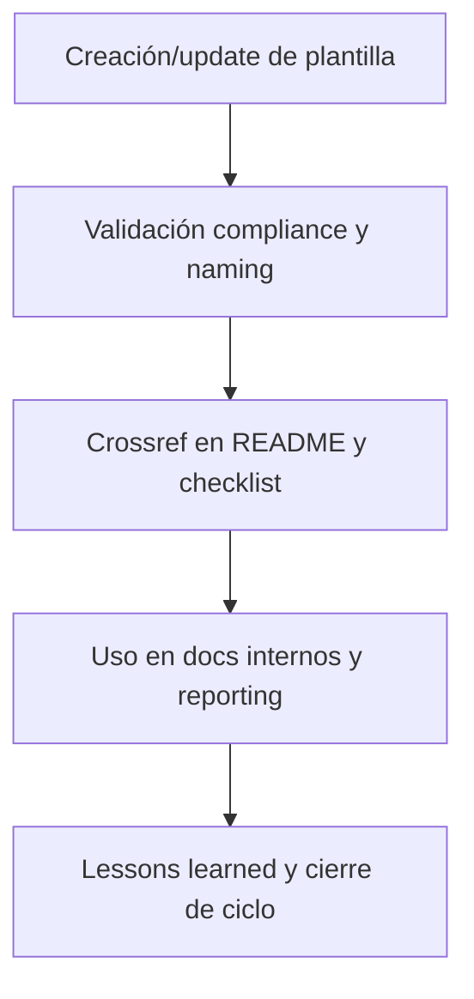

# 📑 core/doc/template/ — Plantillas Modelo de Documentación (v3.2)

## 1. Descripción, función, objetivos y contexto

La carpeta `core/doc/template/` centraliza **todas las plantillas modelo de documentación** utilizadas para generar, estandarizar y actualizar los assets documentales del core AingZ/RwB.

### Funciones principales:

- Almacenar modelos y scaffolds para la documentación específica del core (guías, reportes, onboarding, instructivos, etc.).
- Facilitar la generación y actualización rápida de docs bajo políticas de compliance, naming y versionado.
- Asegurar la consistencia y trazabilidad en todos los documentos generados internamente.

### Integraciones y sistemas relacionados:

- Referencia cruzada con templates universales de `ops/templates/` y plantillas estructurales de `data/template/`.
- Usadas en workflows, reporting y onboarding desde `doc/` y `wf/`.

## 2. Estructura interna

| Archivo/Subcarpeta         | Propósito                          | Estado |
| -------------------------- | ---------------------------------- | ------ |
| plantilla\_guia\_doc.md    | Scaffold/modelo de guía/documento  | Activo |
| plantilla\_reporte\_doc.md | Scaffold/modelo de reporte técnico | Activo |
| ...                        | Otras plantillas modelo de docs    | Activo |

## 3. Metadatos y compliance

- **Versión:** v3.2 — 2025-08-06
- **Owner/Responsable:** AingZ\_Platform · RwB
- **Crossref obligatoria:** Blueprint, master plan, checklist, template universal README (ops/templates/)
- **Naming/Versionado:** Cumplimiento estricto de políticas RwB v3.2
- **Estado:** Activo

## 4. Ciclo de vida y flujos



## 5. Changelog local

- 2025-08-06: Versión v3.2, compliance plantillas docs.

## 6. Observaciones / Lessons learned

- Mantener solo plantillas modelo para docs del core (el resto en ops/templates/).
- Sincronizar naming, versión y metadatos con cambios en políticas y rulesets.

---

**FIN README core/doc/template/ v3.2**

## OutputTemplate
```yaml
CODE:
ID:
VERSION:
ROUTE:
CROSSREF:
AUTHOR:
DATE:
```
