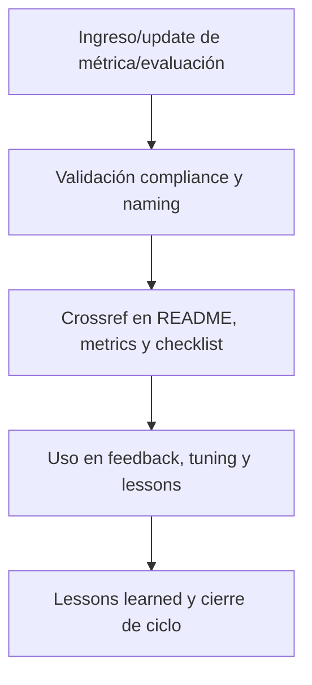

# 📊 core/kns/ai\_learn/eval/ — Evaluaciones y Métricas de Aprendizaje (v3.2)

## 1. Descripción, función, objetivos y contexto

La carpeta `core/kns/ai_learn/eval/` centraliza **todas las evaluaciones, métricas y análisis de performance** asociados al aprendizaje IA/humano en la plataforma AingZ/RwB.

### Funciones principales:

- Almacenar reportes, análisis, métricas y validaciones de modelos, prompts y tuning.
- Facilitar el control de calidad, benchmarking y tracking de progresos o regresiones.
- Permitir auditoría y mejora continua sobre procesos de aprendizaje y ajuste IA/humano.

### Integraciones y sistemas relacionados:

- Conexión directa con lessons, tuning y feedback (`ai_learn/`), y assets de métricas globales (`metrics/`).
- Datos de evaluaciones alimentan procesos de onboarding, reporting y ajustes de workflows (`wf/`).

## 2. Estructura interna

| Archivo/Subcarpeta  | Propósito                            | Estado |
| ------------------- | ------------------------------------ | ------ |
| metricas\_X.md      | Métricas de aprendizaje/test X       | Activo |
| benchmark\_modelos/ | Resultados y comparativas de modelos | Activo |
| ...                 | Otros análisis y reportes            | Activo |

## 3. Metadatos y compliance

- **Versión:** v3.2 — 2025-08-06
- **Owner/Responsable:** AingZ\_Platform · RwB
- **Crossref obligatoria:** Blueprint, master plan, checklist, template universal README (ops/templates/)
- **Naming/Versionado:** Cumplimiento estricto de políticas RwB v3.2
- **Estado:** Activo

## 4. Ciclo de vida y flujos



## 5. Changelog local

- 2025-08-06: Versión v3.2, compliance métricas y evaluaciones IA/humano.

## 6. Observaciones / Lessons learned

- Todas las métricas y evaluaciones deben tener referencia cruzada con lessons, tuning y assets de reporting.
- Mantener histórico y trazabilidad para auditoría y mejora continua.

---

**FIN README core/kns/ai\_learn/eval/ v3.2**

## OutputTemplate
```yaml
CODE:
ID:
VERSION:
ROUTE:
CROSSREF:
AUTHOR:
DATE:
```
