---

file: readme\_core\_kns\_ai\_learn\_feed\_rw\_b\_v3\_2.md version: v3.2-2025-08-06 status: active role: readme owner: AingZ\_Platform · RwB crossref:

- blueprint\_rw\_b\_platform\_v\_3\_20250803.md
- mpln\_master\_plan\_rw\_b\_v\_3\_20250803.md
- checklist\_root\_rw\_b\_v\_3\_20250805.md
- wf\_pipeline\_creacion\_archivos\_rw\_b\_v\_3\_20250805.md
- ops/templates/template\_readme\_rw\_b\_v3\_1.md changelog:
- 2025-08-06: Consolidación README feed/ ai\_learn v3.2, compliance feedback humano/IA.

---

# 💬 core/kns/ai\_learn/feed/ — Feedback estructurado humano/IA (v3.2)

## 1. Descripción, función, objetivos y contexto

La carpeta `core/kns/ai_learn/feed/` centraliza **el feedback estructurado y retroalimentación** proveniente tanto de usuarios humanos como de IA, referente al uso, mejora y validación de la plataforma AingZ/RwB.

### Funciones principales:

- Almacenar sugerencias, críticas, reportes de incidentes y propuestas de mejora.
- Integrar el feedback al ciclo PDCA y a la evolución de assets, workflows y onboarding IA/humano.
- Garantizar trazabilidad, respuesta y documentación de acciones tomadas ante feedback relevante.

### Integraciones y sistemas relacionados:

- Referencia directa con lessons, tuning y métricas (`ai_learn/`, `metrics/`), y workflows de auditoría y reporting (`wf/`).
- El feedback documentado alimenta roadmap, releases y lecciones learned.

## 2. Estructura interna

| Archivo/Subcarpeta   | Propósito                              | Estado |
| -------------------- | -------------------------------------- | ------ |
| feedback\_humano.md  | Sugerencias y experiencias de usuarios | Activo |
| feedback\_ia.md      | Retroalimentación de modelos IA        | Activo |
| mejoras\_incidentes/ | Propuestas de mejora e incidentes      | Activo |
| ...                  | Otros reportes y feedback estructurado | Activo |

## 3. Metadatos y compliance

- **Versión:** v3.2 — 2025-08-06
- **Owner/Responsable:** AingZ\_Platform · RwB
- **Crossref obligatoria:** Blueprint, master plan, checklist, template universal README (ops/templates/)
- **Naming/Versionado:** Cumplimiento estricto de políticas RwB v3.2
- **Estado:** Activo

## 4. Ciclo de vida y flujos

```mermaid
graph TD;
  A[Ingreso/update de feedback] --> B[Validación compliance y naming]
  B --> C[Crossref en README, roadmap y checklist]
  C --> D[Análisis, respuesta y lessons]
  D --> E[Integración en PDCA y cierre de ciclo]
```

## 5. Changelog local

- 2025-08-06: Versión v3.2, compliance feedback humano/IA.

## 6. Observaciones / Lessons learned

- Todo feedback relevante debe tener seguimiento, respuesta e integración documentada.
- Fomentar la recolección y análisis de feedback estructurado en todos los procesos de la plataforma.

---

**FIN README core/kns/ai\_learn/feed/ v3.2**

