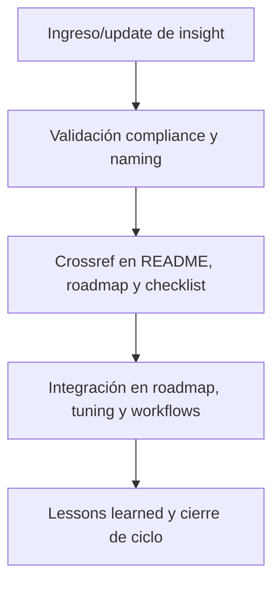

# 🔎 core/kns/ai\_learn/insi/ — Insights Estratégicos y Hallazgos Clave (v3.2)

## 1. Descripción, función, objetivos y contexto

La carpeta `core/kns/ai_learn/insi/` centraliza **insights estratégicos, descubrimientos y hallazgos clave** identificados a lo largo del ciclo de aprendizaje IA/humano y evolución de la plataforma AingZ/RwB.

### Funciones principales:

- Almacenar síntesis, patrones detectados, análisis profundos y hallazgos de valor derivados del feedback, métricas y experiencias de uso.
- Facilitar la explotación estratégica de insights para roadmap, tuning, releases y priorización de mejoras.
- Servir de input para la actualización de workflows, políticas, assets y onboarding IA/humano.

### Integraciones y sistemas relacionados:

- Enlace directo con lessons, feedback, métricas (`ai_learn/`, `metrics/`), y reporting de releases (`wf/`).
- Insights documentados deben alimentar la planificación estratégica y evolución incremental del core.

## 2. Estructura interna

| Archivo/Subcarpeta  | Propósito                                   | Estado |
| ------------------- | ------------------------------------------- | ------ |
| insight\_X.md       | Hallazgo o insight estratégico específico   | Activo |
| patrones\_sintesis/ | Detección de patrones, síntesis y resúmenes | Activo |
| ...                 | Otros descubrimientos y análisis clave      | Activo |

## 3. Metadatos y compliance

- **Versión:** v3.2 — 2025-08-06
- **Owner/Responsable:** AingZ\_Platform · RwB
- **Crossref obligatoria:** Blueprint, master plan, checklist, template universal README (ops/templates/)
- **Naming/Versionado:** Cumplimiento estricto de políticas RwB v3.2
- **Estado:** Activo

## 4. Ciclo de vida y flujos



## 5. Changelog local

- 2025-08-06: Versión v3.2, compliance insights y hallazgos estratégicos.

## 6. Observaciones / Lessons learned

- Todo insight o hallazgo debe alimentar roadmap, tuning y lecciones learned globales.
- Mantener síntesis, patrones y hallazgos versionados y trazables para reporting y auditoría.

---

**FIN README core/kns/ai\_learn/insi/ v3.2**

## OutputTemplate
```yaml
CODE:
ID:
VERSION:
ROUTE:
CROSSREF:
AUTHOR:
DATE:
```
