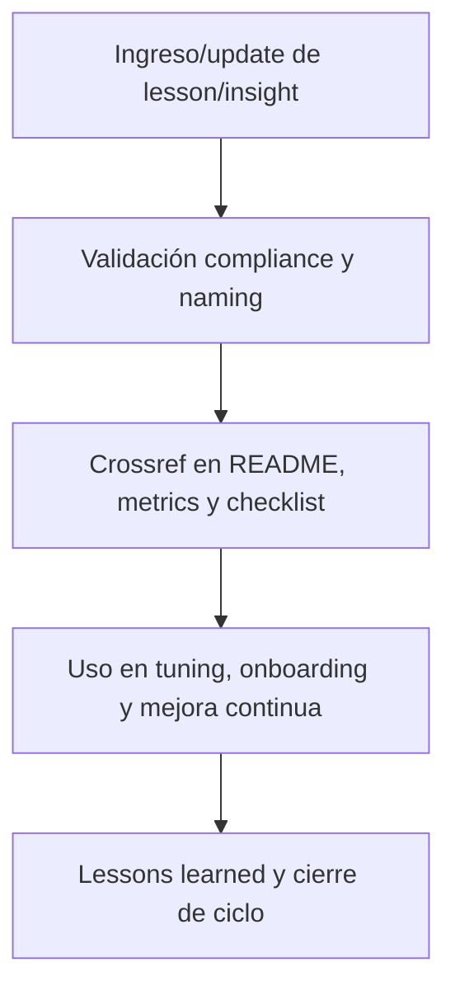

---

file: readme\_core\_kns\_ai\_learn\_rw\_b\_v3\_2.md version: v3.2-2025-08-06 status: active role: readme owner: AingZ\_Platform · RwB crossref:

- blueprint\_rw\_b\_platform\_v\_3\_20250803.md
- mpln\_master\_plan\_rw\_b\_v\_3\_20250803.md
- checklist\_root\_rw\_b\_v\_3\_20250805.md
- wf\_pipeline\_creacion\_archivos\_rw\_b\_v\_3\_20250805.md
- rw\_b\_glosario\_code\_v\_2\_20250729.md
- rw\_b\_diccionario\_code\_triggers\_v\_2\_20250729.md
- ops/templates/template\_readme\_rw\_b\_v3\_1.md changelog:
- 2025-08-06: Consolidación árbol y README ai\_learn/ core/kns v3.2, compliance lessons learned y aprendizaje IA/humano.

---

# 🤖 core/kns/ai\_learn/ — Aprendizaje, Lessons Learned, Insights y Tuning (v3.2)

## 1. Descripción, función, objetivos y contexto

La carpeta `core/kns/ai_learn/` es el **núcleo de registro incremental de aprendizaje, feedback y lessons learned**, tanto para IA como para humanos dentro de la plataforma AingZ/RwB.

### Funciones principales:

- Centralizar el registro y gestión de aprendizaje, tuning, insights, feedback y lessons learned, asegurando trazabilidad y mejora continua.
- Facilitar la explotación, auditoría y análisis de performance de flujos, pipelines, prompts y experiencias de usuario IA/humano.
- Garantizar la integración de lessons y aprendizajes a ciclo PDCA, tuning y onboarding, permitiendo retroalimentación estructurada y contextualizada.

### Integraciones y sistemas relacionados:

- Sincronización y crossref con subniveles (eval, feed, insi, learn, rel, shot, trn, tune).
- Relación directa con workflows de `wf/` y assets de `metrics/` y `chkp/`.
- Lessons e insights alimentan la mejora continua de assets, pipelines, prompts y onboarding.

## 2. Estructura interna

| Subcarpeta / Archivo | Propósito                               | Estado |
| -------------------- | --------------------------------------- | ------ |
| eval/                | Evaluaciones y métricas de aprendizaje  | Activo |
| feed/                | Feedback estructurado humano/IA         | Activo |
| insi/                | Insights estratégicos y hallazgos clave | Activo |
| learn/               | Registro incremental de aprendizajes    | Activo |
| rel/                 | Relevamientos y referencias cruzadas    | Activo |
| shot/                | Snapshots de entrenamiento/aprendizaje  | Activo |
| trn/                 | Registros de entrenamiento y validación | Activo |
| tune/                | Tuning de modelos, prompts y parámetros | Activo |

## 3. Metadatos y compliance

- **Versión:** v3.2 — 2025-08-06
- **Owner/Responsable:** AingZ\_Platform · RwB
- **Crossref obligatoria:** Blueprint, master plan, checklist, triggers, glosario, template universal README (ops/templates/)
- **Naming/Versionado:** Cumplimiento estricto de políticas RwB v3.2
- **Estado:** Activo

## 4. Ciclo de vida y flujos

## 5. Changelog local

- 2025-08-06: Versión v3.2, compliance lessons learned, insights y tuning.

## 6. Observaciones / Lessons learned

- Lessons e insights deben alimentar ciclo PDCA de toda la plataforma.
- Validar y documentar siempre feedback estructurado, tuning y aprendizajes IA/humano.

---

**FIN README core/kns/ai\_learn/ v3.2**

