# 🔗 core/kns/ai\_learn/rel/ — Relevamientos y Referencias Cruzadas (v3.2)

## 1. Descripción, función, objetivos y contexto

La carpeta `core/kns/ai_learn/rel/` centraliza **todos los relevamientos, correspondencias y referencias cruzadas** que vinculan aprendizajes, lessons, workflows y assets de la plataforma AingZ/RwB.

### Funciones principales:

- Almacenar mapeos, tablas de correspondencias, referencias externas y análisis de compatibilidad.
- Facilitar la trazabilidad, migración y consolidación de activos y conocimientos en la plataforma.
- Proveer input clave para migraciones, auditorías y mejoras en los flujos de onboarding y assets.

### Integraciones y sistemas relacionados:

- Relación directa con lessons, insights, snapshots y assets de migración/validación (`ai_learn/`, `wf/`).
- Relevamientos documentados alimentan auditorías, reporting y sincronización incremental de assets.

## 2. Estructura interna

| Archivo/Subcarpeta      | Propósito                                    | Estado |
| ----------------------- | -------------------------------------------- | ------ |
| mapeo\_correspondencia/ | Relación entre assets, lecciones y workflows | Activo |
| referencias\_externas/  | Enlaces y correspondencias externas          | Activo |
| ...                     | Otros relevamientos y crossrefs              | Activo |

## 3. Metadatos y compliance

- **Versión:** v3.2 — 2025-08-06
- **Owner/Responsable:** AingZ\_Platform · RwB
- **Crossref obligatoria:** Blueprint, master plan, checklist, template universal README (ops/templates/)
- **Naming/Versionado:** Cumplimiento estricto de políticas RwB v3.2
- **Estado:** Activo

## 4. Ciclo de vida y flujos

```mermaid
graph TD;
  A[Ingreso/update de relevamiento/crossref] --> B[Validación compliance y naming]
  B --> C[Crossref en README, auditoría y checklist]
  C --> D[Uso en migraciones, reporting y lessons]
  D --> E[Lessons learned y cierre de ciclo]
```



## 5. Changelog local

- 2025-08-06: Versión v3.2, compliance relevamientos y referencias cruzadas.

## 6. Observaciones / Lessons learned

- Todos los relevamientos y referencias deben estar trazados y versionados para migraciones, auditorías y sincronización de assets.
- Mantener correspondencias y crossrefs actualizados ante cualquier cambio en el core.

---

**FIN README core/kns/ai\_learn/rel/ v3.2**

## OutputTemplate
```yaml
CODE:
ID:
VERSION:
ROUTE:
CROSSREF:
AUTHOR:
DATE:
```
