# 🏋️ core/kns/ai\_learn/trn/ — Registros de Entrenamiento y Validación (v3.2)

## 1. Descripción, función, objetivos y contexto

La carpeta `core/kns/ai_learn/trn/` centraliza **todos los registros, datasets y resultados** de entrenamiento y validación IA/humano, para documentación, auditoría y mejora continua de la plataforma AingZ/RwB.

### Funciones principales:

- Almacenar registros de sesiones de entrenamiento, datasets, scripts, prompts y resultados experimentales.
- Facilitar trazabilidad, análisis de evolución y comparativa entre versiones de entrenamiento.
- Servir de soporte documental para reporting, auditoría y tuning de modelos/procesos IA/humano.

### Integraciones y sistemas relacionados:

- Enlace directo con lessons, tuning, eval y snapshots (`ai_learn/`).
- Training documentado debe alimentar lessons learned y la evolución incremental de assets y workflows.

## 2. Estructura interna

| Archivo/Subcarpeta    | Propósito                                   | Estado |
| --------------------- | ------------------------------------------- | ------ |
| training\_dataset\_X/ | Dataset y resultados de entrenamiento       | Activo |
| resultados\_pruebas/  | Logs y outputs de validación/pruebas        | Activo |
| ...                   | Otros registros de entrenamiento/validación | Activo |

## 3. Metadatos y compliance

- **Versión:** v3.2 — 2025-08-06
- **Owner/Responsable:** AingZ\_Platform · RwB
- **Crossref obligatoria:** Blueprint, master plan, checklist, template universal README (ops/templates/)
- **Naming/Versionado:** Cumplimiento estricto de políticas RwB v3.2
- **Estado:** Activo

## 4. Ciclo de vida y flujos

```mermaid
graph TD;
  A[Ingreso/update de registro/dataset] --> B[Validación compliance y naming]
  B --> C[Crossref en README, lessons y checklist]
  C --> D[Uso en tuning, eval y reporting]
  D --> E[Lessons learned y cierre de ciclo]
```



## 5. Changelog local

- 2025-08-06: Versión v3.2, compliance entrenamiento y validación IA/humano.

## 6. Observaciones / Lessons learned

- Todos los registros de entrenamiento y datasets deben estar versionados y trazables.
- Mantener integración viva con lessons learned, tuning y evaluaciones.

---

**FIN README core/kns/ai\_learn/trn/ v3.2**

## OutputTemplate
```yaml
CODE:
ID:
VERSION:
ROUTE:
CROSSREF:
AUTHOR:
DATE:
```
