# 🎚️ core/kns/ai\_learn/tune/ — Tuning de Modelos, Prompts y Parámetros (v3.2)

## 1. Descripción, función, objetivos y contexto

La carpeta `core/kns/ai_learn/tune/` centraliza **todos los registros de tuning, ajustes y pruebas experimentales** sobre modelos, prompts y parámetros IA/humano, para optimización continua en la plataforma AingZ/RwB.

### Funciones principales:

- Almacenar logs de tuning, comparativas, tests A/B y criterios de aceptación/rechazo de ajustes.
- Permitir análisis de resultados, mejoras, rollback y benchmarking incremental de cambios en prompts/modelos.
- Facilitar el registro y replicabilidad de mejoras implementadas en IA/humano.

### Integraciones y sistemas relacionados:

- Enlace directo con lessons, eval, training y snapshots (`ai_learn/`).
- Tuning documentado debe alimentar lessons learned, reporting y evolución de workflows y prompts.

## 2. Estructura interna

| Archivo/Subcarpeta   | Propósito                                    | Estado |
| -------------------- | -------------------------------------------- | ------ |
| tuning\_modelo\_X.md | Log/registro de tuning de modelo/prompt X    | Activo |
| comparativas\_tests/ | Tests A/B, comparativas y análisis de tuning | Activo |
| ...                  | Otros logs y ajustes de tuning               | Activo |

## 3. Metadatos y compliance

- **Versión:** v3.2 — 2025-08-06
- **Owner/Responsable:** AingZ\_Platform · RwB
- **Crossref obligatoria:** Blueprint, master plan, checklist, template universal README (ops/templates/)
- **Naming/Versionado:** Cumplimiento estricto de políticas RwB v3.2
- **Estado:** Activo

## 4. Ciclo de vida y flujos

```mermaid
graph TD;
  A[Ingreso/update de tuning/log] --> B[Validación compliance y naming]
  B --> C[Crossref en README, lessons y checklist]
  C --> D[Análisis, benchmarking y lessons]
  D --> E[Lessons learned y cierre de ciclo]
```



## 5. Changelog local

- 2025-08-06: Versión v3.2, compliance tuning modelos/prompts.

## 6. Observaciones / Lessons learned

- Todos los logs y registros de tuning deben estar versionados y trazables.
- Mantener benchmarking y comparación viva con lessons, training y evaluaciones.

---

**FIN README core/kns/ai\_learn/tune/ v3.2**

## OutputTemplate
```yaml
CODE:
ID:
VERSION:
ROUTE:
CROSSREF:
AUTHOR:
DATE:
```
