# 🌐 core/kns/chkp/aingz\_platform/ — Checkpoints de Plataforma Global (v3.2)

## 1. Descripción, función, objetivos y contexto

La carpeta `core/kns/chkp/aingz_platform/` almacena **los checkpoints y snapshots globales** de la plataforma AingZ/RwB, documentando estados, releases y milestones críticos a nivel raíz.

### Funciones principales:

- Registrar snapshots de contexto vivo, releases y migraciones globales de la plataforma.
- Facilitar rollback, validación y consolidación de cambios estructurales y de releases principales.
- Servir de input documental para auditoría, reporting y mejora continua a nivel plataforma global.

### Integraciones y sistemas relacionados:

- Crossref con reporting, lessons y migraciones (`ai_learn/`, `wf/`).
- Checkpoints globales nutren auditoría y onboarding para nuevas releases o migraciones raíz.

## 2. Estructura interna

| Archivo/Subcarpeta | Propósito                                | Estado |
| ------------------ | ---------------------------------------- | ------ |
| checkpoint\_X.md   | Checkpoint o snapshot global específico  | Activo |
| milestones/        | Registro de hitos/milestones de releases | Activo |
| ...                | Otros estados globales relevantes        | Activo |

## 3. Metadatos y compliance

- **Versión:** v3.2 — 2025-08-06
- **Owner/Responsable:** AingZ\_Platform · RwB
- **Crossref obligatoria:** Blueprint, master plan, checklist, template universal README (ops/templates/)
- **Naming/Versionado:** Cumplimiento estricto de políticas RwB v3.2
- **Estado:** Activo

## 4. Ciclo de vida y flujos

```mermaid
graph TD;
  A[Ingreso/update de checkpoint global] --> B[Validación compliance y naming]
  B --> C[Crossref en README, auditoría y checklist]
  C --> D[Análisis, rollback y lessons]
  D --> E[Lessons learned y cierre de ciclo]
```



## 5. Changelog local

- 2025-08-06: Versión v3.2, compliance checkpoints de plataforma global.

## 6. Observaciones / Lessons learned

- Todos los checkpoints globales deben estar versionados y trazables, integrados a auditoría y releases principales.
- Mantener sincronización incremental con reporting, lessons y migraciones.

---

**FIN README core/kns/chkp/aingz\_platform/ v3.2**

## OutputTemplate
```yaml
CODE:
ID:
VERSION:
ROUTE:
CROSSREF:
AUTHOR:
DATE:
```
