# 🗂️ core/kns/chkp/projects/ — Checkpoints por Proyecto/Ramas (v3.2)

## 1. Descripción, función, objetivos y contexto

La carpeta `core/kns/chkp/projects/` almacena **checkpoints, snapshots y estados de avance** de cada proyecto o rama dentro de la plataforma AingZ/RwB.

### Funciones principales:

- Registrar snapshots y estados de avance particulares para proyectos, subplataformas o ramas.
- Facilitar rollback, validación, consolidación y auditoría específica de cada rama o proyecto.
- Servir de input documental para reporting, lessons y mejora incremental en proyectos activos.

### Integraciones y sistemas relacionados:

- Crossref con reporting, lessons y migraciones (`ai_learn/`, `wf/`).
- Checkpoints de proyectos nutren onboarding y migraciones por dominio/fase.

## 2. Estructura interna

| Archivo/Subcarpeta     | Propósito                            | Estado |
| ---------------------- | ------------------------------------ | ------ |
| checkpoint\_proyectoX/ | Snapshot y avance de proyecto/rama X | Activo |
| ...                    | Otros estados/proyectos relevantes   | Activo |

## 3. Metadatos y compliance

- **Versión:** v3.2 — 2025-08-06
- **Owner/Responsable:** AingZ\_Platform · RwB
- **Crossref obligatoria:** Blueprint, master plan, checklist, template universal README (ops/templates/)
- **Naming/Versionado:** Cumplimiento estricto de políticas RwB v3.2
- **Estado:** Activo

## 4. Ciclo de vida y flujos

```mermaid
graph TD;
  A[Ingreso/update de checkpoint de proyecto] --> B[Validación compliance y naming]
  B --> C[Crossref en README, auditoría y checklist]
  C --> D[Análisis, rollback y lessons]
  D --> E[Lessons learned y cierre de ciclo]
```



## 5. Changelog local

- 2025-08-06: Versión v3.2, compliance checkpoints por proyecto/ramas.

## 6. Observaciones / Lessons learned

- Todos los checkpoints de proyectos deben estar versionados y trazables, integrados a auditoría y lessons específicas de rama.
- Mantener sincronización incremental con reporting, lessons y migraciones de cada proyecto.

---

**FIN README core/kns/chkp/projects/ v3.2**

## OutputTemplate
```yaml
CODE:
ID:
VERSION:
ROUTE:
CROSSREF:
AUTHOR:
DATE:
```
