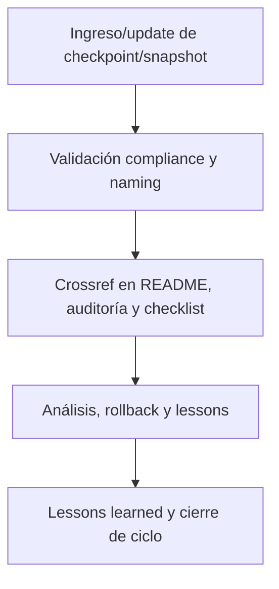

---

file: readme\_core\_kns\_chkp\_rw\_b\_v3\_2.md version: v3.2-2025-08-06 status: active role: readme owner: AingZ\_Platform · RwB crossref:

- blueprint\_rw\_b\_platform\_v\_3\_20250803.md
- mpln\_master\_plan\_rw\_b\_v\_3\_20250803.md
- checklist\_root\_rw\_b\_v\_3\_20250805.md
- wf\_pipeline\_creacion\_archivos\_rw\_b\_v\_3\_20250805.md
- ops/templates/template\_readme\_rw\_b\_v3\_1.md changelog:
- 2025-08-06: Consolidación README chkp/ kns v3.2, compliance checkpoints y snapshots de plataforma/proyectos.

---

# ✅ core/kns/chkp/ — Checkpoints y Snapshots de Plataforma/Proyectos (v3.2)

## 1. Descripción, función, objetivos y contexto

La carpeta `core/kns/chkp/` centraliza **todos los checkpoints, snapshots y estados de avance** tanto de la plataforma global como de cada proyecto/ramas en la plataforma AingZ/RwB.

### Funciones principales:

- Almacenar snapshots de estados, avances y releases de plataforma y proyectos clave.
- Facilitar rollback, auditoría, validación y consolidación de cambios en cualquier nivel del core.
- Garantizar trazabilidad y control incremental del contexto vivo y releases de activos críticos.

### Integraciones y sistemas relacionados:

- Crossref con lessons, reporting y migraciones (`ai_learn/`, `wf/`).
- Checkpoints documentados alimentan auditoría, onboarding y mejora continua a nivel plataforma/proyectos.

## 2. Estructura interna

| Subcarpeta/Archivo | Propósito                              | Estado |
| ------------------ | -------------------------------------- | ------ |
| aingz\_platform/   | Checkpoints y snapshots globales       | Activo |
| projects/          | Checkpoints por proyecto/ramas         | Activo |
| ...                | Otros snapshots/checkpoints relevantes | Activo |

## 3. Metadatos y compliance

- **Versión:** v3.2 — 2025-08-06
- **Owner/Responsable:** AingZ\_Platform · RwB
- **Crossref obligatoria:** Blueprint, master plan, checklist, template universal README (ops/templates/)
- **Naming/Versionado:** Cumplimiento estricto de políticas RwB v3.2
- **Estado:** Activo

## 4. Ciclo de vida y flujos

## 5. Changelog local

- 2025-08-06: Versión v3.2, compliance checkpoints de plataforma y proyectos.

## 6. Observaciones / Lessons learned

- Todos los checkpoints deben estar versionados y trazables, listos para rollback y auditoría.
- Mantener sincronización incremental y crossref con lessons, reporting y migraciones.

---

**FIN README core/kns/chkp/ v3.2**

