# 🌐 core/kns/ctx/aingz\_platform/ — Contexto Extendido de Plataforma Global (v3.2)

## 1. Descripción, función, objetivos y contexto

La carpeta `core/kns/ctx/aingz_platform/` almacena **contexto extendido, configuraciones y preferencias** de la plataforma global AingZ/RwB, documentando la base contextual y de personalización de la experiencia IA/humano.

### Funciones principales:

- Registrar configuraciones, contexto operativo global y glosario extendido de plataforma.
- Facilitar onboarding contextualizado, personalización de experiencia y reporting de contexto vivo global.
- Servir de input para IA/humano en explotación de preferencias, contexto histórico y vocabulario ampliado.

### Integraciones y sistemas relacionados:

- Crossref con onboarding, lessons y checkpoints globales (`doc/`, `kns/`, `chkp/`).
- Contexto global nutre personalización, recuperación de contexto y formación IA/humano.

## 2. Estructura interna

| Archivo/Subcarpeta      | Propósito                                   | Estado |
| ----------------------- | ------------------------------------------- | ------ |
| preferencias\_globales/ | Configuración y preferencias raíz           | Activo |
| glosario\_extendido.md  | Vocabulario y contexto extendido plataforma | Activo |
| ...                     | Otros contextos globales relevantes         | Activo |

## 3. Metadatos y compliance

- **Versión:** v3.2 — 2025-08-06
- **Owner/Responsable:** AingZ\_Platform · RwB
- **Crossref obligatoria:** Blueprint, master plan, checklist, template universal README (ops/templates/)
- **Naming/Versionado:** Cumplimiento estricto de políticas RwB v3.2
- **Estado:** Activo

## 4. Ciclo de vida y flujos

```mermaid
graph TD;
  A[Ingreso/update de contexto global] --> B[Validación compliance y naming]
  B --> C[Crossref en README, onboarding y checklist]
  C --> D[Recuperación y explotación por IA/humano]
  D --> E[Lessons learned y cierre de ciclo]
```



## 5. Changelog local

- 2025-08-06: Versión v3.2, compliance contexto extendido plataforma global.

## 6. Observaciones / Lessons learned

- Todo cambio de contexto/preferencia global debe estar versionado y referenciado.
- Mantener onboarding y recuperación de contexto global sincronizados con releases y lessons.

---

**FIN README core/kns/ctx/aingz\_platform/ v3.2**

## OutputTemplate
```yaml
CODE:
ID:
VERSION:
ROUTE:
CROSSREF:
AUTHOR:
DATE:
```
