---

file: readme\_core\_kns\_ctx\_rw\_b\_v3\_2.md version: v3.2-2025-08-06 status: active role: readme owner: AingZ\_Platform · RwB crossref:

- blueprint\_rw\_b\_platform\_v\_3\_20250803.md
- mpln\_master\_plan\_rw\_b\_v\_3\_20250803.md
- checklist\_root\_rw\_b\_v\_3\_20250805.md
- wf\_pipeline\_creacion\_archivos\_rw\_b\_v\_3\_20250805.md
- ops/templates/template\_readme\_rw\_b\_v3\_1.md changelog:
- 2025-08-06: Consolidación README ctx/ kns v3.2, compliance contexto, preferencias y glosario extendido.

---

# 🌐 core/kns/ctx/ — Contexto, Preferencias y Glosario Extendido (v3.2)

## 1. Descripción, función, objetivos y contexto

La carpeta `core/kns/ctx/` centraliza **todo el contexto operativo, preferencias y glosario extendido** de la plataforma y proyectos AingZ/RwB, sirviendo como base para onboarding IA/humano, personalización y recuperación de contexto vivo.

### Funciones principales:

- Almacenar configuraciones de contexto, preferencias de usuario y glosario extendido para cada rama/plataforma/proyecto.
- Garantizar onboarding contextualizado, personalización y trazabilidad en cada ciclo de evolución de la plataforma.
- Servir como input para IA/humano en recuperación y explotación de contexto vivo (histórico, preferencias, vocabulario ampliado).

### Integraciones y sistemas relacionados:

- Crossref con onboarding, lessons, chkp/ y reporting (`doc/`, `kns/`).
- Contextos documentados nutren IA/humano para personalización, recuperación rápida y mejora de experiencia de usuario.

## 2. Estructura interna

| Subcarpeta/Archivo | Propósito                                 | Estado |
| ------------------ | ----------------------------------------- | ------ |
| aingz\_platform/   | Contexto extendido de plataforma global   | Activo |
| projects/          | Contexto y preferencias por proyecto/rama | Activo |
| ...                | Otros contextos relevantes                | Activo |

## 3. Metadatos y compliance

- **Versión:** v3.2 — 2025-08-06
- **Owner/Responsable:** AingZ\_Platform · RwB
- **Crossref obligatoria:** Blueprint, master plan, checklist, template universal README (ops/templates/)
- **Naming/Versionado:** Cumplimiento estricto de políticas RwB v3.2
- **Estado:** Activo

## 4. Ciclo de vida y flujos

```mermaid
graph TD;
  A[Ingreso/update de contexto/preferencias] --> B[Validación compliance y naming]
  B --> C[Crossref en README, onboarding y checklist]
  C --> D[Recuperación y explotación por IA/humano]
  D --> E[Lessons learned y cierre de ciclo]
```

## 5. Changelog local

- 2025-08-06: Versión v3.2, compliance contexto vivo y preferencias IA/humano.

## 6. Observaciones / Lessons learned

- Todo cambio de contexto/preferencia debe ser versionado y referenciado.
- Mantener onboarding y recuperación de contexto alineados a evolución incremental.

---

**FIN README core/kns/ctx/ v3.2**

