# 📖 core/kns/glossary/ — Glosario Code Universal (vivo) (v3.2)

## 1. Descripción, función, objetivos y contexto

La carpeta `core/kns/glossary/` centraliza **el glosario code universal vivo**, usado para asegurar consistencia semántica, naming y taxonomía en toda la plataforma AingZ/RwB para IA y humanos.

### Funciones principales:

- Almacenar y versionar el glosario code universal, actualizado por pipeline desde `data/dicts/`.
- Servir como fuente única de verdad semántica para IA, scripts, workflows y documentación.
- Facilitar recuperación, validación y expansión incremental de la taxonomía y naming universal.

### Integraciones y sistemas relacionados:

- Crossref con triggers y diccionarios de dominio (`kns/triggers/`, `data/dicts/`).
- Glosario documentado nutre onboarding, validación y compliance en todos los buckets y assets principales.

## 2. Estructura interna

| Archivo/Subcarpeta                       | Propósito                    | Estado |
| ---------------------------------------- | ---------------------------- | ------ |
| rw\_b\_glosario\_code\_v\_2\_20250729.md | Glosario code universal vivo | Activo |
| ...                                      | Otras versiones históricas   | Activo |

## 3. Metadatos y compliance

- **Versión:** v3.2 — 2025-08-06
- **Owner/Responsable:** AingZ\_Platform · RwB
- **Crossref obligatoria:** Blueprint, master plan, checklist, template universal README (ops/templates/)
- **Naming/Versionado:** Cumplimiento estricto de políticas RwB v3.2
- **Estado:** Activo

## 4. Ciclo de vida y flujos

```mermaid
graph TD;
  A[Ingreso/update de glosario code] --> B[Validación compliance y naming]
  B --> C[Crossref en README, onboarding y checklist]
  C --> D[Sincronización con triggers/dicts]
  D --> E[Lessons learned y cierre de ciclo]
```



## 5. Changelog local

- 2025-08-06: Versión v3.2, compliance glosario code universal vivo.

## 6. Observaciones / Lessons learned

- El glosario solo debe actualizarse vía pipeline y estar sincronizado con triggers/dicts de data/.
- Mantener trazabilidad de cambios y releases históricos del glosario code.

---

**FIN README core/kns/glossary/ v3.2**

## OutputTemplate
```yaml
CODE:
ID:
VERSION:
ROUTE:
CROSSREF:
AUTHOR:
DATE:
```
