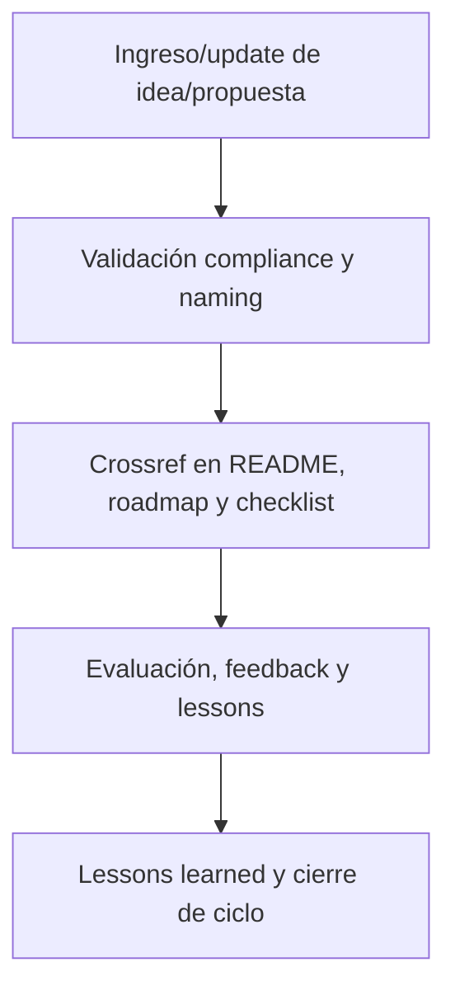

# 💡 core/kns/ideas\_brainstorm/ — Brainstorming e Ideación Incremental (v3.2)

## 1. Descripción, función, objetivos y contexto

La carpeta `core/kns/ideas_brainstorm/` centraliza **el brainstorming, la ideación y las propuestas incrementales** de mejoras, features, arquitecturas y workflows en la plataforma AingZ/RwB.

### Funciones principales:

- Almacenar drafts, propuestas, brainstorming y notas de ideación incremental, tanto IA como humano.
- Servir de insumo para roadmap, releases, features y ajustes de workflows o activos críticos.
- Garantizar la trazabilidad, versionado y evaluación estructurada de propuestas de mejora.

### Integraciones y sistemas relacionados:

- Crossref con lessons, insights, roadmap y reporting incremental (`ai_learn/`, `wf/`).
- Propuestas documentadas nutren la toma de decisiones, priorización y validación en la evolución del core.

## 2. Estructura interna

| Archivo/Subcarpeta   | Propósito                         | Estado |
| -------------------- | --------------------------------- | ------ |
| brainstorming\_X.md  | Draft/idea incremental específica | Activo |
| propuestas\_feature/ | Propuestas de features y mejoras  | Activo |
| ...                  | Otras ideas y notas de ideación   | Activo |

## 3. Metadatos y compliance

- **Versión:** v3.2 — 2025-08-06
- **Owner/Responsable:** AingZ\_Platform · RwB
- **Crossref obligatoria:** Blueprint, master plan, checklist, template universal README (ops/templates/)
- **Naming/Versionado:** Cumplimiento estricto de políticas RwB v3.2
- **Estado:** Activo

## 4. Ciclo de vida y flujos



## 5. Changelog local

- 2025-08-06: Versión v3.2, compliance brainstorming e ideación incremental.

## 6. Observaciones / Lessons learned

- Todas las propuestas e ideas deben estar trazadas, versionadas y vinculadas a roadmap y releases.
- Fomentar la documentación incremental y evaluación estructurada de la ideación IA/humano.

---

**FIN README core/kns/ideas\_brainstorm/ v3.2**

## OutputTemplate
```yaml
CODE:
ID:
VERSION:
ROUTE:
CROSSREF:
AUTHOR:
DATE:
```
