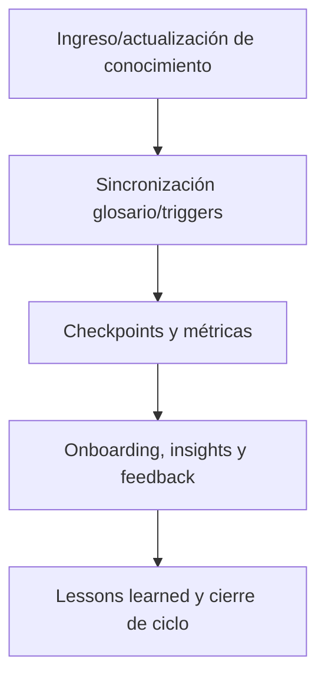

---

file: readme\_core\_kns\_rw\_b\_v3\_2.md version: v3.2-2025-08-06 status: active role: readme owner: AingZ\_Platform · RwB crossref:

- blueprint\_rw\_b\_platform\_v\_3\_20250803.md
- mpln\_master\_plan\_rw\_b\_v\_3\_20250803.md
- checklist\_root\_rw\_b\_v\_3\_20250805.md
- wf\_pipeline\_creacion\_archivos\_rw\_b\_v\_3\_20250805.md
- rw\_b\_glosario\_code\_v\_2\_20250729.md
- rw\_b\_diccionario\_code\_triggers\_v\_2\_20250729.md
- ops/templates/template\_readme\_rw\_b\_v3\_1.md changelog:
- 2025-08-06: Consolidación árbol y README kns/ core v3.2, integración glosario y triggers vivos.

---

# 🧠 core/kns/ — Knowledge Base, Glosario y Triggers vivos (v3.2)

## 1. Descripción, función, objetivos y contexto

La carpeta `core/kns/` es el **núcleo de conocimiento vivo, aprendizaje y referencia semántica** de la plataforma AingZ/RwB.

### Funciones principales:

- Centralizar el registro incremental de aprendizaje, insights, feedback, lessons learned y métricas de performance/QA.
- Mantener los glosarios (code, universal) y triggers activos y sincronizados, asegurando contexto único y semántica robusta para humanos e IA.
- Gestionar checkpoints, contexto, brainstorming y métricas para validación continua y onboarding automático.
- Facilitar la explotación de insights, propuestas y mejoras continuas a través de flujos de feedback y PDCA.

### Integraciones y sistemas relacionados:

- Sincronización directa con `data/dicts/` para glosarios, triggers y taxonomías.
- Interfaz con `wf/` para registro y análisis de workflows, auditorías y migraciones.
- Feedback e insights utilizados por pipelines de `ops/` y onboarding de `doc/`.
- Crossref viva a blueprint, master plan y checklist.

## 2. Estructura interna

| Subcarpeta / Archivo | Propósito                                                     | Estado |
| -------------------- | ------------------------------------------------------------- | ------ |
| ai\_learn/           | Registro de aprendizaje, feedback, insights, tuning, training | Activo |
| chkp/                | Checkpoints de plataforma y proyectos                         | Activo |
| ctx/                 | Contexto, preferencias, glosario extendido                    | Activo |
| glossary/            | Glosario code universal (vivo, sincronizado)                  | Activo |
| triggers/            | Diccionario de triggers (vivo, sincronizado)                  | Activo |
| ideas\_brainstorm/   | Brainstorming, ideación, propuestas                           | Activo |
| metrics/             | Métricas de performance y QA                                  | Activo |

## 3. Metadatos y compliance

- **Versión:** v3.2 — 2025-08-06
- **Owner/Responsable:** AingZ\_Platform · RwB
- **Crossref obligatoria:** Blueprint, master plan, checklist, triggers, glosario, template universal README (ops/templates/)
- **Naming/Versionado:** Cumplimiento estricto de políticas RwB v3.2
- **Estado:** Activo

## 4. Ciclo de vida y flujos

## 5. Changelog local

- 2025-08-06: Versión v3.2, integración de glosario y triggers vivos, ajuste compliance.

## 6. Observaciones / Lessons learned

- Glosario y triggers deben estar siempre sincronizados por pipeline, evitando desvíos semánticos.
- Lessons, feedback e insights deben alimentar todos los procesos de mejora continua (PDCA) de la plataforma.

---

**FIN README core/kns/ v3.2**

