# 🟢 core/kns/triggers/ — Diccionario de Triggers Vivo (v3.2)

## 1. Descripción, función, objetivos y contexto

La carpeta `core/kns/triggers/` centraliza **el diccionario de triggers vivo**, usado para disparo, integración y control de eventos, flujos y hooks críticos en la plataforma AingZ/RwB para IA y humanos.

### Funciones principales:

- Almacenar y versionar el diccionario de triggers, actualizado por pipeline desde `data/dicts/`.
- Servir como referencia para disparadores, hooks y eventos utilizados por scripts, assets y workflows.
- Garantizar la sincronización y consistencia semántica de triggers con el glosario y los assets core.

### Integraciones y sistemas relacionados:

- Crossref con glosario y diccionarios de dominio (`kns/glossary/`, `data/dicts/`).
- Diccionario de triggers nutre workflows, automatización y reporting incremental.

## 2. Estructura interna

| Archivo/Subcarpeta                                    | Propósito                    | Estado |
| ----------------------------------------------------- | ---------------------------- | ------ |
| rw\_b\_diccionario\_code\_triggers\_v\_2\_20250729.md | Diccionario de triggers vivo | Activo |
| ...                                                   | Otras versiones históricas   | Activo |

## 3. Metadatos y compliance

- **Versión:** v3.2 — 2025-08-06
- **Owner/Responsable:** AingZ\_Platform · RwB
- **Crossref obligatoria:** Blueprint, master plan, checklist, template universal README (ops/templates/)
- **Naming/Versionado:** Cumplimiento estricto de políticas RwB v3.2
- **Estado:** Activo

## 4. Ciclo de vida y flujos

```mermaid
graph TD;
  A[Ingreso/update de triggers] --> B[Validación compliance y naming]
  B --> C[Crossref en README, onboarding y checklist]
  C --> D[Sincronización con glosario/dicts]
  D --> E[Lessons learned y cierre de ciclo]
```



## 5. Changelog local

- 2025-08-06: Versión v3.2, compliance diccionario de triggers vivo.

## 6. Observaciones / Lessons learned

- El diccionario solo debe actualizarse vía pipeline y estar sincronizado con glosario/dicts de data/.
- Mantener trazabilidad de cambios y releases históricos del diccionario de triggers.

---

**FIN README core/kns/triggers/ v3.2**

## OutputTemplate
```yaml
CODE:
ID:
VERSION:
ROUTE:
CROSSREF:
AUTHOR:
DATE:
```
