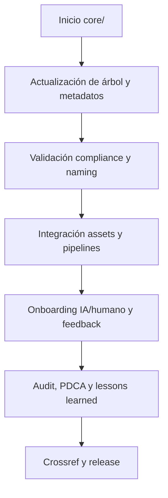

---

file: readme\_core\_rw\_b\_v3\_2.md version: v3.2-2025-08-06 status: active role: readme owner: AingZ\_Platform · RwB crossref:

- blueprint\_rw\_b\_platform\_v\_3\_20250803.md
- mpln\_master\_plan\_rw\_b\_v\_3\_20250803.md
- checklist\_root\_rw\_b\_v\_3\_20250805.md
- wf\_pipeline\_creacion\_archivos\_rw\_b\_v\_3\_20250805.md
- rw\_b\_glosario\_code\_v\_2\_20250729.md
- rw\_b\_diccionario\_code\_triggers\_v\_2\_20250729.md
- ops/templates/template\_readme\_rw\_b\_v3\_1.md changelog:
- 2025-08-06: Consolidación árbol y README core v3.2, integración data/dicts, triggers y glosario activos.

---

# 🏛️ core/ — Núcleo estructural AingZ/RwB (v3.2)

## 1. Descripción, función, objetivos y contexto

El bucket `core/` constituye el **núcleo estructural y semántico** de la plataforma AingZ/RwB, centralizando todos los activos, matrices, reglas, documentación, diccionarios y workflows clave.

### Funciones y objetivos principales:

- Actuar como fuente única de verdad estructural, organizativa y normativa de la plataforma.
- Consolidar la totalidad de los assets base: matrices de planeamiento, rulesets, diccionarios, glosarios, lecciones learned, auditorías, workflows y documentación de onboarding.
- Proveer contexto vivo y crossref para IA/humano, asegurando onboarding universal y compliance permanente.
- Sincronizar glosario y triggers activos, sirviendo de referencia para todos los buckets, pipelines y assets de la plataforma.
- Garantizar trazabilidad, versionado, ciclo PDCA, automatización de workflows y rápida integración de nuevos assets (humanos o IA).

### Integraciones y sistemas relacionados:

- Interfaz directa con todos los buckets principales (`ops/`, `packages/`, `lifecycle/`, `snapshots_ctx/`, `library/`).
- Crossref viva a blueprint, master plan, triggers, workflows y glosario, para garantizar integridad, actualización y trazabilidad.
- Totalmente integrado con pipelines automáticos y sistemas de onboarding desde `ops/` y `doc/onbrd/`.

## 2. Estructura interna

| Subcarpeta / Archivo | Propósito                                                 | Estado |
| -------------------- | --------------------------------------------------------- | ------ |
| data/                | Matrices, reglas, plantillas, diccionarios técnicos       | Activo |
| doc/                 | Documentación técnica, onboarding, imágenes, plantillas   | Activo |
| kns/                 | Knowledge base: aprendizaje, glosario, triggers, métricas | Activo |
| wf/                  | Workflows activos: auditoría, migración, relevamiento     | Activo |

## 3. Metadatos y compliance

- **Versión:** v3.2 — 2025-08-06
- **Owner/Responsable:** AingZ\_Platform · RwB
- **Crossref obligatoria:** Blueprint, master plan, checklist, triggers, glosario, template universal README (ops/templates/)
- **Naming/Versionado:** Cumplimiento estricto de políticas RwB v3.2
- **Estado:** Activo

## 4. Ciclo de vida y flujos

## 5. Changelog local

- 2025-08-06: Consolidación de árbol v3.2, ajuste data/dicts y triggers.

## 6. Observaciones / Lessons learned

- Toda mutación de estructura debe quedar registrada en changelog y checklist.
- Sincronización periódica obligatoria entre diccionarios técnicos (data/dicts), glosario (kns/glossary) y triggers (kns/triggers).
- Validar integración de templates, onboarding y pipelines antes de migración masiva o publicación de release.

---

**FIN README core/ v3.2 (versión activa)**

