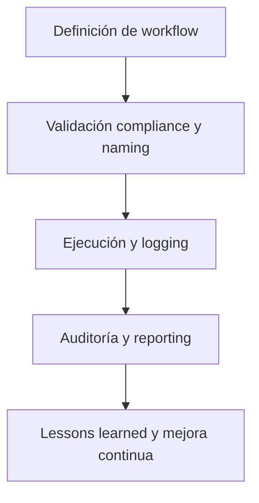

# 🔄 core/wf/ — Workflows, Auditorías y Macroprocesos Operativos (v3.2)

## 1. Descripción, función, objetivos y contexto

La carpeta `core/wf/` centraliza **todos los workflows activos, auditorías y macroprocesos operativos** de la plataforma AingZ/RwB.

### Funciones principales:

- Definir y documentar todos los flujos de trabajo críticos (auditorías, migraciones, relevamientos, macro tareas) que rigen la evolución del core y la plataforma.
- Asegurar trazabilidad, compliance y registro incremental de acciones, auditorías y migraciones.
- Facilitar la automatización y revisión sistemática de procesos (PDCA, validación y consolidación de activos).
- Integrar con pipelines de `ops/` para logging, testeo, automatización y reporting continuo.

### Integraciones y sistemas relacionados:

- Interconexión directa con assets de `data/` (matrices, reglas, diccionarios) y contextos de `kns/` (glosario, checkpoints, métricas).
- Vinculación con documentación de `doc/` para guías, onboarding y reporting de workflows.
- Crossref a blueprint, master plan y checklist para garantizar alineación y compliance.

## 2. Estructura interna

| Subcarpeta / Archivo | Propósito                                   | Estado |
| -------------------- | ------------------------------------------- | ------ |
| audt/                | Auditorías de estructura, compliance y PDCA | Activo |
| mig\_cons/           | Migraciones y consolidaciones de activos    | Activo |
| relv/                | Relevamientos, inventarios, registros       | Activo |
| tareas\_acciones/    | Macro tareas, acciones y seguimiento        | Activo |

## 3. Metadatos y compliance

- **Versión:** v3.2 — 2025-08-06
- **Owner/Responsable:** AingZ\_Platform · RwB
- **Crossref obligatoria:** Blueprint, master plan, checklist, triggers, glosario, template universal README (ops/templates/)
- **Naming/Versionado:** Cumplimiento estricto de políticas RwB v3.2
- **Estado:** Activo

## 4. Ciclo de vida y flujos



## 5. Changelog local

- 2025-08-06: Versión v3.2, integración workflows y ajuste compliance Master Plan.

## 6. Observaciones / Lessons learned

- Todo workflow debe tener ciclo PDCA documentado y trazabilidad de auditoría.
- No integrar workflows legacy sin revisión y registro de compliance.

---

**FIN README core/wf/ v3.2**

## OutputTemplate
```yaml
CODE:
ID:
VERSION:
ROUTE:
CROSSREF:
AUTHOR:
DATE:
```
