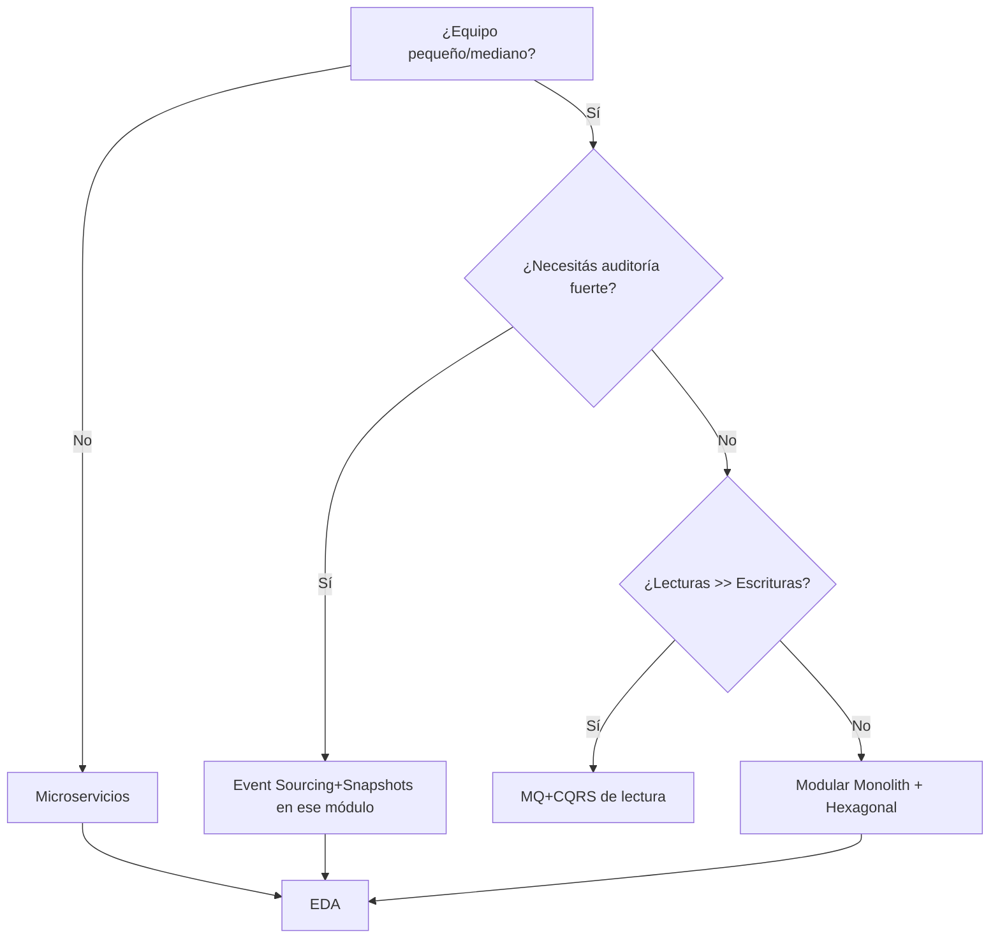

# Patrones de Arquitectura de Software — Snapshots + Matrices (V4)

> **Propósito**: entregar un **doc interno** genérico (sin naming de productos/organizaciones) con snapshots concisos de patrones, **matrices comparativas** (VRS) y un **WF de decisión** para seleccionar opciones para **infraestructura de agentes/IA en proyectos personales (1 dev)**.

## 1) Alcance y supuestos

- **Contexto**: desarrollo profesional **personal (1 dev)** con agentes/IA, pipelines de datos y automatizaciones; foco en simplicidad operativa, trazabilidad y costo bajo.
- **Plataforma**: ejecución en **un solo repositorio** con despliegue en **contenedores** y opción de VM; posibilidad de escalar a orquestadores más adelante.
- **No objetivos**: tiempo real estricto/ultra‑baja latencia, multi‑equipo, SLA 24x7 de misión crítica.
- **Criterios guía**: reproducibilidad, portabilidad, minimización de dependencias externas, auditoría de decisiones de IA, seguridad de credenciales.

### 1.1 Escenarios típicos (Agentes/IA)
- Agente único con **herramientas** (I/O a archivos, web, correo, APIs).
- **Orquestación de tareas** (jobs batch) y colas ligeras.
- **Memoria** del agente: episódica (conversación), semántica (embedding), factual (config/kb).
- **Evaluación** y registro de prompts, decisiones y resultados.

## 1.2 Principios SOLID (guía práctica para agentes/IA)

> **Objetivo**: reducir acoplamiento, aumentar cohesión y testabilidad. Aplicable a clases, módulos, servicios y adaptadores (puertos/herramientas) en proyectos personales con agentes/IA.

| Principio | Enunciado breve | Señales de violación | Heurísticos aplicables | Impacto en agentes/IA |
|---|---|---|---|---|
| **SRP** (Single Responsibility) | Una unidad debe tener **una sola razón de cambio**. | Módulos "multi‑propósito", *utils* gigantes, clases que hacen de todo. | Dividir por **caso de uso**; módulos orientados a dominio; separar *tooling* del core. | Menos deuda, pruebas más simples por función/herramienta.
| **OCP** (Open/Closed) | **Abierta a extensión, cerrada a modificación**. | *if/elif* por tipo, *feature flags* en core, tocar núcleo para agregar herramientas. | Patrones **Strategy/Factory**; cargar herramientas por **registro/config**; plugin‑like. | Añadir tool/modelo sin tocar el núcleo del agente.
| **LSP** (Liskov Substitution) | Subtipos deben **sustituir** sin romper contratos. | Adaptadores que cambian pre/post‑condiciones; *raise* inesperado. | **Contratos explícitos** (Protocol/ABC), **tests de sustitución** compartidos. | Intercambiar proveedor/LLM sin romper flujos.
| **ISP** (Interface Segregation) | Preferir **interfaces específicas** y pequeñas. | Interfaces gordas; métodos no usados. | **Interfaces por caso de uso**; < 5 métodos por puerto; herramientas minimalistas. | Agente con menú de herramientas mínimo y claro.
| **DIP** (Dependency Inversion) | Depender de **abstracciones**, no de concreciones. | Importar SDKs/HTTP client desde el dominio; acoplar a framework. | **Puertos/Adaptadores**, inyección de dependencias, *factories*. | Cambiar proveedor/DB sin tocar dominio.

**Reglas de arquitectura (tests sugeridos)**
- El **dominio** no puede importar **adaptadores** ni SDKs (DIP).
- Todo acceso a proveedor externo debe pasar por un **Puerto** (interface/Protocol) con **Adaptador**.
- **Interfaces pequeñas** por herramienta; evitar *god interfaces* (ISP).
- **Suite de sustitución**: cada adaptador debe pasar los **mismos tests** (LSP).
- Nuevas herramientas se agregan por **registro/config** sin modificar core (OCP).
- Módulos con **una responsabilidad** y *boundaries* claros (SRP).

**Plantillas (DIP/ISP en Python)**
```python
from typing import Protocol, runtime_checkable

@runtime_checkable
class LLMPort(Protocol):
    def complete(self, prompt: str, **kw) -> str: ...

@runtime_checkable
class ToolPort(Protocol):
    name: str
    def run(self, input: dict, ctx: dict) -> dict: ...

class OpenAIAdapter:
    def __init__(self, client):
        self._c = client
    def complete(self, prompt: str, **kw) -> str:
        # implementación concreta del proveedor
        return self._c.completions.create(prompt=prompt, **kw).text

class Agent:
    def __init__(self, llm: LLMPort, tools: list[ToolPort]):
        self.llm, self.tools = llm, {t.name: t for t in tools}
```

**Automatización de calidad**
- **import‑linter**: reglas de dependencia (DIP).
- **pytest**: *tests* de sustitución compartidos por adaptador (LSP).
- **ruff/pylint**: SRP/ISP por métricas de complejidad y tamaño.
- **mypy**: contratos de tipo para puertos/adaptadores.

---

## 2) Snapshots de patrones (1‑pagers)

Cada snapshot resume: **Contexto → Fuerzas → Trade‑offs → Antipatrones → Indicadores**.

### 2.1 Monolito Modular

- **Contexto**: un solo deploy, módulos bien definidos (contextos delimitados).
- **Fuerzas**: simplicidad operativa, transacciones ACID, latencia baja intra‑proceso.
- **Trade‑offs**: riesgo de erosión modular; ciclos de release acoplados.
- **Antipatrones**: *Big Ball of Mud*, capas anémicas.
- **Indicadores**: time‑to‑market inicial, % coupling entre módulos, cobertura de tests por módulo.

### 2.2 Hexagonal (Puertos y Adaptadores)

- **Contexto**: dominio aislado del I/O (DB, MQ, HTTP). Facilita tests y reemplazos.
- **Fuerzas**: desacople fuerte; testing por puertos; fácil mockeo de adaptadores.
- **Trade‑offs**: sobrecosto inicial de diseño; disciplina en boundaries.
- **Antipatrones**: lógica de dominio filtrada a adaptadores; puertos "dios".
- **Indicadores**: nº adaptadores por puerto, % dependencias dominio→infra (ideal 0%).

### 2.3 Arquitectura en Capas (Layered)

- **Contexto**: presentación ⇄ aplicación ⇄ dominio ⇄ datos.
- **Fuerzas**: familiaridad, separación de responsabilidades.
- **Trade‑offs**: riesgo de *pasamanos*; violaciones de capas; latencia por hops.
- **Antipatrones**: servicios anémicos que solo delegan repositorios.
- **Indicadores**: reglas de dependencia (solo hacia abajo) cumplidas.

### 2.4 Microservicios

- **Contexto**: servicios pequeños, independientes, *DB per service*.
- **Fuerzas**: escalado selectivo, independencia de release, equipos autónomos.
- **Trade‑offs**: complejidad operativa (network, observabilidad, consistencia); coste.
- **Antipatrones**: *microservicios en mini‑monolito*; *shared DB*.
- **Indicadores**: lead‑time por servicio, MTTR, tasa de cambios coordinados cross‑servicio.

### 2.5 Event‑Driven (EDA)

- **Contexto**: eventos como primera clase; *publish/subscribe*.
- **Fuerzas**: desacople temporal; resiliencia; extensibilidad.
- **Trade‑offs**: debugging/orden; *at‑least‑once* y deduplicación; semántica eventual.
- **Antipatrones**: *event soup* sin contratos; acoplamiento a payloads frágiles.
- **Indicadores**: lag de colas, % idempotencia efectiva, *dead letters*.

### 2.6 CQRS

- **Contexto**: separar modelos/paths de **lectura** y **escritura**.
- **Fuerzas**: escalado lecturas, proyecciones especializadas.
- **Trade‑offs**: sincronización y consistencia eventual; duplicación de modelos.
- **Antipatrones**: uso sin necesidad; agregar complejidad sin volúmenes de lectura altos.
- **Indicadores**: ratio R/W, latencia de proyección, frescura de vistas.

### 2.7 Event Sourcing

- **Contexto**: el estado es el *log* de eventos; *snapshots* periódicos.
- **Fuerzas**: auditoría perfecta; *time‑travel*; integridad histórica.
- **Trade‑offs**: complejidad de replays/migraciones; *versioning* de eventos.
- **Antipatrones**: usarlo para dominios CRUD simples.
- **Indicadores**: tiempo de *rebuild*, tamaño de log, tasa de *upcasters*.

### 2.8 Serverless (FaaS + servicios gestionados)

- **Contexto**: funciones efímeras y *managed services*.
- **Fuerzas**: coste OPEX por uso, escalado automático, zero‑ops parcial.
- **Trade‑offs**: *cold starts*, límites de ejecución, *vendor lock‑in*.
- **Antipatrones**: core de dominio con cadenas FaaS largas.
- **Indicadores**: p95 de arranque, coste/100k invocaciones, error rate por límite.

### 2.9 Modular Monolith → Strangler Fig (Evolución)

- **Contexto**: iniciar modular y extraer *seams* a servicios cuando maduran.
- **Fuerzas**: control del riesgo, inversiones incrementales.
- **Trade‑offs**: disciplina de boundaries, doble topología transitoria.
- **Indicadores**: nº seams candidatos; *blast radius* de cambios.

### 2.10 Micro‑Frontends (si aplica)

- **Contexto**: UI compuesta por *slices* independientes.
- **Nota**: evaluar solo si crece la UI multi‑equipo.

### 2.11 Orquestación en Grafo (Agentes)
- **Contexto**: flujo como **grafo/DAG** de nodos (agentes/herramientas) con control explícito de estado.
- **Fuerzas**: visualización clara, reintentos por nodo, trazabilidad de decisiones.
- **Trade‑offs**: diseño inicial del grafo; sobrecosto si el flujo es lineal simple.
- **Indicadores**: nº nodos/edges, tasa de reintentos por nodo, tiempo total por recorrido.

### 2.12 Agente Único con Registro de Herramientas
- **Contexto**: proceso único, **registro de herramientas** (adapters) que el agente invoca.
- **Fuerzas**: simplicidad y bajos costos; fácil de depurar.
- **Trade‑offs**: límites de escalado vertical; riesgo de *god‑agent*.
- **Indicadores**: nº herramientas, % llamadas externas exitosas, MTTR por fallo.

### 2.13 Memoria Híbrida del Agente
- **Contexto**: capas de memoria (episódica/semántica/factual) con políticas de retención.
- **Fuerzas**: mejor contexto y repetibilidad; control de privacidad.
- **Trade‑offs**: complejidad de sincronización y vencimientos.
- **Indicadores**: *hit rate* de recuperación, frescura de memoria, coste de almacenamiento.

---

## 3) Matrices comparativas (VRS)

### 3.1 Patrón × Criterios técnicos/operativos

| Patrón           | Complejidad Operativa | Escalabilidad   | Cohesión     | Acoplamiento               | Consistencia Datos  | Latencia   | Despliegue          | Observabilidad       | Coste          | Fit Equipo |
| ---------------- | --------------------- | --------------- | ------------ | -------------------------- | ------------------- | ---------- | ------------------- | -------------------- | -------------- | ---------- |
| Monolito Modular | **Baja**              | Media           | Alta         | Media‑Baja                 | **Fuerte (ACID)**   | **Baja**   | Simple              | Media                | **Bajo**       | **Alto**   |
| Hexagonal        | Baja‑Media            | Media           | **Muy alta** | **Baja**                   | Fuerte              | Baja       | Simple              | Alta                 | Bajo           | Alto       |
| Capas            | Baja                  | Media           | Media        | Media                      | Fuerte              | Media      | Simple              | Media                | Bajo           | Alto       |
| Microservicios   | **Alta**              | **Alta**        | Media        | **Baja (inter‑servicios)** | Eventual            | Media‑Alta | Complejo (K8s/mesh) | **Alta (necesaria)** | **Alto**       | Medio‑Alto |
| EDA              | Media                 | Alta            | Alta         | Baja temporal              | Eventual            | Media      | Medio               | Alta                 | Medio          | Medio      |
| CQRS             | Media                 | Alta (lecturas) | Alta         | Media                      | Eventual (lecturas) | Baja‑Media | Medio               | Media                | Medio          | Medio      |
| Event Sourcing   | Alta                  | Media           | Alta         | Media                      | **Fuerte (audit)**  | Media      | Medio‑Alto          | Alta                 | Medio‑Alto     | Medio      |
| Serverless       | Media                 | **Alta**        | N/A          | N/A                        | N/A                 | Variable   | Simple‑Medio        | Media                | **Bajo‑Medio** | Medio      |

> **Leyenda**: negrita = ventaja clara. "Fit Equipo" asume equipo pequeño‑mediano con fuerte disciplina de testing.

### 3.2 Requisitos (proyectos personales con agentes/IA) × Adecuación de patrón

| Requisito                                 | Monolito Modular | Hexagonal | Microservicios | EDA | CQRS | Event Sourcing | Serverless |
| ----------------------------------------- | ---------------- | --------- | -------------- | --- | ---- | -------------- | ---------- |
| Trazabilidad (auditoría/no‑loss)          | 3                | 5         | 4              | 4   | 4    | **5**          | 4          |
| Time‑to‑market inicial                    | **5**            | 4         | 2              | 3   | 3    | 2              | 4          |
| Evolución incremental sin *big‑bang*      | 4                | **5**     | 3              | 4   | 3    | 3              | 4          |
| Coste operativo inicial bajo              | **5**            | 4         | 2              | 3   | 3    | 2              | 4          |
| Procesos batch/orquestación               | 4                | 4         | 3              | 4   | 3    | 3              | **5**      |
| Dependencias externas variables           | 3                | **5**     | 4              | 4   | 3    | 3              | 4          |

> Escala 1‑5 (mejor=5). Basado en contexto actual (1 dev) y objetivos de simplicidad.

### 3.3 Riesgos clave × Mitigaciones

| Riesgo                | Patrón asociado    | Mitigación                                                              | Indicador/KPI                              |
| --------------------- | ------------------ | ----------------------------------------------------------------------- | ------------------------------------------ |
| Erosión modular       | Monolito Modular   | Reglas de dependencia + *module boundaries* + **tests de arquitectura** | % violaciones detectadas por *linter*      |
| Complejidad/operación | Microservicios/EDA | Observabilidad abierta, *service templates*, *platform repo*            | MTTR, SLIs (lat/err)                       |
| Pérdida de eventos    | EDA/CQRS/ES        | **Outbox**, idempotencia, *DLQ*, *sagas*                                | % reintentos, DLQ size                     |
| Vendor lock‑in        | Serverless         | Abstracción por puertos + *infra as code*                               | % funciones con adapters neutrales          |

### 3.4 Stack de agentes × Integración

| Componente              | Opción mínima (1 dev)           | Patrón de integración        | KPIs sugeridos                 |
|-------------------------|----------------------------------|------------------------------|-------------------------------|
| Orquestación de flujo   | Grafo simple en proceso          | Orquestación en Grafo        | tiempo por nodo, reintentos   |
| Llamadas a herramientas | Registro local de herramientas   | Puertos/Adaptadores          | tasa éxito, latencia por tool |
| Memoria                 | Archivos/BD ligera + índice      | Memoria Híbrida              | hit rate, frescura            |
| Persistencia            | BD relacional ACID               | Hexagonal + Repositorios     | p95 consultas, locks          |
| Mensajería              | Cola ligera/log local            | EDA                          | lag, DLQ                      |
| Evaluación              | Harness de pruebas + métricas    | CQRS (proyecciones de lectura)| frescura de vistas            |
| Observabilidad          | Tracing/métricas/logs básicos    | N/A                          | MTTR, cobertura de spans      |

### 3.5 Matriz SOLID × Patrones

| Patrón / Principio | SRP | OCP | LSP | ISP | DIP | Notas |
|---|---:|---:|---:|---:|---:|---|
| Monolito Modular | 4 | 4 | 4 | 4 | 3 | Requiere disciplina en límites para mantener SRP.
| Hexagonal | **5** | **5** | 4 | **5** | **5** | Puertos/Adaptadores refuerzan OCP/DIP/ISP.
| Capas | 4 | 3 | 3 | 4 | 3 | Riesgo de *pasamanos*; OCP mejora con factories.
| Microservicios | 5 (a nivel servicio) | 4 | 4 | 4 | 4 | Aumenta SRP, pero complejidad operativa.
| EDA | 4 | 4 | 4 | 4 | 4 | Contratos de eventos claros ayudan LSP/ISP.
| CQRS | 4 | 4 | 4 | 4 | 4 | Separación R/W apoya SRP.
| Event Sourcing | 4 | 3 | 4 | 3 | 4 | DIP crítico en *event store*.
| Serverless | 3 | 4 | 3 | 4 | 4 | Mantener puertos evita *lock‑in* proveedor.

> Escala 1‑5; **negrita** = ajuste sobresaliente.

## 4) Roadmap genérico para agentes/IA (equipo 1 dev)

**Estrategia recomendada**: **Monolito Modular + Hexagonal** como base → **EDA táctico** para integración y jobs → **CQRS limitado** donde lecturas escalen → **Event Sourcing solo** en módulos con auditoría fuerte (p.ej., cambios de reglas, decisiones automáticas) → **Serverless** para picos/batch.

### Fase 0 — Baseline (hoy)

- Modular Monolith repo‑first con **capas de dominio hexagonales** (puertos: DB, cola, HTTP, storage).
- **BD relacional ACID** (con soporte JSON) para estado fuerte. **Cache en memoria** con TTL para lecturas frecuentes.
- **Orquestación de jobs** en proceso/cola ligera + **patrón Outbox** para entrega confiable.
- **Telemetría abierta** (tracing/métricas/logs) + KPIs clave del §3.3.
- **CI/CD basado en repositorio** + contenedores.

### Fase 1 — Integración por eventos (3‑6 meses)

- Introducir **bus de mensajería** (cola o *log* distribuido) según throughput.
- **Publicar eventos de dominio** y proyecciones de lectura (mini‑CQRS donde aporte).
- Endurecer idempotencia y *DLQ*.

### Fase 2 — Extracción selectiva (6‑12 meses)

- Identificar *seams* con alta tasa de cambio o *scaling hotspots* → extraer microservicios.
- Plantillas de servicio, *API gateway* y *contract tests*.

### Fase 3 — Serverless táctico

- Funciones para tareas picos/batch (p.ej., análisis de corpus, generación de reportes).

---

## 5) WF — Selección y evaluación de patrón (WF\_APSEL)

**Objetivo**: aplicar un proceso repetible y auditable para elegir patrones por módulo.

**Inputs**: requisitos del módulo, KPIs objetivo, restricciones de operación, *fit* de equipo.

**Pasos**:

0. **SOLID**: validar reglas (DIP/ISP/SRP) y *tests* de sustitución (LSP); exigir extensión por config/registro (OCP).
1. **INGEST**: capturar requisitos → matriz 3.2 por módulo.
2. **SCORING**: puntuar patrones (1‑5) y calcular **Score Ajustado = (Adecuación × Peso requisito)**.
3. **RIESGOS**: evaluar tabla 3.3 y proponer mitigaciones.
4. **DECISIÓN**: seleccionar patrón/es y generar ADR.
5. **VALIDACIÓN**: definir KPIs (latencia, MTTR, % idempotencia, coste) y umbrales.
6. **CHECK**: correr *architecture tests* y QA de dependencias.
7. **CLOSE**: registrar en CHG/LESSONS + disparar **TRG\_CONSOLIDATE\_TL** y **TRG\_AUDIT\_TL**.

**Salidas**: ADR, matriz decisión, backlog de mitigaciones, KPIs y plan de implementación.

### Árbol de decisión (resumen)



---

## 6) KPIs & Observabilidad (mínimos)
- **Disponibilidad** por módulo/servicio; **MTTR**; **latencia p95** rutas críticas.
- **Consistencia**: % mensajes re‑procesados; tamaño de DLQ.
- **Calidad**: cobertura tests de dominio; **tests de arquitectura** (dependencias).
- **Coste**: gasto mensual infra por módulo.
- **IA/Agentes**: *hit rate* de recuperación de memoria; % decisiones explicadas/logueadas; tasa de alucinaciones detectadas.

## 7) Referencias internas & ADR
- Plantilla ADR sugerida:

```yaml
adr:
  id: <consecutivo>
  title: <decision_breve>
  date: <YYYY-MM-DD>
  status: proposed|accepted|deprecated
  context: |
    <resumen del problema y fuerzas>
  decision: |
    <patrón/es elegidos y justificación>
  consequences: |
    <trade-offs y riesgos>
  kpis:
    - name: <kpi>
      target: <umbral>
```

- Este doc se cruza con ADRs por módulo (ruta sugerida: `core/doc/adr/ADR_<id>_<tema>.md`).
- Mantener **no‑loss**: cambios mayores deben registrarse en `ops/changelog.md` y `ops/lessons_learned.md`.

## OutputTemplate (obligatorio)

---
# OutputTemplate (obligatorio)
output_example:
  status: OK
  id_asset: mtx_arch_patterns_v4
  generated_by: ai
  created_at: 2025-08-12T00:00:00-03:00
  params:
    - scope: core
    - audience: single_dev
    - principles: [SOLID]
    - patterns: [monolith_modular, hexagonal, layered, microservices, eda, cqrs, event_sourcing, serverless, graph_orchestration, agent_tools_registry, hybrid_memory]
  result:
    - decision_matrix_path: core/data/mtx/MTX_Arch_Patterns_V4.md
    - recommended_strategy: ModularMonolith+Hexagonal→EDA→CQRS(selectivo)
  log:
    - step0: solid_checks
    - step1: snapshots
    - step2: matrices
    - step3: wf_decision
---

