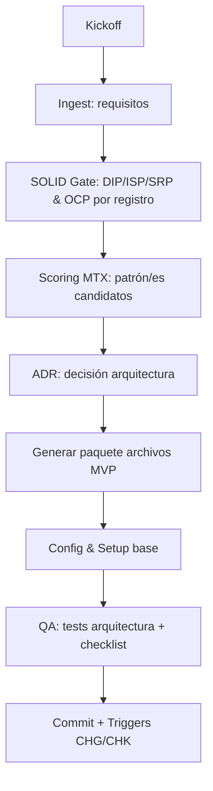

---

## file: core/wf/WF\_ARCH\_CREATE\_V4.md code: WFARC name: ArchCreateWorkflow version: v4.0 date: 2025-08-12 owner: AingZ\_Platform · RwB status: active xrf: blueprint: RwB\_Blueprint\_V4 mplan: RwB\_MasterPlan\_V4 glossary: CODE\_Glossary\_v2 dictionary: CODE\_Triggers\_v2 triggers: [TRG\_CONSOLIDATE\_TL, TRG\_AUDIT\_TL, TRG\_AUDIT\_LEGACY, TRG\_PURGE\_AI] chg: CHG\_main.md#wf\_arch\_create\_v4 chk: CHK\_root.md#wf\_arch\_create\_v4

# WF\_ARCH\_CREATE\_V4 — Workflow para crear una **Arquitectura Base** (agentes/IA, 1 dev)

> **Objetivo**: Instanciar una **arquitectura de software** coherente con la **MTX\_Arch\_Patterns\_V4** (patrones + SOLID) y con el **ruleset V4**. Produce el **paquete de archivos** (blueprint, masterplan, roadmap, ruleset, checklist, configs, setups) listo para versionar.

## 1) Alcance y premisas

- Entorno: proyecto personal (1 dev), agentes/IA, contenedores, CI/CD repo‑based.
- Criterios guía: **trazabilidad, reproducibilidad, bajo costo y simplicidad operativa**.
- Sin naming de productos/terceros; usar **puertos/adaptadores** y **interfaces pequeñas** (SOLID).

## 2) Entradas y salidas

**Inputs**

- MTX: `core/data/mtx/MTX_Arch_Patterns_V4.md` (criterios, matrices, SOLID).
- Requisitos del módulo/arquitectura (alcance, SLIs/SLOs, restricciones, prioridades).

**Outputs**

- Paquete de archivos **MVP** (sección §4) + **ADR** principal + checklist inicial.

## 3) Flujo (paso a paso)



**Detalle de pasos**

1. **Ingest**: capturar requisitos (tabla 3.2 de la MTX). Ponderar criterios.
2. **SOLID‑Gate (0‑fail)**: validar reglas de dependencia (DIP), interfaces pequeñas (ISP), una responsabilidad (SRP), extensión por registro (OCP) y tests de sustitución (LSP).
3. **Scoring**: aplicar matriz VRS → seleccionar patrón/es (p.ej., Monolito Modular + Hexagonal + EDA táctico).
4. **ADR**: registrar contexto, decisión, consecuencias y KPIs.
5. **Generación**: instanciar **paquete** (blueprint/mplan/roadmap/ruleset/checklist/configs/setups) con **metadatos V4**.
6. **Config & Setup**: completar parámetros de `configs` (puertos, secrets, storage, colas).
7. **QA**: ejecutar *tests de arquitectura* (import‑linter), contratos (pytest), tipado (mypy), lint (ruff/pylint).
8. **Commit**: versionar y disparar **TRG\_CONSOLIDATE\_TL** y **TRG\_AUDIT\_TL**.

## 4) **Paquete de archivos convencional (MVP)**

> **Destino**: rutas V4 canónicas. Los archivos incluyen **front‑matter** + **OutputTemplate** o secciones de control.

| Asset             | Ruta V4                                | Propósito                                              | CODE (≤5) |
| ----------------- | -------------------------------------- | ------------------------------------------------------ | --------- |
| **Blueprint**     | `core/doc/blueprint/BLP_<ARCH>_V4.md`  | Topología, límites, dependencias, decisiones clave     | `BLP`     |
| **Master Plan**   | `core/doc/mplan/MPLN_<ARCH>_V4.md`     | Objetivos, fases, riesgos, KPIs                        | `MPLN`    |
| **Roadmap**       | `core/doc/roadmap/RDM_<ARCH>_V4.md`    | Hitos, entregables, fechas, criterios de done          | `RDM`     |
| **RuleSet**       | `core/rules/RULES_<ARCH>_V4.md`        | Reglas de diseño (SOLID, puertos, contratos, naming)   | `RULES`   |
| **Checklist**     | `core/checklists/CHK_<ARCH>_V4.md`     | Controles de cumplimiento (pre/pos‑release)            | `CHK`     |
| **Configs**       | `ops/configs/CFG_<ARCH>_V4.yaml`       | Parámetros de despliegue, puertos, colas, storage, env | `CFG`     |
| **Setups**        | `ops/scripts/setup/SETUP_<ARCH>_V4.md` | Pasos de inicialización local/CI, seeds, fixtures      | `SETUP`   |
| **ADR principal** | `core/doc/adr/ADR_<id>_<ARCH>_V4.md`   | Decisión arquitectónica inicial                        | `ADR`     |

> `<ARCH>` es un alias corto del proyecto/arquitectura (p.ej., `CORE`, `AGNT`).

## 5) **Plantillas (draft) — contenido mínimo**

### 5.1 Blueprint

```markdown
---
file: core/doc/blueprint/BLP_<ARCH>_V4.md
code: BLP
name: <PascalCaseBlueprint>
version: v4.0
date: <YYYY-MM-DD>
owner: <Owner>
status: draft
xrf:
  blueprint: RwB_Blueprint_V4
  mplan: RwB_MasterPlan_V4
  glossary: CODE_Glossary_v2
  dictionary: CODE_Triggers_v2
triggers: [TRG_CONSOLIDATE_TL]
chg: CHG_main.md#blp_<arch>
chk: CHK_root.md#blp_<arch>
---
# Blueprint <ARCH>
- **Patrones**: <Monolito Modular + Hexagonal + EDA>
- **Boundaries**: <módulos/contextos>
- **Dependencias externas**: <DB, cola, storage, API>
- **Contratos**: <puertos/interface + eventos>
- **Riesgos** & **mitigaciones**: <tabla>

---
# OutputTemplate (obligatorio)
output_example:
  status: DRAFT
  id_asset: blp_<arch>_v4
  generated_by: user
  created_at: <ISO8601>
  params:
    - patterns: [<...>]
  result:
    - modules: [<...>]
```

### 5.2 Master Plan

```markdown
---
file: core/doc/mplan/MPLN_<ARCH>_V4.md
code: MPLN
name: <PascalCaseMasterPlan>
version: v4.0
date: <YYYY-MM-DD>
owner: <Owner>
status: draft
xrf:
  blueprint: BLP_<ARCH>_V4
  mplan: RwB_MasterPlan_V4
  glossary: CODE_Glossary_v2
  dictionary: CODE_Triggers_v2
triggers: [TRG_CONSOLIDATE_TL]
chg: CHG_main.md#mplan_<arch>
chk: CHK_root.md#mplan_<arch>
---
# Master Plan <ARCH>
## Fases
- F0 Baseline → F1 Eventos → F2 Extracción → F3 Serverless
## KPIs
- p95 latencia, MTTR, % idempotencia, coste mensual
## Riesgos y planes
- <riesgo>: <mitigación>

---
# OutputTemplate (obligatorio)
output_example:
  status: DRAFT
  id_asset: mplan_<arch>_v4
  generated_by: user
  created_at: <ISO8601>
```

### 5.3 Roadmap

```markdown
---
file: core/doc/roadmap/RDM_<ARCH>_V4.md
code: RDM
name: <PascalCaseRoadmap>
version: v4.0
date: <YYYY-MM-DD>
owner: <Owner>
status: draft
xrf:
  blueprint: BLP_<ARCH>_V4
  mplan: MPLN_<ARCH>_V4
  glossary: CODE_Glossary_v2
  dictionary: CODE_Triggers_v2
triggers: [TRG_CONSOLIDATE_TL]
chg: CHG_main.md#rdm_<arch>
chk: CHK_root.md#rdm_<arch>
---
# Roadmap <ARCH>
- **Hitos**: <Q1/Q2/...>
- **Entregables**: <artefactos>
- **Criterios de done**: <listas>
```

### 5.4 RuleSet

```markdown
---
file: core/rules/RULES_<ARCH>_V4.md
code: RULES
name: <PascalCaseRuleset>
version: v4.0
date: <YYYY-MM-DD>
owner: <Owner>
status: draft
xrf:
  blueprint: BLP_<ARCH>_V4
  mplan: MPLN_<ARCH>_V4
  glossary: CODE_Glossary_v2
  dictionary: CODE_Triggers_v2
triggers: [TRG_AUDIT_TL]
chg: CHG_main.md#rules_<arch>
chk: CHK_root.md#rules_<arch>
---
# RuleSet <ARCH>
- **SOLID**: SRP/OCP/LSP/ISP/DIP
- **Puertos/Adaptadores**: contratos mínimos, idempotencia
- **Eventos**: esquema/versionado, outbox, DLQ
- **Persistencia**: ACID + TTL cache
- **Naming**: CODE ≤5, PascalCaseName, rutas V4
```

### 5.5 Checklist

```markdown
---
file: core/checklists/CHK_<ARCH>_V4.md
code: CHK
name: <PascalCaseChecklist>
version: v4.0
date: <YYYY-MM-DD>
owner: <Owner>
status: draft
xrf:
  blueprint: BLP_<ARCH>_V4
  mplan: MPLN_<ARCH>_V4
  glossary: CODE_Glossary_v2
  dictionary: CODE_Triggers_v2
triggers: [TRG_AUDIT_TL]
chg: CHG_main.md#chk_<arch>
chk: CHK_root.md#chk_<arch>
---
# Checklist <ARCH>
- [ ] DIP: dominio no importa adaptadores/SDK
- [ ] ISP: interfaces pequeñas (<5 métodos)
- [ ] LSP: tests de sustitución por adaptador
- [ ] OCP: registro de herramientas/puertos
- [ ] SRP: una responsabilidad por módulo
- [ ] Eventos: outbox + DLQ + idempotencia
- [ ] Observabilidad: traces/metrics/logs mínimos
- [ ] KPIs definidos y umbrales
```

### 5.6 Configs (YAML)

```yaml
# ops/configs/CFG_<ARCH>_V4.yaml
arch:
  name: <arch_name>
  patterns: [monolith_modular, hexagonal, eda]
  modules:
    - id: <mod_id>
      purpose: <texto>
      ports:
        db: <dsn>
        cache: <redis_url>
        queue: <queue_url>
        http: <base_url>
  events:
    bus: <none|queue|log>
    outbox: true
  telemetry:
    tracing: true
    metrics: true
  ci_cd:
    container: true
    pipelines: [build, test, lint]
```

### 5.7 Setups

```markdown
---
file: ops/scripts/setup/SETUP_<ARCH>_V4.md
code: SETUP
name: <PascalCaseSetup>
version: v4.0
date: <YYYY-MM-DD>
owner: <Owner>
status: draft
xrf:
  blueprint: BLP_<ARCH>_V4
  mplan: MPLN_<ARCH>_V4
  glossary: CODE_Glossary_v2
  dictionary: CODE_Triggers_v2
triggers: [TRG_CONSOLIDATE_TL]
chg: CHG_main.md#setup_<arch>
chk: CHK_root.md#setup_<arch>
---
# Setup <ARCH>
1) **Repo local**: clonar, crear `.env`, levantar contenedor.
2) **Pipelines**: ejecutar build/test/lint.
3) **Seeds/fixtures**: cargar datos mínimos.
4) **QA arquitectura**: correr import‑linter, mypy, pytest, ruff.
```

### 5.8 ADR principal

```markdown
---
file: core/doc/adr/ADR_<id>_<ARCH>_V4.md
code: ADR
name: <PascalCaseADR>
version: v4.0
date: <YYYY-MM-DD>
owner: <Owner>
status: proposed
xrf:
  blueprint: BLP_<ARCH>_V4
  mplan: MPLN_<ARCH>_V4
  glossary: CODE_Glossary_v2
  dictionary: CODE_Triggers_v2
triggers: [TRG_CONSOLIDATE_TL]
chg: CHG_main.md#adr_<arch>
chk: CHK_root.md#adr_<arch>
---
# ADR: Decisión Arquitectónica Inicial
<contexto>
<decisión>
<consecuencias>
<kpis>
```

---

## 6) Controles y crossref (compliance V4)

- **Regla de Máxima Jerarquía**: cada archivo con *front‑matter*, ruta exacta V4, **WF** y **OutputTemplate**.
- Triggers mínimos: **TRG\_CONSOLIDATE\_TL**, **TRG\_AUDIT\_TL**.
- Registrar **CHG/CHK/LESSONS** en commits relevantes.

---

## OutputTemplate (obligatorio)

# OutputTemplate (obligatorio)

output\_example: status: OK id\_asset: wf\_arch\_create\_v4 generated\_by: ai created\_at: 2025-08-12T00:00:00-03:00 params: - source\_mtx: core/data/mtx/MTX\_Arch\_Patterns\_V4.md - deliverables: [blueprint, masterplan, roadmap, ruleset, checklist, configs, setups, adr] result: - package\_root: \<repo\_root> - files: - core/doc/blueprint/BLP\_*V4.md - core/doc/mplan/MPLN**V4.md - core/doc/roadmap/RDM**V4.md - core/rules/RULES**V4.md - core/checklists/CHK**V4.md - ops/configs/CFG**V4.yaml - ops/scripts/setup/SETUP**V4.md - core/doc/adr/ADR*\_\_V4.md log: - step1: ingest - step2: solid\_gate - step3: scoring - step4: adr - step5: package - step6: qa - step7: commit

