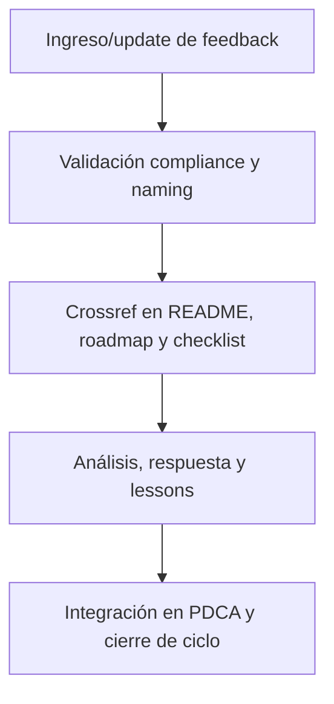

# 💬 core/kns/ai\_learn/feed/ — Feedback estructurado humano/IA (v3.2)

## 1. Descripción, función, objetivos y contexto

La carpeta `core/kns/ai_learn/feed/` centraliza **el feedback estructurado y retroalimentación** proveniente tanto de usuarios humanos como de IA, referente al uso, mejora y validación de la plataforma AingZ/RwB.

### Funciones principales:

- Almacenar sugerencias, críticas, reportes de incidentes y propuestas de mejora.
- Integrar el feedback al ciclo PDCA y a la evolución de assets, workflows y onboarding IA/humano.
- Garantizar trazabilidad, respuesta y documentación de acciones tomadas ante feedback relevante.

### Integraciones y sistemas relacionados:

- Referencia directa con lessons, tuning y métricas (`ai_learn/`, `metrics/`), y workflows de auditoría y reporting (`wf/`).
- El feedback documentado alimenta roadmap, releases y lecciones learned.

## 2. Estructura interna

| Archivo/Subcarpeta   | Propósito                              | Estado |
| -------------------- | -------------------------------------- | ------ |
| feedback\_humano.md  | Sugerencias y experiencias de usuarios | Activo |
| feedback\_ia.md      | Retroalimentación de modelos IA        | Activo |
| mejoras\_incidentes/ | Propuestas de mejora e incidentes      | Activo |
| ...                  | Otros reportes y feedback estructurado | Activo |

## 3. Metadatos y compliance

- **Versión:** v3.2 — 2025-08-06
- **Owner/Responsable:** AingZ\_Platform · RwB
- **Crossref obligatoria:** Blueprint, master plan, checklist, template universal README (ops/templates/)
- **Naming/Versionado:** Cumplimiento estricto de políticas RwB v3.2
- **Estado:** Activo

## 4. Ciclo de vida y flujos



## 5. Changelog local

- 2025-08-06: Versión v3.2, compliance feedback humano/IA.

## 6. Observaciones / Lessons learned

- Todo feedback relevante debe tener seguimiento, respuesta e integración documentada.
- Fomentar la recolección y análisis de feedback estructurado en todos los procesos de la plataforma.

---

**FIN README core/kns/ai\_learn/feed/ v3.2**

## OutputTemplate
```yaml
CODE:
ID:
VERSION:
ROUTE:
CROSSREF:
AUTHOR:
DATE:
```
