# 📚 core/kns/ai\_learn/learn/ — Registro Incremental de Aprendizajes (v3.2)

## 1. Descripción, función, objetivos y contexto

La carpeta `core/kns/ai_learn/learn/` centraliza **el registro incremental de aprendizajes, lessons learned y experiencias acumuladas** de la plataforma AingZ/RwB, tanto para IA como para usuarios humanos.

### Funciones principales:

- Almacenar logs y bitácoras de procesos de aprendizaje, onboarding, training, pruebas y lecciones learned.
- Facilitar transferencia de conocimiento, replicabilidad y onboarding IA/humano basado en experiencia viva.
- Asegurar trazabilidad de aprendizajes y lessons para alimentar mejora continua y flujos de onboarding.

### Integraciones y sistemas relacionados:

- Enlace directo con insights, feedback y tuning (`ai_learn/`) y con reporting de training (`trn/`).
- Aprendizajes documentados nutren los procesos de formación IA/humano y evolución incremental de la plataforma.

## 2. Estructura interna

| Archivo/Subcarpeta    | Propósito                                | Estado |
| --------------------- | ---------------------------------------- | ------ |
| aprendizaje\_X.md     | Log o registro de aprendizaje específico | Activo |
| bitacora\_onboarding/ | Bitácoras de onboarding humano/IA        | Activo |
| ...                   | Otros registros y logs de aprendizaje    | Activo |

## 3. Metadatos y compliance

- **Versión:** v3.2 — 2025-08-06
- **Owner/Responsable:** AingZ\_Platform · RwB
- **Crossref obligatoria:** Blueprint, master plan, checklist, template universal README (ops/templates/)
- **Naming/Versionado:** Cumplimiento estricto de políticas RwB v3.2
- **Estado:** Activo

## 4. Ciclo de vida y flujos

```mermaid
graph TD;
  A[Ingreso/update de log/bitácora] --> B[Validación compliance y naming]
  B --> C[Crossref en README, lessons y checklist]
  C --> D[Uso en onboarding y mejora continua]
  D --> E[Lessons learned y cierre de ciclo]
```



## 5. Changelog local

- 2025-08-06: Versión v3.2, compliance registro incremental de aprendizajes.

## 6. Observaciones / Lessons learned

- Mantener todos los logs y bitácoras versionados y trazables para onboarding y reporting.
- Toda experiencia relevante debe alimentar lessons learned, onboarding y mejora continua.

---

**FIN README core/kns/ai\_learn/learn/ v3.2**

## OutputTemplate
```yaml
CODE:
ID:
VERSION:
ROUTE:
CROSSREF:
AUTHOR:
DATE:
```
