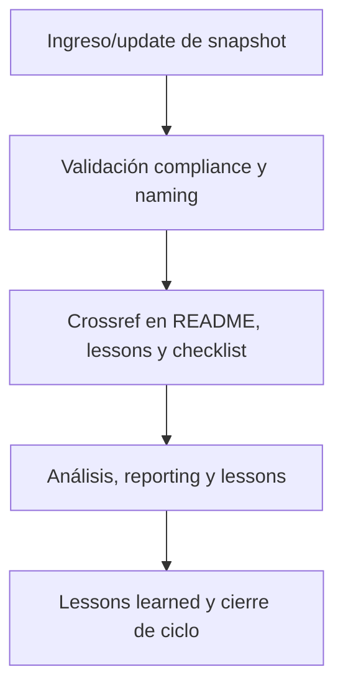

# 🖼️ core/kns/ai\_learn/shot/ — Snapshots de Entrenamiento/Aprendizaje (v3.2)

## 1. Descripción, función, objetivos y contexto

La carpeta `core/kns/ai_learn/shot/` centraliza **todos los snapshots históricos relevantes** de procesos de entrenamiento y aprendizaje, para auditoría, tracking y análisis incremental de cambios en los sistemas IA/humano de la plataforma AingZ/RwB.

### Funciones principales:

- Almacenar estados históricos (snapshots) de modelos, prompts, pipelines y experiencias de aprendizaje.
- Permitir rollback, tracking de progresos/regresiones y análisis comparativo en ciclos PDCA.
- Proveer soporte para auditoría, validación y reporting incremental.

### Integraciones y sistemas relacionados:

- Enlace directo con lessons, eval, training y migraciones (`ai_learn/`, `wf/`).
- Snapshots documentados deben alimentar procesos de mejora continua y reporting global.

## 2. Estructura interna

| Archivo/Subcarpeta   | Propósito                                    | Estado |
| -------------------- | -------------------------------------------- | ------ |
| snapshot\_modelo\_X/ | Estado histórico de modelo/prompt/training   | Activo |
| comparativas/        | Comparativas entre versiones/snapshots       | Activo |
| ...                  | Otros snapshots de entrenamiento/aprendizaje | Activo |

## 3. Metadatos y compliance

- **Versión:** v3.2 — 2025-08-06
- **Owner/Responsable:** AingZ\_Platform · RwB
- **Crossref obligatoria:** Blueprint, master plan, checklist, template universal README (ops/templates/)
- **Naming/Versionado:** Cumplimiento estricto de políticas RwB v3.2
- **Estado:** Activo

## 4. Ciclo de vida y flujos



## 5. Changelog local

- 2025-08-06: Versión v3.2, compliance snapshots de entrenamiento/aprendizaje.

## 6. Observaciones / Lessons learned

- Todos los snapshots deben estar versionados y documentados para auditoría y mejora continua.
- Mantener histórico actualizado y sincronizado con lessons, evaluaciones y training.

---

**FIN README core/kns/ai\_learn/shot/ v3.2**

## OutputTemplate
```yaml
CODE:
ID:
VERSION:
ROUTE:
CROSSREF:
AUTHOR:
DATE:
```
