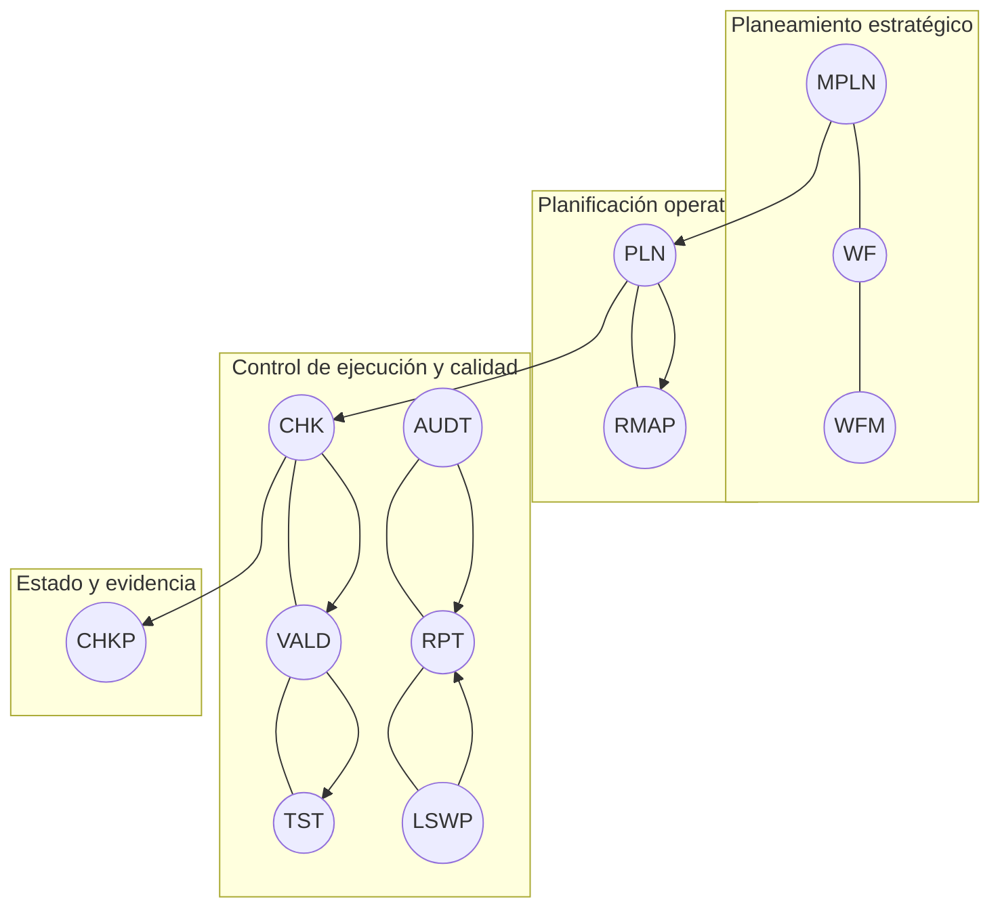

# Glosario CODE — V5 (MAIN)
> **Axioma**: cero ambigüedades. **Contrato antes que implementación.** Sin acoplar a rutas ni a docs externos.
> **Enfoque de uso**: ChatGPT (GPT‑5 Thinking), Codex, OpenAI API, GitHub Bot, VS Code, Python, Apps (Win/Web/Android).

---

## 0) Ruleset mínimo (cabecera obligatoria)
- **Naming**: `CODE` ≤ 5 chars, **SCREAMING_SNAKE**; `Name` **PascalCase**.
- **Unicidad**: `CODE` e `ID` únicos en todo el glosario.
- **Contrato (≤120 chars)**: qué garantiza y cómo se usa; no describe implementación.
- **Compatibilidad**: especificidades por entorno en `PlatformNotes` (`{GPT5:..., PY:...}`) cuando aplique.
- **Deprecación**: `Deprecated: true` + `ReplacedBy` + nota breve.
- **Crossref**: sólo **genérica** (alias/tema), nunca rutas.

<div align="right"><em>Sub-sección de feedback</em> — <strong>0.RULESET</strong>

<details><summary>Propuestas / dudas</summary>

- [ ] ¿Aumentar límite de contrato a 160 chars?
- [ ] ¿Agregar campo `Aliases` por entrada?
- [ ] ¿Fijar vocabulario permitido para `Status`?

</details>
</div>

---

## 1) Principios de semántica profesional
1. **Separación de responsabilidades**: cada término cubre un concepto **único** y atómico.
2. **Contratos claros**: entradas con I/O, efectos y límites **observables**.
3. **Interoperabilidad**: GPT‑5, Codex, API, GH Bot, VSC y Python comparten la misma semántica.
4. **Evolución controlada**: deprecaciones con reemplazos y **mapeo V2→V5**.
5. **Trazabilidad mínima**: `ID, CODE, Name, Contract, PlatformNotes`.

<div align="right"><em>Sub-sección de feedback</em> — <strong>1.PRINCIPIOS</strong>

<details><summary>Propuestas / dudas</summary>

- [ ] ¿Agregar principio de **idempotencia** explícito en WF y scripts?
- [ ] ¿Agregar principio de **observabilidad** (métricas y logs) a nivel global?

</details>
</div>

---

## A. RULESET (principios y control)
| ID | CODE | Name | Definición | Contract (≤120) | Deprecated | ReplacedBy | PlatformNotes |
|---|---|---|---|---|---|---|---|
| A01 | RULE | Ruleset | Marco normativo semántico universal | Rige naming/contratos/validación del glosario | false | — | — |
| A02 | LITW | LiteralWork | Barrido literal 100% sin inferencia | Garantiza trazado textual objetivable | false | — | — |
| A03 | CFG | Configuration | Parámetros operativos declarativos | Define límites/defaults por entorno | false | — | {PY: args; API: headers} |
| A04 | PKG | Package | Unidad empaquetada (release/dataset) | Exporta versión inmutable y firmada | false | — | — |
| A05 | BLN | Baseline | Snapshot de referencia de QA | Punto de comparación invariante | false | — | — |
| A06 | SPEC | SpecificExtension | Extensión contextual de reglas | Debe declarar alcance y overrides | false | — | — |

<div align="right"><em>Sub-sección de feedback</em> — <strong>A.RULESET</strong>

<details><summary>Propuestas / dudas</summary>

- [ ] Confirmar eliminación de `RWB/RWS` (neutralización de marca) → usar `SPEC`.
- [ ] ¿Agregar `POL` (Policy) o se infiere bajo `RULE`?

</details>
</div>

---

## B. IDENTIFICADORES (estructura lógica)
| ID | CODE | Name | Definición | Contract (≤120) | Deprecated | ReplacedBy | PlatformNotes |
|---|---|---|---|---|---|---|---|
| B01 | CTX | Context | Ámbito lógico de trabajo | Aglutina assets/estado con límites claros | false | — | — |
| B02 | LYR | Layer | Capa arquitectónica | Agrupa sin alterar semántica | false | — | — |
| B03 | DOM | Domain | Área funcional | Limita vocabulario y alcance | false | — | — |
| B04 | USC | UserScope | Alcance de privacidad/rol | Gobierna visibilidad/acciones | false | — | — |
| B05 | MOD | Module | Subsistema/microservicio | Interfaz estable y versionada | false | — | {PY: package; API: tag} |
| B06 | CAT | Category | Macro‑grupo funcional | Agrupa TSK/TRG afines | false | — | — |
| B07 | TSK | Task | Acción atómica | I/O definidos + código retorno | false | — | {PY: exit code} |
| B08 | TRG | Trigger | Disparador de acciones | Declarativo; sin ruta; ejecutable por agente | false | — | {GPT5: tool call} |
| B09 | VER | Version | Etiqueta SemVer | Mayor.Minor.Patch | false | — | — |
| B10 | STA | State | Estado (WIP/FINAL/ARCH) | Transiciones controladas | false | — | — |
| B11 | ID | Identifier | UID global | Inmutable por asset | false | — | — |
| B12 | TYP | Type | Tipo/formato | MIME/extensión | false | — | — |
| B13 | BK | Backup | Snapshot crítico | Restauración garantizada | false | — | — |
| B14 | ACTV | ActiveAsset | Activo vivo/actual | Elegible para ingest/uso | false | — | — |
| B15 | PURG | Purgatory | Área de obsoletos | No productivo; retención | false | — | — |
| B16 | DIFF | DiffAsset | Deltas entre versiones | Ayuda auditoría/rollback | false | — | — |
| B17 | TRG_AUDIT_TL | TriggerAuditTL | Disparador auditoría TL | Debe registrar evidencia | false | — | — |
| B18 | TRG_CONSOLIDATE_TL | TriggerConsolidateTL | Disparador consolidación TL | Ejecuta consolidación semántica | false | — | — |
| B19 | TRG_AUDIT_EXT_OFF | TriggerAuditExternalOfficial | Auditoría de assets externos | Evidencia formal | false | — | — |
| B20 | TRG_AUDIT_bk_temp | TriggerAuditBackup | Auditoría de respaldos | Abarca retención/restore | false | — | — |
| B21 | TRG_TRAIN_EXT_COM | TriggerTrainExternalCommunity | Entrenamiento comunidad externa | Curación de datos | false | — | — |
| B22 | TRG_AUDIT_LEGACY | TriggerAuditLegacy | Auditoría de archivos legacy | Plan de migración | false | — | — |
| B23 | TRG_PURGE_AI | TriggerPurgeAI | Purga de datos IA | Cumplimiento y minimización | false | — | — |

<div align="right"><em>Sub-sección de feedback</em> — <strong>B.IDENTIFICADORES</strong>

<details><summary>Propuestas / dudas</summary>

- [ ] ¿Mantener TRG_* en B o mover a D (control)?
- [ ] ¿Agregar `OWNR` (Ownership) como meta‑identificador?

</details>
</div>

---

## C. INSTRUCCIONES & PROCEDIMIENTOS
| ID | CODE | Name | Definición | Contract (≤120) | Deprecated | ReplacedBy | PlatformNotes |
|---|---|---|---|---|---|---|---|
| C01 | INS | InstructionSet | Conjunto de directrices | Orienta conducta; no ejecuta | false | — | — |
| C02 | ENV | EnvInstruction | Instrucción por entorno | Ajustes por plataforma | false | — | {API: rate limits} |
| C03 | HIE | HierInstruction | Instrucción por jerarquía | Rol/capa‑específica | false | — | — |
| C04 | PRC | ProcInstruction | Procedimiento paso a paso | Ejecutable por humano/agente | false | — | {GPT5: steps} |
| C05 | WK | WorkflowKnowledge | Loop de aprendizaje/logging | Persistencia post‑run | false | — | — |
| C06 | WKP | WorkflowKnowledgeProject | Variante WK para onboarding | Inicialización asistida | false | — | — |

<div align="right"><em>Sub-sección de feedback</em> — <strong>C.INSTRUCCIONES</strong>

<details><summary>Propuestas / dudas</summary>

- [ ] ¿Agregar `SOP` como alias de `PRC`?
- [ ] ¿Separar `ENV` (dev/prod) con taxonomía fija?

</details>
</div>

---

## D. WORKFLOW — Planeamiento, Desarrollo y Control (reorganizado)
**Jerarquía por objetivos**
- **N1 • Planeamiento estratégico**: `MPLN`, `WF`, `WFM`
- **N2 • Planificación operativa**: `PLN`, `RMAP`
- **N3 • Control de ejecución y calidad**: `CHK`, `VALD`, `TST`, `AUDT`, `LSWP`, `RPT`
- **N4 • Estado y evidencia**: `CHKP`



### D.1 N1 — Planeamiento estratégico
| CODE | Name | Objetivo | Contract | Relaciones | Crossref genérico |
|---|---|---|---|---|---|
| MPLN | MasterPlan | Definir objetivos macro/criterios de éxito | Fuente de verdad de objetivos y supuestos | parent: CTX; children: PLN | OBJETIVOS |
| WF | Workflow | Orquestar procesos para cumplir objetivos | Secuencia determinista sin efectos colaterales | peers: WFM | PROCESOS |
| WFM | WorkflowMacro | Encadenar múltiples WF coherentes | Preserva invariantes globales | parent: WF | PROCESOS |

### D.2 N2 — Planificación operativa
| CODE | Name | Objetivo | Contract | Relaciones | Crossref genérico |
|---|---|---|---|---|---|
| PLN | Plan | Convertir objetivos en entregables/cronograma | Tareas con dueño/fecha/criterios | parent: MPLN; peers: RMAP | OBJETIVOS, PROCESOS |
| RMAP | Roadmap | Ordenar hitos y dependencias | Visible, medible, revisable | parent: PLN | OBJETIVOS |

### D.3 N3 — Control de ejecución y calidad
| CODE | Name | Objetivo | Contract | Relaciones | Crossref genérico |
|---|---|---|---|---|---|
| CHK | Checklist | Validar requisitos/aceptación | Criterios observables y trazables | parent: PLN | CALIDAD |
| VALD | Validation | Verificar conformidad técnica | Pass/Fail + métricas | derives: CHK | CALIDAD |
| TST | Test | Probar componentes o flujos | Exit codes claros y datos de prueba | derives: VALD | CALIDAD |
| AUDT | Audit | Auditar proceso/resultados | Evidencias y hallazgos accionables | on: WF/PLN/RMAP/CHK | TRANSPARENCIA |
| LSWP | LiteralSweep | Barrer evidencia textual 100% | Registro literal sin inferencia | on: WF/PLN/RMAP/CHK | TRANSPARENCIA |
| RPT | Report | Consolidar resultados/estado | Síntesis, KPIs y decisiones | from: VALD/TST/AUDT/LSWP | COMUNICACION |

### D.4 N4 — Estado y evidencia
| CODE | Name | Objetivo | Contract | Relaciones | Crossref genérico |
|---|---|---|---|---|---|
| CHKP | Checkpoint | Congelar estado en un punto de control | Snapshot reproducible y fechado | from: CHK | EVIDENCIAS |

<div align="right"><em>Sub-sección de feedback</em> — <strong>D.WORKFLOW</strong>

<details><summary>Propuestas / dudas</summary>

- [ ] ¿Mover triggers TRG_* a esta sección como "mecanismos de control"?
- [ ] ¿Agregar `RETRO` (Retrospective) como práctica de cierre?

</details>
</div>

---

## E. LOGS & TRAZABILIDAD
| ID | CODE | Name | Definición | Contract (≤120) | Deprecated | ReplacedBy | PlatformNotes |
|---|---|---|---|---|---|---|---|
| E01 | LOG | Log | Registro cronológico de eventos | Append‑only | false | — | — |
| E02 | BIT | Logbook | Bitácora extendida | Contexto narrativo y decisiones | false | — | — |
| E03 | CHG | Changelog | Historial de cambios | Semántico; auditable | false | — | — |
| E04 | TRC | Trace | Trazabilidad cruzada | IDs enlazados | false | — | — |
| E05 | XRF | CrossRef | Referencias cruzadas | Usar alias, nunca rutas | false | — | — |
| E06 | ADT | AuditLog | Log de auditoría | Pruebas + resultados | false | — | — |
| E07 | VALOG | ValidationLog | Log de QA/tests | Artefactos reproducibles | false | — | — |

<div align="right"><em>Sub-sección de feedback</em> — <strong>E.LOGS</strong>

<details><summary>Propuestas / dudas</summary>

- [ ] ¿Estandarizar formato de IDs de log (prefijo por sección)?
- [ ] ¿Agregar severidades y categorías mínimas?

</details>
</div>

---

## F. DOCUMENTACIÓN & ASSETS
| ID | CODE | Name | Definición | Contract (≤120) | Deprecated | ReplacedBy | PlatformNotes |
|---|---|---|---|---|---|---|---|
| F01 | DOC | Documentation | Documento técnico base | Legible por humano/agente | false | — | — |
| F02 | RDM | Readme | README principal/local | Onboarding + contrato | false | — | — |
| F03 | RDM_H | ReadmeHuman | README visual/humano | Puede incluir gráficos | false | — | — |
| F04 | RDM_AI | ReadmeAI | Prompt set IA | Ingesta/validación por agente | false | — | {GPT5: system} |
| F05 | TXT | TextDoc | Documento textual | Plano, sin metadatos extra | false | — | — |
| F06 | IMG | ImageDoc | Imagen/diagrama | Fuente o export | false | — | — |
| F07 | VID | VideoDoc | Video demo | No fuente de verdad | false | — | — |
| F08 | AUD | AudioDoc | Nota de voz/audio | Transcripción opcional | false | — | — |
| F09 | LIB | LibraryRef | Referencia externa | Citable | false | — | — |
| F10 | PAP | Paper | Artículo científico | Citable | false | — | — |
| F11 | OWN | OwnDoc | Documento interno | Controlado | false | — | — |
| F12 | DRAFT | DraftDoc | Documento en edición | No estable | false | — | — |
| F13 | FINAL | FinalDoc | Documento aprobado | Congelado | false | — | — |
| F14 | NB | Notebook | Jupyter/Colab | Ejecutable | false | — | {PY: ipynb} |
| F15 | MD | Markdown | Documento MD base | Render estándar | false | — | — |
| F16 | TMP | Template | Plantilla reusable | Campos obligatorios | false | — | — |

<div align="right"><em>Sub-sección de feedback</em> — <strong>F.DOCS</strong>

<details><summary>Propuestas / dudas</summary>

- [ ] ¿Agregar `SCHEMA` para contratos JSON/YAML?
- [ ] ¿Separar `RDM` por niveles (root/local)?

</details>
</div>

---

## G. SCRIPTS
| ID | CODE | Name | Definición | Contract (≤120) | Deprecated | ReplacedBy | PlatformNotes |
|---|---|---|---|---|---|---|---|
| G01 | SCR | Script | Ejecutable puntual | Side‑effects controlados | false | — | {PY: .py; SH: .sh} |
| G02 | PIPE | PipelineScript | ETL/flujo de datos | Idempotente | false | — | — |
| G03 | TSTSC | TestScript | Conjunto de tests | Retorna exit codes | false | — | — |
| G04 | INTG | IntegrationScript | Integración/CI/CD | Sin credenciales acopladas | false | — | — |
| G05 | PRCSC | ProcessingScript | Procesamiento batch | Entradas explícitas | false | — | — |
| G06 | CMD | CommandScript | Script de comandos | Portabilidad básica | false | — | — |

<div align="right"><em>Sub-sección de feedback</em> — <strong>G.SCRIPTS</strong>

<details><summary>Propuestas / dudas</summary>

- [ ] ¿Agregar `SVC` para servicios/daemons largos?
- [ ] ¿Unificar resultado estándar: `{status:int, log:list}`?

</details>
</div>

---

## H. MATRICES
| ID | CODE | Name | Definición | Contract (≤120) | Deprecated | ReplacedBy | PlatformNotes |
|---|---|---|---|---|---|---|---|
| H01 | MTR | Matrix | DataFrame/tabla | Export CSV/JSON | false | — | — |
| H02 | MAPX | MappingMatrix | Tabla de correspondencias | Uni/bidireccional | false | — | — |
| H03 | REL | RelationMatrix | Correlaciones | Metodología explícita | false | — | — |
| H04 | INM | InputMatrix | Datos de entrada | Validación previa | false | — | — |
| H05 | OUTM | OutputMatrix | Resultados | Firma y checksum | false | — | — |
| H06 | VALM | ValidationMatrix | QA matrix | Reglas y métricas | false | — | — |
| H07 | VRS | VersusMatrix | Comparativa "versus" | Criterios trazables | false | — | — |
| H08 | TBL | TableSimple | Tabla simple | Sin fórmulas | false | — | — |

<div align="right"><em>Sub-sección de feedback</em> — <strong>H.MATRICES</strong>

<details><summary>Propuestas / dudas</summary>

- [ ] ¿Agregar `DSGN` para matrices de diseño de pruebas?

</details>
</div>

---

## I. CONOCIMIENTO VIVO
| ID | CODE | Name | Definición | Contract (≤120) | Deprecated | ReplacedBy | PlatformNotes |
|---|---|---|---|---|---|---|---|
| I01 | KNS | Knowledge | Núcleo de saberes | Fuente de verdad | false | — | — |
| I02 | MEM | ContextMemory | Memoria contextual | Persistente por proyecto | false | — | — |
| I03 | NOTE | Note | Nota breve | No normativa | false | — | — |
| I04 | DTL | DetailNote | Nota técnica detallada | Puede referenciar ensayos | false | — | — |
| I05 | GLOS | Glossary | Este documento | Autoridad semántica | false | — | — |
| I06 | PREF | Preferences | Config personales | No obligatoria | false | — | — |
| I07 | LEARN | Learning | Registro de aprendizajes | Mejora continua | false | — | — |
| I08 | INSI | Insight | Hallazgo estratégico | Accionable | false | — | — |
| I09 | BRAIN | Brainstorm | Lluvia de ideas | No vinculante | false | — | — |
| I10 | IDEA | IdeaDraft | Idea en borrador | Evolutiva | false | — | — |
| I11 | KNX | KnowledgeExtract | Extracto aplicado | Usable por agentes | false | — | — |

<div align="right"><em>Sub-sección de feedback</em> — <strong>I.KNOWLEDGE</strong>

<details><summary>Propuestas / dudas</summary>

- [ ] ¿Separar `INSI` por severidad/prioridad?
- [ ] ¿Agregar `DEC` (Decision) como artefacto explícito?

</details>
</div>

---

## J. Plataformas (compatibilidad mínima)
| Plataforma | Clave | Notas semánticas |
|---|---|---|
| ChatGPT · GPT‑5 Thinking | GPT5 | Tools/func‑calling; tags por CODE/TRG |
| ChatGPT · Codex | CODEX | Generación/edición de código |
| OpenAI API | OPENAI_API | `responses.tools`, `json_schema` |
| GitHub Bot | GH_BOT | Comentarios/labels con CODE/TRG |
| VS Code | VSC | Naming de archivos y módulos |
| Python | PY | Paquetes, exit codes, typing |
| Apps (Win/Web/Android) | APP | UI labels y acciones derivadas |

<div align="right"><em>Sub-sección de feedback</em> — <strong>J.PLATAFORMAS</strong>

<details><summary>Propuestas / dudas</summary>

- [ ] ¿Agregar `CLI` como plataforma explícita?

</details>
</div>

---

## K. Mapeo V2→V5 (resumen)
> El mapeo V2→V5 completo se edita de forma interactiva en el canvas: **GLOS_V5_Mapping_Interactive.jsx** (export JSON/CSV).

**Cambios clave ya integrados en V5**
- `RWB` → **deprecado** y **mapeado** en `RULE` (neutralización de marca).
- `RWS` → **SPEC** (extensiones específicas neutrales).
- `WF_M` → **WFM** (sin separador).
- `WK_P` → **WKP** (sin separador).
- `J02 PIPE` (estructura) → **PLINE** (*PipelineStruct*) para evitar colisión con `G02 PIPE` (script).

<div align="right"><em>Sub-sección de feedback</em> — <strong>K.MAPEO</strong>

<details><summary>Propuestas / dudas</summary>

- [ ] ¿Agregar columna `Rationale` obligatoria en export?
- [ ] ¿Bloquear códigos con números (p.ej. `A1`)?

</details>
</div>

---

## Panel de feedback global (resumen)
- **Estado**: working (RC‑2).
- **Backlog de ajustes**: ver sub‑secciones de cada capítulo.
- **Fuente de propuestas**: UI interactiva de mapeo (canvas) + comentarios en este documento.

---

## OutputTemplate (obligatorio)
```yaml
output_example:
  status: WORKING
  id_asset: glosario_code_v5_main
  generated_by: ai
  created_at: 2025-08-12T00:00:00-03:00
  params:
    - scope: generic
    - coupling: none (no routes)
  result:
    - sections: [A,B,C,D,E,F,G,H,I,J,K]
    - feedback_slots: enabled
  log:
    - step1: scaffold_v5_main
    - step2: reorganize_D
    - step3: integrate_v2_items
```

