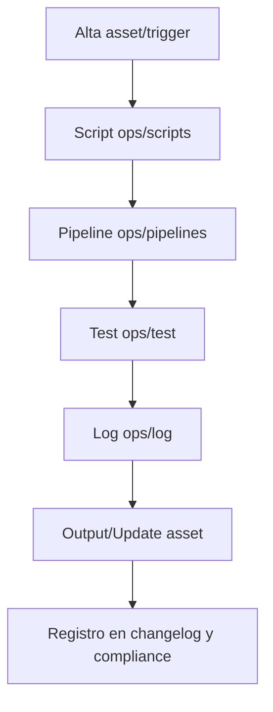

---

## file: ops/templates/readme/README\_TEMPLATE\_V5\_1.md code: RDM name: ReadmeTemplateV5 version: v5.1 date: 2025-08-14 owner: AingZ\_Platform · RwB status: draft xrf: blueprint: BLP\_* mplan: MPLN** roadmap: RDM** rules: - RULES** - core/rulset/RULE\_NAMING\_METADATA\_CROSSREF\_V1.md checklist: CHK** adr: ADR\_0001** cfg: CFG**.yaml triggers: [TRG\_CONSOLIDATE\_TL, TRG\_QA\_GATES, TRG\_AUDIT\_LEGACY, TRG\_PURGE\_AI] chg: CHG\_main.md#readme** chk: CHK\_root.md#readme*\_

# &#x20;— README ()

> **Modo**: `<root|module|RDM_H|RDM_AI>` · **Arquitectura**: `<ARCH>`\
> Fuente de verdad para onboarding, contratos, auditorías y cross-refs vivos.

---

## 0) Panel rápido de edición (dinámico)

> ⚙️ Rellená estos campos y usalos como variables en el resto del doc.

- **ARCH (alias arquitectura)**: `<ARCH>`
- **VER (versión)**: `<VER>`
- **OWNER**: `<Owner|Team>`
- **FOLDER (ruta absoluta)**: `<ruta/absoluta/del/folder>`
- **ENTRYPOINT/COMANDO**: `<cmd principal>`

**Badges (opcionales)**

```
[](<url_ci_run>) [](<url_cov_report>) [](<url_lint_report>)
```

---

## Índice

- [1) Propósito](#1-propósito)
- [2) Alcance & Supuestos](#2-alcance--supuestos)
- [3) Estructura](#3-estructura)
- [4) Configuración](#4-configuración)
- [5) Quick Start / Onboarding](#5-quick-start--onboarding)
- [6) Uso (operativo)](#6-uso-operativo)
- [7) Interfaces & Contratos](#7-interfaces--contratos)
- [8) Calidad & KPIs](#8-calidad--kpis)
- [9) Auditorías automáticas — listas dinámicas](#9-auditorías-automáticas--listas-dinámicas)
- [10) Funciones principales del módulo](#10-funciones-principales-del-módulo)
- [11) Observabilidad & Registro](#11-observabilidad--registro)
- [12) Seguridad & Datos](#12-seguridad--datos)
- [13) Versionado & Releases](#13-versionado--releases)
- [14) ADRs & Decisiones](#14-adrs--decisiones)
- [15) Crossref (links editables)](#15-crossref-links-editables)
- [16) Crossref ](#16-crossref-dinámico-instrucciones-de-pipeline)[**dinámico**](#16-crossref-dinámico-instrucciones-de-pipeline)[ (instrucciones de pipeline)](#16-crossref-dinámico-instrucciones-de-pipeline)
- [17) Compliance & Governance](#17-compliance--governance)
- [18) Integraciones & sistemas relacionados](#18-integraciones--sistemas-relacionados)
- [19) Flujos (mermaid opcional)](#19-flujos-mermaid-opcional)
- [20) Roadmap & TODO](#20-roadmap--todo)
- [21) Snapshot de assets & huellas](#21-snapshot-de-assets--huellas)
- [22) Triggers activos](#22-triggers-activos)
- [23) Changelog (local)](#23-changelog-local)
- [Bloque IA / ingestión automática](#bloque-ia--ingestión-automática)
- [OutputTemplate (obligatorio)](#outputtemplate-obligatorio)

---

## 1) Propósito

\<qué es este folder/módulo y por qué existe — 2/3 líneas de negocio y técnica>

## 2) Alcance & Supuestos

- Público objetivo: \<devs, ops, data, producto>
- Límites: \<qué incluye / qué no incluye>
- Premisas: <1 dev, contenedores, CI/CD repo-based, bajo costo, etc.>

## 3) Estructura

```text
<pegar árbol real del folder o generar con:>
# Linux/Mac:  tree -L 3 -I ".git|.venv|__pycache__" > structure.txt
# Windows:    dir /s /b > structure.txt
```

## 4) Configuración

- Variables: `.env` (claves mínimas) + `CFG_<ARCH>_<VER>.yaml` (puertos, storage, colas, secrets).
- Requisitos: Python <3.12/3.13>, ruff, mypy, pytest, import-linter.
- Setup rápido:
  1. Crear venv e instalar deps
  2. Completar `CFG_<ARCH>_<VER>.yaml` y `.env`
  3. Sanity: `python -m pip list` / `ruff --version`

## 5) Quick Start / Onboarding

```bash
# 1. Clonar repo raíz (con submódulos si aplica)
$ git clone --recurse-submodules <repo>
# 2. Navegar
$ cd <ruta>
# 3. Ejecutar scripts/pipelines clave
$ ls ops/scripts/
$ bash ops/scripts/<script>.sh
```

- **VS Code:** F1 → *Open Workspace* → `<workspace>.code-workspace`
- **Obsidian:** Abrir vault, filtrar backlinks a este folder.

## 6) Uso (operativo)

- Comandos frecuentes:
  - `ruff .` · `mypy .` · `pytest -q`
  - `import-linter -c arch_contracts.toml`
  - `<tu comando principal o script>`
- Ejemplo:
  ```bash
  uv run -m src.<arch>.<entry> --cfg ops/configs/CFG_<ARCH>_<VER>.yaml
  ```

## 7) Interfaces & Contratos

- **Puertos**: LLM, Tools, Repos/DB, Queue, Storage (Protocol/ABC).
- **Eventos**: versionados, idempotencia, outbox/DLQ, reintentos.
- **Dependencias externas**: BD, cache, mensajería, storage, IA vía adaptadores.

## 8) Calidad & KPIs

- **KPIs**: p95 < X s · p99 < Y s · MTTR < Z h · DLQ=0 · cobertura ≥ C%.
- **QA (obligatorio)**: lints, tipos, tests, contratos de arquitectura.
- **Definición de listo**: CI en verde + checklist del módulo sin gaps.

---

## 9) Auditorías automáticas — *listas dinámicas*

> Bloques reservados para herramientas que escriben resultados automáticamente.

### 9.1 Gate — **Version-Gate**

-

### 9.2 Gate — **SOLID-Gate** (contratos y acoplamientos)

-

### 9.3 Gate — **QA-Gate** (calidad)

-

### 9.4 Gate — **Perf/Cost-Gate** (presupuestos)

-

### 9.5 Gate — **Security/Data-Gate**

-

### 9.6 Resultados de auditorías (tabla autogenerable)

| Check       | Herramienta   | Resultado | Reporte | Fecha      |
| ----------- | ------------- | --------- | ------- | ---------- |
| Lint        | ruff          | TODO      |         | YYYY-MM-DD |
| Tipos       | mypy          | TODO      |         | YYYY-MM-DD |
| Tests       | pytest        | TODO      |         | YYYY-MM-DD |
| Arch        | import-linter | TODO      |         | YYYY-MM-DD |
| SAST        | bandit        | TODO      |         | YYYY-MM-DD |
| Licencias   | pip-licenses  | TODO      |         | YYYY-MM-DD |
| SBoM        | cyclonedx     | TODO      |         | YYYY-MM-DD |
| Secret scan | gitleaks      | TODO      |         | YYYY-MM-DD |
| Links       | lychee        | TODO      |         | YYYY-MM-DD |

> Los bloques `AUTO-*` pueden ser sobreescritos por pipelines. Mantener las marcas.

---

## 10) Funciones principales del módulo

> Describí las funciones/servicios clave y **proponé ediciones**. Dejá notas inline para que el asistente las procese.

| Función/Servicio | Descripción actual | Entradas   | Salidas     | Riesgos     | Owner |
| ---------------- | ------------------ | ---------- | ----------- | ----------- | ----- |
| `<fn_1>`         | `<qué hace>`       | `<inputs>` | `<outputs>` | `<riesgos>` | `<@>` |
| `<fn_2>`         | `<qué hace>`       | `<inputs>` | `<outputs>` | `<riesgos>` | `<@>` |

**Propuesta de edición (notas para el asistente)**

```notes-to-ai
# CONTEXTO
<qué mejorar, objetivo>

# CAMBIOS PROPUESTOS (bullets)
- [ ] <cambio 1>
- [ ] <cambio 2>

# IMPACTO / RIESGOS
<riesgos, mitigaciones>

# DECISIÓN
<pending|approved|rejected>
```

> También podés usar un bloque `diff` si preferís:

```diff
- descripción actual
+ descripción propuesta
```

---

## 11) Observabilidad & Registro

- Logs: niveles y formato (json/plain).
- Métricas: básicas del módulo (tps, errores, latencias).
- Tracing: propagación y correlación (trace/span/idempotency\_key).

## 12) Seguridad & Datos

- Manejo de secretos por `.env` / vault (no commitear).
- Política de datos: qué se guarda, retención, PII/SPI, borrado seguro.

## 13) Versionado & Releases

- SemVer interno; tags/branches; notas de versión.
- Migraciones (si aplica): path y reversión.

## 14) ADRs & Decisiones

- **Última ADR** relevante: `core/doc/adr/ADR_0001_<ARCH>_<VER>.md`
- Cambios locales:&#x20;
- Pendientes de decisión:&#x20;

## 15) Crossref (links editables)

> Editá los links en esta tabla. El campo `Val` es para confirmación manual o la salida de un verificador.

| Recurso     | Ruta/URL       | Val        | Notas |
| ----------- | -------------- | ---------- | ----- |
| Blueprint   | `<ruta o url>` | [ ] válido |       |
| Master Plan | `<ruta o url>` | [ ] válido |       |
| Roadmap     | `<ruta o url>` | [ ] válido |       |
| RuleSet     | `<ruta o url>` | [ ] válido |       |
| Checklist   | `<ruta o url>` | [ ] válido |       |
| Config      | `<ruta o url>` | [ ] válido |       |
| ADR-0001    | `<ruta o url>` | [ ] válido |       |

## 16) Crossref **dinámico** (instrucciones de pipeline)

> Para agentes IA/CI y humanos: procedimiento estándar de barrido y actualización de enlaces.

1. Barrido completo del repo (walk) y detección de rutas reales de **blueprint, master plan, prompt Codex, ruleset y ADR**.
2. Actualizar la **tabla Crossref** de este README y de todos los README afectados.
3. Registrar cambios en `ops/changelog.md` y `ops/lessons_learned.md`.
4. Revalidar con `lychee`/`md-check` y marcar `Val`.

## 17) Compliance & Governance

| Área       | Regla                       | Fuente         |
| ---------- | --------------------------- | -------------- |
| Naming     | `naming_universal`          | Blueprint §2.2 |
| Versionado | SemVer (`v<major>.<minor>`) | Blueprint §1.3 |
| Testing    | `ops/test/`                 | Master Plan §3 |
| Scripts    | `ops/scripts/`              | Blueprint §4   |

## 18) Integraciones & sistemas relacionados

- Sincronización con `data/dicts/` (glosarios, triggers, taxonomías).
- Interfaz con `wf/` (workflows, auditorías, migraciones).
- Pipelines `ops/` para QA y onboarding.

## 19) Flujos (mermaid opcional)



## 20) Roadmap & TODO

-

## 21) Snapshot de assets & huellas

| Asset    | Ruta     | Hash/Commit | Tamaño | Fecha        |
| -------- | -------- | ----------- | ------ | ------------ |
| `<file>` | `<ruta>` | `<sha>`     | `<KB>` | `YYYY-MM-DD` |

## 22) Triggers activos

- `TRG_AUDIT_LEGACY` · `TRG_CONSOLIDATE_TL` · `TRG_PURGE_AI` · `TRG_QA_GATES`

## 23) Changelog (local)

- YYYY-MM-DD — init —  —&#x20;
- YYYY-MM-DD —  —  —&#x20;

---

## Bloque IA / ingestión automática

```yaml
bucket: <bucket>
version: <VER>
updated: <YYYY-MM-DD>
blueprint_ref: <ruta>
master_plan_ref: <ruta>
prompt_codex_ref: <ruta>
ruleset_ref:
  - <ruta>
  - <ruta>
triggers:
  - TRG_AUDIT_LEGACY
  - TRG_CONSOLIDATE_TL
  - TRG_PURGE_AI
note: "Validar crossref dinámico y realizar barrido 100% repo tras cada ciclo."
```

---

## OutputTemplate (obligatorio)

```yaml
output_example:
  status: OK
  generated_by: ai
  created_at: <YYYY-MM-DDThh:mm:ss-03:00>
  params:
    - arch: <ARCH>
    - ver: <VER>
    - mode: <root|module|RDM_H|RDM_AI>
    - folder: <ruta/absoluta/del/folder>
  result:
    - readme_ready: true
  log:
    - step1: authoring
    - step2: crossref_links
    - step3: qa_gates
```

