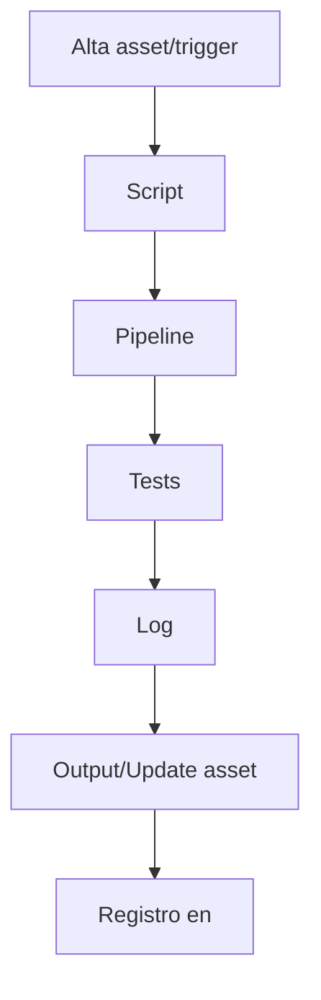

# <TITLE> — README (<VER>)

> **Modo**: `<root|module|RDM_H|RDM_AI>` · **Arquitectura**: `<ARCH>`  
> Plantilla **universal** (no acoplada a rutas ni nombres). Usar solo **placeholders**.

---

## 0) Panel rápido de edición (dinámico)

> ⚙️ Rellená estos campos; podés referenciarlos en todo el documento.

- **ARCH**: `<ARCH>`  
- **VER**: `<VER>`  
- **OWNER**: `<Owner|Team>`  
- **NAMESPACE/MÓDULO**: `<NAMESPACE>`  
- **ENTRYPOINT/COMANDO**: `<ENTRY_CMD>`  
- **FOLDER**: `<ABSOLUTE_OR_RELATIVE_FOLDER>`

**Badges (opcionales)**

```
[](<URL_CI_RUN>) [](<URL_COV_REPORT>) [](<URL_LINT_REPORT>)
```

> **Nota**: todos los campos entre `<>` son editables y **no** deben contener rutas fijas de la repo.

---

## Índice
- [1) Propósito](#1-propósito)
- [2) Alcance & Supuestos](#2-alcance--supuestos)
- [3) Estructura](#3-estructura)
- [4) Configuración](#4-configuración)
- [5) Quick Start / Onboarding](#5-quick-start--onboarding)
- [6) Uso (operativo)](#6-uso-operativo)
- [7) Interfaces & Contratos](#7-interfaces--contratos)
- [8) Calidad & KPIs](#8-calidad--kpis)
- [9) Auditorías automáticas — listas dinámicas](#9-auditorías-automáticas--listas-dinámicas)
- [10) Funciones principales del módulo](#10-funciones-principales-del-módulo)
- [11) Observabilidad & Registro](#11-observabilidad--registro)
- [12) Seguridad & Datos](#12-seguridad--datos)
- [13) Versionado & Releases](#13-versionado--releases)
- [14) ADRs & Decisiones](#14-adrs--decisiones)
- [15) Crossref (links editables)](#15-crossref-links-editables)
- [16) Crossref dinámico (instrucciones)](#16-crossref-dinámico-instrucciones)
- [17) Compliance & Governance](#17-compliance--governance)
- [18) Integraciones & sistemas relacionados](#18-integraciones--sistemas-relacionados)
- [19) Flujos (mermaid opcional)](#19-flujos-mermaid-opcional)
- [20) Roadmap & TODO](#20-roadmap--todo)
- [21) Snapshot de assets & huellas](#21-snapshot-de-assets--huellas)
- [22) Triggers activos](#22-triggers-activos)
- [23) Changelog (local)](#23-changelog-local)
- [Bloque IA / ingestión automática](#bloque-ia--ingestión-automática)
- [OutputTemplate (obligatorio)](#outputtemplate-obligatorio)

---

## 1) Propósito
<qué es este folder/módulo y por qué existe — 2/3 líneas de negocio y técnica>

## 2) Alcance & Supuestos
- Público objetivo: <devs, ops, data, producto>
- Límites: <qué incluye / qué no incluye>
- Premisas: <1 dev, contenedores, CI/CD repo-based, bajo costo, etc.>

## 3) Estructura
```text
# Generá el árbol del folder actual con la herramienta de tu SO
# Ejemplos:
# * Unix-like (si disponés de `tree`):  tree -L 3 > structure.txt
# * PowerShell: Get-ChildItem -Recurse | Out-File structure.txt
```

## 4) Configuración
- Variables: `<ENV_FILE_REF>` (claves mínimas) + `<CONFIG_REF>` (puertos, storage, colas, secrets).  
- Requisitos: `<RUNTIME_REQS>` (ej.: Python <3.12/3.13>) y `<QA_TOOLS>` (ej.: linter, tipos, tests, contratos).  
- Setup rápido:
  1) Crear entorno e instalar dependencias (`<ENV_CREATE_CMD>` / `<DEPS_INSTALL_CMD>`)
  2) Completar `<CONFIG_REF>` y `<ENV_FILE_REF>`
  3) Sanity: `<RUNTIME_VERSION_CMD>` / `<LINTER_VERSION_CMD>`

## 5) Quick Start / Onboarding
```bash
# 1. Obtener el repo
$ git clone <REPO_URL>
# 2. Navegar
$ cd <RELATIVE_PATH>
# 3. Ejecutar comandos/pipelines clave
$ <RUN_SCRIPT_OR_PIPELINE>
```
- IDE/Editor: abrir `<WORKSPACE_FILE_OR_DIR>`  
- Documentación vinculada: revisar backlinks a `<FOLDER>`.

## 6) Uso (operativo)
- Comandos frecuentes (ejemplos; sustituir por tus herramientas):
  - `<LINTER_CMD>` · `<TYPECHECK_CMD>` · `<TEST_CMD>`
  - `<ARCH_CONTRACTS_CMD>`
  - `<MAIN_RUN_CMD>`
- Ejemplo genérico:
  ```bash
  <RUNTIME_BIN> -m <ENTRY_MODULE> --cfg <CONFIG_REF>
  ```

## 7) Interfaces & Contratos
- **Puertos**: LLM, Tools, Repos/DB, Queue, Storage (Protocol/ABC).  
- **Eventos**: versionados, idempotencia, outbox/DLQ, reintentos.  
- **Dependencias externas**: BD, cache, mensajería, storage, IA vía adaptadores.

## 8) Calidad & KPIs
- **KPIs**: p95 < X s · p99 < Y s · MTTR < Z h · DLQ=0 · cobertura ≥ C%.  
- **QA (obligatorio)**: lints, tipos, tests, contratos de arquitectura.  
- **Definición de listo**: CI en verde + checklist del módulo sin gaps.

---

## 9) Auditorías automáticas — *listas dinámicas*
> Bloques reservados para herramientas que escriben resultados automáticamente.

### 9.1 Gate — **Version-Gate**
<!-- AUTO-VERSION-GATE:BEGIN -->
- [ ] `version` en front-matter coincide con `<VER>` esperado
- [ ] `date` actualizado (YYYY-MM-DD)
- [ ] Tag/release creado para `<VER>`
- [ ] `ROUTE` documentada en **Bloque IA**
<!-- AUTO-VERSION-GATE:END -->

### 9.2 Gate — **SOLID-Gate**
<!-- AUTO-SOLID-GATE:BEGIN -->
- [ ] DIP: dependencias **solo** vía puertos
- [ ] ISP: interfaces pequeñas (<5 métodos)
- [ ] SRP: una responsabilidad por módulo
- [ ] OCP: extensión por config/registro, sin tocar core
- [ ] LSP: tests de sustitución por adaptador pasando
<!-- AUTO-SOLID-GATE:END -->

### 9.3 Gate — **QA-Gate**
<!-- AUTO-QA-GATE:BEGIN -->
- [ ] Linter — **OK** | **WARN** | **FAIL**
- [ ] Type-check — **OK** | **WARN** | **FAIL**
- [ ] Tests — **OK** | **WARN** | **FAIL** — coverage: `<%>`
- [ ] Contratos de arquitectura — **OK** | **WARN** | **FAIL**
- [ ] SAST — **OK** | **WARN** | **FAIL**
- [ ] Licencias — **OK** | **WARN** | **FAIL**
- [ ] SBoM — **OK** | **WARN** | **FAIL**
- [ ] Secret scan — **OK** | **WARN** | **FAIL**
- [ ] Dead links — **OK** | **WARN** | **FAIL**
<!-- AUTO-QA-GATE:END -->

### 9.4 Gate — **Perf/Cost-Gate**
<!-- AUTO-PERF-GATE:BEGIN -->
- [ ] p95 < `X` s | p99 < `Y` s
- [ ] uso memoria < `MB` | CPU < `%`
- [ ] latencia proveedor IA dentro de SLA
- [ ] costo por unidad/operación dentro de presupuesto
<!-- AUTO-PERF-GATE:END -->

### 9.5 Gate — **Security/Data-Gate**
<!-- AUTO-SEC-GATE:BEGIN -->
- [ ] `<ENV_FILE_REF>` y secretos no versionados
- [ ] Retención de datos documentada
- [ ] PII/SPI — clasificación hecha y políticas aplicadas
- [ ] Borrado seguro — procedimientos definidos
<!-- AUTO-SEC-GATE:END -->

### 9.6 Resultados de auditorías (tabla autogenerable)

| Check | Herramienta | Resultado | Reporte | Fecha |
|---|---|---|---|---|
| Lint | <TOOL> | TODO | <URL>| YYYY-MM-DD |
| Tipos | <TOOL> | TODO | <URL>| YYYY-MM-DD |
| Tests | <TOOL> | TODO | <URL>| YYYY-MM-DD |
| Arch | <TOOL> | TODO | <URL>| YYYY-MM-DD |
| SAST | <TOOL> | TODO | <URL>| YYYY-MM-DD |
| Licencias | <TOOL> | TODO | <URL>| YYYY-MM-DD |
| SBoM | <TOOL> | TODO | <URL>| YYYY-MM-DD |
| Secret scan | <TOOL> | TODO | <URL>| YYYY-MM-DD |
| Links | <TOOL> | TODO | <URL>| YYYY-MM-DD |

> Los bloques `AUTO-*` pueden ser sobreescritos por pipelines. Mantener las marcas.

---

## 10) Funciones principales del módulo
> Describí las funciones/servicios clave y **proponé ediciones**. Dejás notas inline para que el asistente las procese.

| Función/Servicio | Descripción actual | Entradas | Salidas | Riesgos | Owner |
|---|---|---|---|---|---|
| `<FN_1>` | `<qué hace>` | `<inputs>` | `<outputs>` | `<riesgos>` | `<@>` |
| `<FN_2>` | `<qué hace>` | `<inputs>` | `<outputs>` | `<riesgos>` | `<@>` |

**Propuesta de edición (notas para el asistente)**

```notes-to-ai
# CONTEXTO
<qué mejorar, objetivo>

# CAMBIOS PROPUESTOS (bullets)
- [ ] <cambio 1>
- [ ] <cambio 2>

# IMPACTO / RIESGOS
<riesgos, mitigaciones>

# DECISIÓN
<pending|approved|rejected>
```

> Alternativa con `diff`:
```diff
- descripción actual
+ descripción propuesta
```

---

## 11) Observabilidad & Registro
- Logs: niveles y formato (json/plain).  
- Métricas: básicas del módulo (tps, errores, latencias).  
- Tracing: propagación y correlación (trace/span/idempotency_key).

## 12) Seguridad & Datos
- Manejo de secretos por `<SECRET_MGMT>` (no commitear).  
- Política de datos: qué se guarda, retención, PII/SPI, borrado seguro.

## 13) Versionado & Releases
- SemVer interno; tags/branches; notas de versión.  
- Migraciones (si aplica): path y reversión.

## 14) ADRs & Decisiones
- **ADR relevante**: `<ADR_0001_REF>`  
- Cambios locales: <resumen de trade-offs>  
- Pendientes de decisión: <bullets>

## 15) Crossref (links editables)
> Editá los links en esta tabla. El campo `Val` es para confirmación manual o salida de un verificador.

| Recurso | Ruta/URL | Val | Notas |
|---|---|---|---|
| Blueprint | `<URL_OR_PATH>` | [ ] válido |  |
| Master Plan | `<URL_OR_PATH>` | [ ] válido |  |
| Roadmap | `<URL_OR_PATH>` | [ ] válido |  |
| RuleSet | `<URL_OR_PATH>` | [ ] válido |  |
| Checklist | `<URL_OR_PATH>` | [ ] válido |  |
| Config | `<URL_OR_PATH>` | [ ] válido |  |
| ADR-0001 | `<URL_OR_PATH>` | [ ] válido |  |

## 16) Crossref dinámico (instrucciones)
> Procedimiento estándar para humanos/CI/Agentes IA.

<!-- AUTO-CROSSREF-GATE:BEGIN -->
1. Barrer el repositorio y detectar rutas reales de **blueprint, master plan, ruleset y ADR**.
2. Actualizar la **tabla Crossref** de este README y de los README afectados.
3. Registrar cambios en `<CHANGELOG_REF>` y `<LESSONS_LEARNED_REF>`.
4. Revalidar con tu verificador de enlaces y marcar `Val`.
<!-- AUTO-CROSSREF-GATE:END -->

## 17) Compliance & Governance
| Área | Regla | Fuente |
|---|---|---|
| Naming | `<NAMING_RULE>` | `<SOURCE_REF>` |
| Versionado | `SemVer` | `<SOURCE_REF>` |
| Testing | `<TEST_DIR_OR_RULE>` | `<SOURCE_REF>` |
| Scripts | `<SCRIPTS_DIR_OR_RULE>` | `<SOURCE_REF>` |

## 18) Integraciones & sistemas relacionados
- Sincronización con `<GLOSSARIES_OR_TAXONOMIES>` (glosarios, triggers, taxonomías).  
- Interfaz con `<WORKFLOWS_AREA>` (workflows, auditorías, migraciones).  
- Pipelines `<PIPELINES_AREA>` para QA y onboarding.

## 19) Flujos (mermaid opcional)


## 20) Roadmap & TODO
- [ ] Milestone 1 — <…>
- [ ] Milestone 2 — <…>
- [ ] Deuda técnica — <…>

## 21) Snapshot de assets & huellas
| Asset | Ruta | Hash/Commit | Tamaño | Fecha |
|---|---|---|---|---|
| `<FILE>` | `<URL_OR_PATH>` | `<SHA>` | `<KB>` | `YYYY-MM-DD` |

## 22) Triggers activos
- `<TRIGGER_1>` · `<TRIGGER_2>` · `<TRIGGER_3>`

## 23) Changelog (local)
- YYYY-MM-DD — init — <autor> — <resumen>
- YYYY-MM-DD — <cambio> — <autor> — <resumen>

---

## Bloque IA / ingestión automática
```yaml
bucket: <BUCKET_OR_AREA>
version: <VER>
updated: <YYYY-MM-DD>
blueprint_ref: <BLUEPRINT_REF>
master_plan_ref: <MASTER_PLAN_REF>
ruleset_ref:
  - <RULESET_REF_1>
  - <RULESET_REF_2>
triggers:
  - <TRIGGER_1>
  - <TRIGGER_2>
note: "Validar crossref dinámico y realizar barrido 100% repo tras cada ciclo."
```

---

## OutputTemplate (obligatorio)
```yaml
output_example:
  status: OK
  generated_by: ai
  created_at: <YYYY-MM-DDThh:mm:ss-03:00>
  params:
    - arch: <ARCH>
    - ver: <VER>
    - mode: <root|module|RDM_H|RDM_AI>
    - folder: <ABSOLUTE_OR_RELATIVE_FOLDER>
  result:
    - readme_ready: true
  log:
    - step1: authoring
    - step2: crossref_links
    - step3: qa_gates
```

