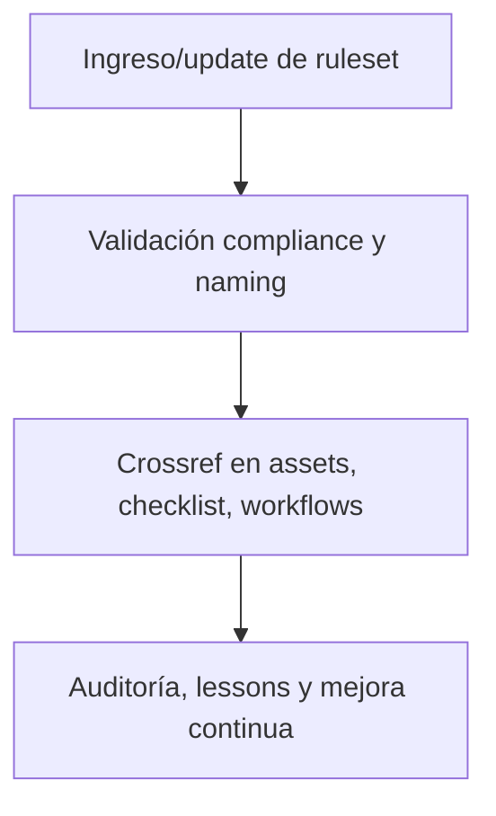

# 🔧 legacy/ruleset/ — Rulesets, Normas y Políticas Universales (v3.2)

## 1. Descripción, función, objetivos y contexto

La carpeta `legacy/ruleset/` centraliza **todos los rulesets, normas, políticas y marcos regulatorios** que rigen la plataforma AingZ/RwB.

### Funciones principales:

- Almacenar reglas universales, políticas de integración, naming, versionado y compliance aplicables a todos los assets y workflows.
- Servir de referencia normativa para la validación, auditoría y automatización de procesos.
- Garantizar la trazabilidad y actualización de todas las políticas críticas, reflejando cambios en blueprint y master plan.

### Integraciones y sistemas relacionados:

- Referencia constante en workflows de `wf/` y validaciones cross-bucket.
- Base normativa para la generación de templates, onboarding y pipelines automáticos desde `ops/`.
- Crossref explícito en todos los assets principales del core y buckets hijos.

## 2. Estructura interna

| Subcarpeta / Archivo         | Propósito                          | Estado |
| ---------------------------- | ---------------------------------- | ------ |
| ruleset\_rw\_b\_universal.md | Ruleset principal y versión viva   | Activo |
| naming\_politicas.md         | Políticas de naming/versionado     | Activo |
| compliance\_policies.md      | Políticas y normas de compliance   | Activo |
| ...                          | Otras normas y reglas de operación | Activo |

## 3. Metadatos y compliance

- **Versión:** v3.2 — 2025-08-06
- **Owner/Responsable:** AingZ\_Platform · RwB
- **Crossref obligatoria:** Blueprint, master plan, checklist, template universal README (ops/templates/)
- **Naming/Versionado:** Cumplimiento estricto de políticas RwB v3.2
- **Estado:** Activo

## 4. Ciclo de vida y flujos



## 5. Changelog local

- 2025-08-06: Versión v3.2, integración de compliance ruleset y políticas universales.

## 6. Observaciones / Lessons learned

- Todo cambio en ruleset o políticas debe reflejarse en blueprint, checklist y changelog global.
- No mantener políticas legacy fuera de compliance y sin versión activa registrada.

---

**FIN README legacy/ruleset/ v3.2**

## OutputTemplate
```yaml
CODE:
ID:
VERSION:
ROUTE:
CROSSREF:
AUTHOR:
DATE:
```
