# Corpus_Platform_V4


## README.md

---
CODE: READM
ID: root_readme
VERSION: v4.0-2025-08-07
ROUTE: /home/runner/work/AingZ_Platform/AingZ_Platform/README.md
CROSSREF:
  - lifecycle/temp/rw_b_blueprint_v_4_extendido_2025_08_06.md
  - lifecycle/temp/rw_b_master_plan_v_4_extendido_2025_08_06.md
  - lifecycle/temp/prompt_codex_baseline_v_4_check.md
  - core/rulset/RULE_CODING_COMPLIANCE_V4.md
  - core/rulset/RULE_NAMING_METADATA_CROSSREF_V1.md
AUTHOR: AingZ_Platform
DATE: 2025-08-07
---
# [RwB] README.md — Platform ROOT (V4, 2025-08-07, versión reforzada)

## 1. Estado y advertencia
*Este README ha sido reforzado para operar bajo arquitectura V4, con instrucciones explícitas para Codex u otros agentes LLM. Debe escanear y actualizar dinámicamente cualquier referencia o crossref afectada por el movimiento de archivos clave.*

---

## 2. Propósito y situación del repo
- El objetivo es alcanzar compliance V4, consolidando el árbol y todos los assets según blueprint y master plan vigentes.
- Se detectó que archivos críticos (blueprint, master plan, prompt Codex, este README) pueden haber sido movidos de la raíz a subcarpetas (`core/lifecycle/temp`, `ops/`, etc.).
- Los crossref deben reflejar siempre la **ubicación real** y actualizada de estos archivos en todo el repo.

---

## 3. Crossref dinámico y referencia clave
- Todos los scripts y README **deben detectar automáticamente** la ruta actual de:
  - `lifecycle/temp/prompt_codex_baseline_v_4_check.md`
  - `lifecycle/temp/rw_b_blueprint_v_4_extendido_2025_08_06.md`
  - `lifecycle/temp/rw_b_master_plan_v_4_extendido_2025_08_06.md`
  - Cualquier README clave y ruleset (`core/rulset/RULE_CODING_COMPLIANCE_V4.md`, `core/rulset/RULE_NAMING_METADATA_CROSSREF_V1.md`)
- Al detectar cambios de ubicación:
  - **Actualizar crossref en todos los README afectados**
  - Registrar cambio en `ops/changelog.md` y `ops/lessons_learned.md`

---

## 4. ⚠️ Validación Automática (para Codex y humanos)
1. Ejecuta barrido completo del repo (`LITW //sweep`, o script Python de walk).
2. Detecta la ubicación real de todos los archivos clave listados arriba.
3. Actualiza el bloque crossref de este y todos los README, usando la ruta real detectada.
4. Refuerza que todos los README incluyan:
   - Descripción y objetivos actuales (no legacy)
   - Crossref vivo (ruta exacta a blueprint, masterplan, prompt Codex, ruleset)
   - Metadatos YAML y OutputTemplate, alineados a V4
5. Ejecuta triggers QA (`TRG_AUDIT_TL`, `TRG_CONSOLIDATE_TL`, `TRG_LSWP`) y registra resultado en `ops/changelog.md`.
6. Documenta cada ciclo, excepción y workaround en `ops/lessons_learned.md` y checklist incremental.

---

## 5. Pendientes críticos y acciones recomendadas inmediatas (para Codex)
- [ ] Buscar y actualizar crossref en todos los README del repo (no solo raíz) tras cualquier cambio de ubicación de archivo clave.
- [ ] Implementar barrido literal 100% repo antes de cualquier edición de crossref.
- [ ] Generar/actualizar `core/rulset/RULE_CODING_COMPLIANCE_V4.md` y referenciarlo dinámicamente en los README.
- [ ] Validar que todos los README, assets y workflows tengan metadatos YAML, descripción actualizada y OutputTemplate.
- [ ] Registrar todo fix o hallazgo en `ops/changelog.md` y `ops/lessons_learned.md`.
- [ ] Configurar y testear cualquier secret/token necesario para GitHub Actions o CI:
    - Si CI/CD automático: crear secret `GH_TOKEN_RW_B_CI` con permisos `repo, workflow`.
    - Si solo trabajo local/manual: omitir (no es requerido para Codex local).
- [ ] Actualizar/crear `requirements.txt` con dependencias (`openai`, `pyyaml`, `pytest`, etc.) si vas a correr CI/CD.

---

## 6. Bloque IA / ingestión automática
```yaml
file: readme.md
version: v4.0-20250807
crossref_blueprint: lifecycle/temp/rw_b_blueprint_v_4_extendido_2025_08_06.md
crossref_masterplan: lifecycle/temp/rw_b_master_plan_v_4_extendido_2025_08_06.md
crossref_prompt_codex: lifecycle/temp/prompt_codex_baseline_v_4_check.md
crossref_ruleset: core/rulset/RULE_NAMING_METADATA_CROSSREF_V1.md
status: migracion-actualizacion-v4
note: "Validar crossref dinámico y barrido 100% repo tras cada ciclo."
```

---

**Fin README raíz V4 (con crossref dinámico)**

## OutputTemplate
```yaml
CODE:
ID:
VERSION:
ROUTE:
CROSSREF:
AUTHOR:
DATE:
```


## core/data/dicts/readme_core_data_dicts_rw_b_v_3_2.md

---
CODE: CORE
ID: readme_core_data_dicts_rw_b_v_3_2_v4
VERSION: v4.0-2025-08-10
ROUTE: /home/runner/work/AingZ_Platform/AingZ_Platform/core/data/dicts/readme_core_data_dicts_rw_b_v_3_2.md
CROSSREF:
  - lifecycle/temp/rw_b_blueprint_v_4_extendido_2025_08_06.md
  - lifecycle/temp/rw_b_master_plan_v_4_extendido_2025_08_06.md
  - lifecycle/temp/prompt_codex_baseline_v_4_check.md
  - core/rulset/RULE_CODING_COMPLIANCE_V4.md
AUTHOR: AingZ_Platform
DATE: 2025-08-10
---
# 📚 core/data/dicts/ — Diccionarios técnicos, de triggers y dominio (v3.2)

## 1. Descripción, función, objetivos y contexto

La carpeta `core/data/dicts/` centraliza **todos los diccionarios técnicos, de triggers, semánticos y de dominio** que estructuran y normalizan el funcionamiento y la interoperabilidad de la plataforma AingZ/RwB.

### Funciones principales:

- Almacenar los diccionarios vivos que definen semántica, taxonomía y naming universal (code, triggers, dominio, etc.).
- Servir como fuente de sincronización obligatoria para los glosarios y triggers de `kns/` y pipelines IA/humano.
- Facilitar la validación, expansión y actualización incremental de la taxonomía RwB.
- Mantener la integridad, compliance y trazabilidad de todos los cambios de nomenclatura y triggers clave.

### Integraciones y sistemas relacionados:

- Referencia cruzada directa y sincronización bidireccional con `kns/glossary/` y `kns/triggers/`.
- Usado por workflows de validación, migración y consolidación de `wf/`.
- Base para onboarding y definición de assets en todos los buckets principales.

## 2. Estructura interna

| Subcarpeta / Archivo                                  | Propósito                              | Estado |
| ----------------------------------------------------- | -------------------------------------- | ------ |
| rw\_b\_glosario\_code\_v\_2\_20250729.md              | Glosario code universal (versión viva) | Activo |
| rw\_b\_diccionario\_code\_triggers\_v\_2\_20250729.md | Diccionario triggers (versión viva)    | Activo |
| ...                                                   | Otros diccionarios técnicos/dominio    | Activo |

## 3. Metadatos y compliance

- **Versión:** v3.2 — 2025-08-06
- **Owner/Responsable:** AingZ\_Platform · RwB
- **Crossref obligatoria:** Blueprint, master plan, checklist, template universal README (ops/templates/)
- **Naming/Versionado:** Cumplimiento estricto de políticas RwB v3.2
- **Estado:** Activo

## 4. Ciclo de vida y flujos

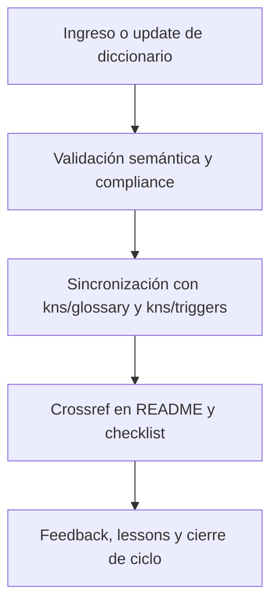

## 5. Changelog local

- 2025-08-06: Versión v3.2, compliance y sincronización con glosario/triggers.

## 6. Observaciones / Lessons learned

- Cualquier cambio en naming/triggers debe propagarse vía pipeline a glosario y triggers de kns/.
- Todo diccionario debe estar versionado, documentado y con changelog activo.

---

**FIN README core/data/dicts/ v3.2**

## OutputTemplate
```yaml
CODE:
ID:
VERSION:
ROUTE:
CROSSREF:
AUTHOR:
DATE:
```


## core/data/mplan/readme_core_data_mplan_rw_b_v_3_2.md

---
CODE: CORE
ID: readme_core_data_mplan_rw_b_v_3_2_v4
VERSION: v4.0-2025-08-10
ROUTE: /home/runner/work/AingZ_Platform/AingZ_Platform/core/data/mplan/readme_core_data_mplan_rw_b_v_3_2.md
CROSSREF:
  - lifecycle/temp/rw_b_blueprint_v_4_extendido_2025_08_06.md
  - lifecycle/temp/rw_b_master_plan_v_4_extendido_2025_08_06.md
  - lifecycle/temp/prompt_codex_baseline_v_4_check.md
  - core/rulset/RULE_CODING_COMPLIANCE_V4.md
AUTHOR: AingZ_Platform
DATE: 2025-08-10
---
# 🗺️ core/data/mplan/ — Master Plans y Matrices de Planificación (v3.2)

## 1. Descripción, función, objetivos y contexto

La carpeta `core/data/mplan/` centraliza los **master plans, cronogramas y matrices de planificación** clave para la evolución y mantenimiento de la plataforma AingZ/RwB.

### Funciones principales:

- Almacenar el master plan vigente y versiones históricas, asegurando trazabilidad y actualización estratégica.
- Mantener matrices de planificación, cronogramas, backlog incremental y roadmap de releases/objetivos.
- Ser fuente de referencia para auditorías, validaciones y priorización de nuevos desarrollos o migraciones.

### Integraciones y sistemas relacionados:

- Sincronización y validación cruzada con `blueprint`, `checklist` y los flujos de `wf/`.
- Alimenta la generación de reportes, auditorías y ciclos PDCA en todos los buckets principales.

## 2. Estructura interna

| Subcarpeta / Archivo                         | Propósito                               | Estado |
| -------------------------------------------- | --------------------------------------- | ------ |
| mpln\_master\_plan\_rw\_b\_v\_3\_20250803.md | Master plan vigente                     | Activo |
| ...                                          | Matrices y cronogramas de planificación | Activo |

## 3. Metadatos y compliance

- **Versión:** v3.2 — 2025-08-06
- **Owner/Responsable:** AingZ\_Platform · RwB
- **Crossref obligatoria:** Blueprint, master plan, checklist, template universal README (ops/templates/)
- **Naming/Versionado:** Cumplimiento estricto de políticas RwB v3.2
- **Estado:** Activo

## 4. Ciclo de vida y flujos

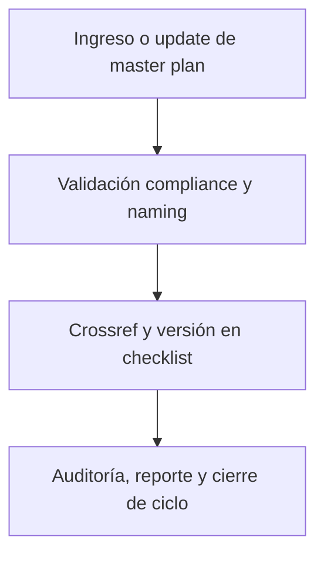

## 5. Changelog local

- 2025-08-06: Versión v3.2, integración compliance master plan y matrices de planificación.

## 6. Observaciones / Lessons learned

- Todo master plan debe ser actualizado solo bajo control de compliance y registro de versión/changelog.
- No eliminar versiones históricas salvo migración explícita documentada.

---

**FIN README core/data/mplan/ v3.2**

## OutputTemplate
```yaml
CODE:
ID:
VERSION:
ROUTE:
CROSSREF:
AUTHOR:
DATE:
```


## core/data/mtx/readme_core_data_mtx_rw_b_v_3_2.md

---
CODE: CORE
ID: readme_core_data_mtx_rw_b_v_3_2_v4
VERSION: v4.0-2025-08-10
ROUTE: /home/runner/work/AingZ_Platform/AingZ_Platform/core/data/mtx/readme_core_data_mtx_rw_b_v_3_2.md
CROSSREF:
  - lifecycle/temp/rw_b_blueprint_v_4_extendido_2025_08_06.md
  - lifecycle/temp/rw_b_master_plan_v_4_extendido_2025_08_06.md
  - lifecycle/temp/prompt_codex_baseline_v_4_check.md
  - core/rulset/RULE_CODING_COMPLIANCE_V4.md
AUTHOR: AingZ_Platform
DATE: 2025-08-10
---
# 🗂️ core/data/mtx/ — Matrices (Versus, Mapping, Clasificación) (v3.2)

## 1. Descripción, función, objetivos y contexto

La carpeta `core/data/mtx/` centraliza todas las **matrices vivas** utilizadas para clasificación, mapping, versus, correlación y validación dentro de la plataforma AingZ/RwB.

### Funciones principales:

- Almacenar matrices de comparación (versus), mapping de correspondencias, tablas de clasificación y relaciones de datos clave.
- Servir como base para la automatización, análisis y verificación de flujos (en especial auditorías, migraciones y consolidaciones).
- Facilitar el onboarding y entrenamiento IA/humano sobre estructuras relacionales críticas del core.

### Integraciones y sistemas relacionados:

- Utilizado en workflows de `wf/` para validaciones y reporting.
- Referencia cruzada en assets y pipelines de `ops/` para integración de nuevos assets y testing.
- Sincronización con cronogramas/matrices de `mplan/` cuando corresponda.

## 2. Estructura interna

| Subcarpeta / Archivo  | Propósito                              | Estado |
| --------------------- | -------------------------------------- | ------ |
| matriz\_versus\_xx.md | Matriz comparativa (versus) específica | Activo |
| mapping\_xx.md        | Tabla de mapping de correspondencias   | Activo |
| clasificacion\_xx.md  | Tabla de clasificación                 | Activo |
| ...                   | Otras matrices relacionadas            | Activo |

## 3. Metadatos y compliance

- **Versión:** v3.2 — 2025-08-06
- **Owner/Responsable:** AingZ\_Platform · RwB
- **Crossref obligatoria:** Blueprint, master plan, checklist, template universal README (ops/templates/)
- **Naming/Versionado:** Cumplimiento estricto de políticas RwB v3.2
- **Estado:** Activo

## 4. Ciclo de vida y flujos

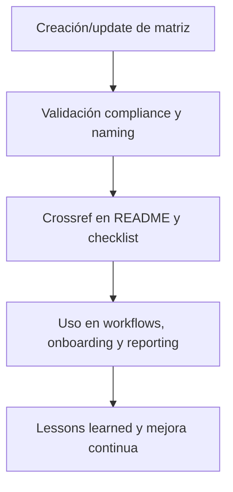

## 5. Changelog local

- 2025-08-06: Versión v3.2, integración compliance matrices versus/mapping.

## 6. Observaciones / Lessons learned

- Todas las matrices deben tener referencia cruzada y estar validadas para su uso por workflows o assets IA/humano.
- No almacenar matrices legacy sin migración y compliance documentados.

---

**FIN README core/data/mtx/ v3.2**

## OutputTemplate
```yaml
CODE:
ID:
VERSION:
ROUTE:
CROSSREF:
AUTHOR:
DATE:
```


## core/data/readme_core_data_rw_b_v_3_2.md

---
CODE: CORE
ID: readme_core_data_rw_b_v_3_2_v4
VERSION: v4.0-2025-08-10
ROUTE: /home/runner/work/AingZ_Platform/AingZ_Platform/core/data/readme_core_data_rw_b_v_3_2.md
CROSSREF:
  - lifecycle/temp/rw_b_blueprint_v_4_extendido_2025_08_06.md
  - lifecycle/temp/rw_b_master_plan_v_4_extendido_2025_08_06.md
  - lifecycle/temp/prompt_codex_baseline_v_4_check.md
  - core/rulset/RULE_CODING_COMPLIANCE_V4.md
AUTHOR: AingZ_Platform
DATE: 2025-08-10
---
# 📊 core/data/ — Matrices, Diccionarios y Plantillas estructurales (v3.2)

## 1. Descripción, función, objetivos y contexto

La carpeta `core/data/` centraliza **todos los insumos estructurales, técnicos y normativos** de la plataforma AingZ/RwB.

### Funciones principales:

- Ser la fuente única para matrices de planificación, mapping, reglas y taxonomías funcionales.
- Centralizar diccionarios técnicos, de triggers y de dominio (`dicts/`), con sincronización periódica hacia `kns/` para uso IA/humano.
- Proveer las reglaset y políticas universales (`rulset/`) que gobiernan los workflows de toda la plataforma.
- Contener todas las plantillas estructurales internas del core (`template/`), diferenciando de las templates universales alojadas en `ops/templates/`.
- Mantener la integridad y versionado de todos los artefactos base que alimentan el core y sus pipelines.

### Integraciones y sistemas relacionados:

- Interconectada con `kns/` (sincronización de glosario y triggers), `wf/` (uso de matrices y reglas), y con los pipelines de onboarding y automatización de `ops/`.
- Referencia cruzada y dependencia directa del blueprint, master plan y checklist.

## 2. Estructura interna

| Subcarpeta / Archivo | Propósito                                  | Estado |
| -------------------- | ------------------------------------------ | ------ |
| dicts/               | Diccionarios técnicos, triggers, dominio   | Activo |
| mplan/               | Master plans, matrices de planificación    | Activo |
| mtx/                 | Matrices de mapping, clasificación, versus | Activo |
| rulset/              | Rulesets, normas y políticas RwB           | Activo |
| template/            | Plantillas estructurales del core          | Activo |

## 3. Metadatos y compliance

- **Versión:** v3.2 — 2025-08-06
- **Owner/Responsable:** AingZ\_Platform · RwB
- **Crossref obligatoria:** Blueprint, master plan, checklist, triggers, glosario, template universal README (ops/templates/)
- **Naming/Versionado:** Cumplimiento estricto de políticas RwB v3.2
- **Estado:** Activo

## 4. Ciclo de vida y flujos

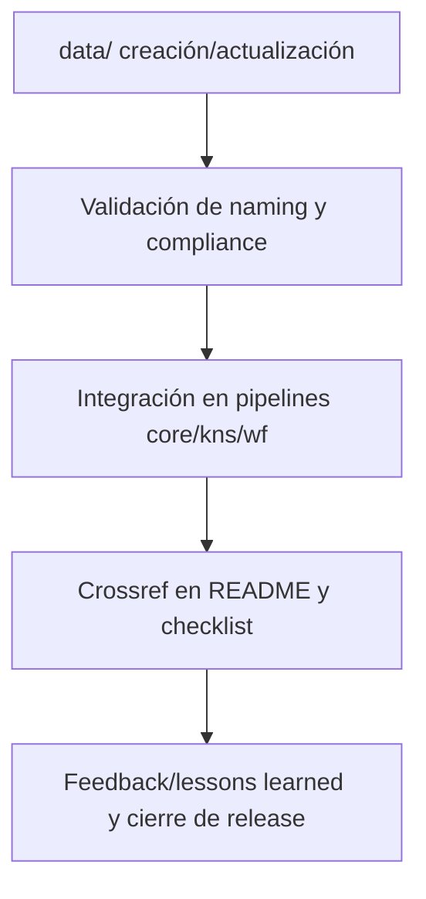

## 5. Changelog local

- 2025-08-06: Versión v3.2, integración dicts y ajuste compliance Master Plan.

## 6. Observaciones / Lessons learned

- Sincronización obligatoria entre dicts (data/) y los nodos de kns/ (glossary, triggers).
- Nunca replicar artefactos universales fuera de su carpeta raíz.

---

**FIN README core/data/ v3.2**

## OutputTemplate
```yaml
CODE:
ID:
VERSION:
ROUTE:
CROSSREF:
AUTHOR:
DATE:
```


## core/data/rulset/readme_core_data_rulset_rw_b_v_3_2.md

---
CODE: CORE
ID: readme_core_data_rulset_rw_b_v_3_2_v4
VERSION: v4.0-2025-08-10
ROUTE: /home/runner/work/AingZ_Platform/AingZ_Platform/core/data/rulset/readme_core_data_rulset_rw_b_v_3_2.md
CROSSREF:
  - lifecycle/temp/rw_b_blueprint_v_4_extendido_2025_08_06.md
  - lifecycle/temp/rw_b_master_plan_v_4_extendido_2025_08_06.md
  - lifecycle/temp/prompt_codex_baseline_v_4_check.md
  - core/rulset/RULE_CODING_COMPLIANCE_V4.md
AUTHOR: AingZ_Platform
DATE: 2025-08-10
---
# 🔧 core/data/rulset/ — Rulesets, Normas y Políticas Universales (v3.2)

## 1. Descripción, función, objetivos y contexto

La carpeta `core/data/rulset/` centraliza **todos los rulesets, normas, políticas y marcos regulatorios** que rigen la plataforma AingZ/RwB.

### Funciones principales:

- Almacenar reglas universales, políticas de integración, naming, versionado y compliance aplicables a todos los assets y workflows.
- Servir de referencia normativa para la validación, auditoría y automatización de procesos.
- Garantizar la trazabilidad y actualización de todas las políticas críticas, reflejando cambios en blueprint y master plan.

### Integraciones y sistemas relacionados:

- Referencia constante en workflows de `wf/` y validaciones cross-bucket.
- Base normativa para la generación de templates, onboarding y pipelines automáticos desde `ops/`.
- Crossref explícito en todos los assets principales del core y buckets hijos.

## 2. Estructura interna

| Subcarpeta / Archivo         | Propósito                          | Estado |
| ---------------------------- | ---------------------------------- | ------ |
| ruleset\_rw\_b\_universal.md | Ruleset principal y versión viva   | Activo |
| naming\_politicas.md         | Políticas de naming/versionado     | Activo |
| compliance\_policies.md      | Políticas y normas de compliance   | Activo |
| ...                          | Otras normas y reglas de operación | Activo |

## 3. Metadatos y compliance

- **Versión:** v3.2 — 2025-08-06
- **Owner/Responsable:** AingZ\_Platform · RwB
- **Crossref obligatoria:** Blueprint, master plan, checklist, template universal README (ops/templates/)
- **Naming/Versionado:** Cumplimiento estricto de políticas RwB v3.2
- **Estado:** Activo

## 4. Ciclo de vida y flujos

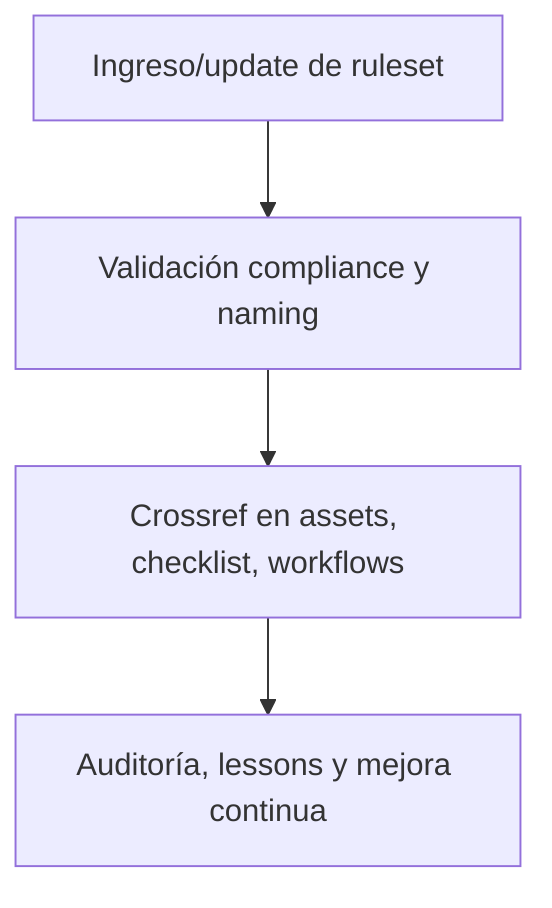

## 5. Changelog local

- 2025-08-06: Versión v3.2, integración de compliance ruleset y políticas universales.

## 6. Observaciones / Lessons learned

- Todo cambio en ruleset o políticas debe reflejarse en blueprint, checklist y changelog global.
- No mantener políticas legacy fuera de compliance y sin versión activa registrada.

---

**FIN README core/data/rulset/ v3.2**

## OutputTemplate
```yaml
CODE:
ID:
VERSION:
ROUTE:
CROSSREF:
AUTHOR:
DATE:
```


## core/data/template/readme_core_data_template_rw_b_v_3_2.md

---
CODE: DOC
ID: readme_core_data_template_rw_b_v_3_2_v4
VERSION: v4.0-2025-08-10
ROUTE: /home/runner/work/AingZ_Platform/AingZ_Platform/core/data/template/readme_core_data_template_rw_b_v_3_2.md
CROSSREF:
  - core/rulset/RULE_CODING_COMPLIANCE_V4.md
  - lifecycle/temp/prompt_codex_baseline_v_4_check.md
  - lifecycle/temp/rw_b_blueprint_v_4_extendido_2025_08_06.md
  - lifecycle/temp/rw_b_master_plan_v_4_extendido_2025_08_06.md
AUTHOR: AingZ_Platform
DATE: 2025-08-10
---
# 📑 core/data/template/ — Plantillas estructurales del Core (v3.2)

## 1. Descripción, función, objetivos y contexto

La carpeta `core/data/template/` centraliza todas las **plantillas estructurales internas** utilizadas para la documentación, matrices y assets propios del core AingZ/RwB.

### Funciones principales:
- Almacenar scaffolds, plantillas y modelos reutilizables para la generación de documentación, matrices, rulesets y assets internos.
- Proveer recursos base para la estandarización de nuevos documentos, assets y estructuras del core, diferenciando de los templates universales alojados en `ops/templates/`.
- Facilitar el onboarding y la consistencia documental y de activos en todo el core y sus subniveles.

### Integraciones y sistemas relacionados:
- Referencia cruzada directa con assets de `data/`, `doc/` y pipelines de documentación.
- Usadas por scripts/manuales de onboarding, validación y auditoría.
- Plantillas universales y de automatización (README, scripts) viven en `ops/templates/`.

## 2. Estructura interna

| Subcarpeta / Archivo         | Propósito                                     | Estado  |
|-----------------------------|-----------------------------------------------|---------|
| plantilla_doc_modelo.md     | Scaffold de documentación interna             | Activo  |
| plantilla_matriz_modelo.md  | Scaffold de matrices internas                 | Activo  |
| ...                         | Otras plantillas estructurales internas       | Activo  |

## 3. Metadatos y compliance
- **Versión:** v3.2 — 2025-08-06
- **Owner/Responsable:** AingZ_Platform · RwB
- **Crossref obligatoria:** Blueprint, master plan, checklist, template universal README (ops/templates/)
- **Naming/Versionado:** Cumplimiento estricto de políticas RwB v3.2
- **Estado:** Activo

## 4. Ciclo de vida y flujos

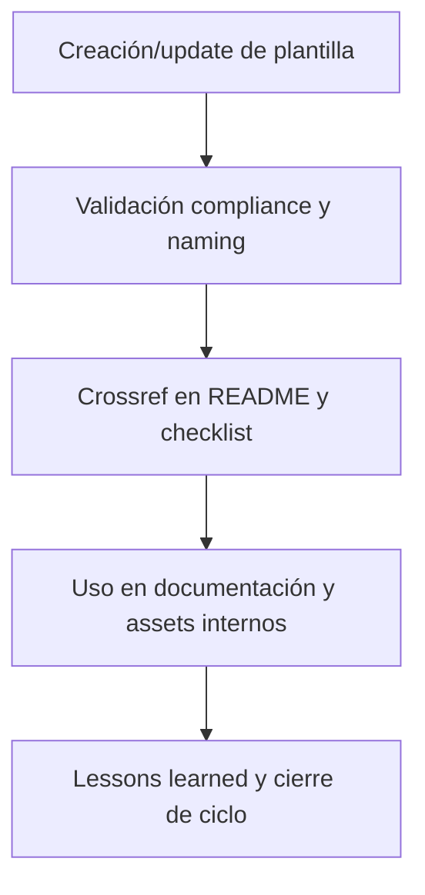

## 5. Changelog local
- 2025-08-06: Versión v3.2, integración compliance y scaffolds estructurales.

## 6. Observaciones / Lessons learned
- Solo alojar plantillas internas del core aquí; las universales y automatizadas deben estar en ops/templates/.
- Mantener sincronización con cambios de reglas, matrices y documentación activa.

---

**FIN README core/data/template/ v3.2**

## OutputTemplate
```yaml
CODE:
ID:
VERSION:
ROUTE:
CROSSREF:
AUTHOR:
DATE:
```


## core/doc/audio/readme_core_doc_audio_rw_b_v_3_2.md

---
CODE: CORE
ID: readme_core_doc_audio_rw_b_v_3_2_v4
VERSION: v4.0-2025-08-10
ROUTE: /home/runner/work/AingZ_Platform/AingZ_Platform/core/doc/audio/readme_core_doc_audio_rw_b_v_3_2.md
CROSSREF:
  - lifecycle/temp/rw_b_blueprint_v_4_extendido_2025_08_06.md
  - lifecycle/temp/rw_b_master_plan_v_4_extendido_2025_08_06.md
  - lifecycle/temp/prompt_codex_baseline_v_4_check.md
  - core/rulset/RULE_CODING_COMPLIANCE_V4.md
AUTHOR: AingZ_Platform
DATE: 2025-08-10
---
# 🎧 core/doc/audio/ — Documentación de Workflows y Activos en Audio (v3.2)

## 1. Descripción, función, objetivos y contexto

La carpeta `core/doc/audio/` centraliza toda la **documentación en formato audio** vinculada a workflows, procesos, activos y onboarding de la plataforma AingZ/RwB.

### Funciones principales:

- Almacenar audios explicativos, grabaciones de procedimientos, notas de voz y recursos sonoros clave para onboarding y operación.
- Complementar la documentación textual, visual y audiovisual de la plataforma.
- Proveer acceso rápido y trazabilidad a información operativa clave en formatos accesibles.

### Integraciones y sistemas relacionados:

- Referencia cruzada con guías de onboarding (`doc/onbrd/`), documentación visual (`doc/image/`), y workflows de `wf/`.
- Usado en scripts/manuales de onboarding y formación de usuarios IA/humano.

## 2. Estructura interna

| Archivo/Subcarpeta     | Propósito                       | Estado |
| ---------------------- | ------------------------------- | ------ |
| audio\_workflow\_X.wav | Audio explicativo de workflow X | Activo |
| nota\_voz\_onboarding/ | Notas de voz para onboarding    | Activo |
| ...                    | Otros recursos y grabaciones    | Activo |

## 3. Metadatos y compliance

- **Versión:** v3.2 — 2025-08-06
- **Owner/Responsable:** AingZ\_Platform · RwB
- **Crossref obligatoria:** Blueprint, master plan, checklist, template universal README (ops/templates/)
- **Naming/Versionado:** Cumplimiento estricto de políticas RwB v3.2
- **Estado:** Activo

## 4. Ciclo de vida y flujos

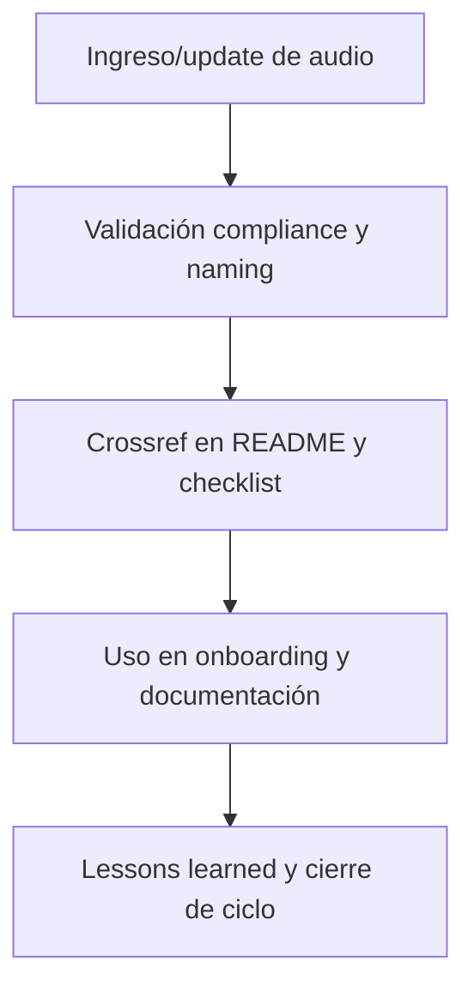

## 5. Changelog local

- 2025-08-06: Versión v3.2, compliance documentación audio y onboarding.

## 6. Observaciones / Lessons learned

- Todos los audios deben tener referencia cruzada a los workflows, docs y guías que documentan.
- Mantener la organización, naming y metadatos para trazabilidad y fácil acceso.

---

**FIN README core/doc/audio/ v3.2**

## OutputTemplate
```yaml
CODE:
ID:
VERSION:
ROUTE:
CROSSREF:
AUTHOR:
DATE:
```


## core/doc/image/readme_core_doc_image_rw_b_v_3_2.md

---
CODE: CORE
ID: readme_core_doc_image_rw_b_v_3_2_v4
VERSION: v4.0-2025-08-10
ROUTE: /home/runner/work/AingZ_Platform/AingZ_Platform/core/doc/image/readme_core_doc_image_rw_b_v_3_2.md
CROSSREF:
  - lifecycle/temp/rw_b_blueprint_v_4_extendido_2025_08_06.md
  - lifecycle/temp/rw_b_master_plan_v_4_extendido_2025_08_06.md
  - lifecycle/temp/prompt_codex_baseline_v_4_check.md
  - core/rulset/RULE_CODING_COMPLIANCE_V4.md
AUTHOR: AingZ_Platform
DATE: 2025-08-10
---
# 🖼️ core/doc/image/ — Imágenes Técnicas y Diagramas (v3.2)

## 1. Descripción, función, objetivos y contexto

La carpeta `core/doc/image/` almacena todas las **imágenes técnicas, diagramas, visualizaciones y recursos gráficos** necesarios para documentar workflows, procesos y assets del core AingZ/RwB.

### Funciones principales:

- Centralizar imágenes y diagramas que acompañan documentación, onboarding, workflows y reporting del core.
- Facilitar la visualización y comprensión de procesos, estructuras, arquitecturas y relaciones complejas.
- Proveer soporte visual para humanos e IA en el despliegue y uso de la plataforma.

### Integraciones y sistemas relacionados:

- Referencia cruzada con `audio/`, `onbrd/`, `video/` y documentación técnica general de `doc/`.
- Usadas en manuales, onboarding, reporting y como input/output en pipelines de IA/documentación automatizada.

## 2. Estructura interna

| Archivo/Subcarpeta        | Propósito                         | Estado |
| ------------------------- | --------------------------------- | ------ |
| diagrama\_arbol\_core.png | Diagrama estructural del core     | Activo |
| visualizacion\_pipeline/  | Diagramas de procesos y pipelines | Activo |
| ...                       | Otros diagramas/imágenes técnicas | Activo |

## 3. Metadatos y compliance

- **Versión:** v3.2 — 2025-08-06
- **Owner/Responsable:** AingZ\_Platform · RwB
- **Crossref obligatoria:** Blueprint, master plan, checklist, template universal README (ops/templates/)
- **Naming/Versionado:** Cumplimiento estricto de políticas RwB v3.2
- **Estado:** Activo

## 4. Ciclo de vida y flujos

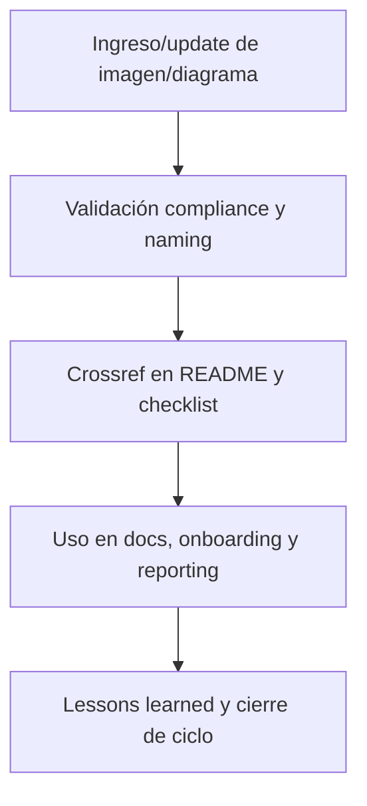

## 5. Changelog local

- 2025-08-06: Versión v3.2, compliance imágenes técnicas y reporting.

## 6. Observaciones / Lessons learned

- Todas las imágenes y diagramas deben estar referenciadas en los README y documentos relevantes.
- Mantener consistencia de formato, naming y metadatos para trazabilidad y uso IA/humano.

---

**FIN README core/doc/image/ v3.2**

## OutputTemplate
```yaml
CODE:
ID:
VERSION:
ROUTE:
CROSSREF:
AUTHOR:
DATE:
```


## core/doc/onbrd/readme_core_doc_onbrd_rw_b_v_3_2.md

---
CODE: CORE
ID: readme_core_doc_onbrd_rw_b_v_3_2_v4
VERSION: v4.0-2025-08-10
ROUTE: /home/runner/work/AingZ_Platform/AingZ_Platform/core/doc/onbrd/readme_core_doc_onbrd_rw_b_v_3_2.md
CROSSREF:
  - lifecycle/temp/rw_b_blueprint_v_4_extendido_2025_08_06.md
  - lifecycle/temp/rw_b_master_plan_v_4_extendido_2025_08_06.md
  - lifecycle/temp/prompt_codex_baseline_v_4_check.md
  - core/rulset/RULE_CODING_COMPLIANCE_V4.md
AUTHOR: AingZ_Platform
DATE: 2025-08-10
---
# 🚀 core/doc/onbrd/ — Onboarding, Guías y Quickstart (v3.2)

## 1. Descripción, función, objetivos y contexto

La carpeta `core/doc/onbrd/` centraliza **todas las guías de onboarding, quickstart y documentación de entrada** para usuarios humanos e IA en la plataforma AingZ/RwB.

### Funciones principales:

- Almacenar manuales, guías, tutoriales y quickstarts para facilitar el ingreso y uso correcto de la plataforma y sus activos.
- Garantizar la trazabilidad de los procesos de onboarding y actualización de nuevos assets, workflows o políticas.
- Proveer recursos vivos y versionados para onboarding incremental, test de usuarios y formación IA.

### Integraciones y sistemas relacionados:

- Vinculada a los pipelines y scripts de onboarding en `ops/` y los assets de `wf/`.
- Referencia cruzada a documentación técnica (`doc/`), imágenes (`image/`), audio (`audio/`) y videos (`video/`).

## 2. Estructura interna

| Archivo/Subcarpeta  | Propósito                                      | Estado |
| ------------------- | ---------------------------------------------- | ------ |
| guia\_onboarding.md | Manual de onboarding general                   | Activo |
| quickstart.md       | Guía rápida de ingreso y uso                   | Activo |
| ...                 | Otros manuales, tutoriales, scripts de entrada | Activo |

## 3. Metadatos y compliance

- **Versión:** v3.2 — 2025-08-06
- **Owner/Responsable:** AingZ\_Platform · RwB
- **Crossref obligatoria:** Blueprint, master plan, checklist, template universal README (ops/templates/)
- **Naming/Versionado:** Cumplimiento estricto de políticas RwB v3.2
- **Estado:** Activo

## 4. Ciclo de vida y flujos

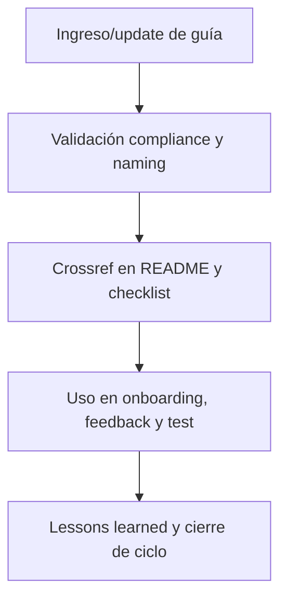

## 5. Changelog local

- 2025-08-06: Versión v3.2, compliance onboarding y quickstart.

## 6. Observaciones / Lessons learned

- Todas las guías deben mantenerse vivas y sincronizadas con cambios de assets y workflows.
- Priorizar la claridad, trazabilidad y feedback para onboarding incremental humano/IA.

---

**FIN README core/doc/onbrd/ v3.2**

## OutputTemplate
```yaml
CODE:
ID:
VERSION:
ROUTE:
CROSSREF:
AUTHOR:
DATE:
```


## core/doc/readme_core_doc_rw_b_v_3_2.md

---
CODE: CORE
ID: readme_core_doc_rw_b_v_3_2_v4
VERSION: v4.0-2025-08-10
ROUTE: /home/runner/work/AingZ_Platform/AingZ_Platform/core/doc/readme_core_doc_rw_b_v_3_2.md
CROSSREF:
  - lifecycle/temp/rw_b_blueprint_v_4_extendido_2025_08_06.md
  - lifecycle/temp/rw_b_master_plan_v_4_extendido_2025_08_06.md
  - lifecycle/temp/prompt_codex_baseline_v_4_check.md
  - core/rulset/RULE_CODING_COMPLIANCE_V4.md
AUTHOR: AingZ_Platform
DATE: 2025-08-10
---
# 📄 core/doc/ — Documentación técnica, onboarding y plantillas modelo (v3.2)

## 1. Descripción, función, objetivos y contexto

La carpeta `core/doc/` reúne **toda la documentación operativa, técnica y de onboarding** de la plataforma AingZ/RwB.

### Funciones principales:

- Centralizar documentación estructurada: guías técnicas, onboarding, diagramas, imágenes, documentación audiovisual y plantillas modelo de uso específico del core.
- Garantizar el onboarding universal (humano/IA) y la rápida transferencia de conocimiento clave de la plataforma.
- Actuar como referencia para la integración y despliegue de nuevos workflows, pipelines y sistemas vinculados al core.
- Asegurar la versionabilidad y trazabilidad de toda documentación relevante del core y su evolución.

### Integraciones y sistemas relacionados:

- Totalmente vinculada a los pipelines de onboarding de `ops/` y los workflows activos de `wf/`.
- Dependencia cruzada directa con `data/` (plantillas, matrices) y los glosarios/vocabularios de `kns/`.
- Crossref viva a blueprint, master plan y checklist.

## 2. Estructura interna

| Subcarpeta / Archivo | Propósito                                       | Estado |
| -------------------- | ----------------------------------------------- | ------ |
| audio/               | Documentación en formato audio de workflows     | Activo |
| image/               | Diagramas, imágenes técnicas, visualizaciones   | Activo |
| onbrd/               | Onboarding: guías, quickstart, capacitación     | Activo |
| template/            | Plantillas modelo de documentación para el core | Activo |
| video/               | Documentación audiovisual                       | Activo |

## 3. Metadatos y compliance

- **Versión:** v3.2 — 2025-08-06
- **Owner/Responsable:** AingZ\_Platform · RwB
- **Crossref obligatoria:** Blueprint, master plan, checklist, triggers, glosario, template universal README (ops/templates/)
- **Naming/Versionado:** Cumplimiento estricto de políticas RwB v3.2
- **Estado:** Activo

## 4. Ciclo de vida y flujos

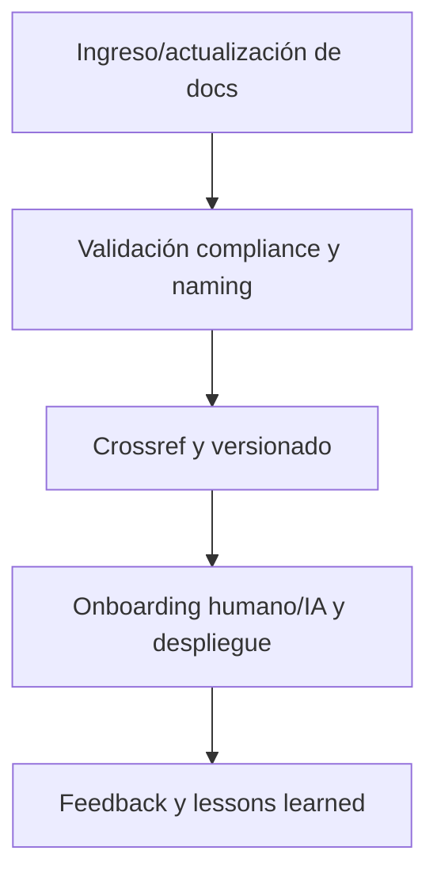

## 5. Changelog local

- 2025-08-06: Versión v3.2, onboarding, ajuste de compliance y crossref.

## 6. Observaciones / Lessons learned

- Onboarding y documentación técnica deben mantenerse sincronizados con la evolución de assets y workflows.
- Toda doc relevante debe tener crossref a blueprint y pipelines activos.

---

**FIN README core/doc/ v3.2**

## OutputTemplate
```yaml
CODE:
ID:
VERSION:
ROUTE:
CROSSREF:
AUTHOR:
DATE:
```


## core/doc/template/readme_core_doc_template_rw_b_v_3_2.md

---
CODE: DOC
ID: readme_core_doc_template_rw_b_v_3_2_v4
VERSION: v4.0-2025-08-10
ROUTE: /home/runner/work/AingZ_Platform/AingZ_Platform/core/doc/template/readme_core_doc_template_rw_b_v_3_2.md
CROSSREF:
  - core/rulset/RULE_CODING_COMPLIANCE_V4.md
  - lifecycle/temp/prompt_codex_baseline_v_4_check.md
  - lifecycle/temp/rw_b_blueprint_v_4_extendido_2025_08_06.md
  - lifecycle/temp/rw_b_master_plan_v_4_extendido_2025_08_06.md
AUTHOR: AingZ_Platform
DATE: 2025-08-10
---
# 📑 core/doc/template/ — Plantillas Modelo de Documentación (v3.2)

## 1. Descripción, función, objetivos y contexto

La carpeta `core/doc/template/` centraliza **todas las plantillas modelo de documentación** utilizadas para generar, estandarizar y actualizar los assets documentales del core AingZ/RwB.

### Funciones principales:

- Almacenar modelos y scaffolds para la documentación específica del core (guías, reportes, onboarding, instructivos, etc.).
- Facilitar la generación y actualización rápida de docs bajo políticas de compliance, naming y versionado.
- Asegurar la consistencia y trazabilidad en todos los documentos generados internamente.

### Integraciones y sistemas relacionados:

- Referencia cruzada con templates universales de `ops/templates/` y plantillas estructurales de `data/template/`.
- Usadas en workflows, reporting y onboarding desde `doc/` y `wf/`.

## 2. Estructura interna

| Archivo/Subcarpeta         | Propósito                          | Estado |
| -------------------------- | ---------------------------------- | ------ |
| plantilla\_guia\_doc.md    | Scaffold/modelo de guía/documento  | Activo |
| plantilla\_reporte\_doc.md | Scaffold/modelo de reporte técnico | Activo |
| ...                        | Otras plantillas modelo de docs    | Activo |

## 3. Metadatos y compliance

- **Versión:** v3.2 — 2025-08-06
- **Owner/Responsable:** AingZ\_Platform · RwB
- **Crossref obligatoria:** Blueprint, master plan, checklist, template universal README (ops/templates/)
- **Naming/Versionado:** Cumplimiento estricto de políticas RwB v3.2
- **Estado:** Activo

## 4. Ciclo de vida y flujos

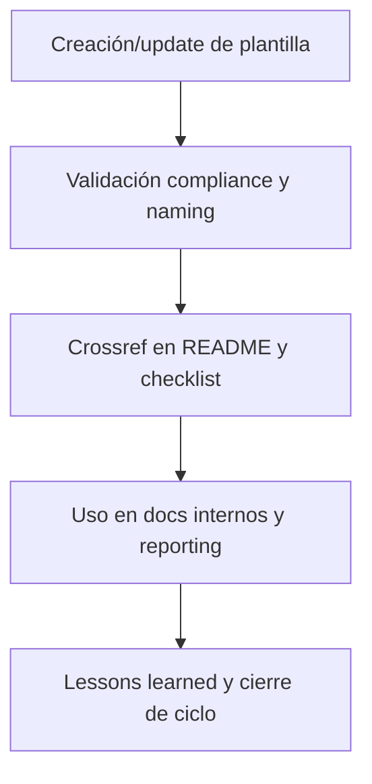

## 5. Changelog local

- 2025-08-06: Versión v3.2, compliance plantillas docs.

## 6. Observaciones / Lessons learned

- Mantener solo plantillas modelo para docs del core (el resto en ops/templates/).
- Sincronizar naming, versión y metadatos con cambios en políticas y rulesets.

---

**FIN README core/doc/template/ v3.2**

## OutputTemplate
```yaml
CODE:
ID:
VERSION:
ROUTE:
CROSSREF:
AUTHOR:
DATE:
```


## core/doc/video/readme_core_doc_video_rw_b_v_3_2.md

---
CODE: CORE
ID: readme_core_doc_video_rw_b_v_3_2_v4
VERSION: v4.0-2025-08-10
ROUTE: /home/runner/work/AingZ_Platform/AingZ_Platform/core/doc/video/readme_core_doc_video_rw_b_v_3_2.md
CROSSREF:
  - lifecycle/temp/rw_b_blueprint_v_4_extendido_2025_08_06.md
  - lifecycle/temp/rw_b_master_plan_v_4_extendido_2025_08_06.md
  - lifecycle/temp/prompt_codex_baseline_v_4_check.md
  - core/rulset/RULE_CODING_COMPLIANCE_V4.md
AUTHOR: AingZ_Platform
DATE: 2025-08-10
---
# 🎞️ core/doc/video/ — Documentación Audiovisual y Videos Técnicos (v3.2)

## 1. Descripción, función, objetivos y contexto

La carpeta `core/doc/video/` centraliza **toda la documentación audiovisual y videos técnicos** vinculados a workflows, procesos y onboarding de la plataforma AingZ/RwB.

### Funciones principales:

- Almacenar videos explicativos, grabaciones de procedimientos, demostraciones, presentaciones y recursos visuales clave para onboarding y operación.
- Complementar la documentación textual, visual y en audio de la plataforma.
- Proveer soporte audiovisual para humanos e IA, facilitando aprendizaje y transferencia de conocimiento.

### Integraciones y sistemas relacionados:

- Referencia cruzada con guías de onboarding (`doc/onbrd/`), imágenes (`image/`), audios (`audio/`) y documentación técnica de `doc/`.
- Usados en reporting, capacitación y despliegue de workflows técnicos.

## 2. Estructura interna

| Archivo/Subcarpeta     | Propósito                             | Estado |
| ---------------------- | ------------------------------------- | ------ |
| video\_workflow\_X.mp4 | Video demostrativo de workflow X      | Activo |
| presentacion\_release/ | Presentaciones de release y novedades | Activo |
| ...                    | Otros recursos y grabaciones          | Activo |

## 3. Metadatos y compliance

- **Versión:** v3.2 — 2025-08-06
- **Owner/Responsable:** AingZ\_Platform · RwB
- **Crossref obligatoria:** Blueprint, master plan, checklist, template universal README (ops/templates/)
- **Naming/Versionado:** Cumplimiento estricto de políticas RwB v3.2
- **Estado:** Activo

## 4. Ciclo de vida y flujos

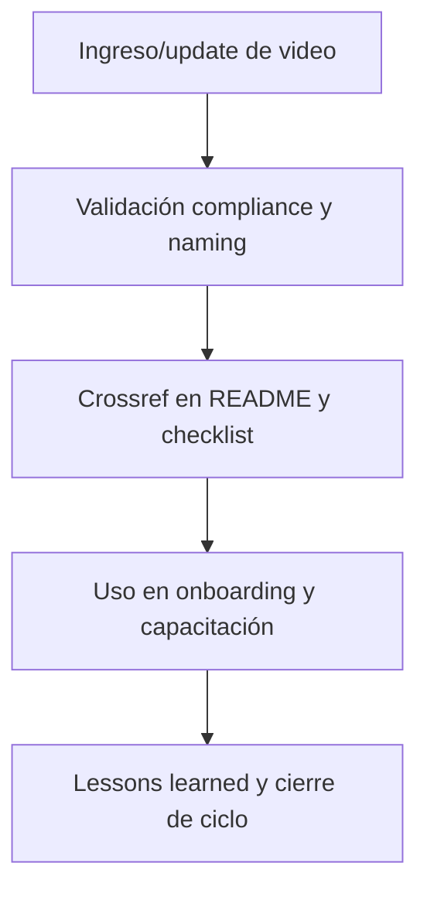

## 5. Changelog local

- 2025-08-06: Versión v3.2, compliance documentación audiovisual.

## 6. Observaciones / Lessons learned

- Todos los videos deben tener referencia cruzada a workflows, docs y guías relevantes.
- Mantener organización y metadatos para trazabilidad y acceso por IA/humano.

---

**FIN README core/doc/video/ v3.2**

## OutputTemplate
```yaml
CODE:
ID:
VERSION:
ROUTE:
CROSSREF:
AUTHOR:
DATE:
```


## core/kns/ai_learn/eval/readme_core_kns_ai_learn_eval_rw_b_v_3_2.md

---
CODE: CORE
ID: readme_core_kns_ai_learn_eval_rw_b_v_3_2_v4
VERSION: v4.0-2025-08-10
ROUTE: /home/runner/work/AingZ_Platform/AingZ_Platform/core/kns/ai_learn/eval/readme_core_kns_ai_learn_eval_rw_b_v_3_2.md
CROSSREF:
  - lifecycle/temp/rw_b_blueprint_v_4_extendido_2025_08_06.md
  - lifecycle/temp/rw_b_master_plan_v_4_extendido_2025_08_06.md
  - lifecycle/temp/prompt_codex_baseline_v_4_check.md
  - core/rulset/RULE_CODING_COMPLIANCE_V4.md
AUTHOR: AingZ_Platform
DATE: 2025-08-10
---
# 📊 core/kns/ai\_learn/eval/ — Evaluaciones y Métricas de Aprendizaje (v3.2)

## 1. Descripción, función, objetivos y contexto

La carpeta `core/kns/ai_learn/eval/` centraliza **todas las evaluaciones, métricas y análisis de performance** asociados al aprendizaje IA/humano en la plataforma AingZ/RwB.

### Funciones principales:

- Almacenar reportes, análisis, métricas y validaciones de modelos, prompts y tuning.
- Facilitar el control de calidad, benchmarking y tracking de progresos o regresiones.
- Permitir auditoría y mejora continua sobre procesos de aprendizaje y ajuste IA/humano.

### Integraciones y sistemas relacionados:

- Conexión directa con lessons, tuning y feedback (`ai_learn/`), y assets de métricas globales (`metrics/`).
- Datos de evaluaciones alimentan procesos de onboarding, reporting y ajustes de workflows (`wf/`).

## 2. Estructura interna

| Archivo/Subcarpeta  | Propósito                            | Estado |
| ------------------- | ------------------------------------ | ------ |
| metricas\_X.md      | Métricas de aprendizaje/test X       | Activo |
| benchmark\_modelos/ | Resultados y comparativas de modelos | Activo |
| ...                 | Otros análisis y reportes            | Activo |

## 3. Metadatos y compliance

- **Versión:** v3.2 — 2025-08-06
- **Owner/Responsable:** AingZ\_Platform · RwB
- **Crossref obligatoria:** Blueprint, master plan, checklist, template universal README (ops/templates/)
- **Naming/Versionado:** Cumplimiento estricto de políticas RwB v3.2
- **Estado:** Activo

## 4. Ciclo de vida y flujos

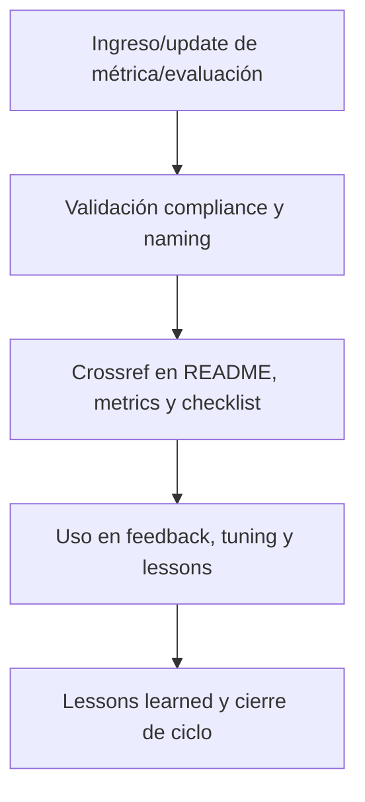

## 5. Changelog local

- 2025-08-06: Versión v3.2, compliance métricas y evaluaciones IA/humano.

## 6. Observaciones / Lessons learned

- Todas las métricas y evaluaciones deben tener referencia cruzada con lessons, tuning y assets de reporting.
- Mantener histórico y trazabilidad para auditoría y mejora continua.

---

**FIN README core/kns/ai\_learn/eval/ v3.2**

## OutputTemplate
```yaml
CODE:
ID:
VERSION:
ROUTE:
CROSSREF:
AUTHOR:
DATE:
```


## core/kns/ai_learn/feed/readme_core_kns_ai_learn_feed_rw_b_v_3_2.md

---
CODE: CORE
ID: readme_core_kns_ai_learn_feed_rw_b_v_3_2_v4
VERSION: v4.0-2025-08-10
ROUTE: /home/runner/work/AingZ_Platform/AingZ_Platform/core/kns/ai_learn/feed/readme_core_kns_ai_learn_feed_rw_b_v_3_2.md
CROSSREF:
  - lifecycle/temp/rw_b_blueprint_v_4_extendido_2025_08_06.md
  - lifecycle/temp/rw_b_master_plan_v_4_extendido_2025_08_06.md
  - lifecycle/temp/prompt_codex_baseline_v_4_check.md
  - core/rulset/RULE_CODING_COMPLIANCE_V4.md
AUTHOR: AingZ_Platform
DATE: 2025-08-10
---
# 💬 core/kns/ai\_learn/feed/ — Feedback estructurado humano/IA (v3.2)

## 1. Descripción, función, objetivos y contexto

La carpeta `core/kns/ai_learn/feed/` centraliza **el feedback estructurado y retroalimentación** proveniente tanto de usuarios humanos como de IA, referente al uso, mejora y validación de la plataforma AingZ/RwB.

### Funciones principales:

- Almacenar sugerencias, críticas, reportes de incidentes y propuestas de mejora.
- Integrar el feedback al ciclo PDCA y a la evolución de assets, workflows y onboarding IA/humano.
- Garantizar trazabilidad, respuesta y documentación de acciones tomadas ante feedback relevante.

### Integraciones y sistemas relacionados:

- Referencia directa con lessons, tuning y métricas (`ai_learn/`, `metrics/`), y workflows de auditoría y reporting (`wf/`).
- El feedback documentado alimenta roadmap, releases y lecciones learned.

## 2. Estructura interna

| Archivo/Subcarpeta   | Propósito                              | Estado |
| -------------------- | -------------------------------------- | ------ |
| feedback\_humano.md  | Sugerencias y experiencias de usuarios | Activo |
| feedback\_ia.md      | Retroalimentación de modelos IA        | Activo |
| mejoras\_incidentes/ | Propuestas de mejora e incidentes      | Activo |
| ...                  | Otros reportes y feedback estructurado | Activo |

## 3. Metadatos y compliance

- **Versión:** v3.2 — 2025-08-06
- **Owner/Responsable:** AingZ\_Platform · RwB
- **Crossref obligatoria:** Blueprint, master plan, checklist, template universal README (ops/templates/)
- **Naming/Versionado:** Cumplimiento estricto de políticas RwB v3.2
- **Estado:** Activo

## 4. Ciclo de vida y flujos

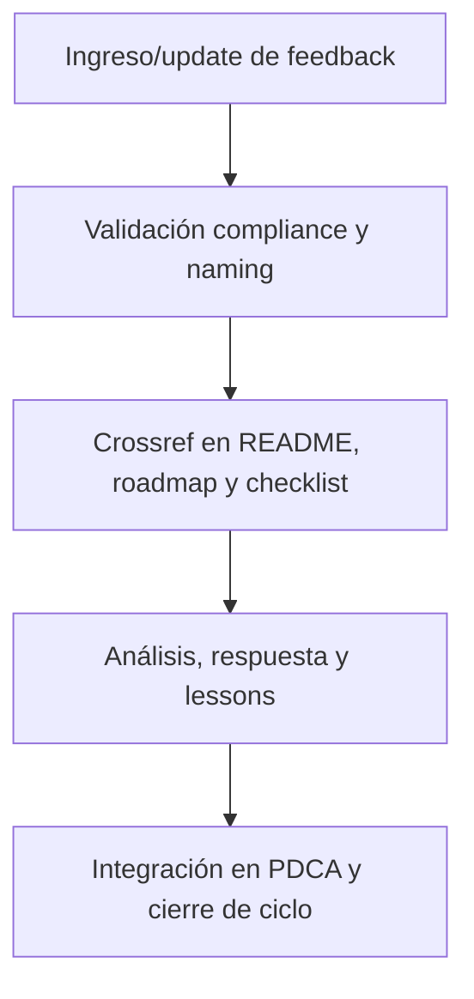

## 5. Changelog local

- 2025-08-06: Versión v3.2, compliance feedback humano/IA.

## 6. Observaciones / Lessons learned

- Todo feedback relevante debe tener seguimiento, respuesta e integración documentada.
- Fomentar la recolección y análisis de feedback estructurado en todos los procesos de la plataforma.

---

**FIN README core/kns/ai\_learn/feed/ v3.2**

## OutputTemplate
```yaml
CODE:
ID:
VERSION:
ROUTE:
CROSSREF:
AUTHOR:
DATE:
```


## core/kns/ai_learn/insi/readme_core_kns_ai_learn_insi_rw_b_v_3_2.md

---
CODE: CORE
ID: readme_core_kns_ai_learn_insi_rw_b_v_3_2_v4
VERSION: v4.0-2025-08-10
ROUTE: /home/runner/work/AingZ_Platform/AingZ_Platform/core/kns/ai_learn/insi/readme_core_kns_ai_learn_insi_rw_b_v_3_2.md
CROSSREF:
  - lifecycle/temp/rw_b_blueprint_v_4_extendido_2025_08_06.md
  - lifecycle/temp/rw_b_master_plan_v_4_extendido_2025_08_06.md
  - lifecycle/temp/prompt_codex_baseline_v_4_check.md
  - core/rulset/RULE_CODING_COMPLIANCE_V4.md
AUTHOR: AingZ_Platform
DATE: 2025-08-10
---
# 🔎 core/kns/ai\_learn/insi/ — Insights Estratégicos y Hallazgos Clave (v3.2)

## 1. Descripción, función, objetivos y contexto

La carpeta `core/kns/ai_learn/insi/` centraliza **insights estratégicos, descubrimientos y hallazgos clave** identificados a lo largo del ciclo de aprendizaje IA/humano y evolución de la plataforma AingZ/RwB.

### Funciones principales:

- Almacenar síntesis, patrones detectados, análisis profundos y hallazgos de valor derivados del feedback, métricas y experiencias de uso.
- Facilitar la explotación estratégica de insights para roadmap, tuning, releases y priorización de mejoras.
- Servir de input para la actualización de workflows, políticas, assets y onboarding IA/humano.

### Integraciones y sistemas relacionados:

- Enlace directo con lessons, feedback, métricas (`ai_learn/`, `metrics/`), y reporting de releases (`wf/`).
- Insights documentados deben alimentar la planificación estratégica y evolución incremental del core.

## 2. Estructura interna

| Archivo/Subcarpeta  | Propósito                                   | Estado |
| ------------------- | ------------------------------------------- | ------ |
| insight\_X.md       | Hallazgo o insight estratégico específico   | Activo |
| patrones\_sintesis/ | Detección de patrones, síntesis y resúmenes | Activo |
| ...                 | Otros descubrimientos y análisis clave      | Activo |

## 3. Metadatos y compliance

- **Versión:** v3.2 — 2025-08-06
- **Owner/Responsable:** AingZ\_Platform · RwB
- **Crossref obligatoria:** Blueprint, master plan, checklist, template universal README (ops/templates/)
- **Naming/Versionado:** Cumplimiento estricto de políticas RwB v3.2
- **Estado:** Activo

## 4. Ciclo de vida y flujos

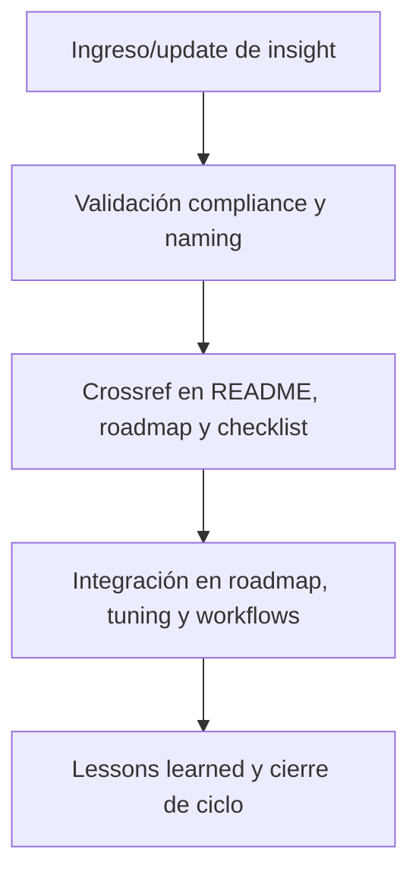

## 5. Changelog local

- 2025-08-06: Versión v3.2, compliance insights y hallazgos estratégicos.

## 6. Observaciones / Lessons learned

- Todo insight o hallazgo debe alimentar roadmap, tuning y lecciones learned globales.
- Mantener síntesis, patrones y hallazgos versionados y trazables para reporting y auditoría.

---

**FIN README core/kns/ai\_learn/insi/ v3.2**

## OutputTemplate
```yaml
CODE:
ID:
VERSION:
ROUTE:
CROSSREF:
AUTHOR:
DATE:
```


## core/kns/ai_learn/learn/readme_core_kns_ai_learn_learn_rw_b_v_3_2.md

---
CODE: CORE
ID: readme_core_kns_ai_learn_learn_rw_b_v_3_2_v4
VERSION: v4.0-2025-08-10
ROUTE: /home/runner/work/AingZ_Platform/AingZ_Platform/core/kns/ai_learn/learn/readme_core_kns_ai_learn_learn_rw_b_v_3_2.md
CROSSREF:
  - lifecycle/temp/rw_b_blueprint_v_4_extendido_2025_08_06.md
  - lifecycle/temp/rw_b_master_plan_v_4_extendido_2025_08_06.md
  - lifecycle/temp/prompt_codex_baseline_v_4_check.md
  - core/rulset/RULE_CODING_COMPLIANCE_V4.md
AUTHOR: AingZ_Platform
DATE: 2025-08-10
---
# 📚 core/kns/ai\_learn/learn/ — Registro Incremental de Aprendizajes (v3.2)

## 1. Descripción, función, objetivos y contexto

La carpeta `core/kns/ai_learn/learn/` centraliza **el registro incremental de aprendizajes, lessons learned y experiencias acumuladas** de la plataforma AingZ/RwB, tanto para IA como para usuarios humanos.

### Funciones principales:

- Almacenar logs y bitácoras de procesos de aprendizaje, onboarding, training, pruebas y lecciones learned.
- Facilitar transferencia de conocimiento, replicabilidad y onboarding IA/humano basado en experiencia viva.
- Asegurar trazabilidad de aprendizajes y lessons para alimentar mejora continua y flujos de onboarding.

### Integraciones y sistemas relacionados:

- Enlace directo con insights, feedback y tuning (`ai_learn/`) y con reporting de training (`trn/`).
- Aprendizajes documentados nutren los procesos de formación IA/humano y evolución incremental de la plataforma.

## 2. Estructura interna

| Archivo/Subcarpeta    | Propósito                                | Estado |
| --------------------- | ---------------------------------------- | ------ |
| aprendizaje\_X.md     | Log o registro de aprendizaje específico | Activo |
| bitacora\_onboarding/ | Bitácoras de onboarding humano/IA        | Activo |
| ...                   | Otros registros y logs de aprendizaje    | Activo |

## 3. Metadatos y compliance

- **Versión:** v3.2 — 2025-08-06
- **Owner/Responsable:** AingZ\_Platform · RwB
- **Crossref obligatoria:** Blueprint, master plan, checklist, template universal README (ops/templates/)
- **Naming/Versionado:** Cumplimiento estricto de políticas RwB v3.2
- **Estado:** Activo

## 4. Ciclo de vida y flujos

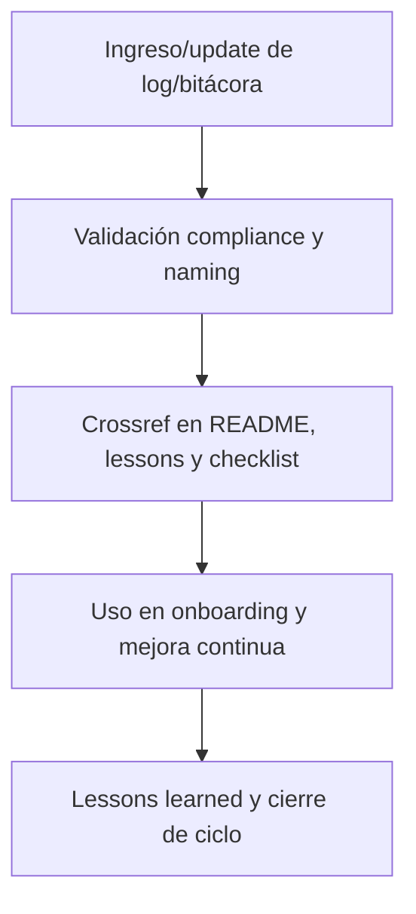

## 5. Changelog local

- 2025-08-06: Versión v3.2, compliance registro incremental de aprendizajes.

## 6. Observaciones / Lessons learned

- Mantener todos los logs y bitácoras versionados y trazables para onboarding y reporting.
- Toda experiencia relevante debe alimentar lessons learned, onboarding y mejora continua.

---

**FIN README core/kns/ai\_learn/learn/ v3.2**

## OutputTemplate
```yaml
CODE:
ID:
VERSION:
ROUTE:
CROSSREF:
AUTHOR:
DATE:
```


## core/kns/ai_learn/readme_core_kns_ai_learn_rw_b_v_3_2.md

---
CODE: CORE
ID: readme_core_kns_ai_learn_rw_b_v_3_2_v4
VERSION: v4.0-2025-08-10
ROUTE: /home/runner/work/AingZ_Platform/AingZ_Platform/core/kns/ai_learn/readme_core_kns_ai_learn_rw_b_v_3_2.md
CROSSREF:
  - lifecycle/temp/rw_b_blueprint_v_4_extendido_2025_08_06.md
  - lifecycle/temp/rw_b_master_plan_v_4_extendido_2025_08_06.md
  - lifecycle/temp/prompt_codex_baseline_v_4_check.md
  - core/rulset/RULE_CODING_COMPLIANCE_V4.md
AUTHOR: AingZ_Platform
DATE: 2025-08-10
---
# 🤖 core/kns/ai\_learn/ — Aprendizaje, Lessons Learned, Insights y Tuning (v3.2)

## 1. Descripción, función, objetivos y contexto

La carpeta `core/kns/ai_learn/` es el **núcleo de registro incremental de aprendizaje, feedback y lessons learned**, tanto para IA como para humanos dentro de la plataforma AingZ/RwB.

### Funciones principales:

- Centralizar el registro y gestión de aprendizaje, tuning, insights, feedback y lessons learned, asegurando trazabilidad y mejora continua.
- Facilitar la explotación, auditoría y análisis de performance de flujos, pipelines, prompts y experiencias de usuario IA/humano.
- Garantizar la integración de lessons y aprendizajes a ciclo PDCA, tuning y onboarding, permitiendo retroalimentación estructurada y contextualizada.

### Integraciones y sistemas relacionados:

- Sincronización y crossref con subniveles (eval, feed, insi, learn, rel, shot, trn, tune).
- Relación directa con workflows de `wf/` y assets de `metrics/` y `chkp/`.
- Lessons e insights alimentan la mejora continua de assets, pipelines, prompts y onboarding.

## 2. Estructura interna

| Subcarpeta / Archivo | Propósito                               | Estado |
| -------------------- | --------------------------------------- | ------ |
| eval/                | Evaluaciones y métricas de aprendizaje  | Activo |
| feed/                | Feedback estructurado humano/IA         | Activo |
| insi/                | Insights estratégicos y hallazgos clave | Activo |
| learn/               | Registro incremental de aprendizajes    | Activo |
| rel/                 | Relevamientos y referencias cruzadas    | Activo |
| shot/                | Snapshots de entrenamiento/aprendizaje  | Activo |
| trn/                 | Registros de entrenamiento y validación | Activo |
| tune/                | Tuning de modelos, prompts y parámetros | Activo |

## 3. Metadatos y compliance

- **Versión:** v3.2 — 2025-08-06
- **Owner/Responsable:** AingZ\_Platform · RwB
- **Crossref obligatoria:** Blueprint, master plan, checklist, triggers, glosario, template universal README (ops/templates/)
- **Naming/Versionado:** Cumplimiento estricto de políticas RwB v3.2
- **Estado:** Activo

## 4. Ciclo de vida y flujos

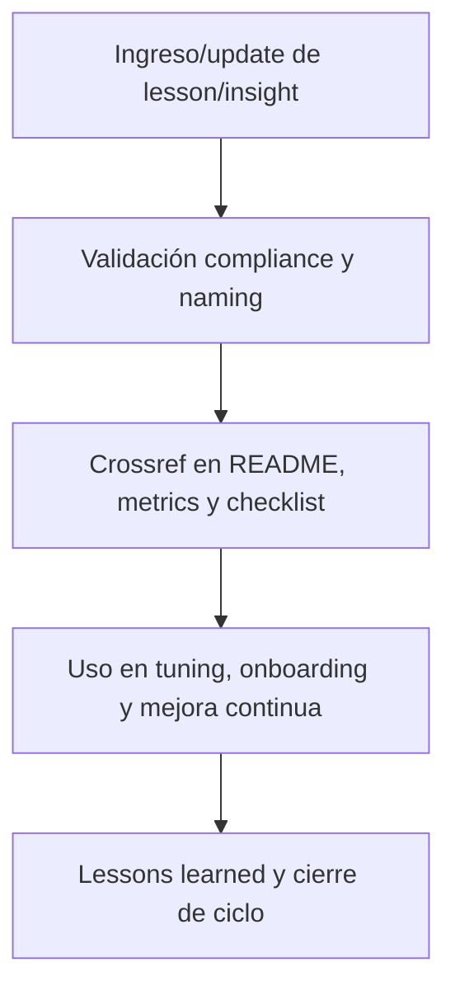

## 5. Changelog local

- 2025-08-06: Versión v3.2, compliance lessons learned, insights y tuning.

## 6. Observaciones / Lessons learned

- Lessons e insights deben alimentar ciclo PDCA de toda la plataforma.
- Validar y documentar siempre feedback estructurado, tuning y aprendizajes IA/humano.

---

**FIN README core/kns/ai\_learn/ v3.2**

## OutputTemplate
```yaml
CODE:
ID:
VERSION:
ROUTE:
CROSSREF:
AUTHOR:
DATE:
```


## core/kns/ai_learn/rel/readme_core_kns_ai_learn_rel_rw_b_v_3_2.md

---
CODE: CORE
ID: readme_core_kns_ai_learn_rel_rw_b_v_3_2_v4
VERSION: v4.0-2025-08-10
ROUTE: /home/runner/work/AingZ_Platform/AingZ_Platform/core/kns/ai_learn/rel/readme_core_kns_ai_learn_rel_rw_b_v_3_2.md
CROSSREF:
  - lifecycle/temp/rw_b_blueprint_v_4_extendido_2025_08_06.md
  - lifecycle/temp/rw_b_master_plan_v_4_extendido_2025_08_06.md
  - lifecycle/temp/prompt_codex_baseline_v_4_check.md
  - core/rulset/RULE_CODING_COMPLIANCE_V4.md
AUTHOR: AingZ_Platform
DATE: 2025-08-10
---
# 🔗 core/kns/ai\_learn/rel/ — Relevamientos y Referencias Cruzadas (v3.2)

## 1. Descripción, función, objetivos y contexto

La carpeta `core/kns/ai_learn/rel/` centraliza **todos los relevamientos, correspondencias y referencias cruzadas** que vinculan aprendizajes, lessons, workflows y assets de la plataforma AingZ/RwB.

### Funciones principales:

- Almacenar mapeos, tablas de correspondencias, referencias externas y análisis de compatibilidad.
- Facilitar la trazabilidad, migración y consolidación de activos y conocimientos en la plataforma.
- Proveer input clave para migraciones, auditorías y mejoras en los flujos de onboarding y assets.

### Integraciones y sistemas relacionados:

- Relación directa con lessons, insights, snapshots y assets de migración/validación (`ai_learn/`, `wf/`).
- Relevamientos documentados alimentan auditorías, reporting y sincronización incremental de assets.

## 2. Estructura interna

| Archivo/Subcarpeta      | Propósito                                    | Estado |
| ----------------------- | -------------------------------------------- | ------ |
| mapeo\_correspondencia/ | Relación entre assets, lecciones y workflows | Activo |
| referencias\_externas/  | Enlaces y correspondencias externas          | Activo |
| ...                     | Otros relevamientos y crossrefs              | Activo |

## 3. Metadatos y compliance

- **Versión:** v3.2 — 2025-08-06
- **Owner/Responsable:** AingZ\_Platform · RwB
- **Crossref obligatoria:** Blueprint, master plan, checklist, template universal README (ops/templates/)
- **Naming/Versionado:** Cumplimiento estricto de políticas RwB v3.2
- **Estado:** Activo

## 4. Ciclo de vida y flujos

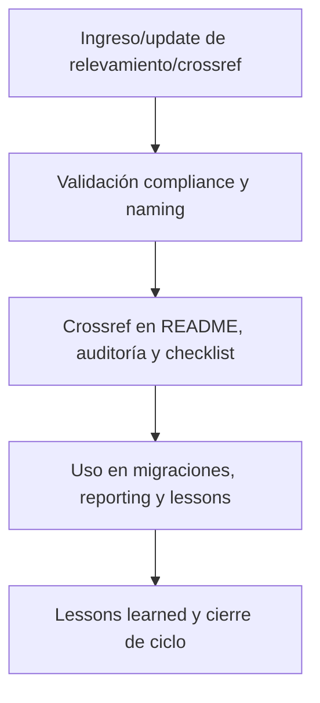

## 5. Changelog local

- 2025-08-06: Versión v3.2, compliance relevamientos y referencias cruzadas.

## 6. Observaciones / Lessons learned

- Todos los relevamientos y referencias deben estar trazados y versionados para migraciones, auditorías y sincronización de assets.
- Mantener correspondencias y crossrefs actualizados ante cualquier cambio en el core.

---

**FIN README core/kns/ai\_learn/rel/ v3.2**

## OutputTemplate
```yaml
CODE:
ID:
VERSION:
ROUTE:
CROSSREF:
AUTHOR:
DATE:
```


## core/kns/ai_learn/shot/readme_core_kns_ai_learn_shot_rw_b_v_3_2.md

---
CODE: CORE
ID: readme_core_kns_ai_learn_shot_rw_b_v_3_2_v4
VERSION: v4.0-2025-08-10
ROUTE: /home/runner/work/AingZ_Platform/AingZ_Platform/core/kns/ai_learn/shot/readme_core_kns_ai_learn_shot_rw_b_v_3_2.md
CROSSREF:
  - lifecycle/temp/rw_b_blueprint_v_4_extendido_2025_08_06.md
  - lifecycle/temp/rw_b_master_plan_v_4_extendido_2025_08_06.md
  - lifecycle/temp/prompt_codex_baseline_v_4_check.md
  - core/rulset/RULE_CODING_COMPLIANCE_V4.md
AUTHOR: AingZ_Platform
DATE: 2025-08-10
---
# 🖼️ core/kns/ai\_learn/shot/ — Snapshots de Entrenamiento/Aprendizaje (v3.2)

## 1. Descripción, función, objetivos y contexto

La carpeta `core/kns/ai_learn/shot/` centraliza **todos los snapshots históricos relevantes** de procesos de entrenamiento y aprendizaje, para auditoría, tracking y análisis incremental de cambios en los sistemas IA/humano de la plataforma AingZ/RwB.

### Funciones principales:

- Almacenar estados históricos (snapshots) de modelos, prompts, pipelines y experiencias de aprendizaje.
- Permitir rollback, tracking de progresos/regresiones y análisis comparativo en ciclos PDCA.
- Proveer soporte para auditoría, validación y reporting incremental.

### Integraciones y sistemas relacionados:

- Enlace directo con lessons, eval, training y migraciones (`ai_learn/`, `wf/`).
- Snapshots documentados deben alimentar procesos de mejora continua y reporting global.

## 2. Estructura interna

| Archivo/Subcarpeta   | Propósito                                    | Estado |
| -------------------- | -------------------------------------------- | ------ |
| snapshot\_modelo\_X/ | Estado histórico de modelo/prompt/training   | Activo |
| comparativas/        | Comparativas entre versiones/snapshots       | Activo |
| ...                  | Otros snapshots de entrenamiento/aprendizaje | Activo |

## 3. Metadatos y compliance

- **Versión:** v3.2 — 2025-08-06
- **Owner/Responsable:** AingZ\_Platform · RwB
- **Crossref obligatoria:** Blueprint, master plan, checklist, template universal README (ops/templates/)
- **Naming/Versionado:** Cumplimiento estricto de políticas RwB v3.2
- **Estado:** Activo

## 4. Ciclo de vida y flujos

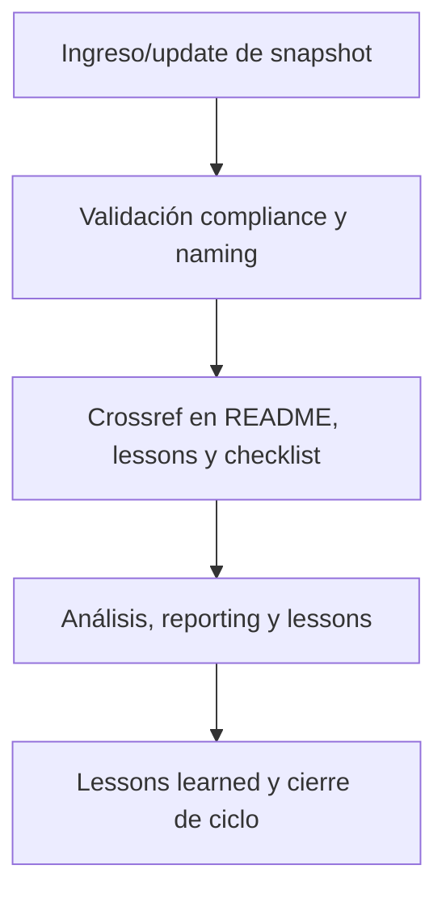

## 5. Changelog local

- 2025-08-06: Versión v3.2, compliance snapshots de entrenamiento/aprendizaje.

## 6. Observaciones / Lessons learned

- Todos los snapshots deben estar versionados y documentados para auditoría y mejora continua.
- Mantener histórico actualizado y sincronizado con lessons, evaluaciones y training.

---

**FIN README core/kns/ai\_learn/shot/ v3.2**

## OutputTemplate
```yaml
CODE:
ID:
VERSION:
ROUTE:
CROSSREF:
AUTHOR:
DATE:
```


## core/kns/ai_learn/trn/readme_core_kns_ai_learn_trn_rw_b_v_3_2.md

---
CODE: CORE
ID: readme_core_kns_ai_learn_trn_rw_b_v_3_2_v4
VERSION: v4.0-2025-08-10
ROUTE: /home/runner/work/AingZ_Platform/AingZ_Platform/core/kns/ai_learn/trn/readme_core_kns_ai_learn_trn_rw_b_v_3_2.md
CROSSREF:
  - lifecycle/temp/rw_b_blueprint_v_4_extendido_2025_08_06.md
  - lifecycle/temp/rw_b_master_plan_v_4_extendido_2025_08_06.md
  - lifecycle/temp/prompt_codex_baseline_v_4_check.md
  - core/rulset/RULE_CODING_COMPLIANCE_V4.md
AUTHOR: AingZ_Platform
DATE: 2025-08-10
---
# 🏋️ core/kns/ai\_learn/trn/ — Registros de Entrenamiento y Validación (v3.2)

## 1. Descripción, función, objetivos y contexto

La carpeta `core/kns/ai_learn/trn/` centraliza **todos los registros, datasets y resultados** de entrenamiento y validación IA/humano, para documentación, auditoría y mejora continua de la plataforma AingZ/RwB.

### Funciones principales:

- Almacenar registros de sesiones de entrenamiento, datasets, scripts, prompts y resultados experimentales.
- Facilitar trazabilidad, análisis de evolución y comparativa entre versiones de entrenamiento.
- Servir de soporte documental para reporting, auditoría y tuning de modelos/procesos IA/humano.

### Integraciones y sistemas relacionados:

- Enlace directo con lessons, tuning, eval y snapshots (`ai_learn/`).
- Training documentado debe alimentar lessons learned y la evolución incremental de assets y workflows.

## 2. Estructura interna

| Archivo/Subcarpeta    | Propósito                                   | Estado |
| --------------------- | ------------------------------------------- | ------ |
| training\_dataset\_X/ | Dataset y resultados de entrenamiento       | Activo |
| resultados\_pruebas/  | Logs y outputs de validación/pruebas        | Activo |
| ...                   | Otros registros de entrenamiento/validación | Activo |

## 3. Metadatos y compliance

- **Versión:** v3.2 — 2025-08-06
- **Owner/Responsable:** AingZ\_Platform · RwB
- **Crossref obligatoria:** Blueprint, master plan, checklist, template universal README (ops/templates/)
- **Naming/Versionado:** Cumplimiento estricto de políticas RwB v3.2
- **Estado:** Activo

## 4. Ciclo de vida y flujos

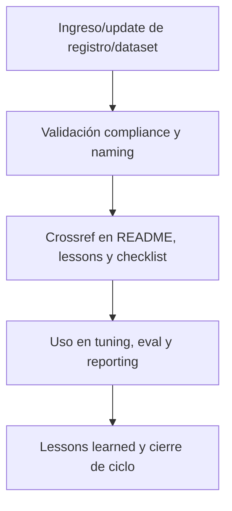

## 5. Changelog local

- 2025-08-06: Versión v3.2, compliance entrenamiento y validación IA/humano.

## 6. Observaciones / Lessons learned

- Todos los registros de entrenamiento y datasets deben estar versionados y trazables.
- Mantener integración viva con lessons learned, tuning y evaluaciones.

---

**FIN README core/kns/ai\_learn/trn/ v3.2**

## OutputTemplate
```yaml
CODE:
ID:
VERSION:
ROUTE:
CROSSREF:
AUTHOR:
DATE:
```


## core/kns/ai_learn/tune/readme_core_kns_ai_learn_tune_rw_b_v_3_2.md

---
CODE: CORE
ID: readme_core_kns_ai_learn_tune_rw_b_v_3_2_v4
VERSION: v4.0-2025-08-10
ROUTE: /home/runner/work/AingZ_Platform/AingZ_Platform/core/kns/ai_learn/tune/readme_core_kns_ai_learn_tune_rw_b_v_3_2.md
CROSSREF:
  - lifecycle/temp/rw_b_blueprint_v_4_extendido_2025_08_06.md
  - lifecycle/temp/rw_b_master_plan_v_4_extendido_2025_08_06.md
  - lifecycle/temp/prompt_codex_baseline_v_4_check.md
  - core/rulset/RULE_CODING_COMPLIANCE_V4.md
AUTHOR: AingZ_Platform
DATE: 2025-08-10
---
# 🎚️ core/kns/ai\_learn/tune/ — Tuning de Modelos, Prompts y Parámetros (v3.2)

## 1. Descripción, función, objetivos y contexto

La carpeta `core/kns/ai_learn/tune/` centraliza **todos los registros de tuning, ajustes y pruebas experimentales** sobre modelos, prompts y parámetros IA/humano, para optimización continua en la plataforma AingZ/RwB.

### Funciones principales:

- Almacenar logs de tuning, comparativas, tests A/B y criterios de aceptación/rechazo de ajustes.
- Permitir análisis de resultados, mejoras, rollback y benchmarking incremental de cambios en prompts/modelos.
- Facilitar el registro y replicabilidad de mejoras implementadas en IA/humano.

### Integraciones y sistemas relacionados:

- Enlace directo con lessons, eval, training y snapshots (`ai_learn/`).
- Tuning documentado debe alimentar lessons learned, reporting y evolución de workflows y prompts.

## 2. Estructura interna

| Archivo/Subcarpeta   | Propósito                                    | Estado |
| -------------------- | -------------------------------------------- | ------ |
| tuning\_modelo\_X.md | Log/registro de tuning de modelo/prompt X    | Activo |
| comparativas\_tests/ | Tests A/B, comparativas y análisis de tuning | Activo |
| ...                  | Otros logs y ajustes de tuning               | Activo |

## 3. Metadatos y compliance

- **Versión:** v3.2 — 2025-08-06
- **Owner/Responsable:** AingZ\_Platform · RwB
- **Crossref obligatoria:** Blueprint, master plan, checklist, template universal README (ops/templates/)
- **Naming/Versionado:** Cumplimiento estricto de políticas RwB v3.2
- **Estado:** Activo

## 4. Ciclo de vida y flujos

```mermaid
graph TD;
  A[Ingreso/update de tuning/log] --> B[Validación compliance y naming]
  B --> C[Crossref en README, lessons y checklist]
  C --> D[Análisis, benchmarking y lessons]
  D --> E[Lessons learned y cierre de ciclo]
```

## 5. Changelog local

- 2025-08-06: Versión v3.2, compliance tuning modelos/prompts.

## 6. Observaciones / Lessons learned

- Todos los logs y registros de tuning deben estar versionados y trazables.
- Mantener benchmarking y comparación viva con lessons, training y evaluaciones.

---

**FIN README core/kns/ai\_learn/tune/ v3.2**

## OutputTemplate
```yaml
CODE:
ID:
VERSION:
ROUTE:
CROSSREF:
AUTHOR:
DATE:
```


## core/kns/chkp/aingz_platform/readme_core_kns_chkp_aingz_platform_rw_b_v_3_2.md

---
CODE: CORE
ID: readme_core_kns_chkp_aingz_platform_rw_b_v_3_2_v4
VERSION: v4.0-2025-08-10
ROUTE: /home/runner/work/AingZ_Platform/AingZ_Platform/core/kns/chkp/aingz_platform/readme_core_kns_chkp_aingz_platform_rw_b_v_3_2.md
CROSSREF:
  - lifecycle/temp/rw_b_blueprint_v_4_extendido_2025_08_06.md
  - lifecycle/temp/rw_b_master_plan_v_4_extendido_2025_08_06.md
  - lifecycle/temp/prompt_codex_baseline_v_4_check.md
  - core/rulset/RULE_CODING_COMPLIANCE_V4.md
AUTHOR: AingZ_Platform
DATE: 2025-08-10
---
# 🌐 core/kns/chkp/aingz\_platform/ — Checkpoints de Plataforma Global (v3.2)

## 1. Descripción, función, objetivos y contexto

La carpeta `core/kns/chkp/aingz_platform/` almacena **los checkpoints y snapshots globales** de la plataforma AingZ/RwB, documentando estados, releases y milestones críticos a nivel raíz.

### Funciones principales:

- Registrar snapshots de contexto vivo, releases y migraciones globales de la plataforma.
- Facilitar rollback, validación y consolidación de cambios estructurales y de releases principales.
- Servir de input documental para auditoría, reporting y mejora continua a nivel plataforma global.

### Integraciones y sistemas relacionados:

- Crossref con reporting, lessons y migraciones (`ai_learn/`, `wf/`).
- Checkpoints globales nutren auditoría y onboarding para nuevas releases o migraciones raíz.

## 2. Estructura interna

| Archivo/Subcarpeta | Propósito                                | Estado |
| ------------------ | ---------------------------------------- | ------ |
| checkpoint\_X.md   | Checkpoint o snapshot global específico  | Activo |
| milestones/        | Registro de hitos/milestones de releases | Activo |
| ...                | Otros estados globales relevantes        | Activo |

## 3. Metadatos y compliance

- **Versión:** v3.2 — 2025-08-06
- **Owner/Responsable:** AingZ\_Platform · RwB
- **Crossref obligatoria:** Blueprint, master plan, checklist, template universal README (ops/templates/)
- **Naming/Versionado:** Cumplimiento estricto de políticas RwB v3.2
- **Estado:** Activo

## 4. Ciclo de vida y flujos

```mermaid
graph TD;
  A[Ingreso/update de checkpoint global] --> B[Validación compliance y naming]
  B --> C[Crossref en README, auditoría y checklist]
  C --> D[Análisis, rollback y lessons]
  D --> E[Lessons learned y cierre de ciclo]
```

## 5. Changelog local

- 2025-08-06: Versión v3.2, compliance checkpoints de plataforma global.

## 6. Observaciones / Lessons learned

- Todos los checkpoints globales deben estar versionados y trazables, integrados a auditoría y releases principales.
- Mantener sincronización incremental con reporting, lessons y migraciones.

---

**FIN README core/kns/chkp/aingz\_platform/ v3.2**

## OutputTemplate
```yaml
CODE:
ID:
VERSION:
ROUTE:
CROSSREF:
AUTHOR:
DATE:
```


## core/kns/chkp/projects/readme_core_kns_chkp_projects_rw_b_v_3_2.md

---
CODE: CORE
ID: readme_core_kns_chkp_projects_rw_b_v_3_2_v4
VERSION: v4.0-2025-08-10
ROUTE: /home/runner/work/AingZ_Platform/AingZ_Platform/core/kns/chkp/projects/readme_core_kns_chkp_projects_rw_b_v_3_2.md
CROSSREF:
  - lifecycle/temp/rw_b_blueprint_v_4_extendido_2025_08_06.md
  - lifecycle/temp/rw_b_master_plan_v_4_extendido_2025_08_06.md
  - lifecycle/temp/prompt_codex_baseline_v_4_check.md
  - core/rulset/RULE_CODING_COMPLIANCE_V4.md
AUTHOR: AingZ_Platform
DATE: 2025-08-10
---
# 🗂️ core/kns/chkp/projects/ — Checkpoints por Proyecto/Ramas (v3.2)

## 1. Descripción, función, objetivos y contexto

La carpeta `core/kns/chkp/projects/` almacena **checkpoints, snapshots y estados de avance** de cada proyecto o rama dentro de la plataforma AingZ/RwB.

### Funciones principales:

- Registrar snapshots y estados de avance particulares para proyectos, subplataformas o ramas.
- Facilitar rollback, validación, consolidación y auditoría específica de cada rama o proyecto.
- Servir de input documental para reporting, lessons y mejora incremental en proyectos activos.

### Integraciones y sistemas relacionados:

- Crossref con reporting, lessons y migraciones (`ai_learn/`, `wf/`).
- Checkpoints de proyectos nutren onboarding y migraciones por dominio/fase.

## 2. Estructura interna

| Archivo/Subcarpeta     | Propósito                            | Estado |
| ---------------------- | ------------------------------------ | ------ |
| checkpoint\_proyectoX/ | Snapshot y avance de proyecto/rama X | Activo |
| ...                    | Otros estados/proyectos relevantes   | Activo |

## 3. Metadatos y compliance

- **Versión:** v3.2 — 2025-08-06
- **Owner/Responsable:** AingZ\_Platform · RwB
- **Crossref obligatoria:** Blueprint, master plan, checklist, template universal README (ops/templates/)
- **Naming/Versionado:** Cumplimiento estricto de políticas RwB v3.2
- **Estado:** Activo

## 4. Ciclo de vida y flujos

```mermaid
graph TD;
  A[Ingreso/update de checkpoint de proyecto] --> B[Validación compliance y naming]
  B --> C[Crossref en README, auditoría y checklist]
  C --> D[Análisis, rollback y lessons]
  D --> E[Lessons learned y cierre de ciclo]
```

## 5. Changelog local

- 2025-08-06: Versión v3.2, compliance checkpoints por proyecto/ramas.

## 6. Observaciones / Lessons learned

- Todos los checkpoints de proyectos deben estar versionados y trazables, integrados a auditoría y lessons específicas de rama.
- Mantener sincronización incremental con reporting, lessons y migraciones de cada proyecto.

---

**FIN README core/kns/chkp/projects/ v3.2**

## OutputTemplate
```yaml
CODE:
ID:
VERSION:
ROUTE:
CROSSREF:
AUTHOR:
DATE:
```


## core/kns/chkp/readme_core_kns_chkp_rw_b_v_3_2.md

---
CODE: CORE
ID: readme_core_kns_chkp_rw_b_v_3_2_v4
VERSION: v4.0-2025-08-10
ROUTE: /home/runner/work/AingZ_Platform/AingZ_Platform/core/kns/chkp/readme_core_kns_chkp_rw_b_v_3_2.md
CROSSREF:
  - lifecycle/temp/rw_b_blueprint_v_4_extendido_2025_08_06.md
  - lifecycle/temp/rw_b_master_plan_v_4_extendido_2025_08_06.md
  - lifecycle/temp/prompt_codex_baseline_v_4_check.md
  - core/rulset/RULE_CODING_COMPLIANCE_V4.md
AUTHOR: AingZ_Platform
DATE: 2025-08-10
---
# ✅ core/kns/chkp/ — Checkpoints y Snapshots de Plataforma/Proyectos (v3.2)

## 1. Descripción, función, objetivos y contexto

La carpeta `core/kns/chkp/` centraliza **todos los checkpoints, snapshots y estados de avance** tanto de la plataforma global como de cada proyecto/ramas en la plataforma AingZ/RwB.

### Funciones principales:

- Almacenar snapshots de estados, avances y releases de plataforma y proyectos clave.
- Facilitar rollback, auditoría, validación y consolidación de cambios en cualquier nivel del core.
- Garantizar trazabilidad y control incremental del contexto vivo y releases de activos críticos.

### Integraciones y sistemas relacionados:

- Crossref con lessons, reporting y migraciones (`ai_learn/`, `wf/`).
- Checkpoints documentados alimentan auditoría, onboarding y mejora continua a nivel plataforma/proyectos.

## 2. Estructura interna

| Subcarpeta/Archivo | Propósito                              | Estado |
| ------------------ | -------------------------------------- | ------ |
| aingz\_platform/   | Checkpoints y snapshots globales       | Activo |
| projects/          | Checkpoints por proyecto/ramas         | Activo |
| ...                | Otros snapshots/checkpoints relevantes | Activo |

## 3. Metadatos y compliance

- **Versión:** v3.2 — 2025-08-06
- **Owner/Responsable:** AingZ\_Platform · RwB
- **Crossref obligatoria:** Blueprint, master plan, checklist, template universal README (ops/templates/)
- **Naming/Versionado:** Cumplimiento estricto de políticas RwB v3.2
- **Estado:** Activo

## 4. Ciclo de vida y flujos

```mermaid
graph TD;
  A[Ingreso/update de checkpoint/snapshot] --> B[Validación compliance y naming]
  B --> C[Crossref en README, auditoría y checklist]
  C --> D[Análisis, rollback y lessons]
  D --> E[Lessons learned y cierre de ciclo]
```

## 5. Changelog local

- 2025-08-06: Versión v3.2, compliance checkpoints de plataforma y proyectos.

## 6. Observaciones / Lessons learned

- Todos los checkpoints deben estar versionados y trazables, listos para rollback y auditoría.
- Mantener sincronización incremental y crossref con lessons, reporting y migraciones.

---

**FIN README core/kns/chkp/ v3.2**

## OutputTemplate
```yaml
CODE:
ID:
VERSION:
ROUTE:
CROSSREF:
AUTHOR:
DATE:
```


## core/kns/ctx/aingz_platform/readme_core_kns_ctx_aingz_platform_rw_b_v_3_2.md

---
CODE: CORE
ID: readme_core_kns_ctx_aingz_platform_rw_b_v_3_2_v4
VERSION: v4.0-2025-08-10
ROUTE: /home/runner/work/AingZ_Platform/AingZ_Platform/core/kns/ctx/aingz_platform/readme_core_kns_ctx_aingz_platform_rw_b_v_3_2.md
CROSSREF:
  - lifecycle/temp/rw_b_blueprint_v_4_extendido_2025_08_06.md
  - lifecycle/temp/rw_b_master_plan_v_4_extendido_2025_08_06.md
  - lifecycle/temp/prompt_codex_baseline_v_4_check.md
  - core/rulset/RULE_CODING_COMPLIANCE_V4.md
AUTHOR: AingZ_Platform
DATE: 2025-08-10
---
# 🌐 core/kns/ctx/aingz\_platform/ — Contexto Extendido de Plataforma Global (v3.2)

## 1. Descripción, función, objetivos y contexto

La carpeta `core/kns/ctx/aingz_platform/` almacena **contexto extendido, configuraciones y preferencias** de la plataforma global AingZ/RwB, documentando la base contextual y de personalización de la experiencia IA/humano.

### Funciones principales:

- Registrar configuraciones, contexto operativo global y glosario extendido de plataforma.
- Facilitar onboarding contextualizado, personalización de experiencia y reporting de contexto vivo global.
- Servir de input para IA/humano en explotación de preferencias, contexto histórico y vocabulario ampliado.

### Integraciones y sistemas relacionados:

- Crossref con onboarding, lessons y checkpoints globales (`doc/`, `kns/`, `chkp/`).
- Contexto global nutre personalización, recuperación de contexto y formación IA/humano.

## 2. Estructura interna

| Archivo/Subcarpeta      | Propósito                                   | Estado |
| ----------------------- | ------------------------------------------- | ------ |
| preferencias\_globales/ | Configuración y preferencias raíz           | Activo |
| glosario\_extendido.md  | Vocabulario y contexto extendido plataforma | Activo |
| ...                     | Otros contextos globales relevantes         | Activo |

## 3. Metadatos y compliance

- **Versión:** v3.2 — 2025-08-06
- **Owner/Responsable:** AingZ\_Platform · RwB
- **Crossref obligatoria:** Blueprint, master plan, checklist, template universal README (ops/templates/)
- **Naming/Versionado:** Cumplimiento estricto de políticas RwB v3.2
- **Estado:** Activo

## 4. Ciclo de vida y flujos

```mermaid
graph TD;
  A[Ingreso/update de contexto global] --> B[Validación compliance y naming]
  B --> C[Crossref en README, onboarding y checklist]
  C --> D[Recuperación y explotación por IA/humano]
  D --> E[Lessons learned y cierre de ciclo]
```

## 5. Changelog local

- 2025-08-06: Versión v3.2, compliance contexto extendido plataforma global.

## 6. Observaciones / Lessons learned

- Todo cambio de contexto/preferencia global debe estar versionado y referenciado.
- Mantener onboarding y recuperación de contexto global sincronizados con releases y lessons.

---

**FIN README core/kns/ctx/aingz\_platform/ v3.2**

## OutputTemplate
```yaml
CODE:
ID:
VERSION:
ROUTE:
CROSSREF:
AUTHOR:
DATE:
```


## core/kns/ctx/projects/readme_core_kns_ctx_projects_rw_b_v_3_2.md

---
CODE: CORE
ID: readme_core_kns_ctx_projects_rw_b_v_3_2_v4
VERSION: v4.0-2025-08-10
ROUTE: /home/runner/work/AingZ_Platform/AingZ_Platform/core/kns/ctx/projects/readme_core_kns_ctx_projects_rw_b_v_3_2.md
CROSSREF:
  - lifecycle/temp/rw_b_blueprint_v_4_extendido_2025_08_06.md
  - lifecycle/temp/rw_b_master_plan_v_4_extendido_2025_08_06.md
  - lifecycle/temp/prompt_codex_baseline_v_4_check.md
  - core/rulset/RULE_CODING_COMPLIANCE_V4.md
AUTHOR: AingZ_Platform
DATE: 2025-08-10
---
# 🗂️ core/kns/ctx/projects/ — Contexto Extendido por Proyecto/Rama (v3.2)

## 1. Descripción, función, objetivos y contexto

La carpeta `core/kns/ctx/projects/` almacena **contextos extendidos, configuraciones y preferencias** de cada proyecto/rama de la plataforma AingZ/RwB, asegurando personalización, onboarding y explotación de contexto vivo a nivel micro.

### Funciones principales:

- Registrar configuraciones, contexto operativo y glosario ampliado de cada proyecto/rama.
- Facilitar onboarding incremental, personalización y reporting de contexto vivo específico.
- Servir de input para IA/humano en recuperación y análisis de contexto histórico/actual por proyecto/rama.

### Integraciones y sistemas relacionados:

- Crossref con onboarding, lessons y checkpoints de proyecto (`doc/`, `kns/`, `chkp/`).
- Contexto de proyecto nutre personalización, recuperación de contexto y mejora de experiencia a nivel de rama.

## 2. Estructura interna

| Archivo/Subcarpeta | Propósito                                    | Estado |
| ------------------ | -------------------------------------------- | ------ |
| preferencias\_X/   | Preferencias y configuraciones de proyecto X | Activo |
| glosario\_X.md     | Glosario ampliado de proyecto/rama X         | Activo |
| ...                | Otros contextos específicos                  | Activo |

## 3. Metadatos y compliance

- **Versión:** v3.2 — 2025-08-06
- **Owner/Responsable:** AingZ\_Platform · RwB
- **Crossref obligatoria:** Blueprint, master plan, checklist, template universal README (ops/templates/)
- **Naming/Versionado:** Cumplimiento estricto de políticas RwB v3.2
- **Estado:** Activo

## 4. Ciclo de vida y flujos

```mermaid
graph TD;
  A[Ingreso/update de contexto proyecto/rama] --> B[Validación compliance y naming]
  B --> C[Crossref en README, onboarding y checklist]
  C --> D[Recuperación y explotación por IA/humano]
  D --> E[Lessons learned y cierre de ciclo]
```

## 5. Changelog local

- 2025-08-06: Versión v3.2, compliance contexto extendido proyecto/rama.

## 6. Observaciones / Lessons learned

- Todo cambio de contexto/preferencia de proyecto debe estar versionado y referenciado.
- Mantener onboarding y recuperación de contexto de proyecto/rama sincronizados con lessons y releases de rama.

---

**FIN README core/kns/ctx/projects/ v3.2**

## OutputTemplate
```yaml
CODE:
ID:
VERSION:
ROUTE:
CROSSREF:
AUTHOR:
DATE:
```


## core/kns/ctx/readme_core_kns_ctx_rw_b_v_3_2.md

---
CODE: CORE
ID: readme_core_kns_ctx_rw_b_v_3_2_v4
VERSION: v4.0-2025-08-10
ROUTE: /home/runner/work/AingZ_Platform/AingZ_Platform/core/kns/ctx/readme_core_kns_ctx_rw_b_v_3_2.md
CROSSREF:
  - lifecycle/temp/rw_b_blueprint_v_4_extendido_2025_08_06.md
  - lifecycle/temp/rw_b_master_plan_v_4_extendido_2025_08_06.md
  - lifecycle/temp/prompt_codex_baseline_v_4_check.md
  - core/rulset/RULE_CODING_COMPLIANCE_V4.md
AUTHOR: AingZ_Platform
DATE: 2025-08-10
---
# 🌐 core/kns/ctx/ — Contexto, Preferencias y Glosario Extendido (v3.2)

## 1. Descripción, función, objetivos y contexto

La carpeta `core/kns/ctx/` centraliza **todo el contexto operativo, preferencias y glosario extendido** de la plataforma y proyectos AingZ/RwB, sirviendo como base para onboarding IA/humano, personalización y recuperación de contexto vivo.

### Funciones principales:

- Almacenar configuraciones de contexto, preferencias de usuario y glosario extendido para cada rama/plataforma/proyecto.
- Garantizar onboarding contextualizado, personalización y trazabilidad en cada ciclo de evolución de la plataforma.
- Servir como input para IA/humano en recuperación y explotación de contexto vivo (histórico, preferencias, vocabulario ampliado).

### Integraciones y sistemas relacionados:

- Crossref con onboarding, lessons, chkp/ y reporting (`doc/`, `kns/`).
- Contextos documentados nutren IA/humano para personalización, recuperación rápida y mejora de experiencia de usuario.

## 2. Estructura interna

| Subcarpeta/Archivo | Propósito                                 | Estado |
| ------------------ | ----------------------------------------- | ------ |
| aingz\_platform/   | Contexto extendido de plataforma global   | Activo |
| projects/          | Contexto y preferencias por proyecto/rama | Activo |
| ...                | Otros contextos relevantes                | Activo |

## 3. Metadatos y compliance

- **Versión:** v3.2 — 2025-08-06
- **Owner/Responsable:** AingZ\_Platform · RwB
- **Crossref obligatoria:** Blueprint, master plan, checklist, template universal README (ops/templates/)
- **Naming/Versionado:** Cumplimiento estricto de políticas RwB v3.2
- **Estado:** Activo

## 4. Ciclo de vida y flujos

```mermaid
graph TD;
  A[Ingreso/update de contexto/preferencias] --> B[Validación compliance y naming]
  B --> C[Crossref en README, onboarding y checklist]
  C --> D[Recuperación y explotación por IA/humano]
  D --> E[Lessons learned y cierre de ciclo]
```

## 5. Changelog local

- 2025-08-06: Versión v3.2, compliance contexto vivo y preferencias IA/humano.

## 6. Observaciones / Lessons learned

- Todo cambio de contexto/preferencia debe ser versionado y referenciado.
- Mantener onboarding y recuperación de contexto alineados a evolución incremental.

---

**FIN README core/kns/ctx/ v3.2**

## OutputTemplate
```yaml
CODE:
ID:
VERSION:
ROUTE:
CROSSREF:
AUTHOR:
DATE:
```


## core/kns/glossary/readme_core_kns_glossary_rw_b_v_3_2.md

---
CODE: CORE
ID: readme_core_kns_glossary_rw_b_v_3_2_v4
VERSION: v4.0-2025-08-10
ROUTE: /home/runner/work/AingZ_Platform/AingZ_Platform/core/kns/glossary/readme_core_kns_glossary_rw_b_v_3_2.md
CROSSREF:
  - lifecycle/temp/rw_b_blueprint_v_4_extendido_2025_08_06.md
  - lifecycle/temp/rw_b_master_plan_v_4_extendido_2025_08_06.md
  - lifecycle/temp/prompt_codex_baseline_v_4_check.md
  - core/rulset/RULE_CODING_COMPLIANCE_V4.md
AUTHOR: AingZ_Platform
DATE: 2025-08-10
---
# 📖 core/kns/glossary/ — Glosario Code Universal (vivo) (v3.2)

## 1. Descripción, función, objetivos y contexto

La carpeta `core/kns/glossary/` centraliza **el glosario code universal vivo**, usado para asegurar consistencia semántica, naming y taxonomía en toda la plataforma AingZ/RwB para IA y humanos.

### Funciones principales:

- Almacenar y versionar el glosario code universal, actualizado por pipeline desde `data/dicts/`.
- Servir como fuente única de verdad semántica para IA, scripts, workflows y documentación.
- Facilitar recuperación, validación y expansión incremental de la taxonomía y naming universal.

### Integraciones y sistemas relacionados:

- Crossref con triggers y diccionarios de dominio (`kns/triggers/`, `data/dicts/`).
- Glosario documentado nutre onboarding, validación y compliance en todos los buckets y assets principales.

## 2. Estructura interna

| Archivo/Subcarpeta                       | Propósito                    | Estado |
| ---------------------------------------- | ---------------------------- | ------ |
| rw\_b\_glosario\_code\_v\_2\_20250729.md | Glosario code universal vivo | Activo |
| ...                                      | Otras versiones históricas   | Activo |

## 3. Metadatos y compliance

- **Versión:** v3.2 — 2025-08-06
- **Owner/Responsable:** AingZ\_Platform · RwB
- **Crossref obligatoria:** Blueprint, master plan, checklist, template universal README (ops/templates/)
- **Naming/Versionado:** Cumplimiento estricto de políticas RwB v3.2
- **Estado:** Activo

## 4. Ciclo de vida y flujos

```mermaid
graph TD;
  A[Ingreso/update de glosario code] --> B[Validación compliance y naming]
  B --> C[Crossref en README, onboarding y checklist]
  C --> D[Sincronización con triggers/dicts]
  D --> E[Lessons learned y cierre de ciclo]
```

## 5. Changelog local

- 2025-08-06: Versión v3.2, compliance glosario code universal vivo.

## 6. Observaciones / Lessons learned

- El glosario solo debe actualizarse vía pipeline y estar sincronizado con triggers/dicts de data/.
- Mantener trazabilidad de cambios y releases históricos del glosario code.

---

**FIN README core/kns/glossary/ v3.2**

## OutputTemplate
```yaml
CODE:
ID:
VERSION:
ROUTE:
CROSSREF:
AUTHOR:
DATE:
```


## core/kns/ideas_brainstorm/readme_core_kns_ideas_brainstorm_rw_b_v_3_2.md

---
CODE: CORE
ID: readme_core_kns_ideas_brainstorm_rw_b_v_3_2_v4
VERSION: v4.0-2025-08-10
ROUTE: /home/runner/work/AingZ_Platform/AingZ_Platform/core/kns/ideas_brainstorm/readme_core_kns_ideas_brainstorm_rw_b_v_3_2.md
CROSSREF:
  - lifecycle/temp/rw_b_blueprint_v_4_extendido_2025_08_06.md
  - lifecycle/temp/rw_b_master_plan_v_4_extendido_2025_08_06.md
  - lifecycle/temp/prompt_codex_baseline_v_4_check.md
  - core/rulset/RULE_CODING_COMPLIANCE_V4.md
AUTHOR: AingZ_Platform
DATE: 2025-08-10
---
# 💡 core/kns/ideas\_brainstorm/ — Brainstorming e Ideación Incremental (v3.2)

## 1. Descripción, función, objetivos y contexto

La carpeta `core/kns/ideas_brainstorm/` centraliza **el brainstorming, la ideación y las propuestas incrementales** de mejoras, features, arquitecturas y workflows en la plataforma AingZ/RwB.

### Funciones principales:

- Almacenar drafts, propuestas, brainstorming y notas de ideación incremental, tanto IA como humano.
- Servir de insumo para roadmap, releases, features y ajustes de workflows o activos críticos.
- Garantizar la trazabilidad, versionado y evaluación estructurada de propuestas de mejora.

### Integraciones y sistemas relacionados:

- Crossref con lessons, insights, roadmap y reporting incremental (`ai_learn/`, `wf/`).
- Propuestas documentadas nutren la toma de decisiones, priorización y validación en la evolución del core.

## 2. Estructura interna

| Archivo/Subcarpeta   | Propósito                         | Estado |
| -------------------- | --------------------------------- | ------ |
| brainstorming\_X.md  | Draft/idea incremental específica | Activo |
| propuestas\_feature/ | Propuestas de features y mejoras  | Activo |
| ...                  | Otras ideas y notas de ideación   | Activo |

## 3. Metadatos y compliance

- **Versión:** v3.2 — 2025-08-06
- **Owner/Responsable:** AingZ\_Platform · RwB
- **Crossref obligatoria:** Blueprint, master plan, checklist, template universal README (ops/templates/)
- **Naming/Versionado:** Cumplimiento estricto de políticas RwB v3.2
- **Estado:** Activo

## 4. Ciclo de vida y flujos

```mermaid
graph TD;
  A[Ingreso/update de idea/propuesta] --> B[Validación compliance y naming]
  B --> C[Crossref en README, roadmap y checklist]
  C --> D[Evaluación, feedback y lessons]
  D --> E[Lessons learned y cierre de ciclo]
```

## 5. Changelog local

- 2025-08-06: Versión v3.2, compliance brainstorming e ideación incremental.

## 6. Observaciones / Lessons learned

- Todas las propuestas e ideas deben estar trazadas, versionadas y vinculadas a roadmap y releases.
- Fomentar la documentación incremental y evaluación estructurada de la ideación IA/humano.

---

**FIN README core/kns/ideas\_brainstorm/ v3.2**

## OutputTemplate
```yaml
CODE:
ID:
VERSION:
ROUTE:
CROSSREF:
AUTHOR:
DATE:
```


## core/kns/metrics/readme_core_kns_metrics_rw_b_v_3_2.md

---
CODE: CORE
ID: readme_core_kns_metrics_rw_b_v_3_2_v4
VERSION: v4.0-2025-08-10
ROUTE: /home/runner/work/AingZ_Platform/AingZ_Platform/core/kns/metrics/readme_core_kns_metrics_rw_b_v_3_2.md
CROSSREF:
  - lifecycle/temp/rw_b_blueprint_v_4_extendido_2025_08_06.md
  - lifecycle/temp/rw_b_master_plan_v_4_extendido_2025_08_06.md
  - lifecycle/temp/prompt_codex_baseline_v_4_check.md
  - core/rulset/RULE_CODING_COMPLIANCE_V4.md
AUTHOR: AingZ_Platform
DATE: 2025-08-10
---
# 📈 core/kns/metrics/ — Métricas de Performance y QA (v3.2)

## 1. Descripción, función, objetivos y contexto

La carpeta `core/kns/metrics/` centraliza **todas las métricas de performance, calidad y validación** asociadas al ciclo de vida de la plataforma AingZ/RwB y sus activos IA/humano.

### Funciones principales:

- Almacenar indicadores clave (KPIs), logs de calidad, métricas de validación y reportes de performance de assets críticos.
- Servir de base para auditoría, reporting, análisis de mejora continua y control de releases.
- Garantizar trazabilidad, replicabilidad y benchmarking incremental de la evolución de la plataforma.

### Integraciones y sistemas relacionados:

- Crossref con eval, lessons, feedback, workflows y auditoría (`ai_learn/`, `wf/`).
- Métricas documentadas nutren reporting, auditoría, releases y toma de decisiones incremental.

## 2. Estructura interna

| Archivo/Subcarpeta | Propósito                            | Estado |
| ------------------ | ------------------------------------ | ------ |
| kpi\_X.md          | Indicador clave de performance (KPI) | Activo |
| reporte\_qa/       | Reportes de calidad y validación     | Activo |
| ...                | Otras métricas y logs de performance | Activo |

## 3. Metadatos y compliance

- **Versión:** v3.2 — 2025-08-06
- **Owner/Responsable:** AingZ\_Platform · RwB
- **Crossref obligatoria:** Blueprint, master plan, checklist, template universal README (ops/templates/)
- **Naming/Versionado:** Cumplimiento estricto de políticas RwB v3.2
- **Estado:** Activo

## 4. Ciclo de vida y flujos

```mermaid
graph TD;
  A[Ingreso/update de métrica/log] --> B[Validación compliance y naming]
  B --> C[Crossref en README, eval y checklist]
  C --> D[Reporting, auditoría y lessons]
  D --> E[Lessons learned y cierre de ciclo]
```

## 5. Changelog local

- 2025-08-06: Versión v3.2, compliance métricas de performance y QA.

## 6. Observaciones / Lessons learned

- Todas las métricas y logs deben estar versionados y trazados para reporting y mejora continua.
- Mantener benchmarking incremental y control cruzado con auditoría, eval y lessons learned.

---

**FIN README core/kns/metrics/ v3.2**

## OutputTemplate
```yaml
CODE:
ID:
VERSION:
ROUTE:
CROSSREF:
AUTHOR:
DATE:
```


## core/kns/readme_core_kns_rw_b_v_3_2.md

---
CODE: CORE
ID: readme_core_kns_rw_b_v_3_2_v4
VERSION: v4.0-2025-08-10
ROUTE: /home/runner/work/AingZ_Platform/AingZ_Platform/core/kns/readme_core_kns_rw_b_v_3_2.md
CROSSREF:
  - lifecycle/temp/rw_b_blueprint_v_4_extendido_2025_08_06.md
  - lifecycle/temp/rw_b_master_plan_v_4_extendido_2025_08_06.md
  - lifecycle/temp/prompt_codex_baseline_v_4_check.md
  - core/rulset/RULE_CODING_COMPLIANCE_V4.md
AUTHOR: AingZ_Platform
DATE: 2025-08-10
---
# 🧠 core/kns/ — Knowledge Base, Glosario y Triggers vivos (v3.2)

## 1. Descripción, función, objetivos y contexto

La carpeta `core/kns/` es el **núcleo de conocimiento vivo, aprendizaje y referencia semántica** de la plataforma AingZ/RwB.

### Funciones principales:

- Centralizar el registro incremental de aprendizaje, insights, feedback, lessons learned y métricas de performance/QA.
- Mantener los glosarios (code, universal) y triggers activos y sincronizados, asegurando contexto único y semántica robusta para humanos e IA.
- Gestionar checkpoints, contexto, brainstorming y métricas para validación continua y onboarding automático.
- Facilitar la explotación de insights, propuestas y mejoras continuas a través de flujos de feedback y PDCA.

### Integraciones y sistemas relacionados:

- Sincronización directa con `data/dicts/` para glosarios, triggers y taxonomías.
- Interfaz con `wf/` para registro y análisis de workflows, auditorías y migraciones.
- Feedback e insights utilizados por pipelines de `ops/` y onboarding de `doc/`.
- Crossref viva a blueprint, master plan y checklist.

## 2. Estructura interna

| Subcarpeta / Archivo | Propósito                                                     | Estado |
| -------------------- | ------------------------------------------------------------- | ------ |
| ai\_learn/           | Registro de aprendizaje, feedback, insights, tuning, training | Activo |
| chkp/                | Checkpoints de plataforma y proyectos                         | Activo |
| ctx/                 | Contexto, preferencias, glosario extendido                    | Activo |
| glossary/            | Glosario code universal (vivo, sincronizado)                  | Activo |
| triggers/            | Diccionario de triggers (vivo, sincronizado)                  | Activo |
| ideas\_brainstorm/   | Brainstorming, ideación, propuestas                           | Activo |
| metrics/             | Métricas de performance y QA                                  | Activo |

## 3. Metadatos y compliance

- **Versión:** v3.2 — 2025-08-06
- **Owner/Responsable:** AingZ\_Platform · RwB
- **Crossref obligatoria:** Blueprint, master plan, checklist, triggers, glosario, template universal README (ops/templates/)
- **Naming/Versionado:** Cumplimiento estricto de políticas RwB v3.2
- **Estado:** Activo

## 4. Ciclo de vida y flujos

```mermaid
graph TD;
  A[Ingreso/actualización de conocimiento] --> B[Sincronización glosario/triggers]
  B --> C[Checkpoints y métricas]
  C --> D[Onboarding, insights y feedback]
  D --> E[Lessons learned y cierre de ciclo]
```

## 5. Changelog local

- 2025-08-06: Versión v3.2, integración de glosario y triggers vivos, ajuste compliance.
- 2025-08-07: Deprecado submódulo `audit/`; scripts y reportes migrados a `ops/`.

## 6. Observaciones / Lessons learned

- Glosario y triggers deben estar siempre sincronizados por pipeline, evitando desvíos semánticos.
- Lessons, feedback e insights deben alimentar todos los procesos de mejora continua (PDCA) de la plataforma.

---

**FIN README core/kns/ v3.2**

## OutputTemplate
```yaml
CODE:
ID:
VERSION:
ROUTE:
CROSSREF:
AUTHOR:
DATE:
```


## core/kns/triggers/readme_core_kns_triggers_rw_b_v_3_2.md

---
CODE: CORE
ID: readme_core_kns_triggers_rw_b_v_3_2_v4
VERSION: v4.0-2025-08-10
ROUTE: /home/runner/work/AingZ_Platform/AingZ_Platform/core/kns/triggers/readme_core_kns_triggers_rw_b_v_3_2.md
CROSSREF:
  - lifecycle/temp/rw_b_blueprint_v_4_extendido_2025_08_06.md
  - lifecycle/temp/rw_b_master_plan_v_4_extendido_2025_08_06.md
  - lifecycle/temp/prompt_codex_baseline_v_4_check.md
  - core/rulset/RULE_CODING_COMPLIANCE_V4.md
AUTHOR: AingZ_Platform
DATE: 2025-08-10
---
# 🟢 core/kns/triggers/ — Diccionario de Triggers Vivo (v3.2)

## 1. Descripción, función, objetivos y contexto

La carpeta `core/kns/triggers/` centraliza **el diccionario de triggers vivo**, usado para disparo, integración y control de eventos, flujos y hooks críticos en la plataforma AingZ/RwB para IA y humanos.

### Funciones principales:

- Almacenar y versionar el diccionario de triggers, actualizado por pipeline desde `data/dicts/`.
- Servir como referencia para disparadores, hooks y eventos utilizados por scripts, assets y workflows.
- Garantizar la sincronización y consistencia semántica de triggers con el glosario y los assets core.

### Integraciones y sistemas relacionados:

- Crossref con glosario y diccionarios de dominio (`kns/glossary/`, `data/dicts/`).
- Diccionario de triggers nutre workflows, automatización y reporting incremental.

## 2. Estructura interna

| Archivo/Subcarpeta                                    | Propósito                    | Estado |
| ----------------------------------------------------- | ---------------------------- | ------ |
| rw\_b\_diccionario\_code\_triggers\_v\_2\_20250729.md | Diccionario de triggers vivo | Activo |
| ...                                                   | Otras versiones históricas   | Activo |

## 3. Metadatos y compliance

- **Versión:** v3.2 — 2025-08-06
- **Owner/Responsable:** AingZ\_Platform · RwB
- **Crossref obligatoria:** Blueprint, master plan, checklist, template universal README (ops/templates/)
- **Naming/Versionado:** Cumplimiento estricto de políticas RwB v3.2
- **Estado:** Activo

## 4. Ciclo de vida y flujos

```mermaid
graph TD;
  A[Ingreso/update de triggers] --> B[Validación compliance y naming]
  B --> C[Crossref en README, onboarding y checklist]
  C --> D[Sincronización con glosario/dicts]
  D --> E[Lessons learned y cierre de ciclo]
```

## 5. Changelog local

- 2025-08-06: Versión v3.2, compliance diccionario de triggers vivo.

## 6. Observaciones / Lessons learned

- El diccionario solo debe actualizarse vía pipeline y estar sincronizado con glosario/dicts de data/.
- Mantener trazabilidad de cambios y releases históricos del diccionario de triggers.

---

**FIN README core/kns/triggers/ v3.2**

## OutputTemplate
```yaml
CODE:
ID:
VERSION:
ROUTE:
CROSSREF:
AUTHOR:
DATE:
```


## core/readme_core_rw_b_v_3_2.md

---
CODE: READM
ID: core_readme
VERSION: v3.2-2025-08-06
ROUTE: /home/runner/work/AingZ_Platform/AingZ_Platform/core/readme_core_rw_b_v_3_2.md
CROSSREF:
  - lifecycle/temp/rw_b_blueprint_v_4_extendido_2025_08_06.md
  - lifecycle/temp/rw_b_master_plan_v_4_extendido_2025_08_06.md
  - lifecycle/temp/prompt_codex_baseline_v_4_check.md
  - core/rulset/RULE_CODING_COMPLIANCE_V4.md
  - core/kns/glossary/rw_b_glosario_code_v_2_20250729.md
  - core/data/dicts/rw_b_diccionario_code_triggers_v_2_20250729.md
  - ops/templates/template_readme_rw_b_v_4.md
AUTHOR: AingZ_Platform
DATE: 2025-08-06
---
# 🏛️ core/ — Núcleo estructural AingZ/RwB (v3.2)

## 1. Descripción, función, objetivos y contexto

El bucket `core/` constituye el **núcleo estructural y semántico** de la plataforma AingZ/RwB, centralizando todos los activos, matrices, reglas, documentación, diccionarios y workflows clave.

### Funciones y objetivos principales:

- Actuar como fuente única de verdad estructural, organizativa y normativa de la plataforma.
- Consolidar la totalidad de los assets base: matrices de planeamiento, rulesets, diccionarios, glosarios, lecciones learned, auditorías, workflows y documentación de onboarding.
- Proveer contexto vivo y crossref para IA/humano, asegurando onboarding universal y compliance permanente.
- Sincronizar glosario y triggers activos, sirviendo de referencia para todos los buckets, pipelines y assets de la plataforma.
- Garantizar trazabilidad, versionado, ciclo PDCA, automatización de workflows y rápida integración de nuevos assets (humanos o IA).

### Integraciones y sistemas relacionados:

- Interfaz directa con todos los buckets principales (`ops/`, `packages/`, `lifecycle/`, `snapshots_ctx/`, `library/`).
- Crossref viva a blueprint, master plan, triggers, workflows y glosario, para garantizar integridad, actualización y trazabilidad.
- Totalmente integrado con pipelines automáticos y sistemas de onboarding desde `ops/` y `doc/onbrd/`.

## 2. Estructura interna

| Subcarpeta / Archivo | Propósito                                                 | Estado |
| -------------------- | --------------------------------------------------------- | ------ |
| data/                | Matrices, reglas, plantillas, diccionarios técnicos       | Activo |
| doc/                 | Documentación técnica, onboarding, imágenes, plantillas   | Activo |
| kns/                 | Knowledge base: aprendizaje, glosario, triggers, métricas | Activo |
| wf/                  | Workflows activos: auditoría, migración, relevamiento     | Activo |

## 3. Metadatos y compliance

- **Versión:** v3.2 — 2025-08-06
- **Owner/Responsable:** AingZ\_Platform · RwB
- **Crossref obligatoria:** Blueprint, master plan, checklist, triggers, glosario, template universal README (ops/templates/)
- **Naming/Versionado:** Cumplimiento estricto de políticas RwB v3.2
- **Estado:** Activo

## 4. Ciclo de vida y flujos

```mermaid
graph TD;
  A[Inicio core/] --> B[Actualización de árbol y metadatos]
  B --> C[Validación compliance y naming]
  C --> D[Integración assets y pipelines]
  D --> E[Onboarding IA/humano y feedback]
  E --> F[Audit, PDCA y lessons learned]
  F --> G[Crossref y release]
```

## 5. Changelog local

- 2025-08-06: Consolidación de árbol v3.2, ajuste data/dicts y triggers.

## 6. Observaciones / Lessons learned

- Toda mutación de estructura debe quedar registrada en changelog y checklist.
- Sincronización periódica obligatoria entre diccionarios técnicos (data/dicts), glosario (kns/glossary) y triggers (kns/triggers).
- Validar integración de templates, onboarding y pipelines antes de migración masiva o publicación de release.

---

**FIN README core/ v3.2 (versión activa)**

## OutputTemplate
```yaml
CODE:
ID:
VERSION:
ROUTE:
CROSSREF:
AUTHOR:
DATE:
```


## core/rulset/RULE_CODING_COMPLIANCE_V4.md

---
CODE: DOC
ID: RULE_CODING_COMPLIANCE_V4_v4
VERSION: v4.0-2025-08-10
ROUTE: /home/runner/work/AingZ_Platform/AingZ_Platform/core/rulset/RULE_CODING_COMPLIANCE_V4.md
CROSSREF:
  - core/rulset/RULE_CODING_COMPLIANCE_V4.md
  - lifecycle/temp/prompt_codex_baseline_v_4_check.md
  - lifecycle/temp/rw_b_blueprint_v_4_extendido_2025_08_06.md
  - lifecycle/temp/rw_b_master_plan_v_4_extendido_2025_08_06.md
AUTHOR: AingZ_Platform
DATE: 2025-08-10
---
# RULE_CODING_COMPLIANCE_V4

(bootstrap ruleset; completa en PR)

## OutputTemplate
```yaml
CODE:
ID:
VERSION:
ROUTE:
CROSSREF:
AUTHOR:
DATE:
```


## core/wf/readme_core_wf_rw_b_v_3_2.md

---
CODE: CORE
ID: readme_core_wf_rw_b_v_3_2_v4
VERSION: v4.0-2025-08-10
ROUTE: /home/runner/work/AingZ_Platform/AingZ_Platform/core/wf/readme_core_wf_rw_b_v_3_2.md
CROSSREF:
  - lifecycle/temp/rw_b_blueprint_v_4_extendido_2025_08_06.md
  - lifecycle/temp/rw_b_master_plan_v_4_extendido_2025_08_06.md
  - lifecycle/temp/prompt_codex_baseline_v_4_check.md
  - core/rulset/RULE_CODING_COMPLIANCE_V4.md
AUTHOR: AingZ_Platform
DATE: 2025-08-10
---
# 🔄 core/wf/ — Workflows, Auditorías y Macroprocesos Operativos (v3.2)

## 1. Descripción, función, objetivos y contexto

La carpeta `core/wf/` centraliza **todos los workflows activos, auditorías y macroprocesos operativos** de la plataforma AingZ/RwB.

### Funciones principales:

- Definir y documentar todos los flujos de trabajo críticos (auditorías, migraciones, relevamientos, macro tareas) que rigen la evolución del core y la plataforma.
- Asegurar trazabilidad, compliance y registro incremental de acciones, auditorías y migraciones.
- Facilitar la automatización y revisión sistemática de procesos (PDCA, validación y consolidación de activos).
- Integrar con pipelines de `ops/` para logging, testeo, automatización y reporting continuo.

### Integraciones y sistemas relacionados:

- Interconexión directa con assets de `data/` (matrices, reglas, diccionarios) y contextos de `kns/` (glosario, checkpoints, métricas).
- Vinculación con documentación de `doc/` para guías, onboarding y reporting de workflows.
- Crossref a blueprint, master plan y checklist para garantizar alineación y compliance.

## 2. Estructura interna

| Subcarpeta / Archivo | Propósito                                   | Estado |
| -------------------- | ------------------------------------------- | ------ |
| audt/                | Auditorías de estructura, compliance y PDCA | Activo |
| mig\_cons/           | Migraciones y consolidaciones de activos    | Activo |
| relv/                | Relevamientos, inventarios, registros       | Activo |
| tareas\_acciones/    | Macro tareas, acciones y seguimiento        | Activo |

## 3. Metadatos y compliance

- **Versión:** v3.2 — 2025-08-06
- **Owner/Responsable:** AingZ\_Platform · RwB
- **Crossref obligatoria:** Blueprint, master plan, checklist, triggers, glosario, template universal README (ops/templates/)
- **Naming/Versionado:** Cumplimiento estricto de políticas RwB v3.2
- **Estado:** Activo

## 4. Ciclo de vida y flujos

```mermaid
graph TD;
  A[Definición de workflow] --> B[Validación compliance y naming]
  B --> C[Ejecución y logging]
  C --> D[Auditoría y reporting]
  D --> E[Lessons learned y mejora continua]
```

## 5. Changelog local

- 2025-08-06: Versión v3.2, integración workflows y ajuste compliance Master Plan.

## 6. Observaciones / Lessons learned

- Todo workflow debe tener ciclo PDCA documentado y trazabilidad de auditoría.
- No integrar workflows legacy sin revisión y registro de compliance.

---

**FIN README core/wf/ v3.2**

## OutputTemplate
```yaml
CODE:
ID:
VERSION:
ROUTE:
CROSSREF:
AUTHOR:
DATE:
```


## library/books/readme_library_books_rw_b_v_3_1.md

---
CODE: LIBRA
ID: readme_library_books_rw_b_v_3_1_v4
VERSION: v4.0-2025-08-10
ROUTE: /home/runner/work/AingZ_Platform/AingZ_Platform/library/books/readme_library_books_rw_b_v_3_1.md
CROSSREF:
  - lifecycle/temp/rw_b_blueprint_v_4_extendido_2025_08_06.md
  - lifecycle/temp/rw_b_master_plan_v_4_extendido_2025_08_06.md
  - lifecycle/temp/prompt_codex_baseline_v_4_check.md
  - core/rulset/RULE_CODING_COMPLIANCE_V4.md
AUTHOR: AingZ_Platform
DATE: 2025-08-10
---
# 📚 README — Subcarpeta `books/` (RwB v3.1)

## 1. Rol y propósito
Subcarpeta dedicada al almacenamiento, organización y versionado de **libros y obras de referencia** relevantes para los dominios de la plataforma.

## 2. Estructura y criterios
- Almacenar únicamente libros completos, digitalizados o en acceso autorizado.
- Incluir metadatos mínimos: título, autor, año, edición, fuente/origen, licencia.
- Usar formatos PDF, EPUB, TXT u otros estandarizados.

## 3. Naming y versionado
- `book_{titulo}_autor_año_{ed}_rw_b_v_3_1.pdf`
- Documentar versiones, cambios y fuentes en README.

## 4. Crossref obligatoria
- [README library/](../readme_library_rw_b_v_3_1.md)
- [Blueprint v3](../../lifecycle/temp/rw_b_blueprint_v_4_extendido_2025_08_06.md)
- [Checklist Root](../../../checklist_root_rw_b_v_3_20250805.md)

## 5. Buenas prácticas y lessons learned
- Verificar integridad del archivo y derechos de uso antes de subir.
- Actualizar tabla de libros y metadatos en README tras cada alta/baja.
- Documentar excepciones, cambios de formato o licencias especiales.

## 6. Tabla de libros (ejemplo)

| Título                     | Autor           | Año | Edición | Formato | Licencia         | Estado   |
|---------------------------|-----------------|-----|---------|---------|------------------|----------|
| Ingeniería de Software    | Sommerville     | 2020| 10ª     | PDF     | Educational Use  | ✅       |
| The Art of Computer Prog. | D. Knuth        | 2011| 3ª      | PDF     | Personal/Academ. | ✅       |

---
**FIN README — books/**

## OutputTemplate
```yaml
CODE:
ID:
VERSION:
ROUTE:
CROSSREF:
AUTHOR:
DATE:
```


## library/datasets/readme_library_datasets_rw_b_v_3_1.md

---
CODE: LIBRA
ID: readme_library_datasets_rw_b_v_3_1_v4
VERSION: v4.0-2025-08-10
ROUTE: /home/runner/work/AingZ_Platform/AingZ_Platform/library/datasets/readme_library_datasets_rw_b_v_3_1.md
CROSSREF:
  - lifecycle/temp/rw_b_blueprint_v_4_extendido_2025_08_06.md
  - lifecycle/temp/rw_b_master_plan_v_4_extendido_2025_08_06.md
  - lifecycle/temp/prompt_codex_baseline_v_4_check.md
  - core/rulset/RULE_CODING_COMPLIANCE_V4.md
AUTHOR: AingZ_Platform
DATE: 2025-08-10
---
# 📊 README — Subcarpeta `datasets/` (RwB v3.1)

## 1. Rol y propósito
Subcarpeta destinada a la gestión, trazabilidad y versionado de **datasets** utilizados en entrenamiento, análisis y workflows IA/humano.

## 2. Estructura y criterios
- Almacenar datasets originales, autorizados o generados en proyectos RwB.
- Metadatos mínimos: nombre, fuente, fecha de obtención, formato, licencia, uso previsto.
- Formatos aceptados: CSV, JSON, XLSX, TXT, otros estructurados.

## 3. Naming y versionado
- `dataset_{nombre}_fuente_fecha_rw_b_v_3_1.csv`
- Tabla de datasets, versiones y uso en README.

## 4. Crossref obligatoria
- [README library/](../readme_library_rw_b_v_3_1.md)
- [Blueprint v3](../../lifecycle/temp/rw_b_blueprint_v_4_extendido_2025_08_06.md)
- [Checklist Root](../../../checklist_root_rw_b_v_3_20250805.md)

## 5. Buenas prácticas y lessons learned
- Documentar licencia y restricciones de uso en cada dataset.
- Registrar cambios, preprocesados, limpieza o splits en README.
- Auditar compatibilidad y trazabilidad antes de incorporar a pipelines.

## 6. Tabla de datasets (ejemplo)

| Nombre         | Fuente         | Fecha      | Formato | Licencia        | Uso          | Estado |
|----------------|---------------|------------|---------|-----------------|--------------|--------|
| Text8          | Wikipedia     | 2022-09-15 | TXT     | Open            | NLP Train    | ✅     |
| HydraulicsData | HidroLab      | 2023-01-10 | CSV     | Académico       | Engineering  | ✅     |

---
**FIN README — datasets/**

## OutputTemplate
```yaml
CODE:
ID:
VERSION:
ROUTE:
CROSSREF:
AUTHOR:
DATE:
```


## library/licencias/readme_library_licencias_rw_b_v_3_1.md

---
CODE: LIBRA
ID: readme_library_licencias_rw_b_v_3_1_v4
VERSION: v4.0-2025-08-10
ROUTE: /home/runner/work/AingZ_Platform/AingZ_Platform/library/licencias/readme_library_licencias_rw_b_v_3_1.md
CROSSREF:
  - lifecycle/temp/rw_b_blueprint_v_4_extendido_2025_08_06.md
  - lifecycle/temp/rw_b_master_plan_v_4_extendido_2025_08_06.md
  - lifecycle/temp/prompt_codex_baseline_v_4_check.md
  - core/rulset/RULE_CODING_COMPLIANCE_V4.md
AUTHOR: AingZ_Platform
DATE: 2025-08-10
---
# 📜 README — Subcarpeta `licencias/` (RwB v3.1)

## 1. Rol y propósito
Subcarpeta dedicada a almacenamiento, consulta y versionado de **licencias de uso, permisos y contratos** asociados a recursos, datasets y documentación en la plataforma.

## 2. Estructura y criterios
- Registrar solo licencias formales, archivos de permisos o textos legales aplicables.
- Metadatos obligatorios: nombre, alcance, recurso asociado, fecha de emisión, validez, tipo de licencia.
- Formatos aceptados: PDF, TXT, DOCX.

## 3. Naming y versionado
- `licencia_{nombre}_recurso_fecha_tipo_rw_b_v_3_1.pdf`
- Tabla de licencias y recursos en README.

## 4. Crossref obligatoria
- [README library/](../readme_library_rw_b_v_3_1.md)
- [Blueprint v3](../../lifecycle/temp/rw_b_blueprint_v_4_extendido_2025_08_06.md)
- [Checklist Root](../../../checklist_root_rw_b_v_3_20250805.md)

## 5. Buenas prácticas y lessons learned
- Mantener documentación original y actualizada de cada licencia.
- Referenciar explícitamente el recurso/documento asociado en cada registro.
- Documentar renovaciones, cambios o expiraciones de licencias.

## 6. Tabla de licencias (ejemplo)

| Nombre               | Recurso Asociado   | Fecha Emisión | Tipo      | Validez     | Estado |
|----------------------|--------------------|---------------|-----------|-------------|--------|
| MIT License          | All Code           | 2022-01-01    | Software  | Permanente  | ✅     |
| CC-BY 4.0            | Manual Soldadura   | 2023-03-15    | Document. | 2028-03-15  | ✅     |

---
**FIN README — licencias/**

## OutputTemplate
```yaml
CODE:
ID:
VERSION:
ROUTE:
CROSSREF:
AUTHOR:
DATE:
```


## library/manuals/readme_library_manuals_rw_b_v_3_1.md

---
CODE: LIBRA
ID: readme_library_manuals_rw_b_v_3_1_v4
VERSION: v4.0-2025-08-10
ROUTE: /home/runner/work/AingZ_Platform/AingZ_Platform/library/manuals/readme_library_manuals_rw_b_v_3_1.md
CROSSREF:
  - lifecycle/temp/rw_b_blueprint_v_4_extendido_2025_08_06.md
  - lifecycle/temp/rw_b_master_plan_v_4_extendido_2025_08_06.md
  - lifecycle/temp/prompt_codex_baseline_v_4_check.md
  - core/rulset/RULE_CODING_COMPLIANCE_V4.md
AUTHOR: AingZ_Platform
DATE: 2025-08-10
---
# 📘 README — Subcarpeta `manuals/` (RwB v3.1)

## 1. Rol y propósito
Subcarpeta para almacenamiento y gestión de **manuales técnicos, guías y documentación operativa** usada como referencia en la plataforma.

## 2. Estructura y criterios
- Guardar solo manuales completos y autorizados.
- Metadatos obligatorios: título, autor/entidad, año, tipo/manual, licencia.
- Formatos aceptados: PDF (preferido), DOCX, TXT.

## 3. Naming y versionado
- `manual_{titulo}_autor_año_tipo_rw_b_v_3_1.pdf`
- Tabla de manuales y versiones en README.

## 4. Crossref obligatoria
- [README library/](../readme_library_rw_b_v_3_1.md)
- [Blueprint v3](../../lifecycle/temp/rw_b_blueprint_v_4_extendido_2025_08_06.md)
- [Checklist Root](../../../checklist_root_rw_b_v_3_20250805.md)

## 5. Buenas prácticas y lessons learned
- Verificar permisos y origen del manual.
- Actualizar tabla y metadatos tras cada alta o modificación.
- Documentar excepciones, actualizaciones o traducciones internas.

## 6. Tabla de manuales (ejemplo)

| Título              | Autor/Entidad   | Año | Tipo        | Formato | Licencia   | Estado |
|---------------------|-----------------|-----|-------------|---------|------------|--------|
| Manual Soldadura    | SoldaTech S.A.  | 2020| Técnico     | PDF     | Comercial  | ✅     |
| User Guide VS Code  | Microsoft       | 2023| Usuario     | PDF     | Libre      | ✅     |

---
**FIN README — manuals/**

## OutputTemplate
```yaml
CODE:
ID:
VERSION:
ROUTE:
CROSSREF:
AUTHOR:
DATE:
```


## library/normas/readme_library_normas_rw_b_v_3_1.md

---
CODE: LIBRA
ID: readme_library_normas_rw_b_v_3_1_v4
VERSION: v4.0-2025-08-10
ROUTE: /home/runner/work/AingZ_Platform/AingZ_Platform/library/normas/readme_library_normas_rw_b_v_3_1.md
CROSSREF:
  - lifecycle/temp/rw_b_blueprint_v_4_extendido_2025_08_06.md
  - lifecycle/temp/rw_b_master_plan_v_4_extendido_2025_08_06.md
  - lifecycle/temp/prompt_codex_baseline_v_4_check.md
  - core/rulset/RULE_CODING_COMPLIANCE_V4.md
AUTHOR: AingZ_Platform
DATE: 2025-08-10
---
# 📑 README — Subcarpeta `normas/` (RwB v3.1)

## 1. Rol y propósito
Subcarpeta dedicada a la gestión y trazabilidad de **normas técnicas, estándares y reglamentos** aplicables a los proyectos y workflows RwB.

## 2. Estructura y criterios
- Ingresar únicamente normas completas y oficiales (ISO, IRAM, UNE, etc.).
- Incluir metadatos mínimos: nombre, organización emisora, año, versión, referencia oficial, licencia.
- Formatos: PDF (preferido), TXT (solo si es permitido).

## 3. Naming y versionado
- `norma_{nombre}_org_año_ver_rw_b_v_3_1.pdf`
- Mantener tabla de normas y fuentes en README.

## 4. Crossref obligatoria
- [README library/](../readme_library_rw_b_v_3_1.md)
- [Blueprint v3](../../lifecycle/temp/rw_b_blueprint_v_4_extendido_2025_08_06.md)
- [Checklist Root](../../../checklist_root_rw_b_v_3_20250805.md)

## 5. Buenas prácticas y lessons learned
- Verificar autenticidad y vigencia de la norma antes de registrar.
- Documentar cambios de versión, traducciones, derogaciones y equivalencias.
- Registrar uso e integración en workflows y assets dependientes.

## 6. Tabla de normas (ejemplo)

| Nombre        | Organización | Año | Versión | Ref. Oficial | Licencia | Estado |
|---------------|--------------|-----|---------|--------------|----------|--------|
| ISO 9001      | ISO          | 2015| 1.0     | ISO9001:2015 | Oficial  | ✅     |
| IRAM 45001    | IRAM         | 2018| 2.1     | IRAM45001    | Académico| ✅     |

---
**FIN README — normas/**

## OutputTemplate
```yaml
CODE:
ID:
VERSION:
ROUTE:
CROSSREF:
AUTHOR:
DATE:
```


## library/papers/readme_library_papers_rw_b_v_3_1.md

---
CODE: LIBRA
ID: readme_library_papers_rw_b_v_3_1_v4
VERSION: v4.0-2025-08-10
ROUTE: /home/runner/work/AingZ_Platform/AingZ_Platform/library/papers/readme_library_papers_rw_b_v_3_1.md
CROSSREF:
  - lifecycle/temp/rw_b_blueprint_v_4_extendido_2025_08_06.md
  - lifecycle/temp/rw_b_master_plan_v_4_extendido_2025_08_06.md
  - lifecycle/temp/prompt_codex_baseline_v_4_check.md
  - core/rulset/RULE_CODING_COMPLIANCE_V4.md
AUTHOR: AingZ_Platform
DATE: 2025-08-10
---
# 📄 README — Subcarpeta `papers/` (RwB v3.1)

## 1. Rol y propósito
Subcarpeta para gestión, referencia y trazabilidad de **papers científicos, artículos y publicaciones técnicas** relevantes para los workflows y dominios RwB.

## 2. Estructura y criterios
- Ingresar solo papers completos, preferentemente con DOI o fuente de origen clara.
- Metadatos mínimos: título, autores, revista/congreso, año, DOI, licencia.
- Formatos preferidos: PDF (principal), TXT (backup, solo si es legal).

## 3. Naming y versionado
- `paper_{titulo}_autor_año_revista_rw_b_v_3_1.pdf`
- Documentar en README todas las referencias y versiones.

## 4. Crossref obligatoria
- [README library/](../readme_library_rw_b_v_3_1.md)
- [Blueprint v3](../../lifecycle/temp/rw_b_blueprint_v_4_extendido_2025_08_06.md)
- [Checklist Root](../../../checklist_root_rw_b_v_3_20250805.md)

## 5. Buenas prácticas y lessons learned
- Verificar acceso y uso permitido (open access o licencia adecuada).
- Mantener tabla de papers actualizada y trazable en README.
- Registrar excepciones, erratas o papers retirados.

## 6. Tabla de papers (ejemplo)

| Título                  | Autor(es)      | Año | Revista/Congreso | DOI                | Licencia      | Estado |
|------------------------|----------------|-----|------------------|--------------------|--------------|--------|
| AI for Engineers       | Smith et al.   | 2022| AI Journal       | 10.1234/ai.eng.22  | Open Access  | ✅     |
| Energy Efficient Design| Zhang & Lee    | 2021| Eng. Conf. 2021  | 10.4321/eed.21     | Academic Use | ✅     |

---
**FIN README — papers/**

## OutputTemplate
```yaml
CODE:
ID:
VERSION:
ROUTE:
CROSSREF:
AUTHOR:
DATE:
```


## library/readme_library_rw_b_v_3_1.md

---
CODE: LIBRA
ID: readme_library_rw_b_v_3_1_v4
VERSION: v4.0-2025-08-10
ROUTE: /home/runner/work/AingZ_Platform/AingZ_Platform/library/readme_library_rw_b_v_3_1.md
CROSSREF:
  - lifecycle/temp/rw_b_blueprint_v_4_extendido_2025_08_06.md
  - lifecycle/temp/rw_b_master_plan_v_4_extendido_2025_08_06.md
  - lifecycle/temp/prompt_codex_baseline_v_4_check.md
  - core/rulset/RULE_CODING_COMPLIANCE_V4.md
AUTHOR: AingZ_Platform
DATE: 2025-08-10
---
# 📚 README — Bucket `library/` (RwB v3.1)

## 1. Rol y propósito

Bucket para almacenamiento, consulta y versionado de **recursos de referencia**: libros, papers, normas, manuales, datasets y licencias. Estructura compatible con ciclo PDCA, crossref y onboarding humano/IA.

## 2. Estructura y subniveles

| Subcarpeta   | Contenido principal                 | Estado   |
|--------------|-------------------------------------|----------|
| books/       | Libros y obras de referencia        | ✅       |
| papers/      | Artículos, papers y publicaciones   | ✅       |
| normas/      | Normas técnicas y estándares        | ✅       |
| manuals/     | Manuales y guías prácticas          | ✅       |
| datasets/    | Datasets de entrenamiento/uso       | ✅       |
| licencias/   | Licencias y permisos de uso         | ✅       |

## 3. Naming y versionado
- Archivos principales: `readme_library_{subnivel}_rw_b_v_3_1.md`
- Versionado semántico y metadatos YAML obligatorios.

## 4. Crossref obligatoria
- [Blueprint v4](../../lifecycle/temp/rw_b_blueprint_v_4_extendido_2025_08_06.md)
- [Master Plan v4](../../lifecycle/temp/rw_b_master_plan_v_4_extendido_2025_08_06.md)
- [Prompt Codex Baseline v4](../lifecycle/temp/prompt_codex_baseline_v_4_check.md)
- [Ruleset Coding Compliance v4](../core/rulset/RULE_CODING_COMPLIANCE_V4.md)
- [Checklist Root](../checklist_root_rw_b_v_3_20250805.md)
- [Workflow Naming/Creación](../wf_pipeline_creacion_archivos_rw_b_v_3_20250805.md)

## 5. Flujo y ciclo de vida (PDCA)

```mermaid
flowchart TD
  start([Input recurso])
  start --> c1[Verificar subcarpeta destino]
  c1 --> c2[Nombrar y versionar asset]
  c2 --> c3[Registrar metadatos y crossref]
  c3 --> c4[Guardar y actualizar README local]
  c4 --> c5[Registrar en checklist y changelog]
  c5 --> end([Recurso drop-in listo para consulta])
```

## 6. Buenas prácticas y lessons learned
- Mantener metadatos y naming alineados a blueprint/master plan.
- Documentar cualquier excepción, workaround o integración externa.
- No agregar ni migrar recursos sin actualizar crossref y checklist.
- Verificar compatibilidad y trazabilidad documental en onboarding.

---
**FIN README — Bucket `library/` (RwB v3.1)**

## OutputTemplate
```yaml
CODE:
ID:
VERSION:
ROUTE:
CROSSREF:
AUTHOR:
DATE:
```


## lifecycle/bk_temp/lifecycle_bk_temp_readme_v_3_1.md

---
CODE: LIFEC
ID: lifecycle_bk_temp_readme_v_3_1_v4
VERSION: v4.0-2025-08-10
ROUTE: /home/runner/work/AingZ_Platform/AingZ_Platform/lifecycle/bk_temp/lifecycle_bk_temp_readme_v_3_1.md
CROSSREF:
  - lifecycle/temp/rw_b_blueprint_v_4_extendido_2025_08_06.md
  - lifecycle/temp/rw_b_master_plan_v_4_extendido_2025_08_06.md
  - lifecycle/temp/prompt_codex_baseline_v_4_check.md
  - core/rulset/RULE_CODING_COMPLIANCE_V4.md
AUTHOR: AingZ_Platform
DATE: 2025-08-10
---
## Índice

1. [Descripción General](#1-descripción-general)
2. [Estructura Interna](#2-estructura-interna)
3. [Cross‑References](#3-cross-references)
4. [Flujos y Buenas Prácticas](#4-flujos-y-buenas-practicas)
5. [Compliance & Changelog](#5-compliance--changelog)
6. [Metadatos IA](#6-metadatos-ia)

---

## 1. Descripción General

Carpeta para staging temporal de backups críticos, snapshots y respaldos de workflows, assets y datos sensibles. Aquí se validan, versionan y resguardan los archivos antes de su integración final o eliminación planificada según blueprint y ciclo PDCA.

---

## 2. Estructura Interna

| Path | Rol        | Descripción breve                          |
| ---- | ---------- | ------------------------------------------ |
| ./   | Contenedor | README + metadatos                         |
| \*   | Backup     | Backups, snapshots y resguardos temporales |

---

## 3. Cross‑References

- **Blueprint v3** → [`../../lifecycle/temp/rw_b_blueprint_v_4_extendido_2025_08_06.md`](../../lifecycle/temp/rw_b_blueprint_v_4_extendido_2025_08_06.md)
- **Master Plan v3** → [`../../lifecycle/temp/rw_b_master_plan_v_4_extendido_2025_08_06.md`](../../lifecycle/temp/rw_b_master_plan_v_4_extendido_2025_08_06.md)
- **Checklist Root v3** → [`../../../checklist_root_rw_b_v_3_20250803.md`](../../../checklist_root_rw_b_v_3_20250803.md)
- **Triggers**: `TRG_AUDIT_LEGACY`, `TRG_PURGE_AI`

---

## 4. Flujos y Buenas Prácticas

- Registrar origen, fecha y motivo de cada backup.
- No mantener backups fuera del ciclo de validación o sin responsable designado.
- Respetar políticas de retención y eliminación segura según compliance.

---

## 5. Compliance & Changelog

| Área   | Regla                  | Fuente         |
| ------ | ---------------------- | -------------- |
| Naming | `naming_universal_v3`  | Blueprint §2.2 |
| Backup | Validación obligatoria | Master Plan §3 |

| Fecha      | Versión | Autor       | Cambios                           |
| ---------- | ------- | ----------- | --------------------------------- |
| 2025-08-05 | v3.1    | ChatGPT 4.1 | README inicial bk\_temp/ enriched |

---

## 6. Metadatos IA

```yaml
bucket: lifecycle/bk_temp
version: v3.1
updated: 2025-08-05
blueprint_ref: ../../lifecycle/temp/rw_b_blueprint_v_4_extendido_2025_08_06.md
master_plan_ref: ../../lifecycle/temp/rw_b_master_plan_v_4_extendido_2025_08_06.md
triggers:
  - TRG_AUDIT_LEGACY
  - TRG_PURGE_AI
```

---

**FIN README lifecycle/bk\_temp/ v3.1**

## OutputTemplate
```yaml
CODE:
ID:
VERSION:
ROUTE:
CROSSREF:
AUTHOR:
DATE:
```


## lifecycle/legacy/lifecycle_legacy_readme_v_3_1.md

---
CODE: LIFEC
ID: lifecycle_legacy_readme_v_3_1_v4
VERSION: v4.0-2025-08-10
ROUTE: /home/runner/work/AingZ_Platform/AingZ_Platform/lifecycle/legacy/lifecycle_legacy_readme_v_3_1.md
CROSSREF:
  - lifecycle/temp/rw_b_blueprint_v_4_extendido_2025_08_06.md
  - lifecycle/temp/rw_b_master_plan_v_4_extendido_2025_08_06.md
  - lifecycle/temp/prompt_codex_baseline_v_4_check.md
  - core/rulset/RULE_CODING_COMPLIANCE_V4.md
AUTHOR: AingZ_Platform
DATE: 2025-08-10
---
## Índice

1. [Descripción General](#1-descripción-general)
2. [Estructura Interna](#2-estructura-interna)
3. [Cross‑References](#3-cross-references)
4. [Flujos y Buenas Prácticas](#4-flujos-y-buenas-practicas)
5. [Compliance & Changelog](#5-compliance--changelog)
6. [Metadatos IA](#6-metadatos-ia)

---

## 1. Descripción General

Carpeta para staging de activos heredados o desfasados, en espera de auditoría, migración a core/ o descarte definitivo. Todos los archivos deben mantener registro de origen, fecha, motivo de paso a legacy y estado.

---

## 2. Estructura Interna

| Path | Rol        | Descripción breve                    |
| ---- | ---------- | ------------------------------------ |
| ./   | Contenedor | README + metadatos                   |
| \*   | Legacy     | Archivos/datos/snapshots en revisión |

---

## 3. Cross‑References

- **Blueprint v3** → [`../../lifecycle/temp/rw_b_blueprint_v_4_extendido_2025_08_06.md`](../../lifecycle/temp/rw_b_blueprint_v_4_extendido_2025_08_06.md)
- **Master Plan v3** → [`../../lifecycle/temp/rw_b_master_plan_v_4_extendido_2025_08_06.md`](../../lifecycle/temp/rw_b_master_plan_v_4_extendido_2025_08_06.md)
- **Checklist Root v3** → [`../../../checklist_root_rw_b_v_3_20250803.md`](../../../checklist_root_rw_b_v_3_20250803.md)
- **Triggers**: `TRG_AUDIT_LEGACY`, `TRG_PURGE_AI`

---

## 4. Flujos y Buenas Prácticas

- Auditar activos legacy antes de cualquier migración.
- Documentar estado de cada archivo (origen, fecha, acción pendiente).
- No mantener activos sin registrar o sin metadatos.

---

## 5. Compliance & Changelog

| Área   | Regla                 | Fuente         |
| ------ | --------------------- | -------------- |
| Naming | `naming_universal_v3` | Blueprint §2.2 |
| Legacy | Audit obligatorio     | Master Plan §3 |

| Fecha      | Versión | Autor       | Cambios                         |
| ---------- | ------- | ----------- | ------------------------------- |
| 2025-08-05 | v3.1    | ChatGPT 4.1 | README inicial legacy/ enriched |

---

## 6. Metadatos IA

```yaml
bucket: lifecycle/legacy
version: v3.1
updated: 2025-08-05
blueprint_ref: ../../lifecycle/temp/rw_b_blueprint_v_4_extendido_2025_08_06.md
master_plan_ref: ../../lifecycle/temp/rw_b_master_plan_v_4_extendido_2025_08_06.md
triggers:
  - TRG_AUDIT_LEGACY
  - TRG_PURGE_AI
```

---

**FIN README lifecycle/legacy/ v3.1**

## OutputTemplate
```yaml
CODE:
ID:
VERSION:
ROUTE:
CROSSREF:
AUTHOR:
DATE:
```


## lifecycle/lifecycle_readme_v_3_1.md

---
CODE: LIFEC
ID: lifecycle_readme_v_3_1_v4
VERSION: v4.0-2025-08-10
ROUTE: /home/runner/work/AingZ_Platform/AingZ_Platform/lifecycle/lifecycle_readme_v_3_1.md
CROSSREF:
  - lifecycle/temp/rw_b_blueprint_v_4_extendido_2025_08_06.md
  - lifecycle/temp/rw_b_master_plan_v_4_extendido_2025_08_06.md
  - lifecycle/temp/prompt_codex_baseline_v_4_check.md
  - core/rulset/RULE_CODING_COMPLIANCE_V4.md
AUTHOR: AingZ_Platform
DATE: 2025-08-10
---
## Índice

1. [Descripción General](#1-descripción-general)
2. [Estructura Interna](#2-estructura-interna)
3. [Cross‑References](#3-cross-references)
4. [Flujos & Workflows](#4-flujos--workflows)
5. [Compliance & Buenas Prácticas](#5-compliance--buenas-practicas)
6. [Changelog](#6-changelog)
7. [Metadatos IA](#7-metadatos-ia)

---

## 1. Descripción General

Bucket para gestión, staging y control del ciclo de vida de todos los activos del sistema: migración, staging temporario, legacy, backups y procesos de QA antes de integración definitiva en core/. Cumple la función de “espejo” y entorno de pruebas/sandbox para datos y workflows en transición.

---

## 2. Estructura Interna

| Path      | Rol        | Descripción breve                              |
| --------- | ---------- | ---------------------------------------------- |
| ./        | Contenedor | README + metadatos                             |
| legacy/   | Legacy     | Activos/archivos antiguos aún no migrados      |
| temp/     | Temp       | Staging temporal, assets en tránsito o pruebas |
| mig/      | Migración  | Workflows/scripts de migración y validación    |
| bk\_temp/ | Backup     | Backups críticos en espera de integración      |

---

## 3. Cross‑References

- **Blueprint v3** → [`../../lifecycle/temp/rw_b_blueprint_v_4_extendido_2025_08_06.md`](../../lifecycle/temp/rw_b_blueprint_v_4_extendido_2025_08_06.md)
- **Master Plan v3** → [`../../lifecycle/temp/rw_b_master_plan_v_4_extendido_2025_08_06.md`](../../lifecycle/temp/rw_b_master_plan_v_4_extendido_2025_08_06.md)
- **Checklist Root v3** → [`../checklist_root_rw_b_v_3_20250803.md`](../checklist_root_rw_b_v_3_20250803.md)
- **Triggers**: `TRG_AUDIT_LEGACY`, `TRG_CONSOLIDATE_TL`, `TRG_PURGE_AI`

---

## 4. Flujos & Workflows

```mermaid
flowchart TD
  IN[Ingreso asset] --> TYP{¿Tipo de staging?}
  TYP -- Legacy --> LGCY[legacy/]
  TYP -- Temp   --> TEMP[temp/]
  TYP -- Mig    --> MIG[mig/]
  TYP -- Backup --> BK[bk_temp/]
  LGCY & TEMP & MIG & BK --> QA[Validación]
  QA --> CORE[Integración core/ o descarte]
```

---

## 5. Compliance & Buenas Prácticas

- Mantener actualizado el registro de movimientos entre buckets (QA, logs, changelog).
- Cada asset debe registrar fecha, motivo y estado de transición.
- Prohibido dejar activos “huérfanos” fuera del ciclo documentado.
- Todos los sub-buckets requieren README y versionado.

---

## 6. Changelog

| Fecha      | Versión | Autor       | Cambios                            |
| ---------- | ------- | ----------- | ---------------------------------- |
| 2025-08-05 | v3.1    | ChatGPT 4.1 | README inicial lifecycle/ enriched |

---

## 7. Metadatos IA

```yaml
bucket: lifecycle
version: v3.1
updated: 2025-08-05
blueprint_ref: ../../lifecycle/temp/rw_b_blueprint_v_4_extendido_2025_08_06.md
master_plan_ref: ../../lifecycle/temp/rw_b_master_plan_v_4_extendido_2025_08_06.md
triggers:
  - TRG_AUDIT_LEGACY
  - TRG_CONSOLIDATE_TL
  - TRG_PURGE_AI
```

---

**FIN README lifecycle/ v3.1**

## OutputTemplate
```yaml
CODE:
ID:
VERSION:
ROUTE:
CROSSREF:
AUTHOR:
DATE:
```


## lifecycle/mig/lifecycle_mig_readme_v_3_1.md

---
CODE: LIFEC
ID: lifecycle_mig_readme_v_3_1_v4
VERSION: v4.0-2025-08-10
ROUTE: /home/runner/work/AingZ_Platform/AingZ_Platform/lifecycle/mig/lifecycle_mig_readme_v_3_1.md
CROSSREF:
  - lifecycle/temp/rw_b_blueprint_v_4_extendido_2025_08_06.md
  - lifecycle/temp/rw_b_master_plan_v_4_extendido_2025_08_06.md
  - lifecycle/temp/prompt_codex_baseline_v_4_check.md
  - core/rulset/RULE_CODING_COMPLIANCE_V4.md
AUTHOR: AingZ_Platform
DATE: 2025-08-10
---
## Índice

1. [Descripción General](#1-descripción-general)
2. [Estructura Interna](#2-estructura-interna)
3. [Cross‑References](#3-cross-references)
4. [Flujos y Buenas Prácticas](#4-flujos-y-buenas-practicas)
5. [Compliance & Changelog](#5-compliance--changelog)
6. [Metadatos IA](#6-metadatos-ia)

---

## 1. Descripción General

Espacio de staging y ejecución de workflows/scripts para migrar, transformar y adaptar activos, documentos y estructuras de versiones previas o sistemas legacy al nuevo estándar RwB. Aquí se controlan y documentan todos los procesos de conversión, asegurando compliance y trazabilidad.

---

## 2. Estructura Interna

| Path  | Rol        | Descripción breve                               |
| ----- | ---------- | ----------------------------------------------- |
| ./    | Contenedor | README + metadatos                              |
| \*.sh | Scripts    | Scripts de migración y refactorización automat. |
| \*.md | Docs       | Logs de migración y manuales de proceso         |

---

## 3. Cross‑References

- **Blueprint v3** → [`../../lifecycle/temp/rw_b_blueprint_v_4_extendido_2025_08_06.md`](../../lifecycle/temp/rw_b_blueprint_v_4_extendido_2025_08_06.md)
- **Master Plan v3** → [`../../lifecycle/temp/rw_b_master_plan_v_4_extendido_2025_08_06.md`](../../lifecycle/temp/rw_b_master_plan_v_4_extendido_2025_08_06.md)
- **Checklist Root v3** → [`../../../checklist_root_rw_b_v_3_20250803.md`](../../../checklist_root_rw_b_v_3_20250803.md)
- **Triggers**: `TRG_AUDIT_LEGACY`, `TRG_CONSOLIDATE_TL`, `TRG_PURGE_AI`

---

## 4. Flujos y Buenas Prácticas

- Documentar origen, destino y reglas de conversión para cada migración.
- Versionar y loggear todos los scripts y acciones realizadas.
- Validar compliance y naming tras cada migración; registrar incidentes y lessons learned.

---

## 5. Compliance & Changelog

| Área   | Regla                 | Fuente         |
| ------ | --------------------- | -------------- |
| Naming | `naming_universal_v3` | Blueprint §2.2 |
| Mig    | Workflow documentado  | Master Plan §3 |

| Fecha      | Versión | Autor       | Cambios                      |
| ---------- | ------- | ----------- | ---------------------------- |
| 2025-08-05 | v3.1    | ChatGPT 4.1 | README inicial mig/ enriched |

---

## 6. Metadatos IA

```yaml
bucket: lifecycle/mig
version: v3.1
updated: 2025-08-05
blueprint_ref: ../../lifecycle/temp/rw_b_blueprint_v_4_extendido_2025_08_06.md
master_plan_ref: ../../lifecycle/temp/rw_b_master_plan_v_4_extendido_2025_08_06.md
triggers:
  - TRG_AUDIT_LEGACY
  - TRG_CONSOLIDATE_TL
  - TRG_PURGE_AI
```

---

**FIN README lifecycle/mig/ v3.1**

## OutputTemplate
```yaml
CODE:
ID:
VERSION:
ROUTE:
CROSSREF:
AUTHOR:
DATE:
```


## lifecycle/temp/informe_reforzar_readme_crossref_v_4_20250807.md

---
CODE: DOC
ID: informe_reforzar_readme_crossref_v_4_20250807_v4
VERSION: v4.0-2025-08-10
ROUTE: /home/runner/work/AingZ_Platform/AingZ_Platform/lifecycle/temp/informe_reforzar_readme_crossref_v_4_20250807.md
CROSSREF:
  - core/rulset/RULE_CODING_COMPLIANCE_V4.md
  - lifecycle/temp/prompt_codex_baseline_v_4_check.md
  - lifecycle/temp/rw_b_blueprint_v_4_extendido_2025_08_06.md
  - lifecycle/temp/rw_b_master_plan_v_4_extendido_2025_08_06.md
AUTHOR: AingZ_Platform
DATE: 2025-08-10
---
# Informe · Refuerzo README & Ruleset — Transición V3.x ➜ V4 (2025‑08‑07)

---

## 1. Panorama de problemas detectados
| Nº | Categoría | Descripción del problema | Impacto |
|----|-----------|--------------------------|---------|
| 1 | **Interpretación Codex** | El modelo ejecutó acciones sin respetar siempre el prompt `Prompt_Codex_Baseline_V4_Check.md` ni las reglas del *Blueprint* y *Master Plan* V4. | Riesgo de naming/ruta incorrectos y divergencia de estándar. |
| 2 | **Crossref insuficiente** | README raíz y secundarios no obligan a validar `CROSSREF` ni a ejecutar triggers tras cada cambio. | Falta de trazabilidad, mayor probabilidad de errores. |
| 3 | **Ruleset débil**      | No existe un documento RULE formal que encapsule las validaciones mínimas para GitHub + Codex + CI. | Dificulta enforcement automático y revisiones PR. |
| 4 | **Compatibilidad CI/CD** | Falta script/hook que ejecute prompt Codex + tests antes de *merge*. | Riesgo de integrar cambios no conformes. |

---

## 2. Requerimientos de refuerzo (según solicitud)
1. **README main** debe:
   - Incluir sección *“⚠️ Validación Automática”* con pasos explícitos para Codex (ejecutar prompt, validar rutas, naming, crossref y triggers).  
   - Enumerar archivos de referencia obligatorios: `Prompt_Codex_Baseline_V4_Check.md`, `rw_b_blueprint_v_4_extendido_2025_08_06.md`, `rw_b_master_plan_v_4_extendido_2025_08_06.md`.
   - Instruir a Codex a *reanálisis completo* (`LITW //sweep`) antes de cada serie de commits.
2. **Crossref & Naming Check**: Añadir mandato de ejecutar script `TRG_AUDIT_TL` al cerrar cualquier PR.
3. **Ruleset sólido**: Crear archivo `core/rulset/RULE_CODING_COMPLIANCE_V4.md` que contenga:
   - Checklist de validación (naming, ruta, metadatos YAML, OutputTemplate, crossref).
   - Hooks Git (`pre-commit`, `pre-push`) que llamen al prompt Codex + pruebas unitarias.
4. **Compatibilidad GitHub & Codex**:
   - Definir *Workflow GitHub Actions* que instale Python 3.11, ejecute prompt Codex en modo *dry‑run*, compare árbol vs baseline y falle si hay discrepancias.
   - Configurar *CI* para correr unit tests en `ops/tests/` y triggers de auditoría.
5. **Procedimiento iterativo V4**:
   - Ciclo PDCA sobre README como *asset de prueba* antes de migrar resto de carpetas.
   - Actualización incremental de README secundarios siguiendo estandarización.

---

## 3. Propuesta de Ruleset → `RULE_CODING_COMPLIANCE_V4`
```yaml
ID: RULE_CODING_COMPLIANCE_V4
VERSION: 0.1‑draft
SCOPE: Naming · Ruta · Crossref · OutputTemplate · CI/CD
MANDATES:
  - Todo archivo/README debe incluir metadatos YAML y bloque OutputTemplate.
  - Crossrefs obligatorios a Blueprint, MasterPlan, Prompt Codex.
  - Ningún cambio se puede *mergear* si `TRG_AUDIT_TL` ≥ 1 fallo.
  - GitHub Action `ci_audit.yml` debe ejecutarse y aprobar.
  - Hooks locales (`pre‑commit`, `pre‑push`) ejecutan prompt Codex en modo *scan*.
TRIGGERS_REQUIRED:
  - TRG_CONSOLIDATE_TL
  - TRG_AUDIT_TL
  - TRG_LSWP
```

---

## 4. Procedimiento iterativo (First Steps V4)
1. **Baseline & Diagnóstico** (ya generado)  
2. **Crear `RULE_CODING_COMPLIANCE_V4.md`** en `core/rulset/`  
3. **Actualizar README main** con secciones reforzadas (⚠️ Validación Automática, Crossref obligatorio).  
4. **Configurar hooks Git** (`ops/hooks/`).  
5. **Adicionar GitHub Action** `ci_audit.yml`.  
6. **Regenerar README secundarios** (`core/`, `core/data/…`) con estándar V4 + crossref.  
7. Ejecutar prompt Codex → validar **0 discrepancias**.  
8. Documentar resultado en `CHANGELOG` y `LESSONS_LEARNED`.  

---

## 5. Configuración & compatibilidad multi‑plataforma
| Plataforma | Requisito clave | Archivo/Script |
|------------|----------------|----------------|
| **GitHub** | Workflow CI con Python 3.11 + prompt Codex *dry‑run* + UnitTests | `.github/workflows/ci_audit.yml` |
| **Codex**  | Prompt obligatorio (`Prompt_Codex_Baseline_V4_Check.md`) + re‑scan tree | (en README main) |
| **Python** | Versión mínima 3.11, `requirements.txt` actualizado, virtualenv reproducible | `ops/requirements/` |
| **Local hooks** | `pre‑commit`, `pre‑push` que invocan prompt Codex + `pytest` | `ops/hooks/` |

---

## 6. Roadmap inmediato (bloque
Kanban simplificado)
- **TO DO**: RULE_CODING_COMPLIANCE_V4 · Hooks · Workflow CI  
- **IN PROGRESS**: Reescritura README main con refuerzo  
- **BLOCKED**: Ninguno  
- **DONE**: Baseline V3.x, Identificación problemas Codex  

---

## 7. Próximos pasos para el equipo
1. Validar este informe en reunión corta.  
2. Aprobar creación del Ruleset y CI.  
3. Proceder a reforzar README main + bootstrap hooks.  
4. Revisar Codex interpretando prompt actualizado.  
5. Continuar con migración iterativa del árbol.  

---

**FIN — Informe de refuerzo README & Ruleset V4**

## OutputTemplate
```yaml
CODE:
ID:
VERSION:
ROUTE:
CROSSREF:
AUTHOR:
DATE:
```


## lifecycle/temp/lifecycle_temp_readme_v_3_1.md

---
CODE: LIFEC
ID: lifecycle_temp_readme_v_3_1_v4
VERSION: v4.0-2025-08-10
ROUTE: /home/runner/work/AingZ_Platform/AingZ_Platform/lifecycle/temp/lifecycle_temp_readme_v_3_1.md
CROSSREF:
  - lifecycle/temp/rw_b_blueprint_v_4_extendido_2025_08_06.md
  - lifecycle/temp/rw_b_master_plan_v_4_extendido_2025_08_06.md
  - lifecycle/temp/prompt_codex_baseline_v_4_check.md
  - core/rulset/RULE_CODING_COMPLIANCE_V4.md
AUTHOR: AingZ_Platform
DATE: 2025-08-10
---
# [RwB] lifecycle/temp/ — README (v3.1)

> **Tagline:** Staging temporal, pruebas y assets en tránsito; zona segura para activos a validar o transformar antes de migrar a core o descarte.

---

## Índice
1. [Descripción General](#1-descripción-general)
2. [Estructura Interna](#2-estructura-interna)
3. [Cross‑References](#3-cross-references)
4. [Flujos y Buenas Prácticas](#4-flujos-y-buenas-practicas)
5. [Compliance & Changelog](#5-compliance--changelog)
6. [Metadatos IA](#6-metadatos-ia)

---

## 1. Descripción General

Carpeta para staging temporal de activos en proceso de auditoría, validación, edición o transformación. Todo archivo aquí es transitorio y debe tener registro de propósito, fecha de ingreso y acción pendiente.

---

## 2. Estructura Interna

| Path     | Rol      | Descripción breve                           |
| -------- | -------- | ------------------------------------------ |
| ./       | Contenedor | README + metadatos                        |
| *        | Temp     | Activos temporales, scripts o snapshots     |

---

## 3. Cross‑References

- **Blueprint v3** → [`../../lifecycle/temp/rw_b_blueprint_v_4_extendido_2025_08_06.md`](../../lifecycle/temp/rw_b_blueprint_v_4_extendido_2025_08_06.md)
- **Master Plan v3** → [`../../lifecycle/temp/rw_b_master_plan_v_4_extendido_2025_08_06.md`](../../lifecycle/temp/rw_b_master_plan_v_4_extendido_2025_08_06.md)
- **Checklist Root v3** → [`../../../checklist_root_rw_b_v_3_20250803.md`](../../../checklist_root_rw_b_v_3_20250803.md)
- **Triggers**: `TRG_AUDIT_LEGACY`, `TRG_CONSOLIDATE_TL`

---

## 4. Flujos y Buenas Prácticas
- Registrar propósito y vencimiento de cada asset temporal.
- Eliminar o migrar assets apenas termine la validación o prueba.
- Evitar acumulación de “basura” digital fuera de ciclo de vida planificado.

---

## 5. Compliance & Changelog

| Área    | Regla                  | Fuente         |
| ------- | ---------------------- | -------------- |
| Naming  | `naming_universal_v3`  | Blueprint §2.2 |
| Temp    | Eliminación obligatoria| Master Plan §3 |

| Fecha      | Versión | Autor       | Cambios                        |
| ---------- | ------- | ----------- | ------------------------------ |
| 2025-08-05 | v3.1    | ChatGPT 4.1 | README inicial temp/ enriched  |

---

## 6. Metadatos IA
```yaml
bucket: lifecycle/temp
version: v3.1
updated: 2025-08-05
blueprint_ref: ../../lifecycle/temp/rw_b_blueprint_v_4_extendido_2025_08_06.md
master_plan_ref: ../../lifecycle/temp/rw_b_master_plan_v_4_extendido_2025_08_06.md
triggers:
  - TRG_AUDIT_LEGACY
  - TRG_CONSOLIDATE_TL
```

---

**FIN README lifecycle/temp/ v3.1**

## OutputTemplate
```yaml
CODE:
ID:
VERSION:
ROUTE:
CROSSREF:
AUTHOR:
DATE:
```


## lifecycle/temp/prompt_codex_baseline_v_4_check.md

---
CODE: PROMP
ID: prompt_codex_baseline_v4_check
VERSION: v4.0-2025-08-07
ROUTE: /home/runner/work/AingZ_Platform/AingZ_Platform/lifecycle/temp/prompt_codex_baseline_v_4_check.md
CROSSREF:
  - ops/changelog.md
  - ops/lessons_learned.md
  - core/rulset/RULE_CODING_COMPLIANCE_V4.md
  - lifecycle/temp/prompt_codex_baseline_v_4_check.md
  - lifecycle/temp/rw_b_blueprint_v_4_extendido_2025_08_06.md
  - lifecycle/temp/rw_b_master_plan_v_4_extendido_2025_08_06.md
AUTHOR: AingZ_Platform
DATE: 2025-08-08
---
# [RwB] PROMPT — Codex TaskSet · Baseline & Structure Compliance V4

## 📌 Contexto

Eres **Codex** (modelo GPT‑4o orientado a generación de código) integrado en la plataforma AingZ/RwB V4. Debes operar bajo:

- **Blueprint V4 EXTENDIDO** (`rw_b_blueprint_v_4_extendido_2025_08_06.md`)
- **Master Plan V4 EXTENDIDO** (`rw_b_master_plan_v_4_extendido_2025_08_06.md`)
- **Glosario CODE v2** y **Diccionario CODE\_TRIGGERS v2** (semántica senior, naming universal, triggers, workflows)

Toda acción que realices debe respetar la **Regla de Máxima Jerarquía**: *Naming · Ruta · WF · OutputTemplate* sin excepciones.

---

## 🎯 Objetivo macro

1. **Generar un *****Baseline***** detallado (BLN) del árbol actual**: listar carpetas, archivos, extensiones, versiones y metadatos.
2. **Detectar y crear folders + README faltantes** para alcanzar el 100 % del árbol propuesto por el Blueprint V4.
3. **Estandarizar y/o regenerar todos los README existentes**, asegurando que cada uno incluya:
   - Metadatos YAML mínimos (CODE, ID, VERSION, ROUTE, CROSSREF, AUTHOR, DATE)
   - Descripción concisa y objetivos alineados al Master Plan
   - Cross‑references explícitas (`XRF`) a Blueprint, MPLAN, Glossary, Triggers y matrices relevantes
   - Bloque **OutputTemplate** integrado al final del archivo
4. **Registrar todo cambio** en `CHANGELOG`, `LESSONS_LEARNED` y `CHECKLIST` conforme ciclo PDCA.

---

## 📥 Inputs obligatorios

- Ruta raíz del repo (argumento `REPO_ROOT`).
- Ramas/buckets esperados (según Blueprint V4).
- Último snapshot de `CHANGELOG`, `CHECKLIST` y `LESSONS_LEARNED`.

---

## 🛠️ Herramientas permitidas

- Lenguaje **Python 3.11** con librerías estándar (`os`, `pathlib`, `yaml`, `json`, `subprocess`, `datetime`).
- Comandos **Shell** (`mkdir`, `touch`, `git`) cuando sea pertinente.
- Triggers definidos en Diccionario CODE (`TRG_CONSOLIDATE_TL`, `TRG_AUDIT_TL`, `TRG_AUDIT_LEGACY`, `TRG_LSWP`, etc.).
- Scripts auxiliares en `ops/` (si existen) o generados on‑the‑fly bajo naming `SCR_…`.

---

## 🚦 Secuencia de tareas (paso a paso)

### 1. Barrido literal & estructural

1.1 Ejecuta *Literal Sweep* (`LITW //sweep`) sobre `REPO_ROOT` → produce `baseline.csv` con: Ruta, CODE, EXT, Versión, Tamaño, Fecha, HASH\_SHA1. 1.2 Identifica **discrepancias** vs. árbol Blueprint: *folders faltantes*, *nombres incorrectos*, *rutas huérfanas*, *archivos legacy* (`v3.x`).

### 2. Diagnóstico & clasificación

2.1 Clasifica cada discrepancia: `MISSING`, `RENAME`, `LEGACY`, `DUPLICATE`, `INVALID_ROUTE`. 2.2 Genera reporte `diagnosis_baseline.md` en `ops/log/` con tablas resumen y enlaces a cada ítem.

### 3. Creación / corrección de estructura

3.1 Para cada `MISSING` crea folder con ruta exacta (`mkdir -p`). 3.2 Dentro de cada nuevo folder genera `README.md` usando plantilla `RDM_TEMPLATE_v4.md` con metadatos YAML + bloques requeridos. 3.3 Para `RENAME` mueve (`git mv`) al naming correcto, actualizando crossrefs. 3.4 Para `LEGACY` traslada a `lifecycle/legacy/` y registra en `CHANGELOG`.

### 4. Estandarización de README

4.1 Revisa cada README existente; 4.2 Si falta metadato, descripción o bloque OutputTemplate → regenera usando plantilla. 4.3 Valida CROSSREF: debe incluir al menos `BLPR`, `MPLN`, `GLS`, `TRG` pertinentes.

### 5. Registro y control

5.1 Actualiza `CHANGELOG` (`CHG //bump`) con cada acción. 5.2 Añade entradas en `LESSONS_LEARNED` para excepciones o workarounds. 5.3 Marca avance en `CHECKLIST` (`CHK` IDs). 5.4 Dispara `TRG_CONSOLIDATE_TL` y `TRG_AUDIT_TL` al finalizar lote.

### 6. Entregables

- `baseline.csv` · snapshot BLN ✔️
- `diagnosis_baseline.md` · reporte auditoría ✔️
- Folders & README creados/actualizados ✔️
- `CHANGELOG`, `LESSONS_LEARNED`, `CHECKLIST` incrementados ✔️
- Log de triggers ejecutados (`valog.log`) ✔️

---

## 🧩 Formato de salida (por lote)

```yaml
LOT_ID: <datetime‑ISO>
SUMMARY: "Folders creados: X | READMEs actualizados: Y | Legacy movidos: Z"
DETAILS:
  BASELINE: baseline.csv
  REPORT: ops/log/diagnosis_baseline.md
  CHANGELOG: ops/changelog.md
  CHECKLIST: core/log/checklist.md
  LESSONS_LEARNED: ops/lessons_learned.md
  LOG: ops/logs/valog.log
STATUS: OK
```

---

## ⚠️ Restricciones y buenas prácticas

- **No** desviarse del *naming universal* ni modificar glosario sin aprobación explícita.
- **No** borrar archivos automáticamente: mover a `lifecycle/legacy/`.
- **Todas** las rutas de carpetas deben crearse relativas a `REPO_ROOT`.
- Incluir *hash* y *timestamp* en baseline para control futuro de integridad.
- Usar *commits atómicos* (`git`) por paso mayor para trazabilidad CICD.

---

## ✅ Criterio de éxito

1. El árbol del repo coincide 1:1 con el Blueprint V4 (sin faltantes/huérfanos).
2. Cada carpeta tiene README estandarizado con metadatos, descripción y crossref vivos.
3. `baseline.csv` y `diagnosis.md` reflejan **0 discrepancias críticas** tras la corrección.
4. CHANGELOG, CHECKLIST y LESSONS\_LEARNED registran el lote y triggers ejecutados.

---

> **Fin del Prompt — Codex TaskSet Baseline & Compliance V4**

## OutputTemplate
```yaml
CODE:
ID:
VERSION:
ROUTE:
CROSSREF:
AUTHOR:
DATE:
```


## lifecycle/temp/rw_b_blueprint_v_4_extendido_2025_08_06.md

---
CODE: DOC
ID: rw_b_blueprint_v_4_extendido_2025_08_06_v4
VERSION: v4.0-2025-08-10
ROUTE: /home/runner/work/AingZ_Platform/AingZ_Platform/lifecycle/temp/rw_b_blueprint_v_4_extendido_2025_08_06.md
CROSSREF:
  - core/rulset/RULE_CODING_COMPLIANCE_V4.md
  - lifecycle/temp/prompt_codex_baseline_v_4_check.md
  - lifecycle/temp/rw_b_blueprint_v_4_extendido_2025_08_06.md
  - lifecycle/temp/rw_b_master_plan_v_4_extendido_2025_08_06.md
AUTHOR: AingZ_Platform
DATE: 2025-08-10
---
# [RwB] Blueprint — Plataforma AingZ/RwB V4 (EXTENDIDO 2025-08-06)

---

## 1. Contexto, visión y propósito estratégico

La plataforma AingZ/RwB V4 surge de la necesidad de consolidar un entorno modular, trazable, robusto y extensible para la gestión de conocimiento, workflows, activos y automatizaciones IA/humano, eliminando ambigüedad, errores repetitivos y pérdida de contexto operativo.

V4 representa el punto de madurez donde convergen los aprendizajes, lessons learned y retroalimentación iterativa de las versiones V3.x y todas las auditorías, tests y migraciones previas, integrando reglas universales, compliance automatizado y control total sobre assets, rutas y naming en toda la organización.

---

## 2. Lookup universal y principios de referencia

- **Diccionario CODE\_TRIGGERS v2**: Lookup ultrarrápido de triggers, workflows, naming y mapping para scripts, prompts y assets. Base única para triggers, QA y control de compliance.
- **Glosario CODE v2**: Semántica universal, mapeo de todos los códigos y assets, punto de referencia obligado antes de crear, migrar o modificar cualquier archivo, workflow o procedimiento. Sincronizado y auditado en cada ciclo PDCA.
- **Mandato**: Ningún asset/procedimiento es válido si no está referenciado literal y auditado conforme a estos lookups.

---

## 3. Regla de máxima jerarquía: Naming, Ruta, WF, OutputTemplate

Toda la arquitectura V4 está fundada en la premisa de **no ambigüedad ni tolerancia al error**: cualquier activo debe tener naming, ruta, workflow asociado y OutputTemplate integrado, todos alineados y referenciados a blueprint y glosario. Este es el filtro supremo: todo ciclo de migración, integración o release valida estos 4 elementos, registrando lessons learned y changelog activo. Excepciones y workarounds sólo pueden admitirse si quedan documentadas y justificadas, con registro explícito en lessons y changelog.

- **Naming**: Literal, semántica única, conforme glosario/diccionario.
- **Ruta**: Exacta, auditable, sin duplicidad ni ramas huérfanas.
- **WF (Workflow)**: Procedimiento documentado, versionado, con control de ciclo de vida y triggers explícitos.
- **OutputTemplate**: Integrado al file, estructura YAML mínima, auto-documentado y validado por scripts/manuales QA.

---

## 4. Estructura del árbol raíz V4 (naming CODE, descripción y compliance)

```text
Repo Root /
├── RDM (README.md): Readme madre y punto de onboarding universal, con crossref activa y snapshot del ciclo actual.
├── core/ (BUCK): Núcleo lógico y base de la arquitectura, contiene todo asset, workflow, data y regla estructural activa.
│   ├── data/ (LYR): Bases de datos vivas, matrices, planes, templates y reglas de negocio.
│   │   ├── mplan/ (MPLN): Master plan versionado, estrategia global y planes activos.
│   │   ├── mtx/ (MTR): Matrices de mapping, versus, correlaciones, gaps y QA.
│   │   ├── rulset/ (RULE): Reglas de negocio, compliance, triggers y policies vivas.
│   │   └── template/ (TMP): Templates de outputs, inputs y scaffolding para todo asset nuevo.
│   ├── doc/ (LYR): Documentación activa y referenciada por asset/tipo (audio, video, imágenes, onboarding, etc).
│   ├── kns/ (KNS): Knowledge store, lessons learned, insights, contextos y checkpoints de cada ciclo operativo.
│   └── wf/ (WF): Workflows estructurales, prompts, compliance, mapping, triggers y todo procedimiento universal (no ejecuta scripts, solo lógica y referencia).
├── packages/ (PKG): Núcleo de extensiones y microservicios, cada uno autocontenido, versionado y documentado.
├── ops/ (BUCK): Operación y ejecución: pipelines, scripts, test, logging, automatizaciones, plantillas operativas.
├── snapshots_ctx/ (BUCK): Estados y contextos vivos de modelos IA, ciclos legacy/activos y pruebas.
├── lifecycle/ (BUCK): Migraciones, staging, backups, cierre de activos y depuración de ramas legacy.
├── library/ (BUCK): Manuales, datasets, normas, papers y documentación científica/operativa asociada.
├── .gitignore, .gitattributes, .editorconfig, requirements.txt, LICENSE: Infraestructura y control repo.
```

Cada rama/asset cumple naming y ruta exacta, con README, workflow, OutputTemplate, triggers y crossref vivo.

---

## 5. Políticas de naming, crossref, compliance y QA

- Todo asset, folder, file o workflow tiene CODE, ID y NAME alineado a glosario y diccionario.
- README y archivos estructurales deben llevar metadatos YAML, crossref a blueprint/mplan/checklist/glosario y changelog vivo.
- Las matrices (versus, mapping, rel, QA) en core/data/mtx son referencia activa para ciclos de migración/test/feedback.
- Compliance: Cada ciclo migratorio, release, integración o auditoría ejecuta triggers (ej: `TRG_CONSOLIDATE_TL`, `TRG_AUDIT_LEGACY`, `TRG_AUDIT_TL`...) y deja registro explícito en lessons learned, changelog y auditoría de QA.
- Lessons learned: Todo aprendizaje, excepción, workaround o mejora debe ser registrado y vinculado al asset/folder/procedimiento asociado.

---

## 6. Procedimientos y PDCA de implementación/cierre

- Post-migración/import, realizar barrido literal, validar árbol vs blueprint y ejecutar triggers de control.
- Completar onboarding de workflows y templates por bucket, migrar y regenerar todos los README y docs legacy a estándar V4, asegurando workflow y OutputTemplate integrado.
- Checklist incremental: mantener registro de validaciones, gaps, lessons learned y feedback en ciclo vivo.
- Solo se permite release/cierre cuando toda la platform cumple naming/ruta/WF/OutputTemplate y la compliance es total y auditable.

---

## 7. Documentación, cierre y operación estable

- Todos los assets legacy y docs temporales deben migrarse, renombrarse o ser depurados antes del release.
- Publicar snapshot, checklist y release note al cierre de V4.
- El blueprint y el mplan V4 se convierten en fuente única y viva de verdad para toda operación futura.
- El ciclo operativo post-V4 es iterativo: cada nuevo asset, integración o workflow debe pasar validación completa, lessons learned, triggers y registro incremental QA.

---

**FIN — Blueprint RwB V4 EXTENDIDO**

## OutputTemplate
```yaml
CODE:
ID:
VERSION:
ROUTE:
CROSSREF:
AUTHOR:
DATE:
```


## lifecycle/temp/rw_b_master_plan_v_4_extendido_2025_08_06.md

---
CODE: DOC
ID: rw_b_master_plan_v_4_extendido_2025_08_06_v4
VERSION: v4.0-2025-08-10
ROUTE: /home/runner/work/AingZ_Platform/AingZ_Platform/lifecycle/temp/rw_b_master_plan_v_4_extendido_2025_08_06.md
CROSSREF:
  - core/rulset/RULE_CODING_COMPLIANCE_V4.md
  - lifecycle/temp/prompt_codex_baseline_v_4_check.md
  - lifecycle/temp/rw_b_blueprint_v_4_extendido_2025_08_06.md
  - lifecycle/temp/rw_b_master_plan_v_4_extendido_2025_08_06.md
AUTHOR: AingZ_Platform
DATE: 2025-08-10
---
# [RwB] Master Plan — Plataforma AingZ/RwB V4 (EXTENDIDO 2025-08-06)

---

## 1. Objetivo, misión y contexto V4
La etapa V4 marca el cierre de toda la legacy y la apertura de una plataforma auditable, robusta y modular que maximiza la automatización, compliance y escalabilidad IA/humano. El objetivo es consolidar el árbol de directorios como línea de base única y documentar en vivo cada ciclo operativo, migración y test, asegurando que cada activo sea drop-in-ready, auto-documentado y fácil de auditar. El contexto incluye lessons learned, feedback de usuarios, resultados de test y todo el conocimiento acumulado durante el ciclo V3.x y su migración total a V4.

---

## 2. Premisas, reglas y principios activos
- Naming, ruta, WF y OutputTemplate son requisitos **innegociables** para todo asset, workflow o procedimiento. Su omisión invalida el asset o integración.
- Todo ciclo de migración, integración, onboarding o cierre debe ejecutar triggers, registrar lessons learned y dejar changelog vivo.
- Los documentos lookup (glosario, diccionario) son la fuente de verdad para naming, triggers y semántica en toda rama/bucket/procedimiento.
- Lessons learned y checklist incremental activos en cada etapa, documentando feedback humano/IA y evolución de la arquitectura.

---

## 3. Procedimiento detallado de implementación y validación V4
### 3.1 Post-import y línea de base
- La importación del árbol de directorios (`platform.zip`) define la línea de base: todo lo que no esté alineado a blueprint/mplan, naming y ruta, debe migrarse o depurarse antes de release.
- Se realiza un barrido literal del árbol, checklist de rutas, assets y triggers activos.

### 3.2 Migración, onboarding y workflows
- Por cada rama, asset o README legacy detectado:
  - Validar naming, ruta y estructura vs blueprint/MPLAN.
  - Regenerar el asset vía workflow actual, integrando OutputTemplate, metadatos YAML, changelog y crossref vivo.
  - Versionar correctamente (sufijo _rw_b_v_4_0.md o nomenclatura establecida).
  - Dejar registro en lessons learned, changelog y checklist incremental.
- Completar onboarding y documentación de workflows en cada bucket (core, ops, packages, library, etc.)

### 3.3 Validación de compliance y testeo
- Ejecutar triggers (`TRG_CONSOLIDATE_TL`, `TRG_AUDIT_LEGACY`, `TRG_AUDIT_TL`, etc.) en cada ciclo, asegurando compliance naming/ruta/WF/OutputTemplate/crossref.
- Automatizar barrido y validación con modelo Codex o IA, registrar lessons learned/feedback tras cada lote.

### 3.4 Cierre, release note y documentación
- Solo se libera la plataforma tras auditar 100% del árbol, migrar todo legacy y consolidar compliance.
- Checklist incremental, changelog, snapshot y release note publicados como documentación final de la V4.
- Blueprint y mplan quedan bloqueados y como fuentes únicas de referencia y compliance para toda operación futura.

---

## 4. Integración IA, aceleradores y feedback vivo
- Utilizar scripts batch y prompts Codex para generación/migración/update masivo de assets, onboarding y reporting.
- Integrar feedback humano/IA tras cada ciclo, documentando lessons learned, gaps, excepciones y oportunidades de mejora.
- Establecer triggers automáticos de validación, registro y reporting por lote de migración o test.

---

## 5. Post-release y ciclo operativo V4
- Solo se permite creación/migración de nuevos assets si cumplen las reglas supremas y pasan auditoría de compliance.
- Todo cambio, excepción o workaround debe quedar registrado y justificado.
- El ciclo PDCA (plan-do-check-act) es mandatorio: feedback y lessons learned alimentan cada iteración.

---

**FIN — Master Plan RwB V4 EXTENDIDO**

## OutputTemplate
```yaml
CODE:
ID:
VERSION:
ROUTE:
CROSSREF:
AUTHOR:
DATE:
```


## ops/bootstrap_v_4_readme.md

---
CODE: OPS
ID: bootstrap_v_4_readme_v4
VERSION: v4.0-2025-08-10
ROUTE: /home/runner/work/AingZ_Platform/AingZ_Platform/ops/bootstrap_v_4_readme.md
CROSSREF:
  - lifecycle/temp/rw_b_blueprint_v_4_extendido_2025_08_06.md
  - lifecycle/temp/rw_b_master_plan_v_4_extendido_2025_08_06.md
  - lifecycle/temp/prompt_codex_baseline_v_4_check.md
  - core/rulset/RULE_CODING_COMPLIANCE_V4.md
AUTHOR: AingZ_Platform
DATE: 2025-08-10
---
# Bootstrap V4 — Instrucciones rápidas

## Copiar archivos
Coloca estos archivos en la **raíz** del repo local, respetando las rutas:
- .github/workflows/aingz_agent_pr.yml
- .github/workflows/ci_audit.yml
- core/rulset/RULE_CODING_COMPLIANCE_V4.md
- ops/templates/template_readme_rw_b_v_4.md
- ops/hooks/pre-commit
- ops/hooks/pre-push
- ops/paths_cache.json

## Commit con GitHub Desktop
1) Verás los cambios en la lista.
2) Rama: **main** (como acordamos).
3) Mensaje: `Bootstrap V4: workflows, ruleset, hooks, template`.
4) Pulsa **Commit to main** y luego **Push origin**.

## Ejecutar el workflow del Agent
En GitHub (web) → **Actions → AingZ Agent PR → Run workflow**. Razón sugerida: `bootstrap`.

## OutputTemplate
```yaml
CODE:
ID:
VERSION:
ROUTE:
CROSSREF:
AUTHOR:
DATE:
```


## ops/log/harvest_readmes.md

# Harvest — Inventario

- README.md | sha1:db9399a1d4e78b2e7e7d8528e70b2e7f73d20a4e | fm:True
- core/data/dicts/readme_core_data_dicts_rw_b_v_3_2.md | sha1:732877516df64abd10037b59676cbf2cb7f0788d | fm:True
- core/data/mplan/readme_core_data_mplan_rw_b_v_3_2.md | sha1:a13248af63e8967227a2a88e5d4a0b3d6aedbcd7 | fm:True
- core/data/mtx/readme_core_data_mtx_rw_b_v_3_2.md | sha1:a44f63620a2d2756ea328678d2edd74694e377dd | fm:True
- core/data/readme_core_data_rw_b_v_3_2.md | sha1:174d74ec9d805afe0a100ce8bd434e02fb1b38d9 | fm:True
- core/data/rulset/readme_core_data_rulset_rw_b_v_3_2.md | sha1:8aac3656151c911b4db9b988d16c55ce7bd13cb8 | fm:True
- core/data/template/readme_core_data_template_rw_b_v_3_2.md | sha1:f0edf50343195399a7fa691a27cf14235f9eb1a7 | fm:True
- core/doc/audio/readme_core_doc_audio_rw_b_v_3_2.md | sha1:e27055c4724050fffa5ca5cc5d65047cd9d5aab2 | fm:True
- core/doc/image/readme_core_doc_image_rw_b_v_3_2.md | sha1:5c0bfc6b08ad73580164805145565924a8fbfaaf | fm:True
- core/doc/onbrd/readme_core_doc_onbrd_rw_b_v_3_2.md | sha1:a531f1ddd4046ceaed1359300ad3962014cfd51f | fm:True
- core/doc/readme_core_doc_rw_b_v_3_2.md | sha1:6ce071571f05677d6ce800ca86d0b6c3a86f411f | fm:True
- core/doc/template/readme_core_doc_template_rw_b_v_3_2.md | sha1:f5f7ba1a97ad5c340e39b7a3464eafb77c299f42 | fm:True
- core/doc/video/readme_core_doc_video_rw_b_v_3_2.md | sha1:77fd7b6fa92a39d2004949639779fcee09109322 | fm:True
- core/kns/ai_learn/eval/readme_core_kns_ai_learn_eval_rw_b_v_3_2.md | sha1:46c0ad79c4d0fe147ea98acf4c6e0f2f05de5c9b | fm:True
- core/kns/ai_learn/feed/readme_core_kns_ai_learn_feed_rw_b_v_3_2.md | sha1:98778dd7a8bb3d46328b15018bc070e6de3153a6 | fm:True
- core/kns/ai_learn/insi/readme_core_kns_ai_learn_insi_rw_b_v_3_2.md | sha1:99df2f360dfc5c90e986446d53b7f5f678172c7c | fm:True
- core/kns/ai_learn/learn/readme_core_kns_ai_learn_learn_rw_b_v_3_2.md | sha1:fbf8579c9e7b668cebda19bfdc15d0272497dcb1 | fm:True
- core/kns/ai_learn/readme_core_kns_ai_learn_rw_b_v_3_2.md | sha1:4e4026c58a550362e7785c120cad16a04df70ae4 | fm:True
- core/kns/ai_learn/rel/readme_core_kns_ai_learn_rel_rw_b_v_3_2.md | sha1:42822495f8c90dc709b78bb0e24804c5be889db1 | fm:True
- core/kns/ai_learn/shot/readme_core_kns_ai_learn_shot_rw_b_v_3_2.md | sha1:ceb7e060886d12c9c7a2b38f9f1a819d3b333827 | fm:True
- core/kns/ai_learn/trn/readme_core_kns_ai_learn_trn_rw_b_v_3_2.md | sha1:a9432bad971f827c5bc0add386642f6d4955635a | fm:True
- core/kns/ai_learn/tune/readme_core_kns_ai_learn_tune_rw_b_v_3_2.md | sha1:00a9aec018f16b2181d7f0291d60c0bfcbe42f01 | fm:True
- core/kns/chkp/aingz_platform/readme_core_kns_chkp_aingz_platform_rw_b_v_3_2.md | sha1:2076ebcf5d4727eb6695905737505c8aac5b9334 | fm:True
- core/kns/chkp/projects/readme_core_kns_chkp_projects_rw_b_v_3_2.md | sha1:33e23de6d6767ac28693b9c8a47f12d4e9e48d8f | fm:True
- core/kns/chkp/readme_core_kns_chkp_rw_b_v_3_2.md | sha1:5b7fe1dc7e119d5d09b2e4326d2515c50838e353 | fm:True
- core/kns/ctx/aingz_platform/readme_core_kns_ctx_aingz_platform_rw_b_v_3_2.md | sha1:42efdfb5e5f229f24f4f4c05221de3404d2848d7 | fm:True
- core/kns/ctx/projects/readme_core_kns_ctx_projects_rw_b_v_3_2.md | sha1:54224a603093c6fef6fef8f3175d4eb33ae7ce73 | fm:True
- core/kns/ctx/readme_core_kns_ctx_rw_b_v_3_2.md | sha1:f4f65e78d76a738e2bb18b0c3fa6c35bd6fb1940 | fm:True
- core/kns/glossary/readme_core_kns_glossary_rw_b_v_3_2.md | sha1:fa027e11abb15ece688a5416900c1c30bda590ed | fm:True
- core/kns/ideas_brainstorm/readme_core_kns_ideas_brainstorm_rw_b_v_3_2.md | sha1:db96f48fc79247854fd43c0a7ca969a4ac42d4d8 | fm:True
- core/kns/metrics/readme_core_kns_metrics_rw_b_v_3_2.md | sha1:8d8f1f35ff70a12ab4fe89e9f21c226e518999a6 | fm:True
- core/kns/readme_core_kns_rw_b_v_3_2.md | sha1:5f5d7295f26b9132e8d84c6e4b3c132162cec36f | fm:True
- core/kns/triggers/readme_core_kns_triggers_rw_b_v_3_2.md | sha1:55408423c42af1e348f9d299bf9e2f1321378c64 | fm:True
- core/readme_core_rw_b_v_3_2.md | sha1:a218cc581a3027c9838fe3ead145c8da2100b263 | fm:True
- core/rulset/RULE_CODING_COMPLIANCE_V4.md | sha1:9901e745eaf3cbb813a485be5572544fa26f31c0 | fm:True
- core/wf/readme_core_wf_rw_b_v_3_2.md | sha1:78afe366e8d4823f3305f47dfe588625b17477ba | fm:True
- library/books/readme_library_books_rw_b_v_3_1.md | sha1:6261ecae8ab81fa25bb53e33cdd506323beb7587 | fm:True
- library/datasets/readme_library_datasets_rw_b_v_3_1.md | sha1:8766602f95fa7b7ef523e494d7cb66af091c989a | fm:True
- library/licencias/readme_library_licencias_rw_b_v_3_1.md | sha1:f3aa2c0e1dd1f37d8992a7ade74e788df5c23686 | fm:True
- library/manuals/readme_library_manuals_rw_b_v_3_1.md | sha1:aa37b3cd01af81da7b45f19e5df44fc8416e68ff | fm:True
- library/normas/readme_library_normas_rw_b_v_3_1.md | sha1:3bf541c1d4021d49348c5001897af1ccb3221722 | fm:True
- library/papers/readme_library_papers_rw_b_v_3_1.md | sha1:cc6e904d35d911cd7a40a3619cf6a3a540b4adf5 | fm:True
- library/readme_library_rw_b_v_3_1.md | sha1:80d39b5487ff3ad868931da84b8fea52e4c35b3d | fm:True
- lifecycle/bk_temp/lifecycle_bk_temp_readme_v_3_1.md | sha1:737eeae288eba31057f20edd7bcf25b2e4a57e03 | fm:True
- lifecycle/legacy/lifecycle_legacy_readme_v_3_1.md | sha1:d59f336d5311f022b320ea95e794b5c47e9b0d74 | fm:True
- lifecycle/lifecycle_readme_v_3_1.md | sha1:a2f08581fe8e54922545e6371ac5dcd876455b86 | fm:True
- lifecycle/mig/lifecycle_mig_readme_v_3_1.md | sha1:b50f62464bb58894b8a4601b7868fe99022bd9d5 | fm:True
- lifecycle/temp/informe_reforzar_readme_crossref_v_4_20250807.md | sha1:3d2091c6e5d24d0a82afab062b10a880c04dbbbd | fm:True
- lifecycle/temp/lifecycle_temp_readme_v_3_1.md | sha1:1366302c2e01ab4faad4b2bdf60abd0b12cb7178 | fm:True
- lifecycle/temp/prompt_codex_baseline_v_4_check.md | sha1:bc5f6b12d1f4148e85365c94a20fa93658fb078d | fm:True
- lifecycle/temp/rw_b_blueprint_v_4_extendido_2025_08_06.md | sha1:b1da1a8ebfea29b62d3483843449eaf79646e13e | fm:True
- lifecycle/temp/rw_b_master_plan_v_4_extendido_2025_08_06.md | sha1:f683624069cf5689d86018e7ed6f32d3ca39a536 | fm:True
- ops/bootstrap_v_4_readme.md | sha1:f683d5990c631a7fd24000e021b2121afb25ace0 | fm:True
- ops/log/harvest_readmes.md | sha1:d002fe73e3631e14aa924c890d166aacf5fdf462 | fm:True
- ops/log/ops_log_readme_v_3_1.md | sha1:da654bd5eb4e0e1ffccf55cf41082b4842e611e0 | fm:True
- ops/ops_readme_v_3_1.md | sha1:076bc10730595459698df990547ab0b05ae7ee00 | fm:True
- ops/pipelines/ops_pipelines_readme_v_3_1.md | sha1:c26a69167e377d674c71221ee2cad07027f5fdcf | fm:True
- ops/scripts/ops_scripts_readme_v_3_1.md | sha1:337386647b51c12009d5006fdca0e62aaca7dc6a | fm:True
- ops/templates/template_readme_rw_b_v_3_1.md | sha1:dc2e8741ab201a779bd52814713a45c574d51b16 | fm:True
- ops/templates/template_readme_rw_b_v_4.md | sha1:5f3fbee445cce75cde4aeb715f83a2951b9c198b | fm:True
- ops/test/ops_test_readme_v_3_1.md | sha1:0649f0941ecfdba9a285eefecc2b4d92968cc14e | fm:True
- packages/packages_readme_v_3_1.md | sha1:ca25a9bb71e416f45ac5d54efa3046daeb62ce45 | fm:True
- packages/vds_core/onboarding/vds_core_onboarding_readme_v_3_1.md | sha1:652b37faa0d2237504c7706e143ed8e3a6f9e62d | fm:True
- packages/vds_core/plugins/vds_core_plugins_readme_v_3_1.md | sha1:551c76cc0d73f77d35370024686516a9c250af40 | fm:True
- packages/vds_core/templates/vds_core_templates_readme_v_3_1.md | sha1:beb8111a66b4714ebbf1425202c7056497f1ff90 | fm:True
- packages/vds_core/tests/vds_core_tests_readme_v_3_1.md | sha1:2770720974f398dbb2a9e03eb2462c96fe809038 | fm:True
- packages/vds_core/vds_core_readme_v_3_1.md | sha1:3721a188dfa9297e3f09e7cf12cfefd7af8bdb35 | fm:True
- snapshots_ctx/codex/snapshots_ctx_codex_readme_v_3_1.md | sha1:482d66579bece45f7a52e75e274512d75dfb517e | fm:True
- snapshots_ctx/common/snapshots_ctx_common_readme_v_3_1.md | sha1:b8d592e77c9bd69a7fcb4a0fd3e4f515d50410ca | fm:True
- snapshots_ctx/gpt_4_1/snapshots_ctx_gpt_4_1_readme_v_3_1.md | sha1:304f0455aa84fe355cfeef16490a468f548698b0 | fm:True
- snapshots_ctx/gpt_4o/snapshots_ctx_gpt_4_o_readme_v_3_1.md | sha1:5e13ee4572194ff195707dabb10a93a2154c7207 | fm:True
- snapshots_ctx/gpt_o3/snapshots_ctx_gpt_o_3_readme_v_3_1.md | sha1:1c2a105dc1fabd277ed2fed3a49ab8621bf8c79e | fm:True
- snapshots_ctx/snapshots_ctx_readme_v_3_1.md | sha1:59cc8171d929890d638b9e043c8b4d4b171e296f | fm:True


## ops/log/ops_log_readme_v_3_1.md

---
CODE: OPS
ID: ops_log_readme_v_3_1_v4
VERSION: v4.0-2025-08-10
ROUTE: /home/runner/work/AingZ_Platform/AingZ_Platform/ops/log/ops_log_readme_v_3_1.md
CROSSREF:
  - lifecycle/temp/rw_b_blueprint_v_4_extendido_2025_08_06.md
  - lifecycle/temp/rw_b_master_plan_v_4_extendido_2025_08_06.md
  - lifecycle/temp/prompt_codex_baseline_v_4_check.md
  - core/rulset/RULE_CODING_COMPLIANCE_V4.md
AUTHOR: AingZ_Platform
DATE: 2025-08-10
---
## Índice

1. [Descripción General](#1-descripción-general)
2. [Estructura Interna](#2-estructura-interna)
3. [Cross‑References](#3-cross-references)
4. [Ciclo de Vida & Workflows](#4-ciclo-de-vida--workflows)
5. [Quick Start / Onboarding](#5-quick-start--onboarding)
6. [Guía para Modelos AI](#6-guía-para-modelos-ai)
7. [Compliance & Governance](#7-compliance--governance)
8. [Changelog](#8-changelog)
9. [Metadatos IA](#9-metadatos-ia)

---

## 1. Descripción General

Directorio para todos los logs, bitácoras y registros cronológicos generados por los procesos automáticos y manuales de la plataforma. Es la fuente principal de auditoría, trazabilidad y debugging para assets, pipelines y flujos críticos.

---

## 2. Estructura Interna

| Path   | Rol        | Descripción breve           |
| ------ | ---------- | --------------------------- |
| ./     | Contenedor | README + metadatos          |
| \*.log | Log        | Logs automáticos/manuales   |
| \*.md  | Docs       | Logs extendidos, changelogs |

### Logs destacados

| Archivo | Descripción breve |
| ------- | ----------------- |
| [diagnosis_baseline.md](diagnosis_baseline.md) | Resultado de [diagnose_baseline.py](../scripts/diagnose_baseline.py) sobre `baseline.csv` |

---

## 3. Cross‑References

- **Blueprint v4** → [`../../lifecycle/temp/rw_b_blueprint_v_4_extendido_2025_08_06.md`](../../lifecycle/temp/rw_b_blueprint_v_4_extendido_2025_08_06.md)
- **Master Plan v4** → [`../../lifecycle/temp/rw_b_master_plan_v_4_extendido_2025_08_06.md`](../../lifecycle/temp/rw_b_master_plan_v_4_extendido_2025_08_06.md)
- **Checklist Root v3** → [`../../checklist_root_rw_b_v_3_20250803.md`](../../checklist_root_rw_b_v_3_20250803.md)
- **Triggers**: `TRG_AUDIT_LEGACY`, `TRG_CONSOLIDATE_TL`, `TRG_PURGE_AI`

---

## 4. Ciclo de Vida & Workflows

```mermaid
flowchart TD
  EVNT[Nuevo evento] --> LOGG[Crear/Actualizar log]
  LOGG --> CHK[Verificar entrada QA]
  CHK -- Ok --> STORE[Registrar en archivo/log]
  CHK -- Error --> REVISAR[Auditar/feedback]
```

---

## 5. Quick Start / Onboarding

```bash
# Listar logs activos
$ ls *.log

# Revisar changelog principal
$ cat chglog_main_rwb_v_5_*.md
```

---

## 6. Guía para Modelos AI

- Cada registro debe tener fecha, tipo, autor y contexto.
- Logs relevantes deben estar linkeados desde README y changelog para trazabilidad IA/humano.

---

## 7. Compliance & Governance

| Área    | Regla                 | Fuente         |
| ------- | --------------------- | -------------- |
| Naming  | `naming_universal_v3` | Blueprint §2.2 |
| Logging | Standard log format   | Ops policy     |
| Audit   | QA crossref oblig.    | Master Plan §3 |

---

## 8. Changelog

| Fecha      | Versión | Autor       | Cambios                      |
| ---------- | ------- | ----------- | ---------------------------- |
| 2025-08-05 | v3.1    | ChatGPT 4.1 | README inicial log/ enriched |
| 2025-08-07 | v3.1    | ChatGPT 4.1 | Migración de `audit/` desde `core/kns/`; reporte en `ops/log/` |

---

## 9. Metadatos IA

```yaml
bucket: ops/log
version: v3.1
updated: 2025-08-05
blueprint_ref: ../../lifecycle/temp/rw_b_blueprint_v_4_extendido_2025_08_06.md
master_plan_ref: ../../lifecycle/temp/rw_b_master_plan_v_4_extendido_2025_08_06.md
triggers:
  - TRG_AUDIT_LEGACY
  - TRG_CONSOLIDATE_TL
  - TRG_PURGE_AI
```

---

**FIN README ops/log/ v3.1**

## OutputTemplate
```yaml
CODE:
ID:
VERSION:
ROUTE:
CROSSREF:
AUTHOR:
DATE:
```


## ops/ops_readme_v_3_1.md

---
CODE: OPS
ID: ops_readme_v_3_1_v4
VERSION: v4.0-2025-08-10
ROUTE: /home/runner/work/AingZ_Platform/AingZ_Platform/ops/ops_readme_v_3_1.md
CROSSREF:
  - lifecycle/temp/rw_b_blueprint_v_4_extendido_2025_08_06.md
  - lifecycle/temp/rw_b_master_plan_v_4_extendido_2025_08_06.md
  - lifecycle/temp/prompt_codex_baseline_v_4_check.md
  - core/rulset/RULE_CODING_COMPLIANCE_V4.md
AUTHOR: AingZ_Platform
DATE: 2025-08-10
---
# [RwB] ops/ — README (v3.1)

> **Tagline:** Orquestador operativo: scripts, pipelines, testing, logs y plantillas para automatización y soporte de la plataforma.

---

## Índice
1. [Descripción General](#1-descripción-general)
2. [Estructura Interna](#2-estructura-interna)
3. [Cross‑References](#3-cross-references)
4. [Ciclo de Vida & Workflows](#4-ciclo-de-vida--workflows)
5. [Quick Start / Onboarding](#5-quick-start--onboarding)
6. [Guía para Modelos AI](#6-guía-para-modelos-ai)
7. [Compliance & Governance](#7-compliance--governance)
8. [Changelog](#8-changelog)
9. [Metadatos IA](#9-metadatos-ia)

---

## 1. Descripción General

El bucket `ops/` centraliza todos los recursos de operación y soporte: scripts, logs, pipelines CI/CD, testing y templates reutilizables. Aquí se gestionan los procesos automáticos, validaciones, monitoreo y la trazabilidad técnica del ciclo de vida de assets y workflows de la plataforma.

---

## 2. Estructura Interna

| Path           | Rol         | Descripción breve                                         |
| -------------- | ----------- | -------------------------------------------------------- |
| ./             | Contenedor  | README + metadatos, entrypoint de recursos operativos    |
| scripts/       | Scripts     | Scripts de automatización, procesamiento y mantenimiento |
| log/           | Logs        | Logs y bitácoras automáticas/manuales de operación       |
| pipelines/     | Pipelines   | Definiciones de pipelines CI/CD, testing, onboarding     |
| test/          | Testing     | Pruebas automáticas y matrices de validación             |
| templates/     | Templates   | Plantillas de scripts, logs, reportes, jobs, docs rápidas|

> Actualiza este mapa tras cualquier alta/baja/modificación de asset.

---

## 3. Cross‑References

- **Blueprint v4** → [`../../lifecycle/temp/rw_b_blueprint_v_4_extendido_2025_08_06.md`](../../lifecycle/temp/rw_b_blueprint_v_4_extendido_2025_08_06.md)
- **Master Plan v4** → [`../../lifecycle/temp/rw_b_master_plan_v_4_extendido_2025_08_06.md`](../../lifecycle/temp/rw_b_master_plan_v_4_extendido_2025_08_06.md)
- **Prompt Codex Baseline v4** → [`../lifecycle/temp/prompt_codex_baseline_v_4_check.md`](../lifecycle/temp/prompt_codex_baseline_v_4_check.md)
- **Ruleset Coding Compliance v4** → [`../core/rulset/RULE_CODING_COMPLIANCE_V4.md`](../core/rulset/RULE_CODING_COMPLIANCE_V4.md)
- **Checklist Root v3** → [`checklist_root_rw_b_v_3_20250803.md`](../checklist_root_rw_b_v_3_20250803.md)
- **Glosario CODE v2** → [`../core/kns/glossary/rw_b_glosario_code_v_2_20250729.md`](../core/kns/glossary/rw_b_glosario_code_v_2_20250729.md)
- **Diccionario CODE_TRIGGERS v2** → [`../core/data/dicts/rw_b_diccionario_code_triggers_v_2_20250729.md`](../core/data/dicts/rw_b_diccionario_code_triggers_v_2_20250729.md)
- **Triggers**: `TRG_AUDIT_LEGACY`, `TRG_CONSOLIDATE_TL`, `TRG_PURGE_AI`

---

## 4. Ciclo de Vida & Workflows

```mermaid
flowchart TD
  IN[Alta asset/trigger] --> SCR[Script ops/scripts]
  SCR --> PIPE[Pipeline ops/pipelines]
  PIPE --> TST[Test ops/test]
  TST --> LOG[Log ops/log]
  LOG --> OUT[Output/Update asset]
  OUT --> FIN[Registro en changelog y compliance]
```

- **Flujo de diagnóstico baseline:** `baseline.csv` → `ops/scripts/diagnose_baseline.py` → `ops/log/diagnosis_baseline.md`

---

## 5. Quick Start / Onboarding

```bash
# 1. Clonar repo raíz con submódulos
$ git clone --recurse-submodules git@github.com:AingZ_Platform/rwb.git

# 2. Navegar a ops/
$ cd ops

# 3. Listar y ejecutar scripts automáticos
$ ls scripts/
$ bash scripts/<script>.sh
```

- **VS Code:** F1 → *Open Workspace* → `workspace_ops.code-workspace`.
- **Obsidian:** Abrir vault en repo raíz, filtrar backlinks a ops/ para ver impacto operativo.

---

## 6. Guía para Modelos AI

- Este README es prompt principal para IA (ChatGPT 4.1, o3, Codex) en automatización, integración y testing.
- **Context Budget:** Máx ≈ 4k tokens; mantener estructura y referencias vivas.
- Scripts y pipelines deben estar referenciados explícitamente aquí para ingesta eficiente por IA y Codex.
- Cada asset generado (log, test, pipeline) debe ser compliant y trazable desde este README.

---

## 7. Compliance & Governance

| Área       | Regla                       | Fuente         |
| ---------- | --------------------------- | -------------- |
| Naming     | `naming_universal_v3`       | Blueprint §2.2 |
| Versionado | SemVer (`v<major>.<minor>`) | Blueprint §1.3 |
| Testing    | *ops/test/*                 | Master Plan §3 |
| Scripts    | *ops/scripts/*              | Blueprint §4   |

- Cambios deben auditarse por triggers activos y logearse en ops/log/.
- Issues de desviación marcar con `non-compliant`.

---

## 8. Changelog

| Fecha      | Versión | Autor      | Cambios                             |
| ---------- | ------- | ---------- | ----------------------------------- |
| 2025-08-05 | v3.1    | ChatGPT 4.1 | README inicial enriquecido nodo ops/|

---

## 9. Metadatos IA
```yaml
bucket: ops
version: v3.1
updated: 2025-08-05
blueprint_ref: ../../lifecycle/temp/rw_b_blueprint_v_4_extendido_2025_08_06.md
master_plan_ref: ../../lifecycle/temp/rw_b_master_plan_v_4_extendido_2025_08_06.md
prompt_codex_ref: ../lifecycle/temp/prompt_codex_baseline_v_4_check.md
ruleset_ref: ../core/rulset/RULE_CODING_COMPLIANCE_V4.md
triggers:
  - TRG_AUDIT_LEGACY
  - TRG_CONSOLIDATE_TL
  - TRG_PURGE_AI
```

---

**FIN README ops/ v3.1**

## OutputTemplate
```yaml
CODE:
ID:
VERSION:
ROUTE:
CROSSREF:
AUTHOR:
DATE:
```


## ops/pipelines/ops_pipelines_readme_v_3_1.md

---
CODE: OPS
ID: ops_pipelines_readme_v_3_1_v4
VERSION: v4.0-2025-08-10
ROUTE: /home/runner/work/AingZ_Platform/AingZ_Platform/ops/pipelines/ops_pipelines_readme_v_3_1.md
CROSSREF:
  - lifecycle/temp/rw_b_blueprint_v_4_extendido_2025_08_06.md
  - lifecycle/temp/rw_b_master_plan_v_4_extendido_2025_08_06.md
  - lifecycle/temp/prompt_codex_baseline_v_4_check.md
  - core/rulset/RULE_CODING_COMPLIANCE_V4.md
AUTHOR: AingZ_Platform
DATE: 2025-08-10
---
## Índice

1. [Descripción General](#1-descripción-general)
2. [Estructura Interna](#2-estructura-interna)
3. [Cross‑References](#3-cross-references)
4. [Ciclo de Vida & Workflows](#4-ciclo-de-vida--workflows)
5. [Quick Start / Onboarding](#5-quick-start--onboarding)
6. [Guía para Modelos AI](#6-guía-para-modelos-ai)
7. [Compliance & Governance](#7-compliance--governance)
8. [Changelog](#8-changelog)
9. [Metadatos IA](#9-metadatos-ia)

---

## 1. Descripción General

Carpeta destinada a la definición y ejecución de pipelines automáticos: integración continua (CI), despliegue continuo (CD), onboarding, validaciones y testing entre buckets y assets de la plataforma.

---

## 2. Estructura Interna

| Path   | Rol        | Descripción breve       |
| ------ | ---------- | ----------------------- |
| ./     | Contenedor | README + metadatos      |
| \*.yml | Pipeline   | Definiciones YAML CI/CD |
| \*.md  | Docs       | Documentación de flujos |

---

## 3. Cross‑References

- **Blueprint v3** → [`../../lifecycle/temp/rw_b_blueprint_v_4_extendido_2025_08_06.md`](../../lifecycle/temp/rw_b_blueprint_v_4_extendido_2025_08_06.md)
- **Master Plan v3** → [`../../lifecycle/temp/rw_b_master_plan_v_4_extendido_2025_08_06.md`](../../lifecycle/temp/rw_b_master_plan_v_4_extendido_2025_08_06.md)
- **Checklist Root v3** → [`../../../checklist_root_rw_b_v_3_20250803.md`](../../../checklist_root_rw_b_v_3_20250803.md)
- **Triggers**: `TRG_AUDIT_LEGACY`, `TRG_CONSOLIDATE_TL`, `TRG_PURGE_AI`

---

## 4. Ciclo de Vida & Workflows

```mermaid
flowchart TD
  UPD[Nueva definición pipeline] --> TEST[QA/Testing]
  TEST --> REG[Registrar pipeline en log]
  REG --> EXEC[Pipeline en producción]
  EXEC --> AUD[Auditar performance]
```

---

## 5. Quick Start / Onboarding

```bash
# Listar pipelines
$ ls *.yml

# Revisar documentación de flujos
$ cat pipeline_onboarding.md
```

---

## 6. Guía para Modelos AI

- Pipelines YAML deben estar autoexplicados y comentados.
- Flujos complejos deben tener crossref a scripts y logs asociados para trazabilidad IA/humano.

---

## 7. Compliance & Governance

| Área      | Regla                 | Fuente         |
| --------- | --------------------- | -------------- |
| Naming    | `naming_universal_v3` | Blueprint §2.2 |
| Pipelines | YAML estándar         | Ops policy     |
| Audit     | QA obligatoria        | Master Plan §3 |

---

## 8. Changelog

| Fecha      | Versión | Autor       | Cambios                            |
| ---------- | ------- | ----------- | ---------------------------------- |
| 2025-08-05 | v3.1    | ChatGPT 4.1 | README inicial pipelines/ enriched |

---

## 9. Metadatos IA

```yaml
bucket: ops/pipelines
version: v3.1
updated: 2025-08-05
blueprint_ref: ../../lifecycle/temp/rw_b_blueprint_v_4_extendido_2025_08_06.md
triggers:
  - TRG_AUDIT_LEGACY
  - TRG_CONSOLIDATE_TL
  - TRG_PURGE_AI
```

---

**FIN README ops/pipelines/ v3.1**

## OutputTemplate
```yaml
CODE:
ID:
VERSION:
ROUTE:
CROSSREF:
AUTHOR:
DATE:
```


## ops/scripts/ops_scripts_readme_v_3_1.md

---
CODE: OPS
ID: ops_scripts_readme_v_3_1_v4
VERSION: v4.0-2025-08-10
ROUTE: /home/runner/work/AingZ_Platform/AingZ_Platform/ops/scripts/ops_scripts_readme_v_3_1.md
CROSSREF:
  - lifecycle/temp/rw_b_blueprint_v_4_extendido_2025_08_06.md
  - lifecycle/temp/rw_b_master_plan_v_4_extendido_2025_08_06.md
  - lifecycle/temp/prompt_codex_baseline_v_4_check.md
  - core/rulset/RULE_CODING_COMPLIANCE_V4.md
AUTHOR: AingZ_Platform
DATE: 2025-08-10
---
## Índice

1. [Descripción General](#1-descripción-general)
2. [Estructura Interna](#2-estructura-interna)
3. [Cross‑References](#3-cross-references)
4. [Ciclo de Vida & Workflows](#4-ciclo-de-vida--workflows)
5. [Quick Start / Onboarding](#5-quick-start--onboarding)
6. [Guía para Modelos AI](#6-guía-para-modelos-ai)
7. [Compliance & Governance](#7-compliance--governance)
8. [Changelog](#8-changelog)
9. [Metadatos IA](#9-metadatos-ia)

---

## 1. Descripción General

Carpeta que centraliza scripts reutilizables para automatización, mantenimiento, migración, depuración y utilidades técnicas. Los scripts aquí almacenados deben ser modulares, documentados y versionados para permitir su uso directo en pipelines, onboarding y mantenimiento programado.

---

## 2. Estructura Interna

| Path         | Rol        | Descripción breve                               |
| ------------ | ---------- | ----------------------------------------------- |
| ./           | Contenedor | README + metadatos                              |
| \*.sh, \*.py | Script     | Scripts Bash/Python de automatización y soporte |

### Scripts disponibles

| Script | Descripción breve |
| ------ | ----------------- |
| [audit_naming.py](audit_naming.py) | Valida convenciones de nombres en assets |
| [diagnose_baseline.py](diagnose_baseline.py) | Genera reporte diagnóstico a partir de `baseline.csv` |
| [report_kpis.py](report_kpis.py) | Produce métricas clave de operación |
| [run_codex_baseline_v4_check.py](run_codex_baseline_v4_check.py) | Ejecuta chequeo Codex sobre baseline v4 |

---

## 3. Cross‑References

- **Blueprint v4** → [`../../lifecycle/temp/rw_b_blueprint_v_4_extendido_2025_08_06.md`](../../lifecycle/temp/rw_b_blueprint_v_4_extendido_2025_08_06.md)
- **Master Plan v4** → [`../../lifecycle/temp/rw_b_master_plan_v_4_extendido_2025_08_06.md`](../../lifecycle/temp/rw_b_master_plan_v_4_extendido_2025_08_06.md)
- **Checklist Root v3** → [`../../checklist_root_rw_b_v_3_20250803.md`](../../checklist_root_rw_b_v_3_20250803.md)
- **Triggers**: `TRG_AUDIT_LEGACY`, `TRG_CONSOLIDATE_TL`, `TRG_PURGE_AI`

---

## 4. Ciclo de Vida & Workflows

```mermaid
flowchart TD
  IN[Alta Script] --> DOC[Agregar docstring y metadatos]
  DOC --> TEST[Prueba en entorno controlado]
  TEST --> PIPE[Integrar a pipeline si aplica]
  PIPE --> LOG[Registrar en ops/log]
  LOG --> USE[Habilitar uso productivo o onboarding]
```

---

## 5. Quick Start / Onboarding

```bash
# Listar scripts disponibles
$ ls *.sh *.py

# Ejemplo de ejecución
$ bash update_readmes_v3_1.sh
$ python migrate_assets.py
```

- Documentar variables y uso en la cabecera del script.
- Scripts que requieren privilegios deben indicar advertencias.

---

## 6. Guía para Modelos AI

- Scripts deben ser autoexplicativos (docstring/cabecera) para ser parseados y utilizados por IA (Codex, GPT-4.1).
- Indicar siempre entrada, salida esperada y dependencias.

---

## 7. Compliance & Governance

| Área    | Regla                 | Fuente         |
| ------- | --------------------- | -------------- |
| Naming  | `naming_universal_v3` | Blueprint §2.2 |
| Version | SemVer                | Blueprint §1.3 |
| Script  | Docstring obligatorio | Ops policy     |

---

## 8. Changelog

| Fecha      | Versión | Autor       | Cambios                          |
| ---------- | ------- | ----------- | -------------------------------- |
| 2025-08-05 | v3.1    | ChatGPT 4.1 | README inicial scripts/ enriched |

---

## 9. Metadatos IA

```yaml
bucket: ops/scripts
version: v3.1
updated: 2025-08-05
blueprint_ref: ../../lifecycle/temp/rw_b_blueprint_v_4_extendido_2025_08_06.md
master_plan_ref: ../../lifecycle/temp/rw_b_master_plan_v_4_extendido_2025_08_06.md
triggers:
  - TRG_AUDIT_LEGACY
  - TRG_CONSOLIDATE_TL
  - TRG_PURGE_AI
```

---

**FIN README ops/scripts/ v3.1**

## OutputTemplate
```yaml
CODE:
ID:
VERSION:
ROUTE:
CROSSREF:
AUTHOR:
DATE:
```


## ops/templates/template_readme_rw_b_v_3_1.md

---
CODE: DOC
ID: template_readme_rw_b_v_3_1_v4
VERSION: v4.0-2025-08-10
ROUTE: /home/runner/work/AingZ_Platform/AingZ_Platform/ops/templates/template_readme_rw_b_v_3_1.md
CROSSREF:
  - core/rulset/RULE_CODING_COMPLIANCE_V4.md
  - lifecycle/temp/prompt_codex_baseline_v_4_check.md
  - lifecycle/temp/rw_b_blueprint_v_4_extendido_2025_08_06.md
  - lifecycle/temp/rw_b_master_plan_v_4_extendido_2025_08_06.md
AUTHOR: AingZ_Platform
DATE: 2025-08-10
---
# 📘 [RwB] README Universal — v3.1

## 1. Descripción, función, objetivos y contexto

\_Descripción **detallada** del bucket, carpeta o subnivel. Explicar su función principal dentro del repositorio, los objetivos y metas que cumple, su relación e integración con otros sistemas, módulos y buckets. Incluir:

- Rol operativo y alcance (qué resuelve o centraliza)
- Tipo de assets (docs, scripts, datasets, workflows, matrices...)
- Sistemas/plataformas relacionados (cómo interactúa o se integra)
- Objetivos estratégicos, dependencia de flujos, crossref críticos
- Contexto suficiente para onboarding completo (humano/IA), garantizando que cualquier usuario (humano o IA) entienda el propósito, uso y relevancia de todos los files y subfolders en este bucket\_

## 2. Estructura interna (tabla)

| Subcarpeta / Archivo | Propósito | Estado |
| -------------------- | --------- | ------ |
| ejemplo/             | ...       | ...    |
| ...                  | ...       | ...    |

## 3. Metadatos y compliance

- **Versión**: Indicar semver y fecha.
- **Owner/Responsable**: Responsable del bucket.
- **Crossref obligatoria**: Blueprint, master plan, checklist, triggers y glosario.
- **Naming/Versionado**: Cumplimiento estricto de políticas RwB.
- **Estado**: (Activo/WIP/Legacy/Final)

## 4. Ciclo de vida y flujos (Mermaid/Tabla)

```mermaid
done
```

*O incluir tabla de ciclo PDCA o pipeline operativo clave.*

## 5. Changelog local

- Fecha y resumen de cambios relevantes.

## 6. Observaciones / Lessons learned

- Notas de integración, problemas, workaround, feedback de uso, etc.

---

**FIN TEMPLATE UNIVERSAL README v3.1 (ops/templates, versión activa)**

## OutputTemplate
```yaml
CODE:
ID:
VERSION:
ROUTE:
CROSSREF:
AUTHOR:
DATE:
```


## ops/templates/template_readme_rw_b_v_4.md

---
CODE: DOC
ID: template_readme_rw_b_v_4_v4
VERSION: v4.0-2025-08-10
ROUTE: /home/runner/work/AingZ_Platform/AingZ_Platform/ops/templates/template_readme_rw_b_v_4.md
CROSSREF:
  - core/rulset/RULE_CODING_COMPLIANCE_V4.md
  - lifecycle/temp/prompt_codex_baseline_v_4_check.md
  - lifecycle/temp/rw_b_blueprint_v_4_extendido_2025_08_06.md
  - lifecycle/temp/rw_b_master_plan_v_4_extendido_2025_08_06.md
AUTHOR: AingZ_Platform
DATE: 2025-08-10
---
## OutputTemplate (obligatorio)

```yaml
output_example:
  status: OK
  id_asset: <id_output_wf>
  generated_by: <user|ai>
  created_at: <ISO8601>
  params:
    - <param1>: <valor>
  result:
    - <kpi>: <valor>
  log:
    - step1: <detalle>
```

## OutputTemplate
```yaml
CODE:
ID:
VERSION:
ROUTE:
CROSSREF:
AUTHOR:
DATE:
```


## ops/test/ops_test_readme_v_3_1.md

---
CODE: OPS
ID: ops_test_readme_v_3_1_v4
VERSION: v4.0-2025-08-10
ROUTE: /home/runner/work/AingZ_Platform/AingZ_Platform/ops/test/ops_test_readme_v_3_1.md
CROSSREF:
  - lifecycle/temp/rw_b_blueprint_v_4_extendido_2025_08_06.md
  - lifecycle/temp/rw_b_master_plan_v_4_extendido_2025_08_06.md
  - lifecycle/temp/prompt_codex_baseline_v_4_check.md
  - core/rulset/RULE_CODING_COMPLIANCE_V4.md
AUTHOR: AingZ_Platform
DATE: 2025-08-10
---
## Índice

1. [Descripción General](#1-descripción-general)
2. [Estructura Interna](#2-estructura-interna)
3. [Cross‑References](#3-cross-references)
4. [Ciclo de Vida & Workflows](#4-ciclo-de-vida--workflows)
5. [Quick Start / Onboarding](#5-quick-start--onboarding)
6. [Guía para Modelos AI](#6-guía-para-modelos-ai)
7. [Compliance & Governance](#7-compliance--governance)
8. [Changelog](#8-changelog)
9. [Metadatos IA](#9-metadatos-ia)

---

## 1. Descripción General

Repositorio central para scripts y assets de testing automatizado: matrices de pruebas, validaciones, logs de QA y documentación de resultados para cada workflow, pipeline y asset de la plataforma.

---

## 2. Estructura Interna

| Path  | Rol        | Descripción breve                 |
| ----- | ---------- | --------------------------------- |
| ./    | Contenedor | README + metadatos                |
| \*.py | Script     | Scripts de test (Python/pytest)   |
| \*.md | Docs       | Matrices, logs y reportes de test |

---

## 3. Cross‑References

- **Blueprint v3** → [`../../lifecycle/temp/rw_b_blueprint_v_4_extendido_2025_08_06.md`](../../lifecycle/temp/rw_b_blueprint_v_4_extendido_2025_08_06.md)
- **Master Plan v3** → [`../../lifecycle/temp/rw_b_master_plan_v_4_extendido_2025_08_06.md`](../../lifecycle/temp/rw_b_master_plan_v_4_extendido_2025_08_06.md)
- **Checklist Root v3** → [`../../../checklist_root_rw_b_v_3_20250803.md`](../../../checklist_root_rw_b_v_3_20250803.md)
- **Triggers**: `TRG_AUDIT_LEGACY`, `TRG_CONSOLIDATE_TL`, `TRG_PURGE_AI`

---

## 4. Ciclo de Vida & Workflows

```mermaid
flowchart TD
  ASSET[Nuevo asset/workflow] --> TEST[Script test]
  TEST --> LOG[Log resultado]
  LOG --> VALD[Validar compliance]
  VALD -- Ok --> CI[Pipeline CI/CD]
  VALD -- Error --> FIX[Corregir y reintentar]
```

---

## 5. Quick Start / Onboarding

```bash
# Listar scripts y matrices de test
$ ls *.py *.md

# Ejecutar pruebas
$ python test_<asset>.py
```

---

## 6. Guía para Modelos AI

- Scripts deben estar documentados, autoexplicados y ser fácilmente reutilizables por IA (Codex, GPT-4.1).
- Logs de QA deben ser trazables y linkeados a assets.

---

## 7. Compliance & Governance

| Área    | Regla                 | Fuente         |
| ------- | --------------------- | -------------- |
| Naming  | `naming_universal_v3` | Blueprint §2.2 |
| Testing | QA automatizado       | Master Plan §3 |

---

## 8. Changelog

| Fecha      | Versión | Autor       | Cambios                       |
| ---------- | ------- | ----------- | ----------------------------- |
| 2025-08-05 | v3.1    | ChatGPT 4.1 | README inicial test/ enriched |

---

## 9. Metadatos IA

```yaml
bucket: ops/test
version: v3.1
updated: 2025-08-05
blueprint_ref: ../../lifecycle/temp/rw_b_blueprint_v_4_extendido_2025_08_06.md
triggers:
  - TRG_AUDIT_LEGACY
  - TRG_CONSOLIDATE_TL
  - TRG_PURGE_AI
```

---

**FIN README ops/test/ v3.1**

## OutputTemplate
```yaml
CODE:
ID:
VERSION:
ROUTE:
CROSSREF:
AUTHOR:
DATE:
```


## packages/packages_readme_v_3_1.md

---
CODE: PACKA
ID: packages_readme_v_3_1_v4
VERSION: v4.0-2025-08-10
ROUTE: /home/runner/work/AingZ_Platform/AingZ_Platform/packages/packages_readme_v_3_1.md
CROSSREF:
  - lifecycle/temp/rw_b_blueprint_v_4_extendido_2025_08_06.md
  - lifecycle/temp/rw_b_master_plan_v_4_extendido_2025_08_06.md
  - lifecycle/temp/prompt_codex_baseline_v_4_check.md
  - core/rulset/RULE_CODING_COMPLIANCE_V4.md
AUTHOR: AingZ_Platform
DATE: 2025-08-10
---
# [RwB] packages/ — README (v3.1)

> **Tagline:** Ecosistema de packages, core+plugins y módulos funcionales autocontenidos; punto de expansión para lógica y servicios de la plataforma.

---

## Índice

1. [Descripción General](#1-descripción-general)
2. [Estructura Interna](#2-estructura-interna)
3. [Cross‑References](#3-cross-references)
4. [Ciclo de Vida & Workflows](#4-ciclo-de-vida--workflows)
5. [Quick Start / Onboarding](#5-quick-start--onboarding)
6. [Guía para Modelos AI](#6-guía-para-modelos-ai)
7. [Compliance & Governance](#7-compliance--governance)
8. [Changelog](#8-changelog)
9. [Metadatos IA](#9-metadatos-ia)

---

## 1. Descripción General

El bucket `packages/` agrupa todos los paquetes funcionales autocontenidos de la plataforma. Implementa el patrón “core + plugins”: cada módulo puede operar de forma independiente y ser escalado o versionado como microservicio. Aquí se desarrollan los procedimientos, lógicas y servicios que amplían las capacidades del core.

---

## 2. Estructura Interna

| Path                             | Rol        | Descripción breve                                             |
| -------------------------------- | ---------- | ------------------------------------------------------------- |
| ./                               | Contenedor | README + metadatos                                            |
| vds\_core/                       | CorePkg    | Infraestructura backend: menú, settings, integración y lógica |
| vds\_core/main.py                | Entrypoint | Script principal de inicialización                            |
| vds\_core/settings.yaml          | Config     | Configuración base para todos los plugins                     |
| vds\_core/onboarding/            | Onboarding | Scripts y docs de onboarding del core                         |
| vds\_core/templates/             | Templates  | Plantillas y scaffolds internos                               |
| vds\_core/tests/                 | Tests      | Scripts y assets de testing de vds\_core                      |
| vds\_core/plugins/               | Plugins    | Plugins autocontenidos: procedimientos y microservicios       |
| vds\_core/plugins/relevamientos/ | Plugin     | Relevamiento de datos y activos (entrevistas, docs, objetos)  |
| vds\_core/plugins/inventario/    | Plugin     | Inventario, clasificación y tracking de activos               |
| vds\_core/plugins/organizador/   | Plugin     | Organización, ordenamiento y agrupación de assets             |

> Cada plugin puede convertirse en package propio si crece o necesita deploy/versionado independiente.

---

## 3. Cross‑References

- **Blueprint v4** → [`../../lifecycle/temp/rw_b_blueprint_v_4_extendido_2025_08_06.md`](../../lifecycle/temp/rw_b_blueprint_v_4_extendido_2025_08_06.md)
- **Master Plan v4** → [`../../lifecycle/temp/rw_b_master_plan_v_4_extendido_2025_08_06.md`](../../lifecycle/temp/rw_b_master_plan_v_4_extendido_2025_08_06.md)
- **Prompt Codex Baseline v4** → [`../lifecycle/temp/prompt_codex_baseline_v_4_check.md`](../lifecycle/temp/prompt_codex_baseline_v_4_check.md)
- **Ruleset Coding Compliance v4** → [`../core/rulset/RULE_CODING_COMPLIANCE_V4.md`](../core/rulset/RULE_CODING_COMPLIANCE_V4.md)
- **Glosario CODE v2** → [`../core/kns/glossary/rw_b_glosario_code_v_2_20250729.md`](../core/kns/glossary/rw_b_glosario_code_v_2_20250729.md)
- **Diccionario CODE\_TRIGGERS v2** → [`../core/data/dicts/rw_b_diccionario_code_triggers_v_2_20250729.md`](../core/data/dicts/rw_b_diccionario_code_triggers_v_2_20250729.md)
- **Triggers**: `TRG_AUDIT_LEGACY`, `TRG_CONSOLIDATE_TL`, `TRG_PURGE_AI`

---

## 4. Ciclo de Vida & Workflows

```mermaid
flowchart TD
  PKG[Alta nuevo package/plugin] --> SET[Definir settings]
  SET --> DEV[Desarrollar lógica/core]
  DEV --> TEST[Testing y validación]
  TEST --> DOCS[Generar docs/onboarding]
  DOCS --> INTEG[Integración en core/packages]
  INTEG --> RELEASE[Deploy/versionado]
```

---

## 5. Quick Start / Onboarding

```bash
# Clonar repo y navegar a packages
$ git clone --recurse-submodules git@github.com:AingZ_Platform/rwb.git
$ cd packages/vds_core

# Ejecutar main.py del core
$ python main.py
```

- Para plugins: navegar a la carpeta del plugin y seguir instrucciones de su README.
- Scripts de onboarding: ver `vds_core/onboarding/`.

---

## 6. Guía para Modelos AI

- Cada README de plugin/package debe indicar estructura, entrypoint y dependencias.
- Prompts IA deben empezar siempre desde este README.
- Plugins autocontenidos: triggers, assets y docs internos.

---

## 7. Compliance & Governance

| Área       | Regla                         | Fuente         |
| ---------- | ----------------------------- | -------------- |
| Naming     | `naming_universal_v3`         | Blueprint §2.2 |
| Version    | SemVer                        | Blueprint §1.3 |
| Testing    | Tests por package/plugin      | Master Plan §3 |
| Onboarding | Script y docs onboarding req. | Blueprint §4   |

---

## 8. Changelog

| Fecha      | Versión | Autor       | Cambios                              |
| ---------- | ------- | ----------- | ------------------------------------ |
| 2025-08-05 | v3.1    | ChatGPT 4.1 | README inicial enriched + estructura |

---

## 9. Metadatos IA

```yaml
bucket: packages
version: v3.1
updated: 2025-08-05
blueprint_ref: ../../lifecycle/temp/rw_b_blueprint_v_4_extendido_2025_08_06.md
master_plan_ref: ../../lifecycle/temp/rw_b_master_plan_v_4_extendido_2025_08_06.md
prompt_codex_ref: ../lifecycle/temp/prompt_codex_baseline_v_4_check.md
ruleset_ref: ../core/rulset/RULE_CODING_COMPLIANCE_V4.md
triggers:
  - TRG_AUDIT_LEGACY
  - TRG_CONSOLIDATE_TL
  - TRG_PURGE_AI
```

---

**FIN README packages/ v3.1**

## OutputTemplate
```yaml
CODE:
ID:
VERSION:
ROUTE:
CROSSREF:
AUTHOR:
DATE:
```


## packages/vds_core/onboarding/vds_core_onboarding_readme_v_3_1.md

---
CODE: PACKA
ID: vds_core_onboarding_readme_v_3_1_v4
VERSION: v4.0-2025-08-10
ROUTE: /home/runner/work/AingZ_Platform/AingZ_Platform/packages/vds_core/onboarding/vds_core_onboarding_readme_v_3_1.md
CROSSREF:
  - lifecycle/temp/rw_b_blueprint_v_4_extendido_2025_08_06.md
  - lifecycle/temp/rw_b_master_plan_v_4_extendido_2025_08_06.md
  - lifecycle/temp/prompt_codex_baseline_v_4_check.md
  - core/rulset/RULE_CODING_COMPLIANCE_V4.md
AUTHOR: AingZ_Platform
DATE: 2025-08-10
---
## Índice

1. [Descripción General](#1-descripción-general)
2. [Estructura Interna](#2-estructura-interna)
3. [Cross‑References](#3-cross-references)
4. [Ciclo de Vida & Workflows](#4-ciclo-de-vida--workflows)
5. [Quick Start / Onboarding](#5-quick-start--onboarding)
6. [Recomendaciones & Lessons Learned](#6-recomendaciones--lessons-learned)
7. [Compliance & Governance](#7-compliance--governance)
8. [Changelog](#8-changelog)
9. [Metadatos IA](#9-metadatos-ia)

---

## 1. Descripción General

Repositorio dedicado a toda la documentación, scripts y ejemplos de onboarding para el core de la plataforma (vds\_core). Aquí se concentran los procedimientos, quickstart, escenarios de prueba y ayudas rápidas para humanos y modelos IA.

> Su propósito es acelerar el ramp-up de nuevos usuarios, auditar flujos y garantizar comprensión completa del ciclo de vida de la plataforma, desde la configuración base hasta la integración de plugins.

---

## 2. Estructura Interna

| Path     | Rol        | Descripción breve                                  |
| -------- | ---------- | -------------------------------------------------- |
| ./       | Contenedor | README + metadatos                                 |
| \*.md    | Docs       | Documentos de onboarding, guías rápidas y flujos   |
| \*.sh    | Scripts    | Scripts de inicialización y ejemplos plug&play     |
| \*.ipynb | Notebooks  | Notebooks de prueba/documentación viva (si aplica) |

---

## 3. Cross‑References

- **Blueprint v3** → [`../../lifecycle/temp/rw_b_blueprint_v_4_extendido_2025_08_06.md`](../../lifecycle/temp/rw_b_blueprint_v_4_extendido_2025_08_06.md)
- **Master Plan v3** → [`../../lifecycle/temp/rw_b_master_plan_v_4_extendido_2025_08_06.md`](../../lifecycle/temp/rw_b_master_plan_v_4_extendido_2025_08_06.md)
- **Checklist Root v3** → [`../../../checklist_root_rw_b_v_3_20250803.md`](../../../checklist_root_rw_b_v_3_20250803.md)
- **Core README** → [`../README.md`](../README.md)

---

## 4. Ciclo de Vida & Workflows

```mermaid
flowchart TD
  STRT[Inicio onboarding] --> QST[Quickstart]
  QST --> SCN[Escenarios ejemplo]
  SCN --> TEST[Testing básico]
  TEST --> DOC[Lectura docs clave]
  DOC --> INTG[Integración con main.py/plugins]
```

---

## 5. Quick Start / Onboarding

```bash
# Navegar a onboarding y listar materiales
$ cd packages/vds_core/onboarding
$ ls *.md *.sh *.ipynb

# Ejecutar ejemplo de onboarding
$ bash onboarding_example.sh
```

> Para usuarios IA: partir desde este README para obtener prompts, ejemplos de estructura y referencias cruzadas.

---

## 6. Recomendaciones & Lessons Learned

- Mantener los ejemplos actualizados cada vez que se modifique la estructura o lógica del core/plugins.
- Todo script, notebook o guía debe indicar fecha y autor.
- Validar que onboarding cubra todo el ciclo de vida desde settings hasta integración de plugins/tests.
- Registrar cualquier incidente o workaround como “lesson learned” para futuro troubleshooting.

---

## 7. Compliance & Governance

| Área       | Regla                 | Fuente         |
| ---------- | --------------------- | -------------- |
| Naming     | `naming_universal_v3` | Blueprint §2.2 |
| Onboarding | Docs/scripts oblig.   | Master Plan §3 |

---

## 8. Changelog

| Fecha      | Versión | Autor       | Cambios                            |
| ---------- | ------- | ----------- | ---------------------------------- |
| 2025-08-05 | v3.1    | ChatGPT 4.1 | README inicial onboarding enriched |

---

## 9. Metadatos IA

```yaml
bucket: packages/vds_core/onboarding
version: v3.1
updated: 2025-08-05
blueprint_ref: ../../lifecycle/temp/rw_b_blueprint_v_4_extendido_2025_08_06.md
master_plan_ref: ../../lifecycle/temp/rw_b_master_plan_v_4_extendido_2025_08_06.md
triggers:
  - TRG_AUDIT_LEGACY
  - TRG_CONSOLIDATE_TL
  - TRG_PURGE_AI
```

---

**FIN README packages/vds\_core/onboarding/ v3.1**

## OutputTemplate
```yaml
CODE:
ID:
VERSION:
ROUTE:
CROSSREF:
AUTHOR:
DATE:
```


## packages/vds_core/plugins/vds_core_plugins_readme_v_3_1.md

---
CODE: PACKA
ID: vds_core_plugins_readme_v_3_1_v4
VERSION: v4.0-2025-08-10
ROUTE: /home/runner/work/AingZ_Platform/AingZ_Platform/packages/vds_core/plugins/vds_core_plugins_readme_v_3_1.md
CROSSREF:
  - lifecycle/temp/rw_b_blueprint_v_4_extendido_2025_08_06.md
  - lifecycle/temp/rw_b_master_plan_v_4_extendido_2025_08_06.md
  - lifecycle/temp/prompt_codex_baseline_v_4_check.md
  - core/rulset/RULE_CODING_COMPLIANCE_V4.md
AUTHOR: AingZ_Platform
DATE: 2025-08-10
---
## Índice

1. [Descripción General](#1-descripción-general)
2. [Estructura Interna](#2-estructura-interna)
3. [Cross‑References](#3-cross-references)
4. [Política y Buenas Prácticas](#4-politica-y-buenas-practicas)
5. [Quick Start / Futuras Integraciones](#5-quick-start--futuras-integraciones)
6. [Compliance & Governance](#6-compliance--governance)
7. [Changelog](#7-changelog)
8. [Metadatos IA](#8-metadatos-ia)

---

## 1. Descripción General

Carpeta destinada a alojar plugins autocontenidos de la plataforma: cada subcarpeta será un procedimiento o microservicio especializado (e.g. relevamientos, inventario, organizador, etc). Los plugins pueden ser escalados a packages independientes según crecimiento, siempre bajo compliance RwB.

---

## 2. Estructura Interna

| Path           | Rol        | Descripción breve                                        |
| -------------- | ---------- | -------------------------------------------------------- |
| ./             | Contenedor | README + metadatos                                       |
| relevamientos/ | Plugin     | Procedimientos de relevamiento de datos y activos        |
| inventario/    | Plugin     | Inventario y tracking de activos                         |
| organizador/   | Plugin     | Organización y agrupamiento de assets                    |
| ...otros/      | Plugin     | Plugins futuros, cada uno con su README y assets propios |

> **Nota:** Este README solo documenta la estructura general y reglas; cada plugin tendrá su propio README y docs cuando sea consolidado.

---

## 3. Cross‑References

- **Blueprint v3** → [`../../lifecycle/temp/rw_b_blueprint_v_4_extendido_2025_08_06.md`](../../lifecycle/temp/rw_b_blueprint_v_4_extendido_2025_08_06.md)
- **Master Plan v3** → [`../../lifecycle/temp/rw_b_master_plan_v_4_extendido_2025_08_06.md`](../../lifecycle/temp/rw_b_master_plan_v_4_extendido_2025_08_06.md)
- **Checklist Root v3** → [`../../../checklist_root_rw_b_v_3_20250803.md`](../../../checklist_root_rw_b_v_3_20250803.md)
- **Core README** → [`../README.md`](../README.md)

---

## 4. Política y Buenas Prácticas

- Cada plugin debe estar autocontenido: scripts, docs, assets y testing propios.
- Naming y estructura deben seguir blueprint v3 y compliance RwB.
- No agregar lógica ni carpetas fuera de la estructura documentada.
- Cuando un plugin esté consolidado, crear README propio con su estructura y quickstart.

---

## 5. Quick Start / Futuras Integraciones

- Para integrar o desarrollar un plugin: crear subcarpeta bajo `/plugins/`, iniciar README y seguir políticas blueprint.
- Cada plugin puede ser migrado a package independiente según necesidad de escalado o versionado.

---

## 6. Compliance & Governance

| Área    | Regla                 | Fuente         |
| ------- | --------------------- | -------------- |
| Naming  | `naming_universal_v3` | Blueprint §2.2 |
| Plugins | Autocontenidos        | Master Plan §3 |

---

## 7. Changelog

| Fecha      | Versión | Autor       | Cambios                          |
| ---------- | ------- | ----------- | -------------------------------- |
| 2025-08-05 | v3.1    | ChatGPT 4.1 | README inicial plugins/ enriched |

---

## 8. Metadatos IA

```yaml
bucket: packages/vds_core/plugins
version: v3.1
updated: 2025-08-05
blueprint_ref: ../../lifecycle/temp/rw_b_blueprint_v_4_extendido_2025_08_06.md
master_plan_ref: ../../lifecycle/temp/rw_b_master_plan_v_4_extendido_2025_08_06.md
triggers:
  - TRG_AUDIT_LEGACY
  - TRG_CONSOLIDATE_TL
  - TRG_PURGE_AI
```

---

**FIN README packages/vds\_core/plugins/ v3.1**

## OutputTemplate
```yaml
CODE:
ID:
VERSION:
ROUTE:
CROSSREF:
AUTHOR:
DATE:
```


## packages/vds_core/templates/vds_core_templates_readme_v_3_1.md

---
CODE: DOC
ID: vds_core_templates_readme_v_3_1_v4
VERSION: v4.0-2025-08-10
ROUTE: /home/runner/work/AingZ_Platform/AingZ_Platform/packages/vds_core/templates/vds_core_templates_readme_v_3_1.md
CROSSREF:
  - core/rulset/RULE_CODING_COMPLIANCE_V4.md
  - lifecycle/temp/prompt_codex_baseline_v_4_check.md
  - lifecycle/temp/rw_b_blueprint_v_4_extendido_2025_08_06.md
  - lifecycle/temp/rw_b_master_plan_v_4_extendido_2025_08_06.md
AUTHOR: AingZ_Platform
DATE: 2025-08-10
---
## Índice

1. [Descripción General](#1-descripción-general)
2. [Estructura Interna](#2-estructura-interna)
3. [Cross‑References](#3-cross-references)
4. [Uso y Buenas Prácticas](#4-uso-y-buenas-practicas)
5. [Quick Start / Ejemplo](#5-quick-start--ejemplo)
6. [Lecciones y Recomendaciones](#6-lecciones-y-recomendaciones)
7. [Compliance & Governance](#7-compliance--governance)
8. [Changelog](#8-changelog)
9. [Metadatos IA](#9-metadatos-ia)

---

## 1. Descripción General

Repositorio de plantillas parametrizables (Jinja, Bash, Markdown, YAML, Python) empleadas como base para nuevos scripts, tests, docs y scaffolds de core/plugins. Permiten acelerar el desarrollo y garantizar naming/compliance. Cada template debe estar bien documentado y versionado.

---

## 2. Estructura Interna

| Path   | Rol        | Descripción breve                                   |
| ------ | ---------- | --------------------------------------------------- |
| ./     | Contenedor | README + metadatos                                  |
| \*.tpl | Template   | Plantillas parametrizables para scripts, docs, etc. |
| \*.md  | Docs       | Plantillas rápidas de documentación                 |

---

## 3. Cross‑References

- **Blueprint v3** → [`../../lifecycle/temp/rw_b_blueprint_v_4_extendido_2025_08_06.md`](../../lifecycle/temp/rw_b_blueprint_v_4_extendido_2025_08_06.md)
- **Master Plan v3** → [`../../lifecycle/temp/rw_b_master_plan_v_4_extendido_2025_08_06.md`](../../lifecycle/temp/rw_b_master_plan_v_4_extendido_2025_08_06.md)
- **Checklist Root v3** → [`../../../checklist_root_rw_b_v_3_20250803.md`](../../../checklist_root_rw_b_v_3_20250803.md)
- **Core README** → [`../README.md`](../README.md)

---

## 4. Uso y Buenas Prácticas

- Cada template debe contener cabecera con descripción, autor, fecha y uso esperado.
- Actualizar/changeloguear cualquier cambio de estructura, naming o lógica.
- Adaptar templates al contexto del plugin/core, evitando hardcoding.

---

## 5. Quick Start / Ejemplo

```bash
# Listar plantillas disponibles
$ ls *.tpl *.md

# Copiar y adaptar plantilla
$ cp script_base.tpl nuevo_script.sh
```

---

## 6. Lecciones y Recomendaciones

- Versionar todo template significativo; mantener histórico.
- Documentar limitaciones y recomendaciones de uso en cada archivo.

---

## 7. Compliance & Governance

| Área     | Regla                  | Fuente         |
| -------- | ---------------------- | -------------- |
| Naming   | `naming_universal_v3`  | Blueprint §2.2 |
| Template | Formato parametrizable | Master Plan §3 |

---

## 8. Changelog

| Fecha      | Versión | Autor       | Cambios                            |
| ---------- | ------- | ----------- | ---------------------------------- |
| 2025-08-05 | v3.1    | ChatGPT 4.1 | README inicial enriched templates/ |

---

## 9. Metadatos IA

```yaml
bucket: packages/vds_core/templates
version: v3.1
updated: 2025-08-05
blueprint_ref: ../../lifecycle/temp/rw_b_blueprint_v_4_extendido_2025_08_06.md
master_plan_ref: ../../lifecycle/temp/rw_b_master_plan_v_4_extendido_2025_08_06.md
triggers:
  - TRG_AUDIT_LEGACY
  - TRG_CONSOLIDATE_TL
  - TRG_PURGE_AI
```

---

**FIN README packages/vds\_core/templates/ v3.1**

## OutputTemplate
```yaml
CODE:
ID:
VERSION:
ROUTE:
CROSSREF:
AUTHOR:
DATE:
```


## packages/vds_core/tests/vds_core_tests_readme_v_3_1.md

---
CODE: PACKA
ID: vds_core_tests_readme_v_3_1_v4
VERSION: v4.0-2025-08-10
ROUTE: /home/runner/work/AingZ_Platform/AingZ_Platform/packages/vds_core/tests/vds_core_tests_readme_v_3_1.md
CROSSREF:
  - lifecycle/temp/rw_b_blueprint_v_4_extendido_2025_08_06.md
  - lifecycle/temp/rw_b_master_plan_v_4_extendido_2025_08_06.md
  - lifecycle/temp/prompt_codex_baseline_v_4_check.md
  - core/rulset/RULE_CODING_COMPLIANCE_V4.md
AUTHOR: AingZ_Platform
DATE: 2025-08-10
---
## Índice

1. [Descripción General](#1-descripción-general)
2. [Estructura Interna](#2-estructura-interna)
3. [Cross‑References](#3-cross-references)
4. [Flujo y Buenas Prácticas](#4-flujo-y-buenas-practicas)
5. [Quick Start / Ejecución](#5-quick-start--ejecucion)
6. [Compliance & Lessons Learned](#6-compliance--lessons-learned)
7. [Changelog](#7-changelog)
8. [Metadatos IA](#8-metadatos-ia)

---

## 1. Descripción General

Directorio para scripts, assets y registros de testing del core y sus plugins. Aquí se ejecutan matrices de pruebas, validaciones y logs QA tanto manuales como automáticos, siguiendo el estándar CI/CD y compliance blueprint v3.

---

## 2. Estructura Interna

| Path  | Rol        | Descripción breve                                 |
| ----- | ---------- | ------------------------------------------------- |
| ./    | Contenedor | README + metadatos                                |
| \*.py | Script     | Scripts de testing (pytest, unittest, custom)     |
| \*.md | Docs       | Matrices, logs y reportes de resultados QA        |
| logs/ | Logs       | Carpeta opcional para logs automáticos de testing |

---

## 3. Cross‑References

- **Blueprint v3** → [`../../lifecycle/temp/rw_b_blueprint_v_4_extendido_2025_08_06.md`](../../lifecycle/temp/rw_b_blueprint_v_4_extendido_2025_08_06.md)
- **Master Plan v3** → [`../../lifecycle/temp/rw_b_master_plan_v_4_extendido_2025_08_06.md`](../../lifecycle/temp/rw_b_master_plan_v_4_extendido_2025_08_06.md)
- **Checklist Root v3** → [`../../../checklist_root_rw_b_v_3_20250803.md`](../../../checklist_root_rw_b_v_3_20250803.md)
- **Core README** → [`../README.md`](../README.md)

---

## 4. Flujo y Buenas Prácticas

- Todo nuevo asset debe ser testeado antes de integración.
- Los scripts deben tener docstring/cabecera con fecha, autor, alcance y dependencias.
- Los resultados relevantes deben loguearse y versionarse en .md o en /logs/.
- El testing debe ser reproducible por humano/IA.

---

## 5. Quick Start / Ejecución

```bash
# Navegar y listar tests
$ cd packages/vds_core/tests
$ ls *.py *.md

# Ejecutar test
$ python test_<modulo>.py
```

---

## 6. Compliance & Lessons Learned

| Área    | Regla                  | Fuente         |
| ------- | ---------------------- | -------------- |
| Naming  | `naming_universal_v3`  | Blueprint §2.2 |
| Testing | Testing obligatorio    | Master Plan §3 |
| Logs    | Registro de resultados | Blueprint §4   |

- Registrar cualquier issue/bug como lesson learned en archivo asociado.

---

## 7. Changelog

| Fecha      | Versión | Autor       | Cambios                        |
| ---------- | ------- | ----------- | ------------------------------ |
| 2025-08-05 | v3.1    | ChatGPT 4.1 | README inicial enriched tests/ |

---

## 8. Metadatos IA

```yaml
bucket: packages/vds_core/tests
version: v3.1
updated: 2025-08-05
blueprint_ref: ../../lifecycle/temp/rw_b_blueprint_v_4_extendido_2025_08_06.md
master_plan_ref: ../../lifecycle/temp/rw_b_master_plan_v_4_extendido_2025_08_06.md
triggers:
  - TRG_AUDIT_LEGACY
  - TRG_CONSOLIDATE_TL
  - TRG_PURGE_AI
```

---

**FIN README packages/vds\_core/tests/ v3.1**

## OutputTemplate
```yaml
CODE:
ID:
VERSION:
ROUTE:
CROSSREF:
AUTHOR:
DATE:
```


## packages/vds_core/vds_core_readme_v_3_1.md

---
CODE: PACKA
ID: vds_core_readme_v_3_1_v4
VERSION: v4.0-2025-08-10
ROUTE: /home/runner/work/AingZ_Platform/AingZ_Platform/packages/vds_core/vds_core_readme_v_3_1.md
CROSSREF:
  - lifecycle/temp/rw_b_blueprint_v_4_extendido_2025_08_06.md
  - lifecycle/temp/rw_b_master_plan_v_4_extendido_2025_08_06.md
  - lifecycle/temp/prompt_codex_baseline_v_4_check.md
  - core/rulset/RULE_CODING_COMPLIANCE_V4.md
AUTHOR: AingZ_Platform
DATE: 2025-08-10
---
# [RwB] packages/vds_core/ — README (v3.1)

> **Tagline:** Infraestructura backend, lógica principal, menú, settings y entrypoint para integración de todos los plugins y servicios de la plataforma.

---

## Índice
1. [Descripción General](#1-descripción-general)
2. [Estructura Interna](#2-estructura-interna)
3. [Cross‑References](#3-cross-references)
4. [Ciclo de Vida & Workflows](#4-ciclo-de-vida--workflows)
5. [Quick Start / Onboarding](#5-quick-start--onboarding)
6. [Guía para Modelos AI](#6-guía-para-modelos-ai)
7. [Compliance & Governance](#7-compliance--governance)
8. [Changelog](#8-changelog)
9. [Metadatos IA](#9-metadatos-ia)

---

## 1. Descripción General

Carpeta que implementa el núcleo de la plataforma: lógica central, inicialización, menú, settings y punto de integración de plugins. Toda operación base, flujo de configuración y menú principal parte desde aquí. Los plugins, tests y scripts se conectan por convención.

---

## 2. Estructura Interna

| Path         | Rol          | Descripción breve                          |
| ------------ | ------------| ------------------------------------------ |
| ./           | Contenedor  | README + metadatos                        |
| main.py      | Entrypoint  | Script principal (main loop, integración)  |
| settings.yaml| Config      | Parámetros de configuración global         |
| onboarding/  | Onboarding  | Scripts y docs de onboarding de vds_core   |
| templates/   | Templates   | Plantillas internas para core/plugins      |
| tests/       | Testing     | Scripts y matrices de prueba de vds_core   |
| plugins/     | Plugins     | Plugins autocontenidos (procedimientos)    |

> Plugins principales se documentan como referencias futuras; cada uno tendrá su propio README y estructura cuando se consolide la lógica.

---

## 3. Cross‑References

- **Blueprint v4** → [`../../lifecycle/temp/rw_b_blueprint_v_4_extendido_2025_08_06.md`](../../lifecycle/temp/rw_b_blueprint_v_4_extendido_2025_08_06.md)
- **Master Plan v4** → [`../../lifecycle/temp/rw_b_master_plan_v_4_extendido_2025_08_06.md`](../../lifecycle/temp/rw_b_master_plan_v_4_extendido_2025_08_06.md)
- **Prompt Codex Baseline v4** → [`../../lifecycle/temp/prompt_codex_baseline_v_4_check.md`](../../lifecycle/temp/prompt_codex_baseline_v_4_check.md)
- **Ruleset Coding Compliance v4** → [`../../core/rulset/RULE_CODING_COMPLIANCE_V4.md`](../../core/rulset/RULE_CODING_COMPLIANCE_V4.md)
- **Checklist Root v3** → [`../../checklist_root_rw_b_v_3_20250803.md`](../../checklist_root_rw_b_v_3_20250803.md)
- **Glosario CODE v2** → [`../../core/kns/glossary/rw_b_glosario_code_v_2_20250729.md`](../../core/kns/glossary/rw_b_glosario_code_v_2_20250729.md)
- **Diccionario CODE_TRIGGERS v2** → [`../../core/data/dicts/rw_b_diccionario_code_triggers_v_2_20250729.md`](../../core/data/dicts/rw_b_diccionario_code_triggers_v_2_20250729.md)

---

## 4. Ciclo de Vida & Workflows

```mermaid
flowchart TD
  STRT[Inicio plataforma] --> CFG[Leer settings]
  CFG --> MNU[Desplegar menú principal]
  MNU --> PLUG[Inyectar plugins]
  PLUG --> TEST[Run tests]
  TEST --> OUT[Core operativo + plugins conectados]
```

---

## 5. Quick Start / Onboarding

```bash
# Navegar a vds_core y lanzar entrypoint
$ cd packages/vds_core
$ python main.py

# Editar configuración global
$ nano settings.yaml

# Para onboarding y pruebas
$ ls onboarding/
$ ls tests/
```

---

## 6. Guía para Modelos AI

- Este README es el nodo raíz para prompts IA dentro de packages.
- Detalla siempre entrypoint, config y directorios clave para navegación Codex/GPT.
- Los plugins y sus README se irán actualizando a medida que se consolide su lógica.

---

## 7. Compliance & Governance

| Área      | Regla                    | Fuente         |
| --------- | ------------------------ | -------------- |
| Naming    | `naming_universal_v3`    | Blueprint §2.2 |
| Version   | SemVer                   | Blueprint §1.3 |
| Onboarding| Onboarding requerido     | Blueprint §4   |
| Plugins   | Deben tener README propio| Master Plan §3 |

---

## 8. Changelog

| Fecha      | Versión | Autor      | Cambios                             |
| ---------- | ------- | ---------- | ----------------------------------- |
| 2025-08-05 | v3.1    | ChatGPT 4.1 | README inicial enriched vds_core/   |

---

## 9. Metadatos IA
```yaml
bucket: packages/vds_core
version: v3.1
updated: 2025-08-05
blueprint_ref: ../../lifecycle/temp/rw_b_blueprint_v_4_extendido_2025_08_06.md
master_plan_ref: ../../lifecycle/temp/rw_b_master_plan_v_4_extendido_2025_08_06.md
prompt_codex_ref: ../../lifecycle/temp/prompt_codex_baseline_v_4_check.md
ruleset_ref: ../../core/rulset/RULE_CODING_COMPLIANCE_V4.md
triggers:
  - TRG_AUDIT_LEGACY
  - TRG_CONSOLIDATE_TL
  - TRG_PURGE_AI
```

---

**FIN README packages/vds_core/ v3.1**

## OutputTemplate
```yaml
CODE:
ID:
VERSION:
ROUTE:
CROSSREF:
AUTHOR:
DATE:
```


## snapshots_ctx/codex/snapshots_ctx_codex_readme_v_3_1.md

---
CODE: SNAPS
ID: snapshots_ctx_codex_readme_v_3_1_v4
VERSION: v4.0-2025-08-10
ROUTE: /home/runner/work/AingZ_Platform/AingZ_Platform/snapshots_ctx/codex/snapshots_ctx_codex_readme_v_3_1.md
CROSSREF:
  - lifecycle/temp/rw_b_blueprint_v_4_extendido_2025_08_06.md
  - lifecycle/temp/rw_b_master_plan_v_4_extendido_2025_08_06.md
  - lifecycle/temp/prompt_codex_baseline_v_4_check.md
  - core/rulset/RULE_CODING_COMPLIANCE_V4.md
AUTHOR: AingZ_Platform
DATE: 2025-08-10
---
## Índice

1. [Descripción General](#1-descripción-general)
2. [Estructura Interna](#2-estructura-interna)
3. [Cross‑References](#3-cross-references)
4. [Flujos & Workflows](#4-flujos--workflows)
5. [Compliance & Buenas Prácticas](#5-compliance--buenas-practicas)
6. [Changelog](#6-changelog)
7. [Metadatos IA](#7-metadatos-ia)

---

## 1. Descripción General

Bucket principal para almacenamiento y versionado de snapshots de contexto, dumps de sesión (IA/humanos), backups temporales y registros de evolución de contexto global. Permite trazabilidad total para debugging, auditoría, rollback o análisis forense.

---

## 2. Estructura Interna

| Path       | Rol        | Descripción breve                        |
| ---------- | ---------- | ---------------------------------------- |
| ./         | Contenedor | README + metadatos                       |
| common/    | Common     | Snapshots y dumps genéricos o cruzados   |
| gpt\_4\_1/ | GPT-4.1    | Snapshots de sesiones IA GPT-4.1         |
| gpt\_4o/   | GPT-4o     | Snapshots de sesiones IA GPT-4o          |
| gpt\_o3/   | GPT-o3     | Snapshots de sesiones IA GPT-o3          |
| codex/     | Codex      | Snapshots, dumps y sesiones OpenAI Codex |

---

## 3. Cross‑References

- **Blueprint v3** → [`../../lifecycle/temp/rw_b_blueprint_v_4_extendido_2025_08_06.md`](../../lifecycle/temp/rw_b_blueprint_v_4_extendido_2025_08_06.md)
- **Master Plan v3** → [`../../lifecycle/temp/rw_b_master_plan_v_4_extendido_2025_08_06.md`](../../lifecycle/temp/rw_b_master_plan_v_4_extendido_2025_08_06.md)
- **Checklist Root v3** → [`../checklist_root_rw_b_v_3_20250803.md`](../checklist_root_rw_b_v_3_20250803.md)
- **Triggers**: `TRG_AUDIT_LEGACY`, `TRG_PURGE_AI`

---

## 4. Flujos & Workflows

```mermaid
flowchart TD
  SNAP[Generar snapshot] --> REG[Registrar en bucket específico]
  REG --> AUDIT[Auditoría/QA]
  AUDIT --> USO[Uso para rollback, debug o análisis]
```

---

## 5. Compliance & Buenas Prácticas

- Mantener metadatos y changelog por snapshot/dump relevante.
- No eliminar ni sobrescribir snapshots sin doble validación y backup.
- Registrar triggers y referencias cruzadas para cada snapshot relevante.
- Snapshots Codex: registrar input/output, versión y contexto de ejecución para trazabilidad IA-código.

---

## 6. Changelog

| Fecha      | Versión | Autor       | Cambios                                         |
| ---------- | ------- | ----------- | ----------------------------------------------- |
| 2025-08-05 | v3.1    | ChatGPT 4.1 | README inicial snapshots\_ctx/ enriched + Codex |

---

## 7. Metadatos IA

```yaml
bucket: snapshots_ctx
version: v3.1
updated: 2025-08-05
blueprint_ref: ../../lifecycle/temp/rw_b_blueprint_v_4_extendido_2025_08_06.md
master_plan_ref: ../../lifecycle/temp/rw_b_master_plan_v_4_extendido_2025_08_06.md
triggers:
  - TRG_AUDIT_LEGACY
  - TRG_PURGE_AI
```

---

**FIN README snapshots\_ctx/ v3.1**

## OutputTemplate
```yaml
CODE:
ID:
VERSION:
ROUTE:
CROSSREF:
AUTHOR:
DATE:
```


## snapshots_ctx/common/snapshots_ctx_common_readme_v_3_1.md

---
CODE: SNAPS
ID: snapshots_ctx_common_readme_v_3_1_v4
VERSION: v4.0-2025-08-10
ROUTE: /home/runner/work/AingZ_Platform/AingZ_Platform/snapshots_ctx/common/snapshots_ctx_common_readme_v_3_1.md
CROSSREF:
  - lifecycle/temp/rw_b_blueprint_v_4_extendido_2025_08_06.md
  - lifecycle/temp/rw_b_master_plan_v_4_extendido_2025_08_06.md
  - lifecycle/temp/prompt_codex_baseline_v_4_check.md
  - core/rulset/RULE_CODING_COMPLIANCE_V4.md
AUTHOR: AingZ_Platform
DATE: 2025-08-10
---
## Índice

1. [Descripción General](#1-descripción-general)
2. [Estructura Interna](#2-estructura-interna)
3. [Cross‑References](#3-cross-references)
4. [Flujos y Buenas Prácticas](#4-flujos-y-buenas-practicas)
5. [Compliance & Changelog](#5-compliance--changelog)
6. [Metadatos IA](#6-metadatos-ia)

---

## 1. Descripción General

Espacio centralizado para snapshots, dumps y registros de contexto generados en flujos multi-modelo, sesiones mixtas IA/humano o procesos que requieren persistencia transversal a distintos contextos. Permite debugging, análisis y rollback general.

---

## 2. Estructura Interna

| Path | Rol        | Descripción breve                           |
| ---- | ---------- | ------------------------------------------- |
| ./   | Contenedor | README + metadatos                          |
| \*   | Snapshot   | Archivos de snapshot comunes/multi-contexto |

---

## 3. Cross‑References

- **Blueprint v3** → [`../../lifecycle/temp/rw_b_blueprint_v_4_extendido_2025_08_06.md`](../../lifecycle/temp/rw_b_blueprint_v_4_extendido_2025_08_06.md)
- **Master Plan v3** → [`../../lifecycle/temp/rw_b_master_plan_v_4_extendido_2025_08_06.md`](../../lifecycle/temp/rw_b_master_plan_v_4_extendido_2025_08_06.md)
- **Checklist Root v3** → [`../../../checklist_root_rw_b_v_3_20250803.md`](../../../checklist_root_rw_b_v_3_20250803.md)
- **Triggers**: `TRG_AUDIT_LEGACY`, `TRG_PURGE_AI`

---

## 4. Flujos y Buenas Prácticas

- Documentar modelo/sesión/origen de cada snapshot.
- Mantener registros claros para debugging y análisis transversal.
- Evitar duplicidad o pérdida de contexto en dumps críticos.

---

## 5. Compliance & Changelog

| Área    | Regla                 | Fuente         |
| ------- | --------------------- | -------------- |
| Naming  | `naming_universal_v3` | Blueprint §2.2 |
| Context | Registro obligatorio  | Master Plan §3 |

| Fecha      | Versión | Autor       | Cambios                         |
| ---------- | ------- | ----------- | ------------------------------- |
| 2025-08-05 | v3.1    | ChatGPT 4.1 | README inicial common/ enriched |

---

## 6. Metadatos IA

```yaml
bucket: snapshots_ctx/common
version: v3.1
updated: 2025-08-05
blueprint_ref: ../../lifecycle/temp/rw_b_blueprint_v_4_extendido_2025_08_06.md
master_plan_ref: ../../lifecycle/temp/rw_b_master_plan_v_4_extendido_2025_08_06.md
triggers:
  - TRG_AUDIT_LEGACY
  - TRG_PURGE_AI
```

---

**FIN README snapshots\_ctx/common/ v3.1**

## OutputTemplate
```yaml
CODE:
ID:
VERSION:
ROUTE:
CROSSREF:
AUTHOR:
DATE:
```


## snapshots_ctx/gpt_4_1/snapshots_ctx_gpt_4_1_readme_v_3_1.md

---
CODE: SNAPS
ID: snapshots_ctx_gpt_4_1_readme_v_3_1_v4
VERSION: v4.0-2025-08-10
ROUTE: /home/runner/work/AingZ_Platform/AingZ_Platform/snapshots_ctx/gpt_4_1/snapshots_ctx_gpt_4_1_readme_v_3_1.md
CROSSREF:
  - lifecycle/temp/rw_b_blueprint_v_4_extendido_2025_08_06.md
  - lifecycle/temp/rw_b_master_plan_v_4_extendido_2025_08_06.md
  - lifecycle/temp/prompt_codex_baseline_v_4_check.md
  - core/rulset/RULE_CODING_COMPLIANCE_V4.md
AUTHOR: AingZ_Platform
DATE: 2025-08-10
---
## Índice

1. [Descripción General](#1-descripción-general)
2. [Estructura Interna](#2-estructura-interna)
3. [Cross‑References](#3-cross-references)
4. [Flujos y Buenas Prácticas](#4-flujos-y-buenas-practicas)
5. [Compliance & Changelog](#5-compliance--changelog)
6. [Metadatos IA](#6-metadatos-ia)

---

## 1. Descripción General

Repositorio específico para snapshots, dumps de contexto, logs y outputs generados en flujos de trabajo, sesiones interactivas y pruebas con el modelo IA GPT-4.1. Permite trazabilidad, debugging, rollback y auditoría específica para este modelo.

---

## 2. Estructura Interna

| Path | Rol        | Descripción breve                    |
| ---- | ---------- | ------------------------------------ |
| ./   | Contenedor | README + metadatos                   |
| \*   | Snapshot   | Snapshots, dumps y registros GPT-4.1 |

---

## 3. Cross‑References

- **Blueprint v3** → [`../../lifecycle/temp/rw_b_blueprint_v_4_extendido_2025_08_06.md`](../../lifecycle/temp/rw_b_blueprint_v_4_extendido_2025_08_06.md)
- **Master Plan v3** → [`../../lifecycle/temp/rw_b_master_plan_v_4_extendido_2025_08_06.md`](../../lifecycle/temp/rw_b_master_plan_v_4_extendido_2025_08_06.md)
- **Checklist Root v3** → [`../../../checklist_root_rw_b_v_3_20250803.md`](../../../checklist_root_rw_b_v_3_20250803.md)
- **Triggers**: `TRG_AUDIT_LEGACY`, `TRG_PURGE_AI`

---

## 4. Flujos y Buenas Prácticas

- Documentar fecha, usuario, prompt, contexto y objetivo de cada snapshot.
- Identificar sesión, fase del workflow y dependencias relevantes.
- No eliminar ni sobreescribir dumps críticos sin registro y backup previo.

---

## 5. Compliance & Changelog

| Área    | Regla                 | Fuente         |
| ------- | --------------------- | -------------- |
| Naming  | `naming_universal_v3` | Blueprint §2.2 |
| Context | Trazabilidad total    | Master Plan §3 |

| Fecha      | Versión | Autor       | Cambios                            |
| ---------- | ------- | ----------- | ---------------------------------- |
| 2025-08-05 | v3.1    | ChatGPT 4.1 | README inicial gpt\_4\_1/ enriched |

---

## 6. Metadatos IA

```yaml
bucket: snapshots_ctx/gpt_4_1
version: v3.1
updated: 2025-08-05
blueprint_ref: ../../lifecycle/temp/rw_b_blueprint_v_4_extendido_2025_08_06.md
master_plan_ref: ../../lifecycle/temp/rw_b_master_plan_v_4_extendido_2025_08_06.md
triggers:
  - TRG_AUDIT_LEGACY
  - TRG_PURGE_AI
```

---

**FIN README snapshots\_ctx/gpt\_4\_1/ v3.1**

## OutputTemplate
```yaml
CODE:
ID:
VERSION:
ROUTE:
CROSSREF:
AUTHOR:
DATE:
```


## snapshots_ctx/gpt_4o/snapshots_ctx_gpt_4_o_readme_v_3_1.md

---
CODE: SNAPS
ID: snapshots_ctx_gpt_4_o_readme_v_3_1_v4
VERSION: v4.0-2025-08-10
ROUTE: /home/runner/work/AingZ_Platform/AingZ_Platform/snapshots_ctx/gpt_4o/snapshots_ctx_gpt_4_o_readme_v_3_1.md
CROSSREF:
  - lifecycle/temp/rw_b_blueprint_v_4_extendido_2025_08_06.md
  - lifecycle/temp/rw_b_master_plan_v_4_extendido_2025_08_06.md
  - lifecycle/temp/prompt_codex_baseline_v_4_check.md
  - core/rulset/RULE_CODING_COMPLIANCE_V4.md
AUTHOR: AingZ_Platform
DATE: 2025-08-10
---
## Índice

1. [Descripción General](#1-descripción-general)
2. [Estructura Interna](#2-estructura-interna)
3. [Cross‑References](#3-cross-references)
4. [Flujos y Buenas Prácticas](#4-flujos-y-buenas-practicas)
5. [Compliance & Changelog](#5-compliance--changelog)
6. [Metadatos IA](#6-metadatos-ia)

---

## 1. Descripción General

Repositorio específico para snapshots, dumps de contexto, logs y outputs generados en flujos de trabajo, sesiones interactivas y pruebas con el modelo IA GPT-4o (Omni). Permite trazabilidad, debugging, rollback y auditoría específica para este modelo y su integración multi-modal.

---

## 2. Estructura Interna

| Path | Rol        | Descripción breve                   |
| ---- | ---------- | ----------------------------------- |
| ./   | Contenedor | README + metadatos                  |
| \*   | Snapshot   | Snapshots, dumps y registros GPT-4o |

---

## 3. Cross‑References

- **Blueprint v3** → [`../../lifecycle/temp/rw_b_blueprint_v_4_extendido_2025_08_06.md`](../../lifecycle/temp/rw_b_blueprint_v_4_extendido_2025_08_06.md)
- **Master Plan v3** → [`../../lifecycle/temp/rw_b_master_plan_v_4_extendido_2025_08_06.md`](../../lifecycle/temp/rw_b_master_plan_v_4_extendido_2025_08_06.md)
- **Checklist Root v3** → [`../../../checklist_root_rw_b_v_3_20250803.md`](../../../checklist_root_rw_b_v_3_20250803.md)
- **Triggers**: `TRG_AUDIT_LEGACY`, `TRG_PURGE_AI`

---

## 4. Flujos y Buenas Prácticas

- Documentar fecha, usuario, prompt, contexto y objetivo de cada snapshot.
- Identificar tipo de input/output (texto, voz, imagen, código, etc.) para trazabilidad multi-modal.
- No eliminar ni sobreescribir dumps críticos sin registro y backup previo.

---

## 5. Compliance & Changelog

| Área    | Regla                 | Fuente         |
| ------- | --------------------- | -------------- |
| Naming  | `naming_universal_v3` | Blueprint §2.2 |
| Context | Trazabilidad total    | Master Plan §3 |

| Fecha      | Versión | Autor       | Cambios                          |
| ---------- | ------- | ----------- | -------------------------------- |
| 2025-08-05 | v3.1    | ChatGPT 4.1 | README inicial gpt\_4o/ enriched |

---

## 6. Metadatos IA

```yaml
bucket: snapshots_ctx/gpt_4o
version: v3.1
updated: 2025-08-05
blueprint_ref: ../../lifecycle/temp/rw_b_blueprint_v_4_extendido_2025_08_06.md
master_plan_ref: ../../lifecycle/temp/rw_b_master_plan_v_4_extendido_2025_08_06.md
triggers:
  - TRG_AUDIT_LEGACY
  - TRG_PURGE_AI
```

---

**FIN README snapshots\_ctx/gpt\_4o/ v3.1**

## OutputTemplate
```yaml
CODE:
ID:
VERSION:
ROUTE:
CROSSREF:
AUTHOR:
DATE:
```


## snapshots_ctx/gpt_o3/snapshots_ctx_gpt_o_3_readme_v_3_1.md

---
CODE: SNAPS
ID: snapshots_ctx_gpt_o_3_readme_v_3_1_v4
VERSION: v4.0-2025-08-10
ROUTE: /home/runner/work/AingZ_Platform/AingZ_Platform/snapshots_ctx/gpt_o3/snapshots_ctx_gpt_o_3_readme_v_3_1.md
CROSSREF:
  - lifecycle/temp/rw_b_blueprint_v_4_extendido_2025_08_06.md
  - lifecycle/temp/rw_b_master_plan_v_4_extendido_2025_08_06.md
  - lifecycle/temp/prompt_codex_baseline_v_4_check.md
  - core/rulset/RULE_CODING_COMPLIANCE_V4.md
AUTHOR: AingZ_Platform
DATE: 2025-08-10
---
## Índice

1. [Descripción General](#1-descripción-general)
2. [Estructura Interna](#2-estructura-interna)
3. [Cross‑References](#3-cross-references)
4. [Flujos y Buenas Prácticas](#4-flujos-y-buenas-practicas)
5. [Compliance & Changelog](#5-compliance--changelog)
6. [Metadatos IA](#6-metadatos-ia)

---

## 1. Descripción General

Repositorio específico para snapshots, dumps de contexto, logs y outputs generados en flujos de trabajo, sesiones interactivas y pruebas con el modelo IA GPT-o3 (OpenAI). Permite trazabilidad, debugging, rollback y auditoría específica para este modelo y experimentos asociados.

---

## 2. Estructura Interna

| Path | Rol        | Descripción breve                   |
| ---- | ---------- | ----------------------------------- |
| ./   | Contenedor | README + metadatos                  |
| \*   | Snapshot   | Snapshots, dumps y registros GPT-o3 |

---

## 3. Cross‑References

- **Blueprint v3** → [`../../lifecycle/temp/rw_b_blueprint_v_4_extendido_2025_08_06.md`](../../lifecycle/temp/rw_b_blueprint_v_4_extendido_2025_08_06.md)
- **Master Plan v3** → [`../../lifecycle/temp/rw_b_master_plan_v_4_extendido_2025_08_06.md`](../../lifecycle/temp/rw_b_master_plan_v_4_extendido_2025_08_06.md)
- **Checklist Root v3** → [`../../../checklist_root_rw_b_v_3_20250803.md`](../../../checklist_root_rw_b_v_3_20250803.md)
- **Triggers**: `TRG_AUDIT_LEGACY`, `TRG_PURGE_AI`

---

## 4. Flujos y Buenas Prácticas

- Documentar fecha, usuario, prompt, contexto y objetivo de cada snapshot.
- Registrar especificidad del modelo, variantes y contexto de ejecución.
- No eliminar ni sobreescribir dumps críticos sin registro y backup previo.

---

## 5. Compliance & Changelog

| Área    | Regla                 | Fuente         |
| ------- | --------------------- | -------------- |
| Naming  | `naming_universal_v3` | Blueprint §2.2 |
| Context | Trazabilidad total    | Master Plan §3 |

| Fecha      | Versión | Autor       | Cambios                          |
| ---------- | ------- | ----------- | -------------------------------- |
| 2025-08-05 | v3.1    | ChatGPT 4.1 | README inicial gpt\_o3/ enriched |

---

## 6. Metadatos IA

```yaml
bucket: snapshots_ctx/gpt_o3
version: v3.1
updated: 2025-08-05
blueprint_ref: ../../lifecycle/temp/rw_b_blueprint_v_4_extendido_2025_08_06.md
master_plan_ref: ../../lifecycle/temp/rw_b_master_plan_v_4_extendido_2025_08_06.md
triggers:
  - TRG_AUDIT_LEGACY
  - TRG_PURGE_AI
```

---

**FIN README snapshots\_ctx/gpt\_o3/ v3.1**

## OutputTemplate
```yaml
CODE:
ID:
VERSION:
ROUTE:
CROSSREF:
AUTHOR:
DATE:
```


## snapshots_ctx/snapshots_ctx_readme_v_3_1.md

---
CODE: SNAPS
ID: snapshots_ctx_readme_v_3_1_v4
VERSION: v4.0-2025-08-10
ROUTE: /home/runner/work/AingZ_Platform/AingZ_Platform/snapshots_ctx/snapshots_ctx_readme_v_3_1.md
CROSSREF:
  - lifecycle/temp/rw_b_blueprint_v_4_extendido_2025_08_06.md
  - lifecycle/temp/rw_b_master_plan_v_4_extendido_2025_08_06.md
  - lifecycle/temp/prompt_codex_baseline_v_4_check.md
  - core/rulset/RULE_CODING_COMPLIANCE_V4.md
AUTHOR: AingZ_Platform
DATE: 2025-08-10
---
## Índice

1. [Descripción General](#1-descripción-general)
2. [Estructura Interna](#2-estructura-interna)
3. [Cross‑References](#3-cross-references)
4. [Flujos & Workflows](#4-flujos--workflows)
5. [Compliance & Buenas Prácticas](#5-compliance--buenas-practicas)
6. [Changelog](#6-changelog)
7. [Metadatos IA](#7-metadatos-ia)

---

## 1. Descripción General

Bucket principal para almacenamiento y versionado de snapshots de contexto, dumps de sesión (IA/humanos), backups temporales y registros de evolución de contexto global. Permite trazabilidad total para debugging, auditoría, rollback o análisis forense.

---

## 2. Estructura Interna

| Path       | Rol        | Descripción breve                        |
| ---------- | ---------- | ---------------------------------------- |
| ./         | Contenedor | README + metadatos                       |
| common/    | Common     | Snapshots y dumps genéricos o cruzados   |
| gpt\_4\_1/ | GPT-4.1    | Snapshots de sesiones IA GPT-4.1         |
| gpt\_4o/   | GPT-4o     | Snapshots de sesiones IA GPT-4o          |
| gpt\_o3/   | GPT-o3     | Snapshots de sesiones IA GPT-o3          |
| codex/     | Codex      | Snapshots, dumps y sesiones OpenAI Codex |

---

## 3. Cross‑References

- **Blueprint v3** → [`../../lifecycle/temp/rw_b_blueprint_v_4_extendido_2025_08_06.md`](../../lifecycle/temp/rw_b_blueprint_v_4_extendido_2025_08_06.md)
- **Master Plan v3** → [`../../lifecycle/temp/rw_b_master_plan_v_4_extendido_2025_08_06.md`](../../lifecycle/temp/rw_b_master_plan_v_4_extendido_2025_08_06.md)
- **Checklist Root v3** → [`../checklist_root_rw_b_v_3_20250803.md`](../checklist_root_rw_b_v_3_20250803.md)
- **Triggers**: `TRG_AUDIT_LEGACY`, `TRG_PURGE_AI`

---

## 4. Flujos & Workflows

```mermaid
flowchart TD
  SNAP[Generar snapshot] --> REG[Registrar en bucket específico]
  REG --> AUDIT[Auditoría/QA]
  AUDIT --> USO[Uso para rollback, debug o análisis]
```

---

## 5. Compliance & Buenas Prácticas

- Mantener metadatos y changelog por snapshot/dump relevante.
- No eliminar ni sobrescribir snapshots sin doble validación y backup.
- Registrar triggers y referencias cruzadas para cada snapshot relevante.
- Snapshots Codex: registrar input/output, versión y contexto de ejecución para trazabilidad IA-código.

---

## 6. Changelog

| Fecha      | Versión | Autor       | Cambios                                         |
| ---------- | ------- | ----------- | ----------------------------------------------- |
| 2025-08-05 | v3.1    | ChatGPT 4.1 | README inicial snapshots\_ctx/ enriched + Codex |

---

## 7. Metadatos IA

```yaml
bucket: snapshots_ctx
version: v3.1
updated: 2025-08-05
blueprint_ref: ../../lifecycle/temp/rw_b_blueprint_v_4_extendido_2025_08_06.md
master_plan_ref: ../../lifecycle/temp/rw_b_master_plan_v_4_extendido_2025_08_06.md
triggers:
  - TRG_AUDIT_LEGACY
  - TRG_PURGE_AI
```

---

**FIN README snapshots\_ctx/ v3.1**

## OutputTemplate
```yaml
CODE:
ID:
VERSION:
ROUTE:
CROSSREF:
AUTHOR:
DATE:
```

