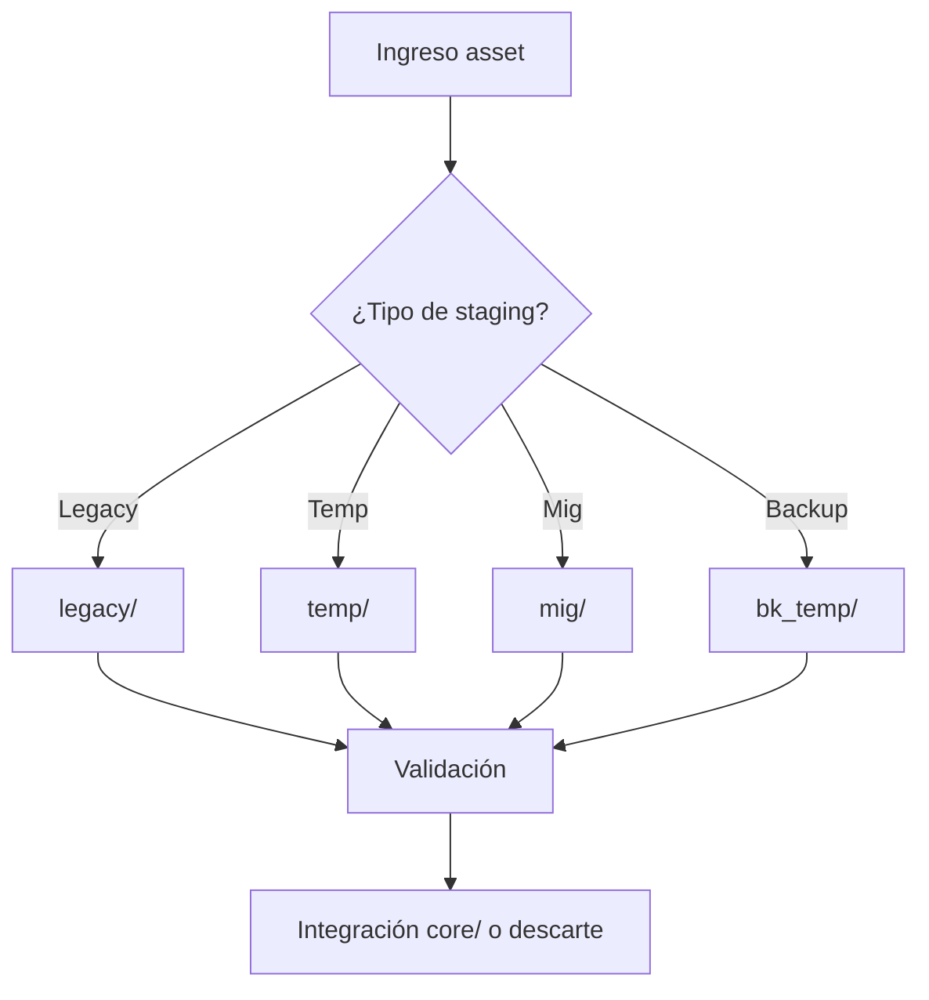

## Índice

1. [Descripción General](#1-descripción-general)
2. [Estructura Interna](#2-estructura-interna)
3. [Cross‑References](#3-cross-references)
4. [Flujos & Workflows](#4-flujos--workflows)
5. [Compliance & Buenas Prácticas](#5-compliance--buenas-practicas)
6. [Changelog](#6-changelog)
7. [Metadatos IA](#7-metadatos-ia)

---

## 1. Descripción General

Bucket para gestión, staging y control del ciclo de vida de todos los activos del sistema: migración, staging temporario, legacy, backups y procesos de QA antes de integración definitiva en core/. Cumple la función de “espejo” y entorno de pruebas/sandbox para datos y workflows en transición.

---

## 2. Estructura Interna

| Path      | Rol        | Descripción breve                              |
| --------- | ---------- | ---------------------------------------------- |
| ./        | Contenedor | README + metadatos                             |
| legacy/   | Legacy     | Activos/archivos antiguos aún no migrados      |
| temp/     | Temp       | Staging temporal, assets en tránsito o pruebas |
| mig/      | Migración  | Workflows/scripts de migración y validación    |
| bk\_temp/ | Backup     | Backups críticos en espera de integración      |

---

## 3. Cross‑References

- **Blueprint v3** → [`../blueprint_rw_b_platform_v_3_20250803.md`](../blueprint_rw_b_platform_v_3_20250803.md)
- **Master Plan v3** → [`../mpln_master_plan_rw_b_v_3_20250803.md`](../mpln_master_plan_rw_b_v_3_20250803.md)
- **Checklist Root v3** → [`../checklist_root_rw_b_v_3_20250803.md`](../checklist_root_rw_b_v_3_20250803.md)
- **Triggers**: `TRG_AUDIT_LEGACY`, `TRG_CONSOLIDATE_TL`, `TRG_PURGE_AI`

---

## 4. Flujos & Workflows



---

## 5. Compliance & Buenas Prácticas

- Mantener actualizado el registro de movimientos entre buckets (QA, logs, changelog).
- Cada asset debe registrar fecha, motivo y estado de transición.
- Prohibido dejar activos “huérfanos” fuera del ciclo documentado.
- Todos los sub-buckets requieren README y versionado.

---

## 6. Changelog

| Fecha      | Versión | Autor       | Cambios                            |
| ---------- | ------- | ----------- | ---------------------------------- |
| 2025-08-05 | v3.1    | ChatGPT 4.1 | README inicial lifecycle/ enriched |

---

## 7. Metadatos IA

```yaml
bucket: lifecycle
version: v3.1
updated: 2025-08-05
blueprint_ref: ../blueprint_rw_b_platform_v_3_20250803.md
master_plan_ref: ../mpln_master_plan_rw_b_v_3_20250803.md
triggers:
  - TRG_AUDIT_LEGACY
  - TRG_CONSOLIDATE_TL
  - TRG_PURGE_AI
```

---

**FIN README lifecycle/ v3.1**

## OutputTemplate
```yaml
CODE:
ID:
VERSION:
ROUTE:
CROSSREF:
AUTHOR:
DATE:
```
