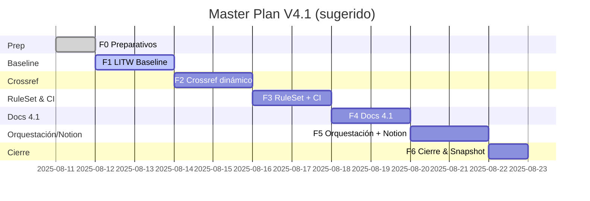

---

## file: lifecycle/temp/rw\_b\_master\_plan\_v\_4\_1.md code: MPLN name: RwB\_MasterPlan\_V\_4\_1 version: v4.1 date: 2025-08-11 owner: AingZ\_Platform · RwB status: active xrf: blueprint: RwB\_Blueprint\_V4 mplan: RwB\_MasterPlan\_V4 glossary: CODE\_Glossary\_v2 dictionary: CODE\_Triggers\_v2 triggers: [TRG\_CONSOLIDATE\_TL, TRG\_AUDIT\_TL, TRG\_AUDIT\_LEGACY, TRG\_PURGE\_AI] chg: CHG\_main.md#2025-08-11-masterplan-4\_1 chk: CHK\_root.md#2025-08-11-masterplan-4\_1

# Master Plan V4.1 — Normalización y Enforcement del RuleSet

> **Propósito**: establecer el plan ejecutable para llevar el RuleSet V4 a **estado 4.1**, con **precedencia** de Glosario/Diccionario y **enforcement** Pre/PostCheck unificado entre **Chat · Actions · Bot/API · Notion**, alineado con el **Blueprint V4.1** vigente en canvas.

## 1) Alcance

- Todo el **árbol V4**: `core/`, `ops/`, `packages/`, `lifecycle/`, `snapshots_ctx/`, `library/`.
- Plataformas: Chat (GPT-5 Thinking), GitHub Actions, GitHub Bot/API, Notion.

## 2) Principios (máxima jerarquía)

- **Glosario (CODE\_Glossary\_v2)** y **Diccionario (CODE\_Triggers\_v2)** **>** Blueprint **>** Master Plan **>** RuleSets **>** Workflows **>** README **>** Actions/Bot **>** Notion **>** Scripts.
- **Contrato I/O**: front‑matter completo + **OutputTemplate** + **XRF** + **TRIGGERS**.
- **PDCA vivo** y trazabilidad (`CHG/CHK/CHKP/LESSONS`).

## 3) Entregables globales V4.1

- **Baseline** (solo lectura): `baseline.csv`, `route_index.json`, `platform_versus_compliance.md`, `xrf_map.md`.
- **RuleSet y CI**: `core/rulset/RULE_CODING_COMPLIANCE_V4.md`, `aingz_litw_baseline_v4.yml`, `aingz_incoherence_report.yml`, (luego) `diff_guard` y `orchestrator`.
- **Docs**: `README.md` reforzado, `templates/README_TEMPLATE_v4_1.md`, `lifecycle/temp/rw_b_blueprint_v_4_1.md`, `lifecycle/temp/rw_b_master_plan_v_4_1.md`.
- **Notion**: DBs y vistas con **upsert** de baseline y estados.

## 4) Roadmap por fases (F0→F6)

### F0 — Preparativos

- Verificar secrets de CI y permisos (si aplica a futuro **full‑agent**).
- Confirmar Python 3.11 en runners (o usar setup‑python).
- Rama de trabajo: `feat/v4.1-baseline`.

### F1 — LITW Baseline (solo lectura)

- Ejecutar `aingz_litw_baseline_v4.yml` y obtener artefactos.
- Ejecutar `aingz_incoherence_report.yml` y archivar `ops/log/diagnosis_baseline.md`.
- Publicar en Notion: resumen de hallazgos y KPI de cumplimiento (sin cambios en repo).

**Salidas**: baseline + diagnosis + evidencias.

### F2 — Crossref dinámico

- Construir/actualizar `ops/paths_cache.json` (rutas **reales** de BLPR/MPLN/Prompt/RuleSet).
- Implementar `ops/scripts/update_crossrefs.py` (read‑only **dry‑run** primero; luego update controlado).
- Validar contra Blueprint V4.1 (canvas vigente).

**Salidas**: `paths_cache.json` + log de dry‑run.

### F3 — RuleSet + CI (enforcement)

- Aplicar `RULE_CODING_COMPLIANCE_V4.md` como gate normativo.
- Añadir jobs de **PreCheck/PostCheck** a pipelines que generen/editen MD.
- Preparar `aingz_diff_guard.yml` y `aingz_orchestrator.yml` (no‑loss, posterior a baseline).

**Salidas**: Workflows listos + checks en verde.

### F4 — Docs 4.1 (actualización)

- **README main**: sección “Precedencia Normativa” + “Validación Automática (V4.1)”.
- **Plantilla** `README_TEMPLATE_v4_1.md`: uso obligatorio.
- **Blueprint 4.1**: ya en canvas; mantener alineación.
- **Master Plan 4.1**: este archivo (publicación).

**Salidas**: PRs de documentación.

### F5 — Orquestación & Notion

- Conector Notion: DBs `Assets/Workflows/Triggers/CHG/CHK/LESSONS` (props: CODE, Ruta, Versión, Estado, XRF, Triggers, Resultado).
- Cargar baseline y diagnosis como páginas/rows, con enlaces a artefactos.
- Automatizar vistas: Kanban por plataforma, Timeline PDCA, Compliance V4.

**Salidas**: páginas Notion actualizadas.

### F6 — Cierre y Snapshot

- Ejecutar `diff_guard` y `orchestrator` → verificación en verde.
- Congelar Blueprint/MPLAN 4.1 como **únicas fuentes vivas**.
- Publicar `release_note.md` y snapshot con CHG/CHK/CHKP/LESSONS.

**Salidas**: release + snapshot + estados Notion finales.

## 5) Roles (resumen)

| Rol     | Responsabilidad clave                                                       |
| ------- | --------------------------------------------------------------------------- |
| Chat    | Redacción y validación de assets (canvas); generación de plantillas/patches |
| Actions | Ejecución de LITW, diagnosis, Pre/PostCheck; artefactos                     |
| Bot/API | Comentarios con OutputTemplate; logs en `ops/log/`                          |
| Notion  | Estado y evidencias; vistas PDCA                                            |

## 6) Riesgos & mitigaciones

- **Hardcodes residuales** → usar `paths_cache.json` + dry‑run.
- **Falta de secrets CI** → ejecutar semiautomático (PR manual) hasta habilitar full‑agent.
- **Diferencias Chat/CI** → contrato I/O unificado + matrices VERSUS.

## 7) Métricas de éxito (DoD)

- **0** crossrefs rotos; **100%** assets con front‑matter y OutputTemplate.
- **Baseline** y **Diagnosis** generados; KPIs de cumplimiento y gaps listados.
- **README/Plantilla/BLPR/MPLN 4.1** publicados.
- **Notion** sincronizado con IDs y artefactos.

## 8) Calendario (Gantt sugerido)

## 9) Checklist de ejecución

-

---

# OutputTemplate (obligatorio)

master\_plan\_4\_1: status: OK id\_asset: MPLN\_4\_1\_2025-08-11T00:00:00Z generated\_by: ai created\_at: 2025-08-11T00:00:00Z params: phases: [F0, F1, F2, F3, F4, F5, F6] platforms: [chat, actions, bot, notion] deliverables: - baseline - diagnosis - ruleset\_ci - docs\_41 - notion\_sync - release\_snapshot result: plan\_published: true precedence\_locked: true enforcement\_unified: true log: - step1: publish\_mplan\_41 - step2: align\_with\_blueprint\_41 - step3: await\_litw\_outputs

