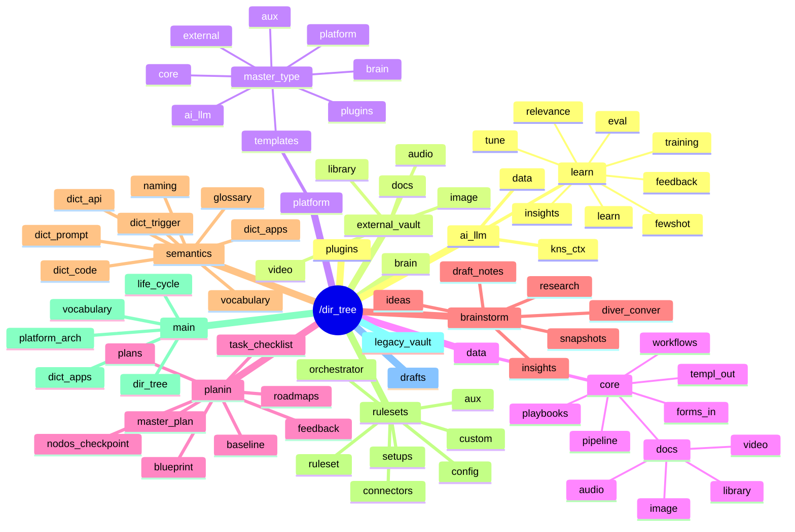
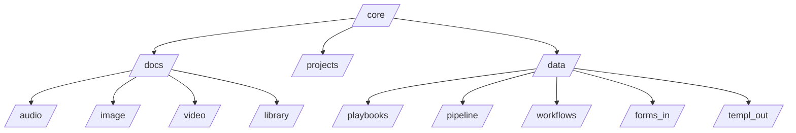

# [[Formulario :: Dir Tree Creator]]

> [!summary] Navegacion rapida  
> [[#00 :: Setup]] · [[#10 :: Horizonte & Alcance]] · [[#20 :: Mermaid Blueprint]] · [[#25 :: Snapshot YAML]] · [[#30 :: Excalidraw Sync]] · [[#40 :: Assets por Carpeta]] · [[#50 :: Validacion & Checks]] · [[#60 :: KPIs & Auditoria]] · [[#70 :: WK.log & Feedback]]

---

## 00 :: Setup

```button
name Abrir dir tree en Excalidraw
text Abrir dir tree en Excalidraw
type command
action Excalidraw:Open drawing
color orange
```

```button
name Generar blueprint base Mermaid
text Generar blueprint base Mermaid
type command
action QuickAdd:DirTree -> Mermaid Blueprint
color teal
```

```button
name Refrescar paneles
text Refrescar paneles
type command
action Dataview:Refresh current view
color purple
```

- [ ] Confirmar ruta raiz del arbol: ` `
- [ ] Definir repositorios afectados: ` `
- [ ] Registrar stakeholders tecnicos en [[#40 :: Assets por Carpeta]].

> [!hint] Ajusta los nombres de comandos `QuickAdd` y `Excalidraw` segun tu vault.

---

## 10 :: Horizonte & Alcance

| Elemento | Detalle | Estado |
| --- | --- | --- |
| Proposito del arbol |  | - [ ] |
| Alcance temporal |  | - [ ] |
| Entornos implicados |  | - [ ] |
| Dependencias criticas |  | - [ ] |

> [!faq]- Preguntas guia  
> - Que equipos consumen este arbol?  
> - Que normas o baselines condicionan su estructura?  
> - Como se coordinan Codex/GPT5 con revisores humanos?

---

## 20 :: Mermaid Blueprint





- [ ] Revisar que el diagrama refleja el estado actual del `[[dir_tree_draft]]`.
- [ ] Documentar convenciones de nomenclatura bajo los diagramas (camelCase, snake_case, prefijos, etc.).
- [ ] Registrar fecha/hora de actualizacion en el frontmatter (`dir_tree_last_sync`).

> [!tip] Duplica este bloque al versionar cambios significativos para mantener trazabilidad historica.

---

## 25 :: Snapshot YAML

```yaml
# Generado desde dir_tree_draft.excalidraw.md
root: /dir_tree
children:
  - /plugins
  - /brain
  - /platform/templates/master_type:
      - platform
      - core
      - plugins
      - brain
      - ai_llm
      - external
      - aux
  - /data/core/docs:
      - audio
      - image
      - video
      - library
  - /data/core:
      - playbooks
      - pipeline
      - workflows
      - forms_in
      - templ_out
  - /planin:
      - master_plan
      - blueprint
      - baseline
      - roadmaps
      - plans
      - task_checklist
      - nodos_checkpoint
      - feedback
  - /semantics:
      - glossary
      - dict_code
      - dict_trigger
      - dict_prompt
      - dict_api
      - dict_apps
      - vocabulary
      - naming
  - /rulesets:
      - ruleset
      - config
      - custom
      - orchestrator
      - connectors
      - setups
      - aux
  - /ai_llm:
      - data
      - kns_ctx
      - learn
  - /external_vault:
      - docs
      - audio
      - image
      - video
      - library
```

> [!info] Usa este snapshot como insumo para scripts de sincronizacion (`scripts/diagram_sync/`) y para validar cobertura en plantillas.

---

## 30 :: Excalidraw Sync

> [!info] Enlaza el lienzo activo para edicion colaborativa.

[[[dir_tree_draft.excalidraw]]]

- [ ] Sincronizar capas de Excalidraw con los nodos de Mermaid y el YAML de [[#25 :: Snapshot YAML]].
- [ ] Anadir sticky notes con owners y SLAs por carpeta.
- [ ] Exportar PNG/SVG y adjuntarlo en `attachments/` si se comparte externamente.

---

## 40 :: Assets por Carpeta

> [!todo]+ Matriz de requisitos  
> Lista cada carpeta con sus assets obligatorios, responsables y estado.

| Carpeta | Asset requerido | Responsable | Estado | Notas |
| --- | --- | --- | --- | --- |
| `/platform/templates/master_type` | `master_template_index.md` |  | - [ ] | sincronizar variantes platform/core/plugins |
| `/data/core/docs/audio` | `README_audio.md` |  | - [ ] | incluye convencion de nombre para `voice_note` |
| `/data/core/playbooks` | `playbook_catalog.md` |  | - [ ] | relacionar con pipelines y workflows |
| `/planin` | `planin_overview.md` |  | - [ ] | mapea master_plan, blueprint, baseline |
| `/semantics` | `semantics_registry.md` |  | - [ ] | generar resumen de dict_* y naming |
| `/rulesets` | `ruleset_registry.md` |  | - [ ] | enlazar con assets en `ruleset_pack_v1/` |
| `/ai_llm/learn` | `learning_log.md` |  | - [ ] | seguimiento de learn/eval/tune |
| `/external_vault` | `external_vault_manifest.md` |  | - [ ] | definir politicas de sincronizacion |

```tasks
not done
path includes "<ruta raiz>"
description includes "asset"
```

> [!warning] Mantén consistentes las etiquetas (`#dir-tree`, `#asset-mandatory`) para reportes automaticos.

---

## 50 :: Validacion & Checks

- [ ] Cada carpeta tiene owner y plan de respaldo documentado.
- [ ] Existe estrategia de versionado para scripts sensibles.
- [ ] Las dependencias cruzadas estan registradas en `README` locales.
- [ ] Se notifico a Codex/GPT5 sobre cambios relevantes.

```tracker
searchType: task
searchTarget: "#dir-tree"
startDate: 2024-01-01
endDate: 2024-12-31
summary:
  template: "Checks completados: {{count}}"
```

---

## 60 :: KPIs & Auditoria

| KPI | Formula | Meta | Valor actual |
| --- | --- | --- | --- |
| TreeCompleteness | (# carpetas documentadas / # carpetas totales) | 100% |  |
| AssetAssignmentRate | (# assets con owner / # assets totales) | 95% |  |
| ReviewCycleTime | (fecha ultima revision - fecha previa) | <= 14 dias |  |

```dataview
TABLE file.link AS "Formulario", asset_status
FROM "templates/architecture_interactive_forms"
WHERE asset_type = "dir_tree_form" and file.name != this.file.name
SORT file.mtime desc
LIMIT 15
```

> [!note] Usa `asset_status` = `in_review`, `approved` o `deprecated` para facilitar los tableros.

---

## 70 :: WK.log & Feedback

- :: <% tp.date.now("YYYY-MM-DD HH:mm") %> :: Responsable:  :: Resumen:
- ::  :: Responsable:  :: Resumen:
- ::  :: Responsable:  :: Resumen:

> [!tip] Etiqueta entradas relevantes con `#dir-tree-log` y enlaza decisiones clave al Legacy correspondiente.

---

> [!done] Al finalizar, actualiza `asset_status` a `approved` y archiva una copia inmutable del Mermaid, YAML y Excalidraw asociados.
