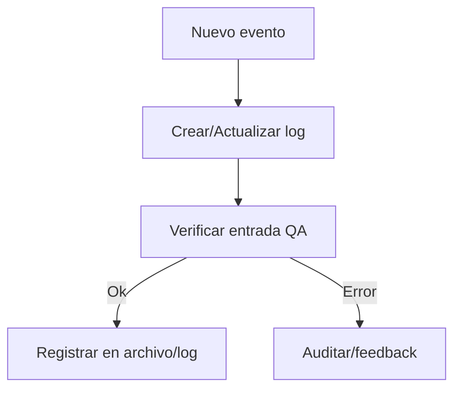

---

## file: README.md version: v3.1-2025-08-05 bucket: ops/log blueprint: ../../rw_b_blueprint_v_4_extendido_2025_08_06.md status: active updated: 2025-08-05 role: documentation owner: AingZ_Platform · RwB

# [RwB] ops/log/ — README (v3.1)

> **Tagline:** Carpeta de logs y bitácoras operativas, registros automáticos/manuales y trazabilidad de todos los procesos críticos.

---

## Índice

1. [Descripción General](#1-descripción-general)
2. [Estructura Interna](#2-estructura-interna)
3. [Cross‑References](#3-cross-references)
4. [Ciclo de Vida & Workflows](#4-ciclo-de-vida--workflows)
5. [Quick Start / Onboarding](#5-quick-start--onboarding)
6. [Guía para Modelos AI](#6-guía-para-modelos-ai)
7. [Compliance & Governance](#7-compliance--governance)
8. [Changelog](#8-changelog)
9. [Metadatos IA](#9-metadatos-ia)

---

## 1. Descripción General

Directorio para todos los logs, bitácoras y registros cronológicos generados por los procesos automáticos y manuales de la plataforma. Es la fuente principal de auditoría, trazabilidad y debugging para assets, pipelines y flujos críticos.

---

## 2. Estructura Interna

| Path   | Rol        | Descripción breve           |
| ------ | ---------- | --------------------------- |
| ./     | Contenedor | README + metadatos          |
| \*.log | Log        | Logs automáticos/manuales   |
| \*.md  | Docs       | Logs extendidos, changelogs |

### Logs destacados

| Archivo | Descripción breve |
| ------- | ----------------- |
| [diagnosis_baseline.md](diagnosis_baseline.md) | Resultado de [diagnose_baseline.py](../scripts/diagnose_baseline.py) sobre `baseline.csv` |

---

## 3. Cross‑References

- **Blueprint v4** → [`../../rw_b_blueprint_v_4_extendido_2025_08_06.md`](../../rw_b_blueprint_v_4_extendido_2025_08_06.md)
- **Master Plan v4** → [`../../rw_b_master_plan_v_4_extendido_2025_08_06.md`](../../rw_b_master_plan_v_4_extendido_2025_08_06.md)
- **Checklist Root v3** → [`../../checklist_root_rw_b_v_3_20250803.md`](../../checklist_root_rw_b_v_3_20250803.md)
- **Triggers**: `TRG_AUDIT_LEGACY`, `TRG_CONSOLIDATE_TL`, `TRG_PURGE_AI`

---

## 4. Ciclo de Vida & Workflows



---

## 5. Quick Start / Onboarding

```bash
# Listar logs activos
$ ls *.log

# Revisar changelog principal
$ cat chglog_main_rwb_v_5_*.md
```

---

## 6. Guía para Modelos AI

- Cada registro debe tener fecha, tipo, autor y contexto.
- Logs relevantes deben estar linkeados desde README y changelog para trazabilidad IA/humano.

---

## 7. Compliance & Governance

| Área    | Regla                 | Fuente         |
| ------- | --------------------- | -------------- |
| Naming  | `naming_universal_v3` | Blueprint §2.2 |
| Logging | Standard log format   | Ops policy     |
| Audit   | QA crossref oblig.    | Master Plan §3 |

---

## 8. Changelog

| Fecha      | Versión | Autor       | Cambios                      |
| ---------- | ------- | ----------- | ---------------------------- |
| 2025-08-05 | v3.1    | ChatGPT 4.1 | README inicial log/ enriched |
| 2025-08-07 | v3.1    | ChatGPT 4.1 | Migración de `audit/` desde `core/kns/`; reporte en `ops/log/` |

---

## 9. Metadatos IA

```yaml
bucket: ops/log
version: v3.1
updated: 2025-08-05
blueprint_ref: ../../rw_b_blueprint_v_4_extendido_2025_08_06.md
master_plan_ref: ../../rw_b_master_plan_v_4_extendido_2025_08_06.md
triggers:
  - TRG_AUDIT_LEGACY
  - TRG_CONSOLIDATE_TL
  - TRG_PURGE_AI
```

---

**FIN README ops/log/ v3.1**

