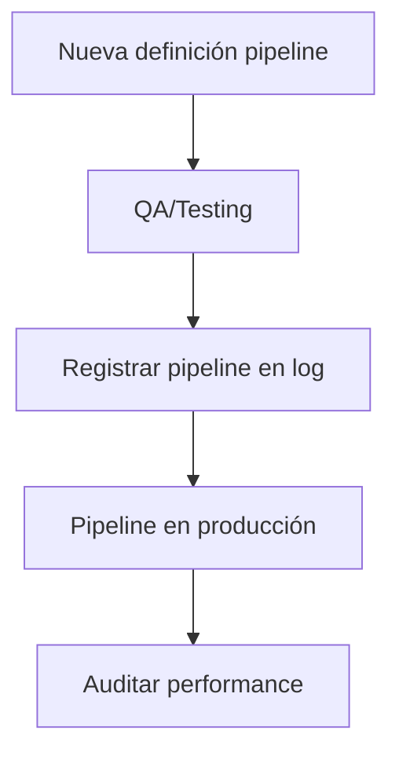

---

## file: README.md version: v3.1-2025-08-05 bucket: ops/pipelines blueprint: ../../../blueprint\_rw\_b\_platform\_v\_3\_20250803.md status: active updated: 2025-08-05 role: documentation owner: AingZ\_Platform · RwB

# [RwB] ops/pipelines/ — README (v3.1)

> **Tagline:** Definición y gestión de pipelines automáticos: CI/CD, onboarding, validación y testing para todos los buckets de la plataforma.

---

## Índice

1. [Descripción General](#1-descripción-general)
2. [Estructura Interna](#2-estructura-interna)
3. [Cross‑References](#3-cross-references)
4. [Ciclo de Vida & Workflows](#4-ciclo-de-vida--workflows)
5. [Quick Start / Onboarding](#5-quick-start--onboarding)
6. [Guía para Modelos AI](#6-guía-para-modelos-ai)
7. [Compliance & Governance](#7-compliance--governance)
8. [Changelog](#8-changelog)
9. [Metadatos IA](#9-metadatos-ia)

---

## 1. Descripción General

Carpeta destinada a la definición y ejecución de pipelines automáticos: integración continua (CI), despliegue continuo (CD), onboarding, validaciones y testing entre buckets y assets de la plataforma.

---

## 2. Estructura Interna

| Path   | Rol        | Descripción breve       |
| ------ | ---------- | ----------------------- |
| ./     | Contenedor | README + metadatos      |
| \*.yml | Pipeline   | Definiciones YAML CI/CD |
| \*.md  | Docs       | Documentación de flujos |

---

## 3. Cross‑References

- **Blueprint v3** → [`../../../blueprint_rw_b_platform_v_3_20250803.md`](../../../blueprint_rw_b_platform_v_3_20250803.md)
- **Master Plan v3** → [`../../../mpln_master_plan_rw_b_v_3_20250803.md`](../../../mpln_master_plan_rw_b_v_3_20250803.md)
- **Checklist Root v3** → [`../../../checklist_root_rw_b_v_3_20250803.md`](../../../checklist_root_rw_b_v_3_20250803.md)
- **Triggers**: `TRG_AUDIT_LEGACY`, `TRG_CONSOLIDATE_TL`, `TRG_PURGE_AI`

---

## 4. Ciclo de Vida & Workflows



---

## 5. Quick Start / Onboarding

```bash
# Listar pipelines
$ ls *.yml

# Revisar documentación de flujos
$ cat pipeline_onboarding.md
```

---

## 6. Guía para Modelos AI

- Pipelines YAML deben estar autoexplicados y comentados.
- Flujos complejos deben tener crossref a scripts y logs asociados para trazabilidad IA/humano.

---

## 7. Compliance & Governance

| Área      | Regla                 | Fuente         |
| --------- | --------------------- | -------------- |
| Naming    | `naming_universal_v3` | Blueprint §2.2 |
| Pipelines | YAML estándar         | Ops policy     |
| Audit     | QA obligatoria        | Master Plan §3 |

---

## 8. Changelog

| Fecha      | Versión | Autor       | Cambios                            |
| ---------- | ------- | ----------- | ---------------------------------- |
| 2025-08-05 | v3.1    | ChatGPT 4.1 | README inicial pipelines/ enriched |

---

## 9. Metadatos IA

```yaml
bucket: ops/pipelines
version: v3.1
updated: 2025-08-05
blueprint_ref: ../../../blueprint_rw_b_platform_v_3_20250803.md
triggers:
  - TRG_AUDIT_LEGACY
  - TRG_CONSOLIDATE_TL
  - TRG_PURGE_AI
```

---

**FIN README ops/pipelines/ v3.1**

