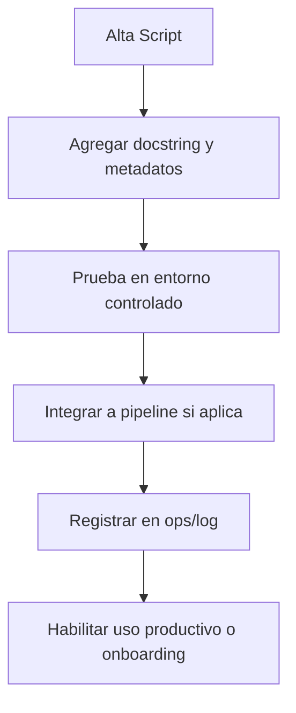

## Índice

1. [Descripción General](#1-descripción-general)
2. [Estructura Interna](#2-estructura-interna)
3. [Cross‑References](#3-cross-references)
4. [Ciclo de Vida & Workflows](#4-ciclo-de-vida--workflows)
5. [Quick Start / Onboarding](#5-quick-start--onboarding)
6. [Guía para Modelos AI](#6-guía-para-modelos-ai)
7. [Compliance & Governance](#7-compliance--governance)
8. [Changelog](#8-changelog)
9. [Metadatos IA](#9-metadatos-ia)

---

## 1. Descripción General

Carpeta que centraliza scripts reutilizables para automatización, mantenimiento, migración, depuración y utilidades técnicas. Los scripts aquí almacenados deben ser modulares, documentados y versionados para permitir su uso directo en pipelines, onboarding y mantenimiento programado.

---

## 2. Estructura Interna

| Path         | Rol        | Descripción breve                               |
| ------------ | ---------- | ----------------------------------------------- |
| ./           | Contenedor | README + metadatos                              |
| \*.sh, \*.py | Script     | Scripts Bash/Python de automatización y soporte |

### Scripts disponibles

| Script | Descripción breve |
| ------ | ----------------- |
| [audit_naming.py](audit_naming.py) | Valida convenciones de nombres en assets |
| [diagnose_baseline.py](diagnose_baseline.py) | Genera reporte diagnóstico a partir de `baseline.csv` |
| [report_kpis.py](report_kpis.py) | Produce métricas clave de operación |
| [run_codex_baseline_v4_check.py](run_codex_baseline_v4_check.py) | Ejecuta chequeo Codex sobre baseline v4 |

---

## 3. Cross‑References

- **Blueprint v4** → [`../../lifecycle/temp/rw_b_blueprint_v_4_extendido_2025_08_06.md`](../../lifecycle/temp/rw_b_blueprint_v_4_extendido_2025_08_06.md)
- **Master Plan v4** → [`../../lifecycle/temp/rw_b_master_plan_v_4_extendido_2025_08_06.md`](../../lifecycle/temp/rw_b_master_plan_v_4_extendido_2025_08_06.md)
- **Checklist Root v3** → [`../../checklist_root_rw_b_v_3_20250803.md`](../../checklist_root_rw_b_v_3_20250803.md)
- **Triggers**: `TRG_AUDIT_LEGACY`, `TRG_CONSOLIDATE_TL`, `TRG_PURGE_AI`

---

## 4. Ciclo de Vida & Workflows



---

## 5. Quick Start / Onboarding

```bash
# Listar scripts disponibles
$ ls *.sh *.py

# Ejemplo de ejecución
$ bash update_readmes_v3_1.sh
$ python migrate_assets.py
```

- Documentar variables y uso en la cabecera del script.
- Scripts que requieren privilegios deben indicar advertencias.

---

## 6. Guía para Modelos AI

- Scripts deben ser autoexplicativos (docstring/cabecera) para ser parseados y utilizados por IA (Codex, GPT-4.1).
- Indicar siempre entrada, salida esperada y dependencias.

---

## 7. Compliance & Governance

| Área    | Regla                 | Fuente         |
| ------- | --------------------- | -------------- |
| Naming  | `naming_universal_v3` | Blueprint §2.2 |
| Version | SemVer                | Blueprint §1.3 |
| Script  | Docstring obligatorio | Ops policy     |

---

## 8. Changelog

| Fecha      | Versión | Autor       | Cambios                          |
| ---------- | ------- | ----------- | -------------------------------- |
| 2025-08-05 | v3.1    | ChatGPT 4.1 | README inicial scripts/ enriched |

---

## 9. Metadatos IA

```yaml
bucket: ops/scripts
version: v3.1
updated: 2025-08-05
blueprint_ref: ../../lifecycle/temp/rw_b_blueprint_v_4_extendido_2025_08_06.md
master_plan_ref: ../../lifecycle/temp/rw_b_master_plan_v_4_extendido_2025_08_06.md
triggers:
  - TRG_AUDIT_LEGACY
  - TRG_CONSOLIDATE_TL
  - TRG_PURGE_AI
```

---

**FIN README ops/scripts/ v3.1**

## OutputTemplate
```yaml
CODE:
ID:
VERSION:
ROUTE:
CROSSREF:
AUTHOR:
DATE:
```
