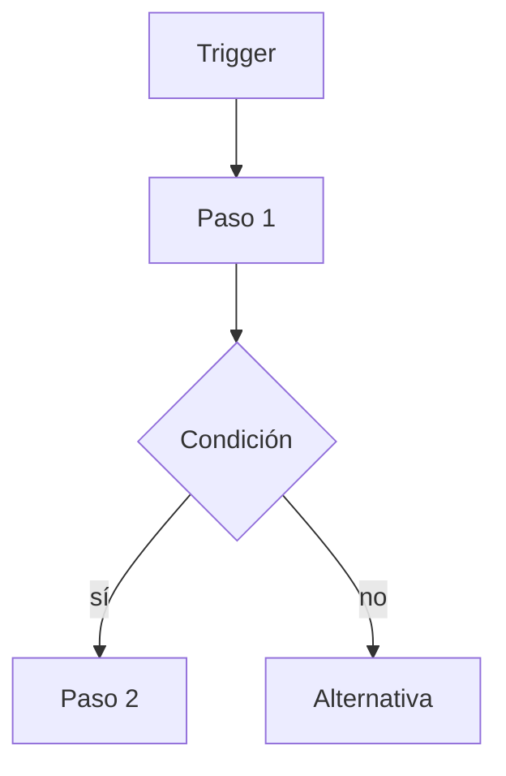

---

## file: \<ruta\_relativa\_al\_readme> code: \<CODE\_≤5\_SCREAMING\_SNAKE> name:  version: v4.0 date:  owner: AingZ\_Platform · RwB status: active xrf: blueprint: RwB\_Blueprint\_V4 mplan: RwB\_MasterPlan\_V4 glossary: CODE\_Glossary\_v2 dictionary: CODE\_Triggers\_v2 triggers: [TRG\_CONSOLIDATE\_TL, TRG\_AUDIT\_TL, TRG\_LSWP] chg: CHG\_main.md#\<id\_cambio> chk: CHK\_root.md#\<id\_check>

# \<Título — Bucket/Asset> (v4)

## Objetivo (GPT‑5 / Codex‑ready)

- Describir **qué** hace el asset, **para qué**, **quién** lo usa y **criterios de done**.
- Evitar ambigüedad; usar verbos imperativos.

## Alcance y Ruta

- **ROUTE**: `<ruta_relativa_al_readme>`
- Subárbol cubierto: `core/|ops/|packages/|lifecycle/|snapshots_ctx/|library/` (elegir)

## Instrucciones Operativas — **No‑Loss Merge** (pegar legacy íntegro)

> **Pega aquí el contenido anterior (legacy) completo, sin editar.** Este bloque sirve como fuente canónica para el análisis y comparación; no se pierde información.

```legacy
<PEGA_AQUI_TODO_EL_CONTENIDO_LEGACY_DEL_README_ANTERIOR_SIN_RECORTES>
```

## Síntesis Ejecutiva (derivada del legacy)

- Lista breve y accionable **para modelos GPT‑5/Codex**.
- Debe cubrir: entradas, proceso, salidas, errores comunes, KPIs.

## Flujos / Lógicas de Plataforma



## Entradas / Salidas / Triggers / Conectores

- **Inputs**: …
- **Outputs**: …
- **Triggers**: TRG\_CONSOLIDATE\_TL · TRG\_AUDIT\_TL · TRG\_LSWP (ajustar)
- **Conectores**: github / notion (si aplica)

## Crossref (canónico)

- Blueprint V4 · Master Plan V4 · Prompt Codex v4 · Glosario v2 · Diccionario CODE\_TRIGGERS v2

## Integración de Legacy — Control de No Pérdida

```yaml
legacy_control:
  source_path: <ruta_del_readme_legacy_si_aplica>
  legacy_sha1: <sha1_del_texto_legacy>
  legacy_lines: <conteo_lineas_legacy>
  merged_at: <ISO8601>
  reviewer: <usuario>
```

## Validación

- `python ops/validate_metadata.py` → **OK**
- `python ops/update_crossrefs.py` → sin pendientes
- **CI** `CI Audit V4` → verde
- **Diff Guard** → sin pérdida (`removed <= added`)

---

## OutputTemplate (obligatorio)

```yaml
output_example:
  status: OK
  id_asset: <id_output_wf>
  generated_by: <user|ai>
  created_at: <ISO8601>
  params:
    - <param1>: <valor>
  result:
    - <kpi>: <valor>
  log:
    - step1: <detalle>
```

