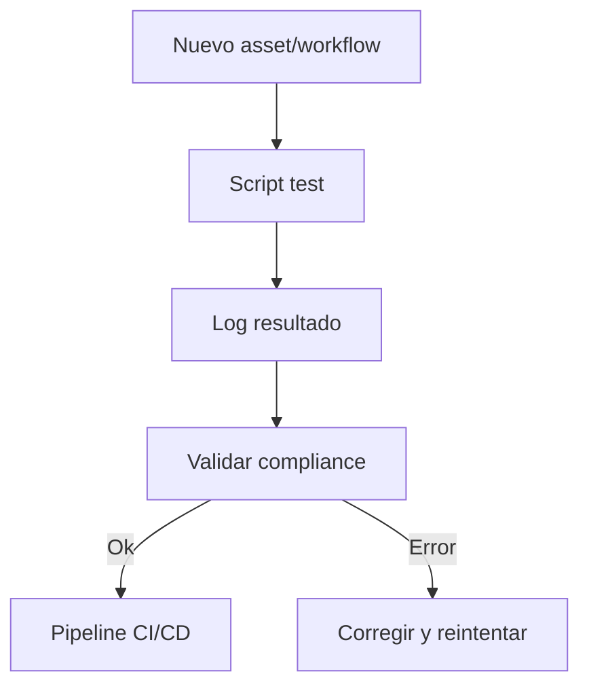

## Índice

1. [Descripción General](#1-descripción-general)
2. [Estructura Interna](#2-estructura-interna)
3. [Cross‑References](#3-cross-references)
4. [Ciclo de Vida & Workflows](#4-ciclo-de-vida--workflows)
5. [Quick Start / Onboarding](#5-quick-start--onboarding)
6. [Guía para Modelos AI](#6-guía-para-modelos-ai)
7. [Compliance & Governance](#7-compliance--governance)
8. [Changelog](#8-changelog)
9. [Metadatos IA](#9-metadatos-ia)

---

## 1. Descripción General

Repositorio central para scripts y assets de testing automatizado: matrices de pruebas, validaciones, logs de QA y documentación de resultados para cada workflow, pipeline y asset de la plataforma.

---

## 2. Estructura Interna

| Path  | Rol        | Descripción breve                 |
| ----- | ---------- | --------------------------------- |
| ./    | Contenedor | README + metadatos                |
| \*.py | Script     | Scripts de test (Python/pytest)   |
| \*.md | Docs       | Matrices, logs y reportes de test |

---

## 3. Cross‑References

- **Blueprint v3** → [`../../../blueprint_rw_b_platform_v_3_20250803.md`](../../../blueprint_rw_b_platform_v_3_20250803.md)
- **Master Plan v3** → [`../../../mpln_master_plan_rw_b_v_3_20250803.md`](../../../mpln_master_plan_rw_b_v_3_20250803.md)
- **Checklist Root v3** → [`../../../checklist_root_rw_b_v_3_20250803.md`](../../../checklist_root_rw_b_v_3_20250803.md)
- **Triggers**: `TRG_AUDIT_LEGACY`, `TRG_CONSOLIDATE_TL`, `TRG_PURGE_AI`

---

## 4. Ciclo de Vida & Workflows



---

## 5. Quick Start / Onboarding

```bash
# Listar scripts y matrices de test
$ ls *.py *.md

# Ejecutar pruebas
$ python test_<asset>.py
```

---

## 6. Guía para Modelos AI

- Scripts deben estar documentados, autoexplicados y ser fácilmente reutilizables por IA (Codex, GPT-4.1).
- Logs de QA deben ser trazables y linkeados a assets.

---

## 7. Compliance & Governance

| Área    | Regla                 | Fuente         |
| ------- | --------------------- | -------------- |
| Naming  | `naming_universal_v3` | Blueprint §2.2 |
| Testing | QA automatizado       | Master Plan §3 |

---

## 8. Changelog

| Fecha      | Versión | Autor       | Cambios                       |
| ---------- | ------- | ----------- | ----------------------------- |
| 2025-08-05 | v3.1    | ChatGPT 4.1 | README inicial test/ enriched |

---

## 9. Metadatos IA

```yaml
bucket: ops/test
version: v3.1
updated: 2025-08-05
blueprint_ref: ../../../blueprint_rw_b_platform_v_3_20250803.md
triggers:
  - TRG_AUDIT_LEGACY
  - TRG_CONSOLIDATE_TL
  - TRG_PURGE_AI
```

---

**FIN README ops/test/ v3.1**

## OutputTemplate
```yaml
CODE:
ID:
VERSION:
ROUTE:
CROSSREF:
AUTHOR:
DATE:
```
