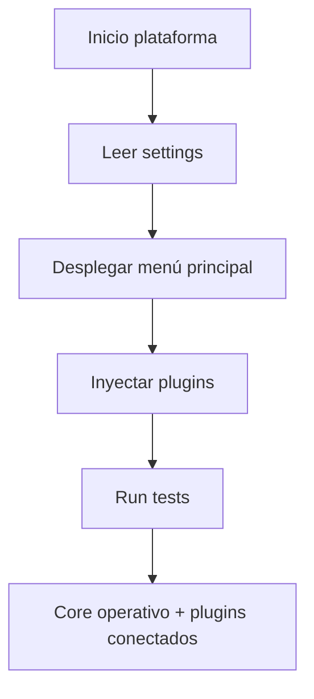

# [RwB] packages/vds_core/ — README (v3.1)

> **Tagline:** Infraestructura backend, lógica principal, menú, settings y entrypoint para integración de todos los plugins y servicios de la plataforma.

---

## Índice
1. [Descripción General](#1-descripción-general)
2. [Estructura Interna](#2-estructura-interna)
3. [Cross‑References](#3-cross-references)
4. [Ciclo de Vida & Workflows](#4-ciclo-de-vida--workflows)
5. [Quick Start / Onboarding](#5-quick-start--onboarding)
6. [Guía para Modelos AI](#6-guía-para-modelos-ai)
7. [Compliance & Governance](#7-compliance--governance)
8. [Changelog](#8-changelog)
9. [Metadatos IA](#9-metadatos-ia)

---

## 1. Descripción General

Carpeta que implementa el núcleo de la plataforma: lógica central, inicialización, menú, settings y punto de integración de plugins. Toda operación base, flujo de configuración y menú principal parte desde aquí. Los plugins, tests y scripts se conectan por convención.

---

## 2. Estructura Interna

| Path         | Rol          | Descripción breve                          |
| ------------ | ------------| ------------------------------------------ |
| ./           | Contenedor  | README + metadatos                        |
| main.py      | Entrypoint  | Script principal (main loop, integración)  |
| settings.yaml| Config      | Parámetros de configuración global         |
| onboarding/  | Onboarding  | Scripts y docs de onboarding de vds_core   |
| templates/   | Templates   | Plantillas internas para core/plugins      |
| tests/       | Testing     | Scripts y matrices de prueba de vds_core   |
| plugins/     | Plugins     | Plugins autocontenidos (procedimientos)    |

> Plugins principales se documentan como referencias futuras; cada uno tendrá su propio README y estructura cuando se consolide la lógica.

---

## 3. Cross‑References

- **Blueprint v4** → [`../../lifecycle/temp/rw_b_blueprint_v_4_extendido_2025_08_06.md`](../../lifecycle/temp/rw_b_blueprint_v_4_extendido_2025_08_06.md)
- **Master Plan v4** → [`../../lifecycle/temp/rw_b_master_plan_v_4_extendido_2025_08_06.md`](../../lifecycle/temp/rw_b_master_plan_v_4_extendido_2025_08_06.md)
- **Prompt Codex Baseline v4** → [`../../lifecycle/temp/prompt_codex_baseline_v_4_check.md`](../../lifecycle/temp/prompt_codex_baseline_v_4_check.md)
- **Ruleset Coding Compliance v4** → [`../../core/rulset/RULE_CODING_COMPLIANCE_V4.md`](../../core/rulset/RULE_CODING_COMPLIANCE_V4.md)
- **Ruleset Naming & Metadata v1** → [`../../core/rulset/RULE_NAMING_METADATA_CROSSREF_V1.md`](../../core/rulset/RULE_NAMING_METADATA_CROSSREF_V1.md)
- **Checklist Root v3** → [`../../checklist_root_rw_b_v_3_20250803.md`](../../checklist_root_rw_b_v_3_20250803.md)
- **Glosario CODE v2** → [`../../core/kns/glossary/rw_b_glosario_code_v_2_20250729.md`](../../core/kns/glossary/rw_b_glosario_code_v_2_20250729.md)
- **Diccionario CODE_TRIGGERS v2** → [`../../core/data/dicts/rw_b_diccionario_code_triggers_v_2_20250729.md`](../../core/data/dicts/rw_b_diccionario_code_triggers_v_2_20250729.md)

---

## 4. Ciclo de Vida & Workflows



---

## 5. Quick Start / Onboarding

```bash
# Navegar a vds_core y lanzar entrypoint
$ cd packages/vds_core
$ python main.py

# Editar configuración global
$ nano settings.yaml

# Para onboarding y pruebas
$ ls onboarding/
$ ls tests/
```

---

## 6. Guía para Modelos AI

- Este README es el nodo raíz para prompts IA dentro de packages.
- Detalla siempre entrypoint, config y directorios clave para navegación Codex/GPT.
- Los plugins y sus README se irán actualizando a medida que se consolide su lógica.

---

## 7. Compliance & Governance

| Área      | Regla                    | Fuente         |
| --------- | ------------------------ | -------------- |
| Naming    | `naming_universal_v3`    | Blueprint §2.2 |
| Version   | SemVer                   | Blueprint §1.3 |
| Onboarding| Onboarding requerido     | Blueprint §4   |
| Plugins   | Deben tener README propio| Master Plan §3 |

---

## 8. Changelog

| Fecha      | Versión | Autor      | Cambios                             |
| ---------- | ------- | ---------- | ----------------------------------- |
| 2025-08-05 | v3.1    | ChatGPT 4.1 | README inicial enriched vds_core/   |

---

## 9. Metadatos IA
```yaml
bucket: packages/vds_core
version: v3.1
updated: 2025-08-05
blueprint_ref: ../../lifecycle/temp/rw_b_blueprint_v_4_extendido_2025_08_06.md
master_plan_ref: ../../lifecycle/temp/rw_b_master_plan_v_4_extendido_2025_08_06.md
prompt_codex_ref: ../../lifecycle/temp/prompt_codex_baseline_v_4_check.md
ruleset_ref:
  - ../../core/rulset/RULE_CODING_COMPLIANCE_V4.md
  - ../../core/rulset/RULE_NAMING_METADATA_CROSSREF_V1.md
triggers:
  - TRG_AUDIT_LEGACY
  - TRG_CONSOLIDATE_TL
  - TRG_PURGE_AI
```

---

**FIN README packages/vds_core/ v3.1**

## OutputTemplate
```yaml
CODE:
ID:
VERSION:
ROUTE:
CROSSREF:
AUTHOR:
DATE:
```
