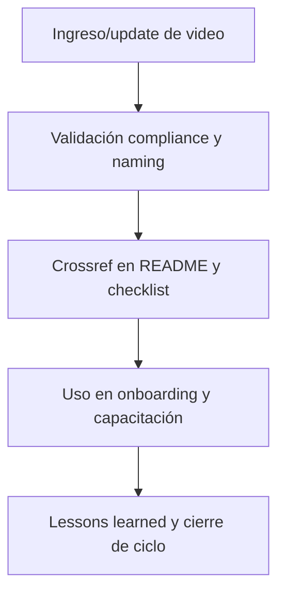

---

file: readme\_core\_doc\_video\_rw\_b\_v3\_2.md version: v3.2-2025-08-06 status: active role: readme owner: AingZ\_Platform · RwB crossref:

- blueprint\_rw\_b\_platform\_v\_3\_20250803.md
- mpln\_master\_plan\_rw\_b\_v\_3\_20250803.md
- checklist\_root\_rw\_b\_v\_3\_20250805.md
- wf\_pipeline\_creacion\_archivos\_rw\_b\_v\_3\_20250805.md
- ops/templates/template\_readme\_rw\_b\_v3\_1.md changelog:
- 2025-08-06: Consolidación árbol y README video/ core/doc v3.2, compliance documentación audiovisual.

---

# 🎞️ core/doc/video/ — Documentación Audiovisual y Videos Técnicos (v3.2)

## 1. Descripción, función, objetivos y contexto

La carpeta `core/doc/video/` centraliza **toda la documentación audiovisual y videos técnicos** vinculados a workflows, procesos y onboarding de la plataforma AingZ/RwB.

### Funciones principales:

- Almacenar videos explicativos, grabaciones de procedimientos, demostraciones, presentaciones y recursos visuales clave para onboarding y operación.
- Complementar la documentación textual, visual y en audio de la plataforma.
- Proveer soporte audiovisual para humanos e IA, facilitando aprendizaje y transferencia de conocimiento.

### Integraciones y sistemas relacionados:

- Referencia cruzada con guías de onboarding (`doc/onbrd/`), imágenes (`image/`), audios (`audio/`) y documentación técnica de `doc/`.
- Usados en reporting, capacitación y despliegue de workflows técnicos.

## 2. Estructura interna

| Archivo/Subcarpeta     | Propósito                             | Estado |
| ---------------------- | ------------------------------------- | ------ |
| video\_workflow\_X.mp4 | Video demostrativo de workflow X      | Activo |
| presentacion\_release/ | Presentaciones de release y novedades | Activo |
| ...                    | Otros recursos y grabaciones          | Activo |

## 3. Metadatos y compliance

- **Versión:** v3.2 — 2025-08-06
- **Owner/Responsable:** AingZ\_Platform · RwB
- **Crossref obligatoria:** Blueprint, master plan, checklist, template universal README (ops/templates/)
- **Naming/Versionado:** Cumplimiento estricto de políticas RwB v3.2
- **Estado:** Activo

## 4. Ciclo de vida y flujos

## 5. Changelog local

- 2025-08-06: Versión v3.2, compliance documentación audiovisual.

## 6. Observaciones / Lessons learned

- Todos los videos deben tener referencia cruzada a workflows, docs y guías relevantes.
- Mantener organización y metadatos para trazabilidad y acceso por IA/humano.

---

**FIN README core/doc/video/ v3.2**

