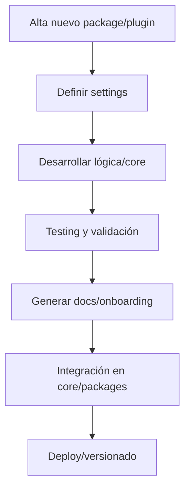

---

## file: README.md version: v3.1-2025-08-05 bucket: packages blueprint: ../blueprint\_rw\_b\_platform\_v\_3\_20250803.md status: active updated: 2025-08-05 role: documentation owner: AingZ\_Platform · RwB

# [RwB] packages/ — README (v3.1)

> **Tagline:** Ecosistema de packages, core+plugins y módulos funcionales autocontenidos; punto de expansión para lógica y servicios de la plataforma.

---

## Índice

1. [Descripción General](#1-descripción-general)
2. [Estructura Interna](#2-estructura-interna)
3. [Cross‑References](#3-cross-references)
4. [Ciclo de Vida & Workflows](#4-ciclo-de-vida--workflows)
5. [Quick Start / Onboarding](#5-quick-start--onboarding)
6. [Guía para Modelos AI](#6-guía-para-modelos-ai)
7. [Compliance & Governance](#7-compliance--governance)
8. [Changelog](#8-changelog)
9. [Metadatos IA](#9-metadatos-ia)

---

## 1. Descripción General

El bucket `packages/` agrupa todos los paquetes funcionales autocontenidos de la plataforma. Implementa el patrón “core + plugins”: cada módulo puede operar de forma independiente y ser escalado o versionado como microservicio. Aquí se desarrollan los procedimientos, lógicas y servicios que amplían las capacidades del core.

---

## 2. Estructura Interna

| Path                             | Rol        | Descripción breve                                             |
| -------------------------------- | ---------- | ------------------------------------------------------------- |
| ./                               | Contenedor | README + metadatos                                            |
| vds\_core/                       | CorePkg    | Infraestructura backend: menú, settings, integración y lógica |
| vds\_core/main.py                | Entrypoint | Script principal de inicialización                            |
| vds\_core/settings.yaml          | Config     | Configuración base para todos los plugins                     |
| vds\_core/onboarding/            | Onboarding | Scripts y docs de onboarding del core                         |
| vds\_core/templates/             | Templates  | Plantillas y scaffolds internos                               |
| vds\_core/tests/                 | Tests      | Scripts y assets de testing de vds\_core                      |
| vds\_core/plugins/               | Plugins    | Plugins autocontenidos: procedimientos y microservicios       |
| vds\_core/plugins/relevamientos/ | Plugin     | Relevamiento de datos y activos (entrevistas, docs, objetos)  |
| vds\_core/plugins/inventario/    | Plugin     | Inventario, clasificación y tracking de activos               |
| vds\_core/plugins/organizador/   | Plugin     | Organización, ordenamiento y agrupación de assets             |

> Cada plugin puede convertirse en package propio si crece o necesita deploy/versionado independiente.

---

## 3. Cross‑References

- **Blueprint v3** → [`../blueprint_rw_b_platform_v_3_20250803.md`](../blueprint_rw_b_platform_v_3_20250803.md)
- **Master Plan v3** → [`../mpln_master_plan_rw_b_v_3_20250803.md`](../mpln_master_plan_rw_b_v_3_20250803.md)
- **Checklist Root v3** → [`../checklist_root_rw_b_v_3_20250803.md`](../checklist_root_rw_b_v_3_20250803.md)
- **Glosario CODE v2** → [`../core/kns/glossary/rw_b_glosario_code_v_2_20250729.md`](../core/kns/glossary/rw_b_glosario_code_v_2_20250729.md)
- **Diccionario CODE\_TRIGGERS v2** → [`../core/data/dicts/rw_b_diccionario_code_triggers_v_2_20250729.md`](../core/data/dicts/rw_b_diccionario_code_triggers_v_2_20250729.md)
- **Triggers**: `TRG_AUDIT_LEGACY`, `TRG_CONSOLIDATE_TL`, `TRG_PURGE_AI`

---

## 4. Ciclo de Vida & Workflows



---

## 5. Quick Start / Onboarding

```bash
# Clonar repo y navegar a packages
$ git clone --recurse-submodules git@github.com:AingZ_Platform/rwb.git
$ cd packages/vds_core

# Ejecutar main.py del core
$ python main.py
```

- Para plugins: navegar a la carpeta del plugin y seguir instrucciones de su README.
- Scripts de onboarding: ver `vds_core/onboarding/`.

---

## 6. Guía para Modelos AI

- Cada README de plugin/package debe indicar estructura, entrypoint y dependencias.
- Prompts IA deben empezar siempre desde este README.
- Plugins autocontenidos: triggers, assets y docs internos.

---

## 7. Compliance & Governance

| Área       | Regla                         | Fuente         |
| ---------- | ----------------------------- | -------------- |
| Naming     | `naming_universal_v3`         | Blueprint §2.2 |
| Version    | SemVer                        | Blueprint §1.3 |
| Testing    | Tests por package/plugin      | Master Plan §3 |
| Onboarding | Script y docs onboarding req. | Blueprint §4   |

---

## 8. Changelog

| Fecha      | Versión | Autor       | Cambios                              |
| ---------- | ------- | ----------- | ------------------------------------ |
| 2025-08-05 | v3.1    | ChatGPT 4.1 | README inicial enriched + estructura |

---

## 9. Metadatos IA

```yaml
bucket: packages
version: v3.1
updated: 2025-08-05
blueprint_ref: ../blueprint_rw_b_platform_v_3_20250803.md
master_plan_ref: ../mpln_master_plan_rw_b_v_3_20250803.md
triggers:
  - TRG_AUDIT_LEGACY
  - TRG_CONSOLIDATE_TL
  - TRG_PURGE_AI
```

---

**FIN README packages/ v3.1**

